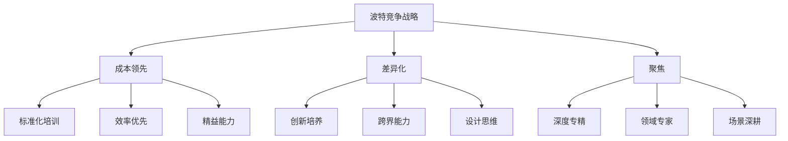
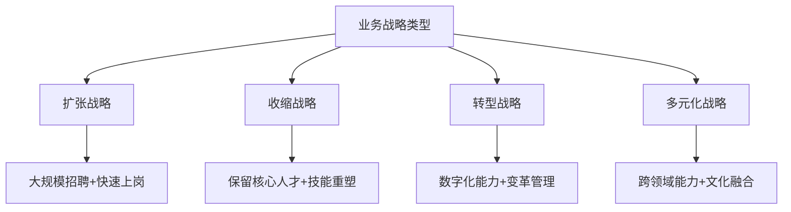
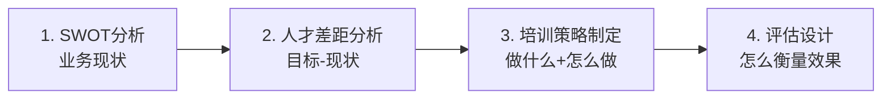

# 不同战略下的人才发展策略

> [!abstract] 一句话总结
> 业务战略决定人才策略，人才策略决定培训方向。没有脱离战略的培训，也没有脱离培训的战略落地。

---

## 波特竞争战略 → 人才策略映射

迈克尔·波特提出的三种通用竞争战略，每一种都对人才发展提出不同的要求。

### 成本领先战略

> [!important] 战略逻辑
> 通过规模效应、流程优化、供应链整合，实现比竞争对手更低的成本。典型行业：制造业、零售业、航空业（低成本航空）。

| 维度 | 人才要求 | 培训策略 |
|------|----------|----------|
| **核心能力** | 标准化操作、流程优化、成本意识 | SOP培训、精益生产、六西格玛 |
| **人才结构** | 金字塔型，大量基层操作人员 | 标准化上岗培训，快速复制 |
| **培训方式** | 在岗培训为主，强调标准化 | 操作手册、视频教程、认证考试 |
| **评估方式** | 效率指标（工时、良品率、成本） | 技能认证、操作考核 |
| **典型实践** | 麦当劳汉堡大学、丰田精益培训 | 高度标准化，全球统一 |

> [!example] 面试话术
> "成本领先战略的企业，培训核心是'标准化'和'效率'。比如制造业，培训不是让员工'创新'，而是让员工'一次做对'。培训的价值在于降低错误率、提升良品率、缩短上岗周期。"

### 差异化战略

> [!important] 战略逻辑
> 通过产品创新、品牌溢价、客户体验，提供竞争对手无法复制的独特价值。典型行业：科技、设计、奢侈品、高端服务。

| 维度 | 人才要求 | 培训策略 |
|------|----------|----------|
| **核心能力** | 创新能力、设计思维、跨界整合 | 创新工作坊、设计思维、跨界学习 |
| **人才结构** | 哑铃型，创意人才+技术专家 | 个性化发展路径，鼓励探索 |
| **培训方式** | 项目制学习、外部交流、导师制 | 黑客马拉松、创新实验室 |
| **评估方式** | 创新成果（专利、新产品、新方法） | 创新项目孵化、成果展示 |
| **典型实践** | Google 20%时间、3M创新文化 | 给空间、给资源、给容错 |

> [!example] 面试话术
> "差异化战略的企业，培训不能'一刀切'。核心是激发创新、培养跨界思维。Google的20%自由时间、IDEO的设计思维培训，都是典型实践。培训的价值不在于'教什么'，而在于'创造一个让人愿意学的环境'。"

### 聚焦战略

> [!important] 战略逻辑
> 在特定细分市场（客户群、产品线、地域）建立深度优势，做"小而美"的专家。典型行业：咨询、专业服务、利基市场。

| 维度 | 人才要求 | 培训策略 |
|------|----------|----------|
| **核心能力** | 领域深度、专家思维、场景洞察 | 深度专业培训、行业研究、场景沙盘 |
| **人才结构** | 专家型，少量但精尖 | 师徒制、深度带教、长期培养 |
| **培训方式** | 案例教学、场景模拟、知识沉淀 | 领域知识库、最佳实践分享 |
| **评估方式** | 专业认证、客户满意度、行业影响力 | 专业资质、行业奖项 |
| **典型实践** | 麦肯锡顾问培养、四大会计师事务所 | 高强度、高标准、长期投入 |

---

## 业务战略类型 → 培训差异

除了竞争战略，业务发展方向也决定培训的不同侧重点。

### 扩张战略

> [!tip] 典型场景
> 业务快速增长，需要大量人才快速到位。如：新市场开拓、新工厂投产、新业务线启动。

- **培训重点**：快速上岗、标准化复制、批量培养
- **关键能力**：新员工入职培训、管理者速成、文化传导
- **风险**：培训质量下降、文化稀释
- **对策**：标准化+导师制，用体系保证底线质量

### 收缩战略

> [!tip] 典型场景
> 业务收缩或重组，裁员降低成本，但需要保留核心人才。如：业务线关停、市场退出。

- **培训重点**：核心人才保留、技能重塑、心理支持
- **关键能力**：保留激励、转型辅导、职业规划
- **风险**：幸存者综合征、人才流失加剧
- **对策**：透明沟通、聚焦核心团队、提供转岗培训

### 转型战略

> [!tip] 典型场景
> 企业从传统业务向新业务转型，如制造业数字化转型、传统零售转电商。

- **培训重点**：新技能培训、变革管理、思维转变
- **关键能力**：数字化能力、敏捷思维、变革领导力
- **风险**：员工抵触、技能断层、转型失败
- **对策**：分阶段推进、树立标杆、领导带头

> [!example] 案例：制造业转型数字化
>
> **背景**：某传统制造企业启动数字化转型，从人工操作转向智能化生产。
>
> **人才挑战**：
> - 一线工人缺乏数字技能，不会操作新设备
> - 中层管理者不理解数字化转型的意义
> - 技术人才短缺，AI、IoT人才薪资高，难以吸引
>
> **培训策略**：
> 1. **分层培训**：一线工人学操作（2周），技术骨干学维护（2个月），管理者学理念（1周）
> 2. **标杆示范**：先建一条数字化示范线，让员工看到效果
> 3. **技能认证**：通过数字化技能认证，绑定晋升和薪酬
> 4. **导师带教**：每台新设备配一名厂家技术员带教3个月
>
> **结果**：6个月内完成全厂技能转型，良品率提升15%

### 多元化战略

> [!tip] 典型场景
> 企业进入多个业务领域，需要跨领域的人才能力和文化融合。如：互联网公司进入金融、汽车行业。

- **培训重点**：跨领域知识、文化融合、整合管理
- **关键能力**：跨界学习、文化敏感度、整合思维
- **风险**：文化冲突、能力不匹配、协同失效
- **对策**：轮岗机制、跨BU项目、统一文化培训

---

## 面试应用：SWOT → 人才差距 → 培训策略

> [!question] 高频面试题
> **"如果让你为一个新业务设计培训方案，你会怎么做？"**

**推荐分析框架**：

### 第一步：SWOT分析（业务视角）

| 维度 | 分析要点 | 培训关联 |
|------|----------|----------|
| **S 优势** | 我们有什么独特能力？ | 放大优势，形成核心竞争力 |
| **W 劣势** | 我们缺什么能力？ | 培训弥补短板 |
| **O 机会** | 外部环境有什么趋势？ | 培训抓住机会窗口 |
| **T 威胁** | 竞争对手在做什么？ | 培训建立护城河 |

### 第二步：人才差距分析

- **数量差距**：现有多少人，需要多少人？
- **质量差距**：现有能力水平，需要什么水平？
- **结构差距**：现有人员结构，需要什么结构？
- **时间差距**：什么时候需要到位？

### 第三步：培训策略制定

基于差距分析，确定：
- 培训对象：谁需要培训？（分层分类）
- 培训内容：学什么？（能力差距清单）
- 培训方式：怎么学？（70-20-10组合）
- 培训资源：谁来做？（内部讲师、外部机构、平台工具）

### 第四步：评估设计

参见 [[03-HR人事/培训与人才发展/02-核心理论/06_柯氏四级评估]]，从反应层到结果层设计完整评估链。

---

## 关联笔记

- [[03-HR人事/培训与人才发展/01-战略视角/01_企业生命周期与人才战略]] —— 生命周期 × 战略类型 = 完整人才策略矩阵
- [[03-HR人事/培训与人才发展/01-战略视角/02_战略人力资源与人才供应链]] —— 人才供应链如何在战略层面落地
- [[03-HR人事/培训与人才发展/02-核心理论/07_ADDIE教学设计模型]] —— 培训方案设计的系统化流程
- [[03-HR人事/培训与人才发展/02-核心理论/06_柯氏四级评估]] —— 培训效果的评估方法论
- [[03-HR人事/培训与人才发展/00_MOC_培训与人才发展中枢]] —— 返回知识库目录
- [[HR AI转型全景图]] —— 转型战略中AI能力的培养
- [[电网项目人才培养实践]] —— 案例：聚焦战略下的人才培养