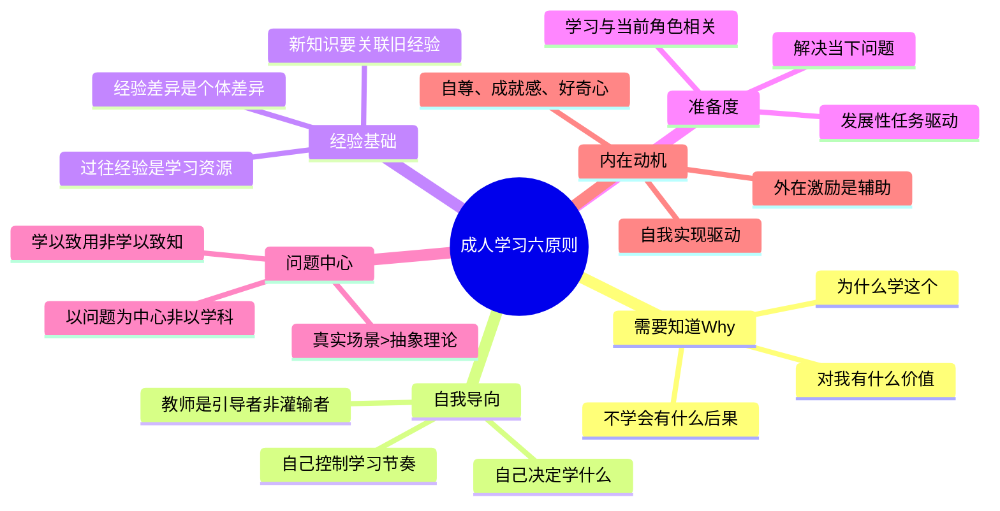
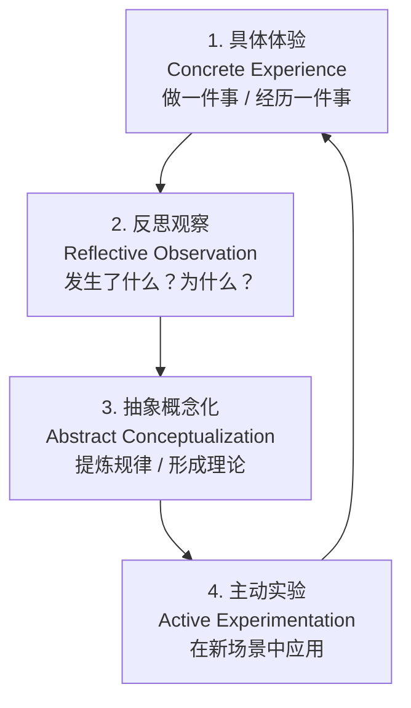
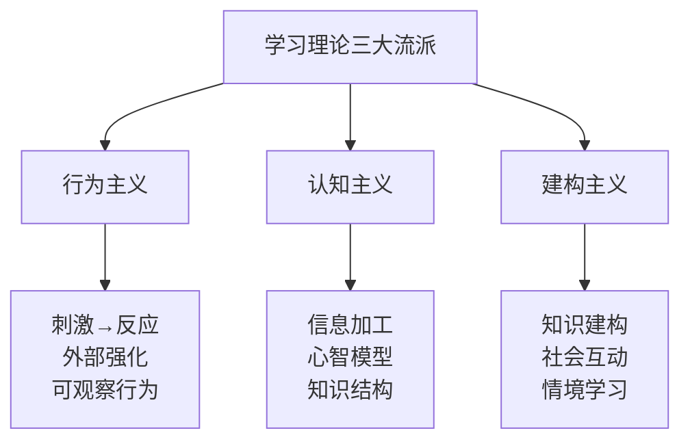

# 成人学习理论

> [!abstract] 一句话总结
> 成年人不是大号的小孩。培训设计必须遵循成人学习规律，否则再好的内容也无效。诺尔斯六原则是底层逻辑，Kolb经验学习圈是过程框架。

---

## 诺尔斯成人学习六原则

马尔科姆·诺尔斯（Malcolm Knowles）在《成人学习者》（The Adult Learner）中提出，成人学习与儿童学习有本质区别，并将成人学习理论命名为"Andragogy"（区别于教育学的"Pedagogy"）。

### 六原则详解

> [!important] 原则一：需要知道Why
> 成年人在学习前需要知道"为什么我要学这个"。如果看不到学习的价值，他们不会投入。
>
> **培训设计启示**：每门课程开篇必须回答"为什么"，建立学习动机。不要默认学员"应该知道"。

> [!important] 原则二：自我导向
> 成年人有自我管理的需求，希望自己控制学习过程，而非被动接受。
>
> **培训设计启示**：提供选择空间（选课、选模块、选路径），给予学员主动权。翻转课堂、自主学习平台都是好的实践。

> [!important] 原则三：经验基础
> 成年人带着丰富的经验进入学习，这些经验是极其宝贵的学习资源。
>
> **培训设计启示**：激活学员已有经验，用案例讨论、经验分享、角色扮演等方式，让新知识与旧经验建立连接。

> [!important] 原则四：准备度
> 成年人学习的准备度由其社会角色和发展任务决定。当学习内容与当前角色相关时，学习动机最强。
>
> **培训设计启示**：培训内容要紧密关联学员当前工作场景，在"刚好需要"的时候提供"刚好够用"的知识。

> [!important] 原则五：问题中心
> 成年人学习以问题为中心，而非以学科为中心。他们关心的是"怎么解决这个问题"，而非"这门学科是什么"。
>
> **培训设计启示**：用真实业务问题驱动学习，而非按学科体系组织知识。行动学习、案例教学优于纯理论讲授。

> [!important] 原则六：内在动机
> 成年人学习的核心驱动力来自内在——自尊、成就感、好奇心、自我实现。外在激励（奖金、晋升）是辅助。
>
> **培训设计启示**：设计成就感体验（如技能认证、成果展示），激发内在动机，而非依赖外部奖惩。

---

## Kolb 经验学习圈

大卫·库伯（David Kolb）提出，有效学习是一个循环过程，从具体体验开始，经过反思和抽象，再回到新的实践。

> [!tip] 四阶段在培训设计中的应用

| 阶段 | 培训活动示例 | 设计要点 |
|------|-------------|----------|
| **具体体验** | 案例分析、角色扮演、模拟演练、实地参观 | 必须是真实或高度仿真的体验 |
| **反思观察** | 小组讨论、复盘会、学习日志、一对一反馈 | 留出思考时间，引导深度反思 |
| **抽象概念化** | 讲师讲解、理论模型、框架工具、阅读材料 | 从案例中提炼可迁移的规律 |
| **主动实验** | 行动计划制定、在岗实践、项目任务 | 设定明确的应用目标和时间 |

> [!warning] 常见错误
> 大多数培训只覆盖了"体验"和"概念化"，跳过了"反思"和"实验"。结果是：学员听懂了，但不会用。Kolb循环必须跑完四个阶段，学习才真正发生。

---

## 三种学习理论对比

| 维度 | 行为主义 | 认知主义 | 建构主义 |
|------|----------|----------|----------|
| **核心观点** | 学习是刺激-反应的联结，通过外部强化形成 | 学习是信息加工过程，关注内部心智模型 | 学习是学习者主动建构知识的过程 |
| **代表人物** | 斯金纳、桑代克 | 皮亚杰、加涅 | 维果茨基、布鲁纳 |
| **学习者角色** | 被动接受者 | 信息加工者 | 主动建构者 |
| **教师角色** | 强化者、训练者 | 信息组织者、引导者 | 促进者、脚手架提供者 |
| **培训应用** | 技能训练、操作规范、行为矫正 | 知识讲解、概念理解、问题解决 | 案例教学、项目学习、协作学习 |
| **适用场景** | 标准化操作、安全规范、合规培训 | 专业知识、管理理论、工具方法 | 领导力、创新思维、复杂问题解决 |
| **典型工具** | 行为检查表、技能认证、积分激励 | 思维导图、知识图谱、微课 | 行动学习、沙盘模拟、学习社群 |

> [!tip] 如何选择
> 没有一种理论是"最好的"。培训设计应该根据学习目标选择适当的理论组合：
> - **技能型**（学操作）：行为主义为主
> - **知识型**（学理论）：认知主义为主
> - **能力型**（学思维）：建构主义为主
> - 复杂培训项目通常是三种理论的混合应用

---

## 对培训设计的核心启示

> [!important] 培训不等于讲课

传统的"老师讲、学员听"模式之所以低效，是因为它违背了成人学习的基本原则：

| 传统培训的错误假设 | 成人学习理论告诉我们 |
|---------------------|----------------------|
| "老师知道学员需要什么" | 学员需要自己感知到学习价值 |
| "讲得越多，学得越多" | 学习不是灌输，是建构 |
| "听完课就会了" | 从听到会，中间需要体验+反思+应用 |
| "所有人用同样的方式学" | 学习风格、经验基础各不相同 |
| "考试分数代表学习效果" | 真正的学习效果体现在行为改变 |

> [!tip] 培训设计的黄金法则
> **"设计体验，而非设计内容。"** 培训设计师的核心工作不是"编排知识点"，而是"设计学习体验"——让学员在体验中反思、在反思中提炼、在提炼后应用。

---

## 面试应用

> [!question] 高频面试题
> **"你如何设计一门培训课程？"**

**推荐回答框架**（以"新任管理者培训"为例）：

1. **从成人学习理论切入（建立专业感）**
   - "我设计的底层逻辑是诺尔斯成人学习六原则和Kolb经验学习圈"
   - "核心原则：培训不等于讲课，要设计体验+反思+应用"

2. **分析学员（体现系统性）**
   - 学员是谁？新任管理者，从个人贡献者到团队管理者
   - 他们的痛点是什么？不知道如何授权、如何绩效面谈、如何激励团队
   - 他们的经验基础是什么？有丰富的业务经验，但缺乏管理经验

3. **设计学习体验（体现专业能力）**
   - **体验阶段**：用真实管理场景案例（如"下属绩效不达标，如何面谈？"）
   - **反思阶段**：小组讨论、角色扮演后的复盘
   - **概念化阶段**：引入管理模型（如情境领导、GROW教练模型）
   - **实验阶段**：制定课后行动计划，30天后回访

4. **混合学习方式（体现70-20-10）**
   - 10%正式培训：2天线下工作坊
   - 20%社交学习：组建学习小组，每月一次导师辅导
   - 70%在岗实践：3个月管理实践，月度复盘

5. **评估设计（体现闭环思维）**
   - 反应层：培训满意度问卷
   - 学习层：管理知识测试
   - 行为层：3个月后360度评估
   - 结果层：团队绩效变化

> [!tip] 加分项
> - 提到"学习风格差异化"：不同学员有不同的学习偏好（Kolb学习风格量表）
> - 提到"培训迁移"（Transfer of Learning）：如何确保培训内容回到工作中真正被使用
> - 结合AI工具：AI可以辅助个性化学习路径推荐、学习效果分析

---

## 关联笔记

- [[03-HR人事/培训与人才发展/02-核心理论/05_70-20-10法则]] —— 成人学习理论在混合式学习中的应用
- [[03-HR人事/培训与人才发展/02-核心理论/07_ADDIE教学设计模型]] —— 系统化培训设计的流程框架
- [[03-HR人事/培训与人才发展/02-核心理论/06_柯氏四级评估]] —— 如何验证学习效果
- [[03-HR人事/培训与人才发展/00_MOC_培训与人才发展中枢]] —— 返回知识库目录
- [[HR AI转型全景图]] —— 前沿：AI如何个性化成人学习体验