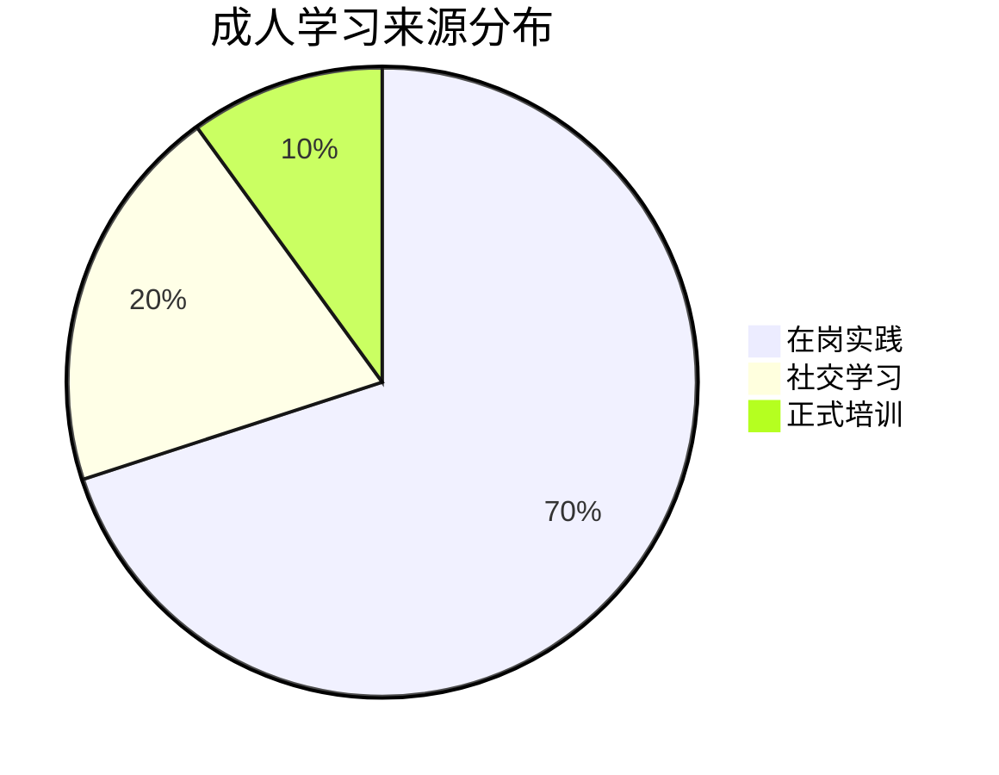
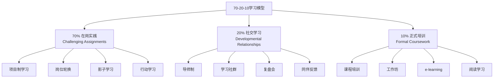
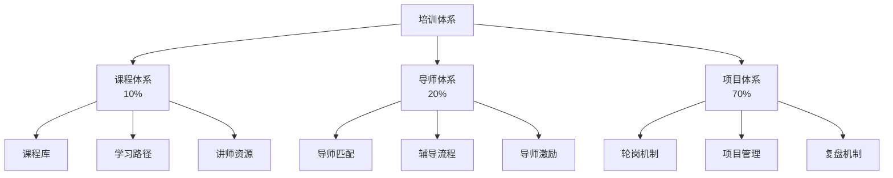

# 70-20-10法则

> [!abstract] 一句话总结
> 70%的学习来自在岗实践，20%来自社交学习，10%来自正式培训。这不是一个精确的数学公式，而是一种学习理念：培训体系必须是"课程+导师+项目"三合一。

---

## 模型定义

70-20-10法则由麦可·隆巴多（Michael Lombardo）和罗伯特·艾辛格（Robert Eichinger）在创造性领导力中心（CCL）的研究中提出。他们调查了成功的管理者，发现有效的学习来源分布如下：

---

## 三部分详解

### 70%：在岗实践

> [!important] 核心逻辑
> 最有效的学习发生在真实工作场景中。知识的价值在于应用，而应用能力只能在实践中获得。

| 实践方式 | 描述 | 适用场景 | 设计要点 |
|----------|------|----------|----------|
| **项目制学习** | 承担具有挑战性的项目任务 | 培养综合能力、跨部门协作 | 项目难度略高于当前能力 |
| **岗位轮换** | 在不同岗位间轮岗 | 培养全局视野、综合管理能力 | 轮岗周期3-12个月，有明确目标 |
| **影子学习** | 跟随资深人员观察学习 | 领导力培养、隐性知识传递 | 明确观察重点，定期交流反馈 |
| **行动学习** | 解决真实业务问题的过程中学习 | 领导力发展、组织变革 | 小组形式，有教练引导 |
| **任务与挑战** | 承担超出当前能力的任务 | 加速成长、突破舒适区 | 有安全网，允许失败 |
| **工作丰富化** | 增加工作的广度和深度 | 职业倦怠期、成长期 | 逐步增加责任，而非一次性 |

> [!tip] 设计原则
> - **挑战性**：任务难度略高于当前能力（舒适区边缘）
> - **真实性**：解决真实业务问题，而非模拟练习
> - **反馈性**：有及时的反馈和复盘机制
> - **安全性**：允许在安全范围内犯错和学习

### 20%：社交学习

> [!important] 核心逻辑
> 学习是社会性的。通过与他人互动——观察、模仿、讨论、反馈——获得的知识比独自学习更深刻、更持久。

| 社交方式 | 描述 | 适用场景 | 设计要点 |
|----------|------|----------|----------|
| **导师制** | 资深员工一对一辅导 | 新人培养、高潜发展、领导力 | 匹配度>层级，定期交流 |
| **学习社群** | 有共同学习目标的人组成小组 | 专业能力提升、经验分享 | 有明确主题和产出，而非泛泛交流 |
| **复盘会** | 项目/任务结束后的结构化回顾 | 经验萃取、组织学习 | 结构化流程：目标回顾→过程分析→根因分析→行动计划 |
| **同伴反馈** | 同事间的正式/非正式反馈 | 自我认知提升、行为改进 | 建设性反馈，具体而非笼统 |
| **跨界交流** | 与不同领域/行业的人交流 | 创新思维、跨界启发 | 提前准备问题，带着目的交流 |
| **内部讲师** | 员工担任内部讲师分享经验 | 知识沉淀、经验传承 | 有激励机制，提供TTT培训 |

> [!tip] 设计原则
> - **结构化**：社交学习不是"放养"，需要有结构设计（匹配机制、交流频率、产出要求）
> - **互惠性**：双方都能获益，而非单向输出
> - **持续性**：建立长期关系，而非一次性活动
> - **多样性**：不同背景、不同层级的人带来不同视角

### 10%：正式培训

> [!important] 核心逻辑
> 正式培训仍然重要，但角色从"学习的主体"变为"学习的触发器"——提供系统知识框架、激发学习动机、引导后续实践。

| 培训方式 | 描述 | 适用场景 | 设计要点 |
|----------|------|----------|----------|
| **课程培训** | 讲师授课，系统传授知识 | 新知识导入、方法论学习 | 不超过30%时间讲授，70%互动 |
| **工作坊** | 参与式、产出导向的集中学习 | 技能训练、团队共创 | 有明确产出物，而非只是讨论 |
| **e-learning** | 在线学习平台、微课 | 基础知识点、合规培训 | 碎片化、场景化、可检索 |
| **阅读学习** | 书籍、文章、案例分析 | 自主学习、深度思考 | 有推荐书单，有讨论输出 |
| **认证培训** | 外部专业资格认证 | 专业能力提升、职业发展 | 与职业发展路径绑定 |

> [!tip] 设计原则
> - **精准**：只教"学了就能用"的内容，不追求知识体系完整
> - **触发**：正式培训是学习的起点，不是终点
> - **衔接**：培训内容必须与后续的70%实践和20%社交紧密衔接

---

## 常见误区

> [!warning] 误区一：放弃正式培训，只做实践
> **错误理解**："既然70%来自实践，那正式培训不重要了"。
> **正确理解**：10%的正式培训是"种子"——提供系统框架、触发学习动机。没有这10%，70%的实践就是"盲目试错"。好的培训像是"地图"，告诉你去哪里、怎么走，实践才是"走路"。

> [!warning] 误区二：70-20-10是精确数字
> **错误理解**："我做了培训效果评估，发现培训效果只占8%，不符合10%的标准"。
> **正确理解**：70-20-10是理念，不是精确公式。核心信息是：学习主要发生在工作中，培训体系不能只有课堂。不同岗位、不同场景，比例会有差异：
> - 技术岗：实践比例可能更高（80-10-10）
> - 管理岗：社交学习比例可能更高（50-30-20）

> [!warning] 误区三：三部分是割裂的
> **错误理解**："先做10%培训，再做20%社交，最后做70%实践"。
> **正确理解**：三部分应该交织在一起。比如：培训中学了方法论（10%），回到工作中实践（70%），遇到问题向导师请教（20%），再回到培训中分享经验（10%）。这是一个循环，不是线性流程。

> [!warning] 误区四：70-20-10就是培训体系
> **错误理解**："我设计了培训课程、导师制度和项目实践，这就是70-20-10体系"。
> **正确理解**：70-20-10是"学习来源分布"的描述，不是"培训体系"的架构。真正的培训体系还要包括：需求分析、能力模型、学习路径、评估机制等。

---

## 与培训体系设计的关系

> [!important] 三合一体系
> 基于70-20-10法则，完整的培训体系应该包含三个子系统：

| 子系统 | 核心功能 | 关键产出物 | 常见问题 |
|--------|----------|-----------|----------|
| **课程体系** | 提供系统知识框架 | 课程库、学习地图、讲师手册 | 课程太多，与工作脱节 |
| **导师体系** | 提供个性化指导 | 导师匹配表、辅导记录、反馈工具 | 导师积极性低，缺乏培训 |
| **项目体系** | 提供实践机会 | 项目清单、轮岗计划、复盘模板 | 项目与学习目标不匹配 |

---

## 面试应用

> [!question] 高频面试题
> **"你如何设计一个完整的培训体系？"**

**推荐回答框架**：

1. **从70-20-10切入**
   - "培训体系不能只有课程，更重要的是实践和社交学习"
   - "我设计的培训体系是'课程+导师+项目'三合一"

2. **课程体系（10%）**
   - 基于能力模型设计学习地图
   - 分层分类：新员工、专业岗、管理岗，不同层级不同内容
   - 混合模式：线下工作坊 + 线上微课 + 自主学习

3. **导师体系（20%）**
   - 导师选拔与匹配机制
   - 导师培训（TTT）：教导师如何辅导，而非如何讲课
   - 激励与考核：导师积分、优秀导师评选

4. **项目体系（70%）**
   - 轮岗计划：关键岗位必须有轮岗经历
   - 行动学习：以真实业务问题为课题，小组攻关
   - 复盘机制：项目结束后结构化复盘，沉淀经验

5. **举例说明**
   - "以电网行业为例，新员工培训体系：入职集中培训2周（10%）→ 师带徒6-12个月（20%）→ 在岗实践+技能认证（70%）"
   - "三部分不是割裂的，而是循环递进的"

> [!tip] 加分项
> - 提到"学习旅程"（Learning Journey）而非"培训课程"的概念
> - 提到"学习效果的可视化"：学习积分、技能雷达图
> - 关联电网笔记中的721实践案例

---

## 关联笔记

- [[03-HR人事/培训与人才发展/02-核心理论/04_成人学习理论]] —— 70-20-10的理论基础
- [[03-HR人事/培训与人才发展/02-核心理论/07_ADDIE教学设计模型]] —— 如何系统化设计培训项目
- [[03-HR人事/培训与人才发展/02-核心理论/06_柯氏四级评估]] —— 如何评估70-20-10的效果
- [[03-HR人事/培训与人才发展/01-战略视角/01_企业生命周期与人才战略]] —— 不同阶段的70-20-10配置差异
- [[03-HR人事/培训与人才发展/00_MOC_培训与人才发展中枢]] —— 返回知识库目录
- [[电网项目人才培养实践]] —— 案例：电网721实践
- [[HR AI转型全景图]] —— 前沿：AI如何赋能混合式学习