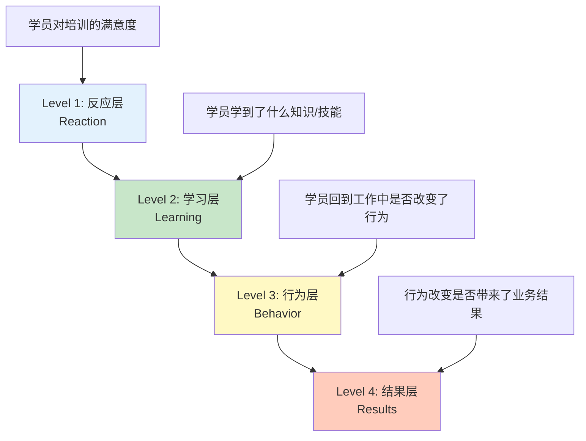
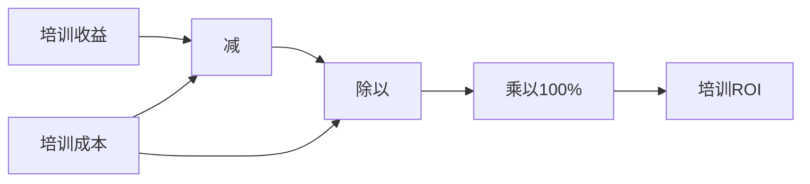

# 柯氏四级评估

> [!abstract] 一句话总结
> 培训效果评估不能只看满意度。柯氏四级评估从反应、学习、行为、结果四个层次递进，帮你回答"培训到底有没有用"。其中行为层和结果层最难评估，但也最有价值。

---

## 四级模型总览

唐纳德·柯克帕特里克（Donald Kirkpatrick）在1959年提出四级评估模型，至今仍是培训评估领域的黄金标准。

| 层级 | 评估内容 | 核心问题 | 评估时机 | 评估难度 |
|:---:|----------|----------|----------|:---:|
| **L1 反应** | 学员满意度 | "学员喜欢这个培训吗？" | 培训结束时 | 容易 |
| **L2 学习** | 知识/技能掌握 | "学员学到了什么？" | 培训前后 | 较易 |
| **L3 行为** | 工作行为改变 | "学员在工作中用了吗？" | 培训后1-3个月 | 困难 |
| **L4 结果** | 业务结果改善 | "培训带来了什么业务价值？" | 培训后3-12个月 | 极难 |

---

## 各层级详解

### L1：反应层（Reaction）

> [!important] 评估什么
> 学员对培训内容、讲师、方式、环境、组织的满意度和主观感受。

| 评估工具 | 优点 | 局限 |
|----------|------|------|
| 满意度问卷 | 标准化、易量化、成本低 | 可能受"人情分"影响 |
| 即时反馈 | 现场捕捉真实反应 | 不够系统 |
| NPS（净推荐值） | 可横向比较 | 只有单一维度 |
| 焦点小组访谈 | 深度挖掘反馈 | 成本高、样本小 |

> [!tip] 实操建议
> - 反应层评估是"必要但不充分"的——满意度高不等于学习效果好
> - 问卷设计要聚焦"学习体验"而非"讲师魅力"
> - 结合定性和定量：评分+开放性问题
> - 建议问卷模板：课程内容相关性（1-5分）、讲师专业度（1-5分）、学习方式有效性（1-5分）、你会推荐给同事吗？（是/否）、最有用的是什么？最需要改进的是什么？

> [!warning] 常见误区
> "满意度高=培训效果好"——这是一个危险的假设。很多让人"感觉很爽"的培训，实际上没有带来任何行为改变。反之，真正有效的培训可能是"不舒服"的（因为挑战了舒适区）。

### L2：学习层（Learning）

> [!important] 评估什么
> 学员通过培训在知识、技能、态度方面获得了哪些提升。

| 评估工具 | 适用场景 | 设计要点 |
|----------|----------|----------|
| 知识测试 | 知识型培训 | 前测+后测，对比学习增量 |
| 技能考核 | 操作型培训 | 实操考核，设定通过标准 |
| 案例分析 | 应用型培训 | 用真实案例评估分析和判断能力 |
| 模拟演练 | 综合型培训 | 角色扮演、情景模拟，观察行为表现 |
| 学习日志 | 反思型培训 | 记录学习过程，评估深度思考 |

> [!tip] 实操建议
> - **前测+后测**是L2评估的黄金标准：前测建立基线，后测衡量增量
> - 测试题目要对应学习目标（不要测你没教的内容）
> - 知识型内容适合客观题，能力型内容适合表现性评估
> - 设定及格线：知识型80分，技能型100%通过（安全相关）

> [!example] 示例：新员工产品知识培训
> - 前测：培训前产品知识测试（基线）
> - 后测：培训后同一套测试（增量）
> - 目标：后测分数比前测提升40%以上
> - 如果未达标：分析是内容问题还是测试问题

### L3：行为层（Behavior）

> [!important] 评估什么
> 学员回到工作岗位后，是否将培训所学应用到实际工作中，行为是否发生了可观察的改变。

| 评估工具 | 描述 | 优点 | 局限 |
|----------|------|------|------|
| 360度评估 | 上级、同事、下属、自己多角度评估 | 全面、客观 | 实施成本高 |
| 行为观察 | 直接观察学员的工作行为 | 直接、真实 | 费时、主观 |
| 行动计划追踪 | 跟踪学员培训后的行动计划完成情况 | 结构化、可量化 | 依赖学员自觉 |
| 工作产出分析 | 分析学员的工作成果变化 | 客观、有说服力 | 行为变化不一定体现在产出 |
| 关键事件回顾 | 收集学员应用新技能的关键事件 | 深度、有故事性 | 样本量小 |

> [!warning] 为什么L3最难评估？
> 1. **时间延迟**：行为改变需要时间，无法在培训后立即评估
> 2. **多因一果**：行为改变可能来自培训，也可能来自其他因素（领导要求、工作压力、自我学习）
> 3. **环境制约**：学员学了但没机会用（没有应用场景、上级不支持）
> 4. **测量困难**：行为改变不容易量化，依赖主观判断
> 5. **遗忘曲线**：艾宾浩斯遗忘曲线表明，不使用的知识会快速遗忘

> [!tip] 提升L3评估有效性的方法
> - **培训前**：与学员上级沟通，明确期望的行为改变，获得支持
> - **培训中**：制定个人行动计划，明确具体行动和时间节点
> - **培训后**：定期跟进（30天、60天、90天），收集行为改变证据
> - **环境支持**：确保学员有应用场景和资源支持
> - **混合方法**：结合360评估+行动计划追踪+关键事件回顾

### L4：结果层（Results）

> [!important] 评估什么
> 培训带来的业务结果改善——效率提升、成本降低、质量改善、客户满意度提升、员工留存率提高等。

| 评估指标 | 适用场景 | 数据来源 |
|----------|----------|----------|
| 生产效率 | 操作型培训 | 生产数据（产量、良品率、工时） |
| 质量指标 | 质量相关培训 | 质量数据（缺陷率、返工率） |
| 销售业绩 | 销售培训 | 销售数据（销售额、转化率、客单价） |
| 客户满意度 | 服务培训 | 客户满意度调查、NPS |
| 员工留存 | 管理培训 | 离职率、敬业度调查 |
| 安全事故 | 安全培训 | 事故率、安全隐患数量 |

> [!warning] 为什么L4最难评估？
> 1. **隔离效应**：很难把培训的效果从其他因素中隔离开来（市场变化、产品更新、管理变革）
> 2. **时间延迟**：业务结果变化需要更长时间（6-12个月）
> 3. **数据可得性**：很多业务数据不完整或不准确
> 4. **归因困难**：即使业务结果改善了，也可能是"培训后发生的"而非"因为培训而发生的"
> 5. **成本高昂**：做严谨的L4评估（如对照组实验）成本极高

---

## 培训ROI计算

> [!important] ROI公式
> **培训ROI = (培训收益 - 培训成本) / 培训成本 x 100%**
>
> 例如：培训收益300万，培训成本100万
> ROI = (300 - 100) / 100 x 100% = 200%

| 收益项 | 成本项 |
|--------|--------|
| 效率提升带来的产出增加 | 课程开发费用 |
| 质量改善带来的返工减少 | 讲师费用（内外部） |
| 事故减少带来的损失避免 | 场地、设备、物料费用 |
| 人员流失减少带来的招聘节省 | 学员差旅和工时成本 |
| 客户满意度提升带来的收入增长 | 管理运营成本 |

> [!warning] 注意
> ROI计算的关键难点在于**收益的量化**。很多培训收益是"软性"的（如领导力提升、团队协作改善），难以直接折算为金额。对于这类培训，建议使用"投资回报故事"（Return on Investment Story）而非精确数字——用一系列定性+定量证据讲述培训的价值。

---

## 面试应用

> [!question] 高频面试题
> **"你怎么证明培训是有效的？"**

**推荐回答框架**：

1. **引入柯氏四级框架**
   - "我用柯氏四级评估模型来回答这个问题"
   - "培训效果评估不能只看满意度，要从四个层次递进"

2. **分层阐述**
   - **L1反应层**：满意度问卷 + NPS，确保学习体验好
   - **L2学习层**：前测+后测，验证知识/技能提升
   - **L3行为层**：360评估 + 行动计划追踪，验证行为改变
   - **L4结果层**：业务指标对比，验证业务价值

3. **坦诚L3和L4的难度**
   - "诚实地说，L3和L4很难做到完美评估"
   - "但这不是放弃评估的理由，而是要用混合方法逼近真相"
   - "我的做法是：至少做到L2，努力做到L3，选择性做到L4"

4. **举例说明**
   - "以管理者培训为例：L1看满意度（目标4.5/5分），L2看管理知识测试（前测50分→后测80分），L3看团队敬业度变化（360评估），L4看团队离职率变化"

5. **收尾**
   - "评估不是为了'证明培训有用'，而是为了'发现培训哪里可以更好'"
   - "评估的终极目的是持续改进，而非自证价值"

> [!tip] 加分项
> - 提到"评估矩阵"：不是所有培训都需要做到L4，根据培训的战略重要性决定评估深度
> - 提到"对照组"概念：如果资源允许，用对照组消除干扰因素
> - 提到"ROI故事"：对于无法精确量化的培训，用叙事+证据的方式展示价值

---

## 关联笔记

- [[03-HR人事/培训与人才发展/02-核心理论/05_70-20-10法则]] —— 如何评估70-20-10各部分的培训效果
- [[03-HR人事/培训与人才发展/02-核心理论/07_ADDIE教学设计模型]] —— ADDIE中的E阶段与柯氏四级的整合
- [[03-HR人事/培训与人才发展/02-核心理论/04_成人学习理论]] —— 评估设计要符合成人学习规律
- [[03-HR人事/培训与人才发展/00_MOC_培训与人才发展中枢]] —— 返回知识库目录
- [[HR AI转型全景图]] —— 前沿：AI如何提升培训评估的精准度