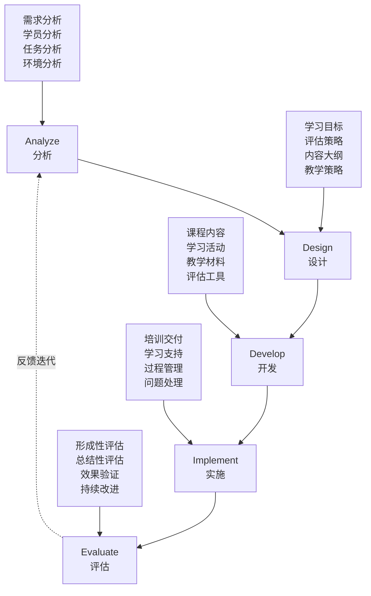
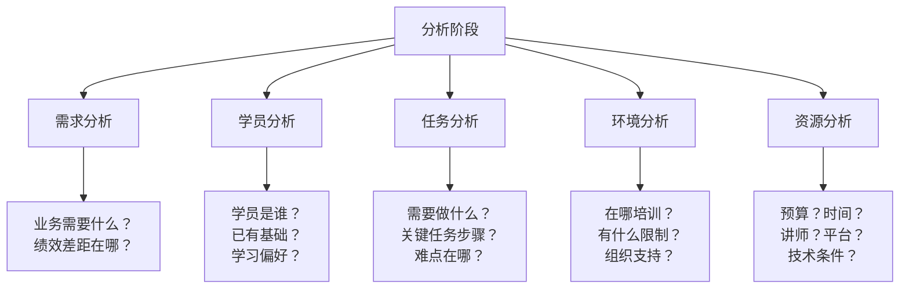
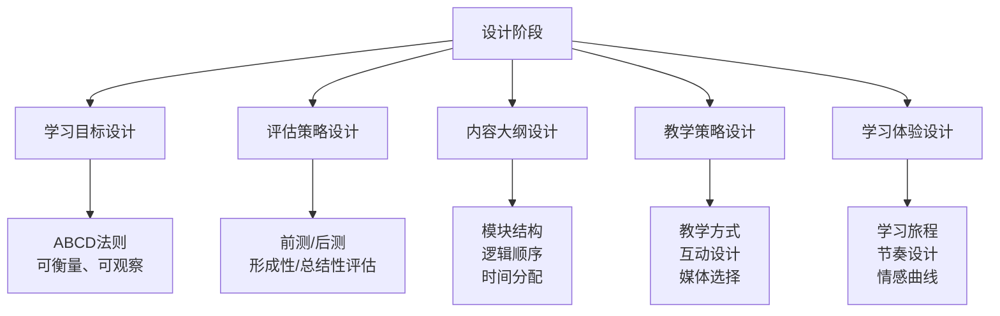
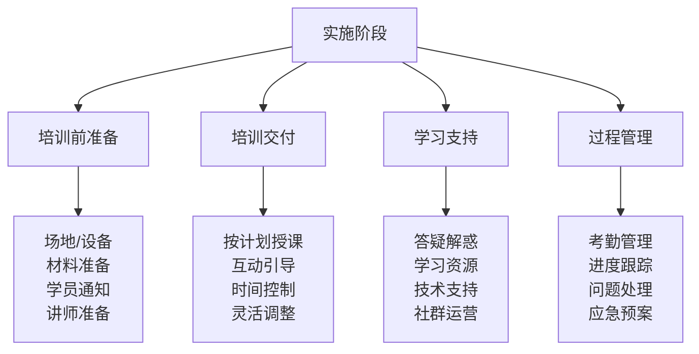
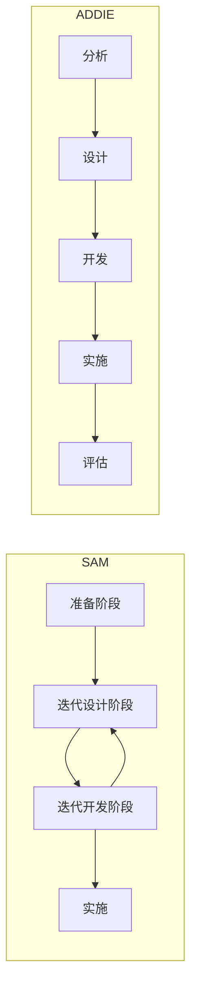

# ADDIE教学设计模型

> [!abstract] 一句话总结
> ADDIE是培训项目开发的系统化流程，涵盖分析、设计、开发、实施、评估五个阶段。它不是线性流程，而是迭代循环。面试中描述一个培训项目，用ADDIE框架是最经典的结构。

---

## 模型总览

> [!important] 核心原则
> 1. **系统性**：五个阶段环环相扣，前一个阶段的产出是后一个阶段的输入
> 2. **迭代性**：ADDIE不是线性的，评估结果会反馈到分析和设计阶段进行迭代
> 3. **以学员为中心**：每个阶段都要从学员的视角出发
> 4. **以目标为导向**：学习目标是整个设计的核心锚点

---

## 五阶段详解

### 第一阶段：分析（Analyze）

> [!important] 分析阶段的核心产出物
> **培训需求分析报告**，包含：
> - 业务背景与绩效差距
> - 学员画像（人数、层级、基础、学习偏好）
> - 关键任务分析（需要学会做什么）
> - 培训约束条件（时间、预算、资源、环境）
> - 培训目标建议（初步）

| 分析维度 | 关键问题 | 数据来源 |
|----------|----------|----------|
| **需求分析** | 业务要解决什么问题？不培训会怎样？ | 业务访谈、绩效数据、战略解码 |
| **学员分析** | 学员是谁？有什么基础？学习偏好？ | 学员调研、人才数据、上级访谈 |
| **任务分析** | 完成工作需要什么知识/技能/态度？ | 岗位说明书、专家访谈、现场观察 |
| **环境分析** | 培训在什么环境中进行？有什么限制？ | 场地考察、技术评估 |
| **资源分析** | 预算多少？时间多少？有什么资源？ | 项目立项文件、预算审批 |

> [!tip] 实操建议
> - 分析阶段决定了整个项目的方向，投入时间至少占项目总时间的20%
> - 最危险的错误是"跳过分析直接设计"——做了很多精美的课程，但根本不是学员需要的
> - 需求分析的核心是区分"培训能解决的"和"培训不能解决的"——不是所有绩效问题都能通过培训解决

> [!example] 需求分析案例
> **场景**：某公司新员工入职后3个月内离职率高达30%
>
> **错误的分析**：直接设计"新员工关怀培训"
>
> **正确的分析**：
> 1. 访谈离职员工：为什么离开？（薪酬不匹配？文化不适应？管理者不关注？）
> 2. 分析数据：哪个部门离职率最高？什么时间点离职最多？
> 3. 对比在职员工：留下的员工有什么共性？
> 4. 结论：如果是薪酬问题，培训不能解决；如果是融入问题，培训+导师制可以解决

### 第二阶段：设计（Design）

> [!important] 设计阶段的核心产出物
> **培训设计方案**，包含：
> - 学习目标（可衡量、可观察）
> - 评估策略（前测、后测、实操评估）
> - 内容大纲（模块+单元+时间分配）
> - 教学策略（讲授、讨论、练习、案例、模拟）
> - 学习体验设计（学习旅程地图）

> [!tip] 学习目标设计：ABCD法则

| 要素 | 含义 | 示例 |
|------|------|------|
| **A**udience（学员） | 谁要学？ | "新入职的销售代表" |
| **B**ehavior（行为） | 学会后能做什么？ | "能够独立完成客户需求分析" |
| **C**ondition（条件） | 在什么条件下？ | "在模拟客户场景中" |
| **D**egree（标准） | 达到什么标准？ | "准确识别至少3个核心需求" |

> [!example] 完整学习目标示例
> 错误写法："了解客户需求分析方法"
>
> 正确写法（ABCD）：
> "新入职的销售代表（A），在模拟客户拜访场景中（C），能够运用SPIN提问法准确识别客户至少3个核心需求（B），并形成需求分析报告（D）"

> [!tip] 教学策略选择矩阵

| 学习目标类型 | 推荐教学策略 | 不推荐 |
|-------------|-------------|--------|
| 知识记忆 | 讲解+测验+记忆卡片 | 纯讨论 |
| 技能操作 | 示范+练习+反馈 | 纯讲授 |
| 态度转变 | 案例+讨论+角色扮演 | 纯考试 |
| 问题解决 | 案例教学+行动学习 | 纯理论 |
| 创新思维 | 工作坊+头脑风暴+跨界学习 | 纯讲授 |

### 第三阶段：开发（Develop）

> [!important] 开发阶段的核心产出物
> - 课程内容（PPT、讲义、学员手册）
> - 学习活动（案例、练习、讨论题、角色扮演脚本）
> - 教学材料（讲师手册、视频、图片、道具）
> - 评估工具（前测试卷、后测试卷、评估问卷）
> - 平台内容（e-learning课程、学习管理系统配置）

> [!tip] 开发顺序建议
> 1. 先开发评估工具（确保考什么和教什么一致）
> 2. 再开发核心内容（知识点、模型、方法论）
> 3. 再开发学习活动（案例、练习、讨论）
> 4. 最后开发辅助材料（PPT、讲师手册、学员手册）

> [!warning] 常见错误
> - 先做PPT再做内容设计——本末倒置
> - 内容过多，教学时间不够——"覆盖"不等于"学会"
> - 评估工具和教学内容脱节——考的没教，教的没考

### 第四阶段：实施（Implement）

> [!important] 实施阶段的核心产出物
> - 培训交付记录
> - 学员出勤和学习数据
> - 实施过程中的问题和改进点
> - 学员即时反馈

> [!tip] 实操建议
> - **讲师准备**：至少提前1周进行试讲（内部试讲+同行评审）
> - **应急预案**：设备故障、讲师突发状况、学员特殊需求
> - **学习支持**：不只是上课，还包括课前预习、课后作业、在线答疑
> - **灵活调整**：根据学员反应动态调整节奏和深度，不僵化执行计划

### 第五阶段：评估（Evaluate）

> [!important] 评估阶段的核心产出物
> - 培训评估报告（参见 [[03-HR人事/培训与人才发展/02-核心理论/06_柯氏四级评估]]）
> - 改进建议清单
> - 项目总结报告

> [!tip] 评估的两种类型

| 类型 | 时机 | 目的 | 方法 |
|------|------|------|------|
| **形成性评估** | 每个阶段进行中 | 及时发现和修正问题 | 试点测试、专家评审、学员反馈 |
| **总结性评估** | 培训结束后 | 衡量整体效果和价值 | 柯氏四级评估（L1-L4） |

> [!warning] ADDIE中的"E"不是终点
> 评估的结果应该反馈到分析和设计阶段，推动下一轮迭代。ADDIE是一个循环，不是一条直线。

---

## 对比其他教学设计模型

### SAM模型（Successive Approximation Model）

| 维度 | ADDIE | SAM | 敏捷教学设计 |
|------|-------|-----|-------------|
| **核心理念** | 系统化、阶段性 | 快速迭代、持续改进 | 小步快跑、快速验证 |
| **流程** | 线性递进（可迭代） | 循环迭代 | Sprint迭代 |
| **适用场景** | 大型、复杂培训项目 | 需要快速产出的项目 | 不确定性高的项目 |
| **优势** | 结构清晰、便于管理 | 响应快、灵活 | 适应性强、风险低 |
| **劣势** | 前期投入大、响应慢 | 可能缺乏系统性 | 不适用于大规模标准化 |
| **产出节奏** | 阶段末产出 | 持续产出 | 每个Sprint产出MVP |

> [!tip] 如何选择
> - **ADDIE**：适合大型培训项目、认证项目、标准化课程体系
> - **SAM**：适合需要快速验证的培训产品、迭代优化的在线课程
> - **敏捷**：适合创业公司、快速变化的环境中的人才培养
> - 在实践中，三者可以混合使用：整体框架用ADDIE，具体课程开发用SAM或敏捷

---

## 面试应用

> [!question] 高频面试题
> **"请描述一个你设计/主导的培训项目"**

**推荐回答框架**（以"新任管理者培养项目"为例）：

1. **用ADDIE框架组织回答（5分钟）**
   - "我用ADDIE教学设计模型来组织这个项目，分为五个阶段"

2. **A - 分析（1分钟）**
   - 背景：公司业务扩张，大量新管理者从业务骨干提拔，管理能力不足
   - 学员：新任管理者，平均管理经验不到6个月，痛点是不懂授权、不会绩效面谈
   - 需求：通过访谈20位新任管理者和他们的上级，锁定5大核心能力差距

3. **D - 设计（1分钟）**
   - 学习目标：培训后，学员能够独立完成一对一绩效面谈、制定团队目标、解决团队冲突
   - 内容设计：4个模块（角色认知→目标管理→团队激励→绩效面谈）
   - 教学策略：案例教学+角色扮演+行动学习，讲授不超过30%
   - 70-20-10配置：2天线下工作坊（10%）+ 导师每月辅导（20%）+ 3个月管理实践项目（70%）

4. **D - 开发（30秒）**
   - 基于真实管理场景开发了12个案例
   - 设计了绩效面谈角色扮演脚本
   - 开发了管理能力自评量表

5. **I - 实施（1分钟）**
   - 分3期实施，每期20人
   - 2天线下工作坊 + 3个月线上跟进
   - 难点：学员工作忙，出勤率问题——通过"上级承诺书"机制解决

6. **E - 评估（1分钟）**
   - L1：满意度4.6/5.0
   - L2：管理知识测试，前测52分→后测85分
   - L3：3个月后360评估，团队管理能力评分提升35%
   - L4：学员团队离职率从18%降至12%

7. **反思与迭代（30秒）**
   - "这个项目让我意识到，培训不是孤立的事件，而是需要组织环境的支持"
   - "下一期我会增加'上级参与'的环节，让学员的直属上级也参与进来"

> [!tip] 加分项
> - 用具体数字而非模糊描述（"提升35%"而非"显著提升"）
> - 提到遇到的困难以及如何解决（体现问题解决能力）
> - 展示反思和学习（体现成长型思维）
> - 关联柯氏四级评估和70-20-10法则（体现知识体系完整性）

---

## 关联笔记

- [[03-HR人事/培训与人才发展/02-核心理论/04_成人学习理论]] —— ADDIE设计阶段的理论基础
- [[03-HR人事/培训与人才发展/02-核心理论/05_70-20-10法则]] —— 如何在ADDIE中融入混合式学习设计
- [[03-HR人事/培训与人才发展/02-核心理论/06_柯氏四级评估]] —— ADDIE评估阶段的详细方法论
- [[03-HR人事/培训与人才发展/01-战略视角/03_不同战略下的人才发展策略]] —— 分析阶段如何结合业务战略
- [[03-HR人事/培训与人才发展/00_MOC_培训与人才发展中枢]] —— 返回知识库目录
- [[HR AI转型全景图]] —— 前沿：AI如何改变ADDIE各阶段的工作方式