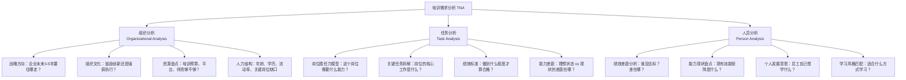
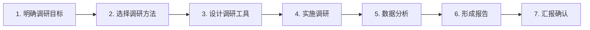

# 08 - 培训需求分析 TNA

> [!abstract] 核心定义
> 培训需求分析（Training Needs Analysis, TNA）是培训体系建设的起点，回答三个核心问题：**谁需要培训？需要什么培训？为什么需要培训？** TNA 的质量直接决定培训投入的精准度和 ROI。

---

## 一、TNA 三层模型

TNA 的经典框架是 **Goldstein 三层次模型**，从宏观到微观逐层聚焦：

### 1.1 组织分析（Organizational Analysis）

| 维度 | 核心问题 | 分析方法 |
|------|----------|----------|
| 战略方向 | 公司未来3-5年要往哪走？需要什么新能力？ | 战略解码会、高管访谈 |
| 组织文化 | 公司鼓励什么行为？培训需要强化什么文化？ | 文化诊断问卷、关键事件复盘 |
| 资源盘点 | 有多少预算？有什么平台？谁来做培训？ | 资源清单、IT 系统盘点 |
| 人力结构 | 年龄分布、学历结构、关键岗位空缺率 | HRIS 数据提取 |

### 1.2 任务分析（Task Analysis）

任务分析聚焦于**岗位层面**，核心输出是"这个岗位需要什么能力才能胜任"。

> [!example] 示例：销售经理岗位的任务分析
> 
> | 关键任务 | 所需能力 | 当前差距 | 培训优先级 |
> |----------|----------|----------|------------|
> | 大客户谈判 | 商务谈判技巧、合同风险识别 | 70% 销售经理未受过系统谈判训练 | P0 |
> | 团队业绩管理 | 目标分解、绩效辅导 | 50% 有管理经验，但缺乏系统方法论 | P1 |
> | CRM 数据分析 | 数据透视、销售漏斗分析 | 大部分依赖 Excel 手动统计 | P1 |

### 1.3 人员分析（Person Analysis）

人员分析聚焦于**个体层面**，回答"这个人需要培训什么"。

- **绩效差距分析**：将绩效数据与岗位标准对比，找出不达标项目
- **能力现状盘点**：建立技能矩阵（Skill Matrix），可视化团队能力分布
- **个人发展意愿**：通过问卷/访谈了解员工希望提升的方向
- **学习风格匹配**：视觉型/听觉型/动手型，不同风格匹配不同培训方式

---

## 二、需求调研方法

### 2.1 七种方法对比

| 方法 | 适用场景 | 优势 | 局限 |
|------|----------|------|------|
| **高管访谈** | 战略层需求 | 获取战略方向、高层期望 | 时间成本高、可能偏宏观 |
| **问卷调研** | 大规模覆盖 | 量化数据、覆盖面广 | 回收率低、表面化 |
| **绩效数据分析** | 能力差距 | 客观、可量化 | 只能发现"已经发生"的问题 |
| **焦点小组** | 深度挖掘 | 互动产生新洞察 | 容易受群体思维影响 |
| **关键事件复盘** | 典型问题 | 真实场景、可操作 | 样本量小、推广性存疑 |
| **工作观察** | 技能类培训 | 直接、不依赖自述 | 耗时、霍桑效应 |
| **对标分析** | 行业趋势 | 外部视角、前瞻性 | 数据获取难、可比性存疑 |

> [!tip] 最佳实践
> 单一方法不足以支撑完整的 TNA。推荐组合：**高管访谈（定方向）+ 问卷调研（定广度）+ 绩效数据分析（定差距）+ 焦点小组（定深度）**。

### 2.2 调研流程

---

## 三、战略关联：不同企业阶段的 TNA 重点

这是 TNA 中**最容易被忽略但最关键**的维度。同一个培训需求，在企业不同阶段，处理方式完全不同。

| 企业阶段 | TNA 核心问题 | 典型场景 | 培训策略 |
|----------|-------------|----------|----------|
| **初创期** | 业务缺口在哪？谁能快速上手？ | 新产品需要快速推向市场，但团队缺乏相关经验 | 聚焦业务急用技能，以战代练，外部引入关键能力 |
| **成长期** | 如何规模化复制能力？如何防止管理失控？ | 团队从50人扩张到200人，管理者多为"被提拔的明星员工" | 重点抓管理能力标准化培训，建立新员工入职体系 |
| **成熟期** | 如何创造能力溢价？如何避免组织僵化？ | 核心业务增长放缓，需要创新突破，但团队思维固化 | 创新思维培训、跨界学习、内部创业项目 |
| **转型期** | 哪些技能需要重塑？谁可以转型？ | 传统业务数字化，大量员工技能不匹配新业务 | 技能重塑（Reskilling）为核心，识别可转型人才 |

> [!important] 战略视角
> TNA 不是"大家想学什么"，而是"**企业战略需要什么能力**"。优秀的 TNA 一定是从战略出发，向下拆解到任务和人员，而不是从需求问卷出发，向上汇总。

---

## 四、常见误区

> [!warning] 误区一：只做问卷，不问业务
> 问卷只能反映"员工认为自己需要什么"，不能反映"业务需要员工会什么"。只依赖问卷的 TNA，最终产出的是"愿望清单"而非"需求清单"。

> [!warning] 误区二：只问 HR，不访高管
> HR 知道培训怎么做，但高管知道业务要往哪走。跳过高管访谈的 TNA，培训方案与战略脱节的风险极高。

> [!warning] 误区三：需求变成"愿望清单"
> 所有需求都重要 = 所有需求都不重要。TNA 必须做优先级排序，输出"必须做/应该做/可以做"三级清单，而非把所有需求堆在一起。

> [!warning] 误区四：只做一次，不做持续更新
> TNA 是动态的，不是一次性的。业务变化、人员变动、技术迭代都会带来新的培训需求。建议至少每半年做一次正式 TNA，每季度做一次快速扫描。

> [!warning] 误区五：忽略"不用培训也能解决"的需求
> 不是所有能力差距都要靠培训解决。有时候问题出在流程、工具、激励或招聘上。TNA 的结论中应该有一栏"非培训解决方案"。

---

## 五、面试应用

### 面试题：「你如何做培训需求调研？」

**STAR 回答框架：**

**Situation**：先判断企业所处阶段和业务战略。例如："在回答这个问题之前，我需要先了解公司的业务阶段和战略方向，因为不同阶段 TNA 的重点完全不同。"

**Task**：明确 TNA 的目标。例如："如果公司处于快速扩张期，TNA 的核心目标是识别管理能力短板和关键岗位能力缺口。"

**Action**：描述具体方法组合。
- "我会先和高管做 1-2 轮访谈，了解战略方向和能力期望。"
- "然后设计调研问卷，覆盖全员，了解员工自评的能力现状和培训意愿。"
- "同时拉取绩效数据，分析关键岗位的绩效差距。"
- "针对关键岗位，组织焦点小组，深挖具体任务场景中的能力不足。"
- "最后将所有信息汇总，形成'必须做/应该做/可以做'三级需求清单。"

**Result**：强调产出。例如："最终输出一份《培训需求分析报告》，包含组织层面、任务层面、人员层面的分析结论，以及优先级排序后的培训建议。"

> [!tip] 加分回答
> 如果你的面试官是业务负责人，可以补充："TNA 的最终目的是帮业务解决问题，所以我会在需求确认阶段，和业务负责人一起做一次'需求校准会'，确保我们理解的'需求'和业务理解的'需求'是同一个东西。"

---

## 关联笔记

- [[03-HR人事/培训与人才发展/01-战略视角/01_企业生命周期与人才战略]] — 不同企业阶段的 TNA 策略差异
- [[03-HR人事/培训与人才发展/01-战略视角/02_战略人力资源与人才供应链]] — 战略导向的人才需求预测
- [[03-HR人事/培训与人才发展/01-战略视角/03_不同战略下的人才发展策略]] — 业务战略对培训需求的影响
- [[03-HR人事/培训与人才发展/03-培训体系/09_课程体系搭建]] — TNA 结果如何转化为课程体系
- [[03-HR人事/培训与人才发展/03-培训体系/11_培训预算与ROI]] — TNA 如何支撑预算编制
- [[03-HR人事/培训与人才发展/02-核心理论/04_成人学习理论]] — 成人学习特点对需求调研的启示
- [[03-HR人事/培训与人才发展/02-核心理论/07_ADDIE教学设计模型]] — TNA 对应 ADDIE 的 A（分析）阶段
- [[03-HR人事/培训与人才发展/07-面试实战/22_面试常见问题]] — 更多面试题
- [[03-HR人事/培训与人才发展/07-面试实战/23_案例：电网培训基地复盘]] — 电网项目 TNA 实战案例