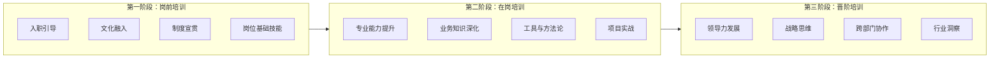
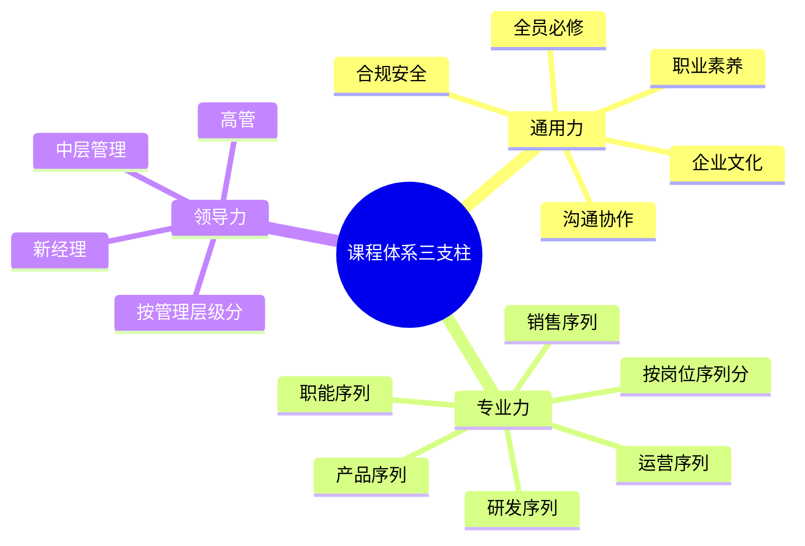
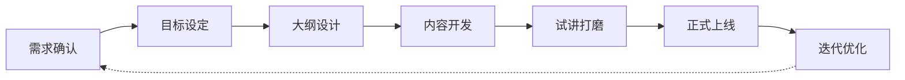
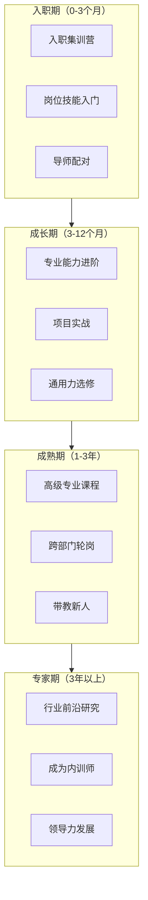

# 09 - 课程体系搭建

> [!abstract] 核心定义
> 课程体系是企业培训的"产品矩阵"，决定了员工在什么阶段、学什么内容、达到什么标准。一个优秀的课程体系不是课程清单的罗列，而是**以岗位能力模型为骨架、以员工发展阶段为节奏、以业务战略为方向**的结构化学习路径。

---

## 一、三阶段设计

课程体系围绕员工全生命周期设计，分为三个阶段：

### 1.1 岗前培训（New Hire Onboarding）

| 模块 | 内容 | 时长 | 形式 |
|------|------|------|------|
| 入职引导 | 公司介绍、组织架构、IT 账号、工位安排 | 第1天 | 现场 + 手册 |
| 文化融入 | 使命愿景价值观、行为准则、公司故事 | 第1周 | 高管分享 + 案例研讨 |
| 制度宣贯 | 考勤、薪酬、绩效、晋升、合规 | 第1周 | 线上课程 + 考试 |
| 岗位基础技能 | 岗位必备工具、流程、规范 | 第1-3个月 | 导师带教 + 实操 |

> [!tip] 岗前培训的关键指标
> 不是"培训完成率"，而是**新员工30/60/90天留存率**和**首季度绩效达标率**。

### 1.2 在岗培训（On-the-Job Training）

在岗培训是课程体系的核心，目标是从"能干活"到"干得好"。

- **专业能力提升**：按岗位序列设计专业课程（如：销售序列的"大客户经营"、研发序列的"系统架构设计"）
- **业务知识深化**：行业趋势、竞品分析、客户洞察
- **工具与方法论**：项目管理、数据分析、AI 工具应用
- **项目实战**：以真实业务项目为载体的行动学习

### 1.3 晋阶培训（Career Advancement）

当员工从"个人贡献者"走向"团队管理者"，培训内容需要从"做事"转向"带人"和"看方向"。

| 晋阶路径 | 培训重点 | 典型课程 |
|----------|----------|----------|
| 骨干 → 一线管理 | 角色转变、任务分配、绩效反馈 | 《从明星员工到合格管理者》 |
| 一线管理 → 中层管理 | 团队建设、跨部门协作、资源协调 | 《中层管理者的五项修炼》 |
| 中层管理 → 高层管理 | 战略思维、组织设计、文化塑造 | 《战略领导力》 |

---

## 二、三支柱模型

课程体系按"能力属性"分为三大支柱：

### 2.1 通用力（全员必修）

| 类别 | 课程举例 | 覆盖要求 |
|------|----------|----------|
| 企业文化 | 公司历史与价值观、行为准则 | 100% 覆盖 |
| 职业素养 | 时间管理、商务礼仪、邮件写作 | 100% 覆盖 |
| 通用技能 | 高效沟通、PPT 制作、数据分析基础 | 按岗位分级 |
| 合规安全 | 信息安全、反腐败、安全生产 | 100% 覆盖 + 年度复训 |

### 2.2 专业力（按岗位序列）

| 岗位序列 | 初级 | 中级 | 高级 |
|----------|------|------|------|
| 销售序列 | 产品知识、销售话术 | 大客户经营、谈判技巧 | 行业解决方案、客户战略 |
| 研发序列 | 编码规范、技术栈入门 | 系统设计、代码审查 | 架构设计、技术规划 |
| 产品序列 | 需求分析、原型设计 | 产品规划、数据分析 | 产品战略、商业模式 |
| 运营序列 | 内容运营、活动策划 | 用户增长、数据驱动 | 运营体系搭建、品牌策略 |

### 2.3 领导力（按管理层级）

| 层级 | 核心能力 | 培训方式 |
|------|----------|----------|
| 新经理（L1） | 角色认知、任务分配、绩效反馈 | 课堂培训 + 导师辅导 |
| 中层管理（L2） | 团队建设、跨部门协作、变革管理 | 行动学习 + 外部对标 |
| 高层管理（L3） | 战略思维、组织设计、文化塑造 | 高管教练 + 私董会 |

---

## 三、课程开发流程

| 阶段 | 关键动作 | 产出物 |
|------|----------|--------|
| 需求确认 | 与业务方对齐课程目标，确认目标学员画像 | 课程需求文档 |
| 目标设定 | 用 Bloom 教学目标分类法，设定知识/技能/态度目标 | 教学目标清单 |
| 大纲设计 | 确定课程结构、模块划分、时间分配 | 课程大纲 |
| 内容开发 | 编写课件、案例、练习、测评 | 课件包（PPT+讲师手册+学员手册） |
| 试讲打磨 | 小范围试讲，收集反馈，迭代优化 | 试讲反馈报告 |
| 正式上线 | 排课、宣传、报名、实施 | 课程运营方案 |
| 迭代优化 | 基于学员反馈和效果评估，持续优化 | 课程迭代记录 |

> [!tip] 敏捷课程开发
> 传统 ADDIE 模型强调"先分析、再设计、再开发"，适合大型课程体系。对于快速变化的业务需求，推荐使用**敏捷课程开发**：先出 MVP（最小可行课程），小范围试讲，快速迭代。不必追求第一次就完美。

---

## 四、学习地图（Learning Map）

学习地图是从"新人"到"专家"的全景路径图，直接回答员工最关心的问题："**我在这个岗位，能学到什么？能走到哪？**"

> [!example] 以产品经理序列为例
> 
> | 阶段 | 必修课程 | 学习方式 | 检验标准 |
> |------|----------|----------|----------|
> | 入职期 | 《产品经理入门》《公司产品全景》《用户研究方法》 | 线上课 + 导师带教 | 独立完成1个需求文档 |
> | 成长期 | 《数据分析实战》《竞品分析方法》《产品规划》 | 项目实战 + 研讨 | 主导1个产品模块迭代 |
> | 成熟期 | 《商业模式设计》《增长方法论》《用户心理学》 | 轮岗 + 外部学习 | 主导1条产品线规划 |
> | 专家期 | 《行业趋势》《战略思维》《AI产品设计》 | 对外分享 + 带团队 | 成为公司产品专家 |

---

## 五、面试应用

### 面试题：「你如何搭建一个公司的课程体系？」

**STAR 回答框架：**

**Situation**：先判断公司阶段。
- "在搭建课程体系之前，我首先需要了解公司处于什么发展阶段、业务战略是什么、组织架构是怎样的。"
- "比如，初创期公司不需要复杂的晋阶培训，重点放在岗前和在岗培训；成熟期公司则需要完整的三阶段体系。"

**Task**：明确课程体系的目标。
- "课程体系的核心目标是：让每个岗位的员工，在每个发展阶段，都能找到对应的学习内容。"

**Action**：分步搭建。
1. **摸底**：先做组织分析和岗位分析，梳理关键岗位序列和能力模型。
2. **分层**：按三阶段（岗前/在岗/晋阶）和三支柱（通用力/专业力/领导力）搭建框架。
3. **填内容**：通过 TNA 确定每个格子里的课程需求，优先做"最紧急最重要"的课程。
4. **做学习地图**：为每个关键岗位绘制从新人到专家的学习路径图。
5. **建机制**：课程开发的流程、讲师资源、评估机制。

**Result**：
- "最终交付一个可落地的课程体系框架，包含课程清单、学习地图、开发排期和资源需求。"

> [!tip] 加分回答
> "课程体系不是一次性建完的。我会采用'小步快跑'的策略：先做 P0 课程（覆盖最紧急的能力缺口），用 3 个月上线；然后每个季度迭代，逐步完善。同时，课程体系需要和晋升、绩效、人才盘点打通，形成'学-用-评'闭环。"

---

## 关联笔记

- [[03-HR人事/培训与人才发展/03-培训体系/08_培训需求分析TNA]] — TNA 是课程体系搭建的输入
- [[03-HR人事/培训与人才发展/03-培训体系/10_内训师队伍建设]] — 课程谁来教？内训师是课程落地的关键
- [[03-HR人事/培训与人才发展/03-培训体系/11_培训预算与ROI]] — 课程体系如何影响预算编制
- [[03-HR人事/培训与人才发展/02-核心理论/04_成人学习理论]] — 课程设计如何符合成人学习规律
- [[03-HR人事/培训与人才发展/02-核心理论/05_70-20-10法则]] — 课程体系中的学习方式分配
- [[03-HR人事/培训与人才发展/02-核心理论/06_柯氏四级评估]] — 课程效果的评估框架
- [[03-HR人事/培训与人才发展/02-核心理论/07_ADDIE教学设计模型]] — 课程开发流程
- [[03-HR人事/培训与人才发展/01-战略视角/01_企业生命周期与人才战略]] — 不同阶段的课程体系侧重
- [[03-HR人事/培训与人才发展/01-战略视角/03_不同战略下的人才发展策略]] — 业务战略对课程内容的影响
- [[03-HR人事/培训与人才发展/07-面试实战/22_面试常见问题]] — 更多面试题
- [[03-HR人事/培训与人才发展/07-面试实战/24_案例：从零搭建培训体系]] — 从零搭建的实战案例