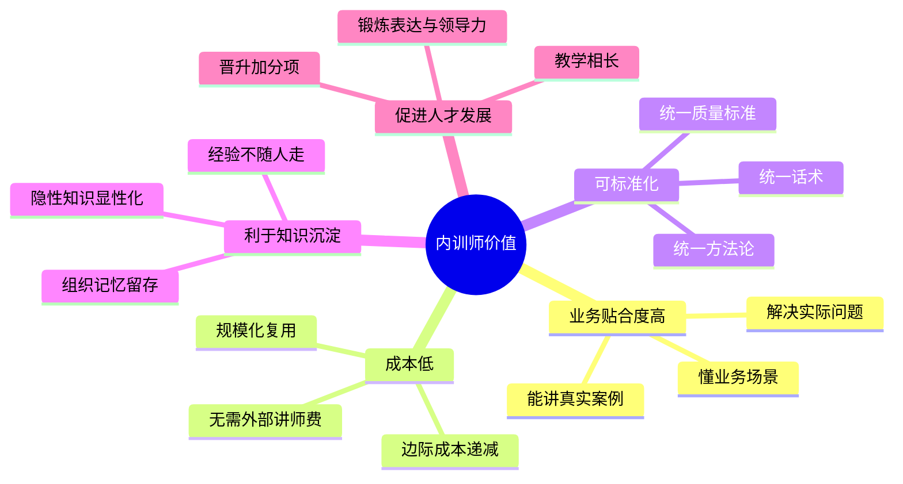
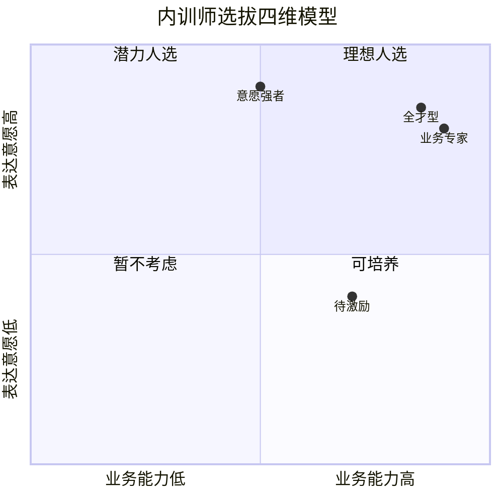
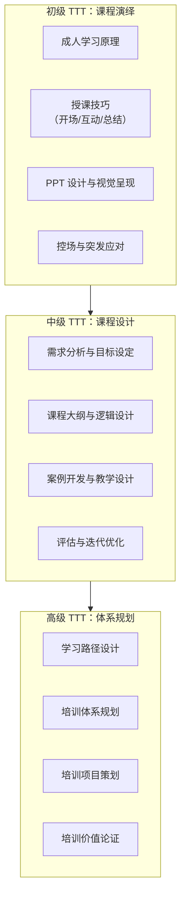
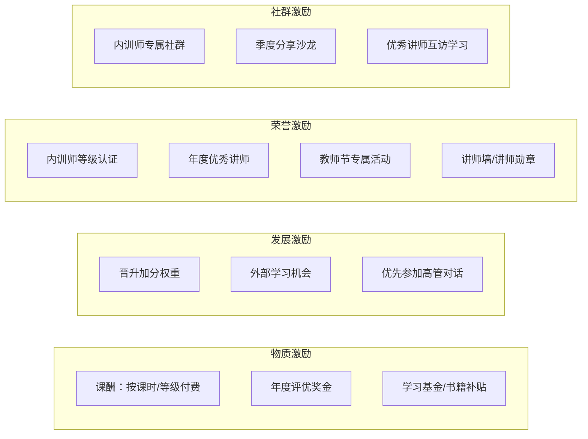

# 10 - 内训师队伍建设

> [!abstract] 核心定义
> 内训师（Internal Trainer）是企业培训资源中**性价比最高、业务贴合度最强**的资产。一支高质量的内训师队伍，可以解决"培训内容脱离业务""外部讲师成本高""知识无法沉淀"三大痛点。

---

## 一、内训师价值分析

### 内训师 vs 外聘讲师决策矩阵

| 维度 | 内训师 | 外聘讲师 | 决策建议 |
|------|--------|----------|----------|
| 业务贴合度 | 高 | 低 | 业务类课程优先内训师 |
| 体系化程度 | 依赖培养 | 自带体系 | 核心课程体系化后内化 |
| 前沿视野 | 局限 | 开阔 | 行业趋势类优先外聘 |
| 成本 | 低（长期） | 高（单次） | 高频课程优先内训师 |
| 权威性 | 内部认可 | 外部背书 | 变革类课程可引入外部 |
| 时间投入 | 兼职教学 | 专职 | 需平衡业务与教学 |

> [!tip] 决策原则
> **"高频 + 业务 + 标准化"用内训师，"低频 + 前沿 + 变革"用外聘讲师。** 外聘讲师的目标不是替代内训师，而是"赋能内训师"——把外部的方法论和视野，通过内训师转化到组织内部。

---

## 二、内训师选拔标准

### 2.1 四维选拔模型

| 维度 | 标准 | 评估方式 |
|------|------|----------|
| **业务专家** | 在所在领域有 3 年以上实战经验，绩效排名前 30% | 绩效数据 + 上级评价 |
| **表达意愿** | 愿意分享、乐于带教，不排斥公开表达 | 面试 + 试讲 |
| **带教能力** | 能把复杂问题讲清楚，有耐心，能换位思考 | 试讲评估 + 学员反馈 |
| **时间投入** | 每月能保证 4-8 小时用于课程开发和授课 | 上级确认 + 自我承诺 |

### 2.2 选拔流程

---

## 三、TTT（Train the Trainer）培养体系

TTT 是内训师的核心赋能体系，按照能力梯度分为三个等级：

| 等级 | 能力定位 | 核心能力 | 认证方式 | 典型周期 |
|------|----------|----------|----------|----------|
| 初级 | 能讲好课 | 课程演绎、控场互动 | 试讲 + 学员满意度 >= 4.5/5 | 3个月 |
| 中级 | 能开发课 | 课程设计、案例开发 | 独立开发 1 门课程并通过评审 | 6-12个月 |
| 高级 | 能规划体系 | 学习路径设计、培训项目策划 | 主导 1 个培训项目并达成目标 | 12-24个月 |

---

## 四、激励与保留

内训师是"兼职"角色，如果没有有效的激励机制，很容易出现"报名时热情，上课时请假"的情况。

### 4.1 激励体系设计

### 4.2 课酬设计参考

| 讲师等级 | 课酬标准（元/课时） | 适用条件 |
|----------|---------------------|----------|
| 初级讲师 | 100-200 | 通过初级 TTT 认证 |
| 中级讲师 | 200-400 | 通过中级 TTT 认证，满意度 >= 4.5 |
| 高级讲师 | 400-800 | 通过高级 TTT 认证，满意度 >= 4.8 |
| 特聘讲师 | 800-1500 | 高管/行业专家，不设评级 |

> [!tip] 非金钱激励同样重要
> 调研显示，内训师最看重的激励因素排序：**成长机会 > 荣誉认可 > 晋升关联 > 课酬**。所以不要只盯着课酬，更要给内训师"看得见的成长"。

---

## 五、常见问题与对策

> [!warning] 问题一：业务忙，没时间上课
> **对策**：与内训师上级达成共识，将授课时间纳入工作计划；授课安排在业务淡季；建立"替补讲师"机制。

> [!warning] 问题二：课程质量参差不齐
> **对策**：建立课程标准化模板（课件模板、讲师手册模板）；所有新课必须经过试讲评审；每季度做课程质量抽检。

> [!warning] 问题三：内训师流失率高
> **对策**：定期做内训师满意度调研；为内训师设计专属成长路径（如优先晋升、优先外部学习）；建立内训师社群，增强归属感。

> [!warning] 问题四：内训师变成"读 PPT 机器"
> **对策**：在 TTT 培训中强化"引导式教学"而非"灌输式教学"；鼓励内训师用案例、研讨、实操代替纯讲授；课程评估中加入"互动性"维度。

---

## 六、面试应用

### 面试题：「你们公司内训师怎么管理？」

**STAR 回答框架：**

**Situation**：先说明内训师的定位。
- "内训师是培训体系的'最后一公里'，再好的课程设计，如果没有合适的讲师，效果都会大打折扣。"

**Task**：内训师管理的核心目标。
- "内训师管理的核心是三个词：选对人、培养好、留得住。"

**Action**：
1. **选**："我们建立了四维选拔标准：业务专家+表达意愿+带教能力+时间投入。选拔流程包括自荐/推荐→材料审核→试讲面试→聘任。"
2. **育**："我们有三阶 TTT 培养体系：初级学'怎么讲'，中级学'怎么设计'，高级学'怎么规划'。每个阶段都有认证考核。"
3. **用**："内训师匹配到对应的课程体系，按照课程计划排课。每季度做一次课程质量评估。"
4. **留**："激励体系包括四个维度：课酬（物质）、晋升加分（发展）、年度评优（荣誉）、讲师社群（归属）。"

**Result**：
- "最终目标是打造一支'召之即来、来之能讲、讲之有效'的内训师队伍。"

> [!tip] 加分回答
> "内训师管理的核心难点不是'怎么激励'，而是'怎么让业务领导支持'。我会在启动内训师项目时，先和关键业务负责人做一次正式沟通，讲清楚内训师对业务团队的价值——不是额外负担，而是团队能力建设的投资。"

---

## 关联笔记

- [[03-HR人事/培训与人才发展/03-培训体系/08_培训需求分析TNA]] — TNA 结果决定需要什么类型的内训师
- [[03-HR人事/培训与人才发展/03-培训体系/09_课程体系搭建]] — 课程体系决定内训师的配置需求
- [[03-HR人事/培训与人才发展/03-培训体系/11_培训预算与ROI]] — 内训师课酬在预算中的占比
- [[03-HR人事/培训与人才发展/02-核心理论/04_成人学习理论]] — TTT 中如何教内训师理解成人学习
- [[03-HR人事/培训与人才发展/02-核心理论/05_70-20-10法则]] — 内训师成长的 70-20-10 应用
- [[03-HR人事/培训与人才发展/05-培训运营/16_培训项目全流程管理]] — 内训师在项目中的角色
- [[03-HR人事/培训与人才发展/07-面试实战/22_面试常见问题]] — 更多面试题
- [[03-HR人事/培训与人才发展/07-面试实战/23_案例：电网培训基地复盘]] — 电网项目中的内训师实践