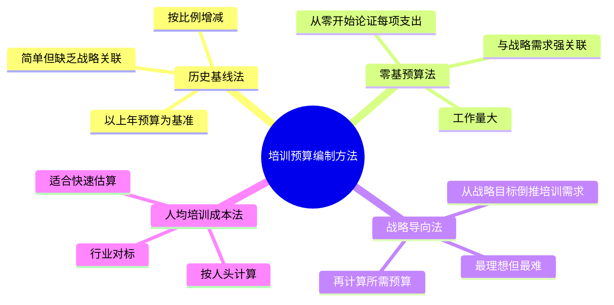
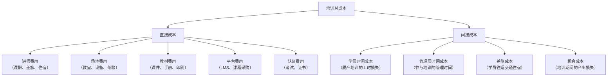

# 11 - 培训预算与 ROI

> [!abstract] 核心定义
> 培训预算管理是培训体系中最具"战略说服力"的环节。它不只是"多少钱怎么花"，而是**用数据和逻辑向业务方证明：培训这笔钱，花得值**。在 COE 面试中，能否讲清楚培训预算与 ROI，直接体现候选人的商业思维和战略高度。

---

## 一、预算编制方法



### 1.1 四种方法对比

| 方法 | 公式 | 优势 | 劣势 | 适用场景 |
|------|------|------|------|----------|
| 历史基线法 | 今年预算 = 去年预算 x (1 + 增长率) | 简单、有历史依据 | 与战略脱节，容易"惯性花钱" | 稳定期企业 |
| 零基预算法 | 每个项目从零开始论证 | 精准、与战略强关联 | 工作量大，容易被砍 | 需要精细化管理时 |
| 战略导向法 | 从战略目标倒推培训需求再算成本 | 战略一致性最高 | 对 T&D 团队能力要求高 | 有成熟 T&D 团队时 |
| 人均培训成本法 | 预算 = 人均成本 x 员工数 | 快速、可对标 | 忽略岗位差异和战略需求 | 快速估算或行业对标 |

> [!tip] 最佳实践
> 推荐组合：**战略导向法定方向 + 零基预算法定细节 + 人均成本法做校验**。用战略导向法确定"今年必须投入什么"，用零基预算逐项论证，最后用行业人均成本做合理性校验。

---

## 二、培训成本构成



> [!example] 培训成本估算示例
> 
> 假设一个为期 2 天的中层管理培训，30 人参加：
> 
> | 成本项目 | 金额 | 说明 |
> |----------|------|------|
> | 外部讲师费 | 30,000 | 2天 x 15,000/天 |
> | 场地 + 茶歇 | 5,000 | 酒店会议室 |
> | 教材印刷 | 3,000 | 手册 + 资料 |
> | 差旅费 | 15,000 | 异地学员往返 |
> | 学员时间成本 | 48,000 | 30人 x 2天 x 800元/天（人均日薪估算） |
> | **总计** | **101,000** | — |
> 
> 其中直接成本 38,000，间接成本 63,000。**间接成本往往是直接成本的 1.5-2 倍，做预算时容易被忽略。**

---

## 三、战略关联：经济下行期如何论证培训预算

> [!important] 核心论点
> 培训不是成本，是投资。经济下行期砍培训预算，短期看似省钱，长期是"省了教练钱，输了比赛"。

### 3.1 论证框架

```mermaid
flowchart TD
    A["CEO 要砍培训预算"] --> B{"你的论证策略"}

    B --> C["角度一：用数据说话"]
    C --> C1["展示过去培训项目的 ROI 数据"]
    C --> C2["对标行业：不培训的隐性成本"]
    C --> C3["用"替代成本"论证：\n外部招聘成本 vs 内部培养成本"]

    B --> D["角度二：用战略说话"]
    D --> D1["经济下行期更需要能力升级\n而非能力退化"]
    D --> D2["砍培训 = 砍未来竞争力\n经济复苏时团队能力跟不上"]
    D --> D3["把培训预算从"维护性"转为\n"进攻性"：聚焦战略级能力"]

    B --> E["角度三：用方案说话"]
    E --> E1["主动提出降本方案：\n多用内训师、线上化、聚焦核心"]
    E --> E2["提出"保底线"方案：\n哪些培训绝对不能砍"]
    E --> E3["设计"低预算高产出"方案：\n721 中的 70% 项目实践成本很低"]
```

### 3.2 不同经济周期的培训策略

| 经济环境 | 培训策略 | 预算重点 |
|----------|----------|----------|
| 上行期 | 扩张型：加大投入，抢占人才红利 | 领导力发展、新业务能力建设 |
| 平稳期 | 稳健型：优化结构，提升效率 | 内训师建设、数字化学习平台 |
| 下行期 | 聚焦型：砍广度保深度，钱花在刀刃上 | 关键岗位能力、技能重塑（Reskilling） |
| 复苏期 | 进攻型：提前布局，为增长储备 | 新技能培训、组织能力升级 |

---

## 四、培训价值论证的三种方式

### 4.1 硬 ROI（财务数据）

直接用财务数据量化培训的效果。

> [!example] 硬 ROI 计算公式
> 
> **ROI = (培训收益 - 培训成本) / 培训成本 x 100%**
> 
> 示例：销售技巧培训
> - 培训成本：100,000 元
> - 培训后 6 个月内，参训学员人均销售额提升 15%，折合增量收入 500,000 元
> - ROI = (500,000 - 100,000) / 100,000 x 100% = **400%**

> [!warning] 硬 ROI 的局限性
> 并非所有培训都能精确量化。领导力、文化、创新能力的培训效果往往是长期和间接的，硬 ROI 计算容易低估其价值。

### 4.2 软 ROI（行为改变）

用行为改变和绩效提升来论证培训价值。

| 指标类型 | 举例 | 数据来源 |
|----------|------|----------|
| 行为改变 | 360 度评估中"辅导下属"得分提升 20% | 前后测对比 |
| 效率提升 | 新员工上手时间从 3 个月缩短到 2 个月 | HR 数据 |
| 质量改善 | 产品缺陷率降低 15% | 业务数据 |
| 员工留存 | 参训学员 1 年留存率比未参训高 10% | HR 数据 |

### 4.3 战略价值（组织能力）

用培训对组织长期能力的贡献来论证。

| 维度 | 论证方式 | 举例 |
|------|----------|------|
| 人才梯队 | 内部晋升率、关键岗位内部填补率 | "通过领导力项目，中高层内部晋升率从 30% 提升到 60%" |
| 组织能力 | 从"依赖外部招聘"到"具备内部培养能力" | "3 年前核心岗位 80% 靠外部招聘，现在 60% 靠内部培养" |
| 战略支撑 | 培训直接支撑战略落地 | "数字化转型项目，培训使 500 名员工完成技能重塑" |

---

## 五、面试应用

### 面试题：「如果 CEO 要砍培训预算，你怎么说？」

**STAR 回答框架：**

**Situation**：先理解 CEO 的立场。
- "我理解在经济下行期，CEO 需要控制成本。但我会用数据和逻辑，让 CEO 看到培训不是可砍的成本，而是必须保留的投资。"

**Task**：不是拒绝砍预算，而是提出更聪明的方案。
- "我的目标不是'一分钱不砍'，而是'砍掉该砍的，保住该保的'。"

**Action**：三步走策略。
1. **用数据说话**："我会先拿出过去培训项目的 ROI 数据，用具体数字证明培训创造了什么价值。比如，销售培训后人均业绩提升 15%，领导力项目后内部晋升率提升到 60%。"
2. **用战略说话**："我会把培训预算和公司战略绑在一起。比如，如果公司今年要数字化转型，我会说'数字化能力的培训预算不能砍，因为这是转型能否成功的关键支撑'。"
3. **用方案说话**："我不会被动等待被砍，而是主动提出优化方案：把外部讲师换成内训师，把线下培训搬到线上，把'nice to have'的课程砍掉，聚焦'战略级'课程。目标是'预算减 20%，效果不降'。"

**Result**：
- "最终交出一个'优化后的培训预算方案'，让 CEO 看到：我们不是在保护部门利益，而是在帮公司做最聪明的投资决策。"

> [!tip] 加分回答
> "还有一个角度：我会帮 CEO 算一笔'不培训的代价'。比如，关键岗位外部招聘成本是内部培养的 2-3 倍；新员工没有系统培训，离职率高出 30%。这些隐性成本，往往比培训预算高得多。"

---

## 关联笔记

- [[03-HR人事/培训与人才发展/03-培训体系/08_培训需求分析TNA]] — TNA 是预算编制的基础输入
- [[03-HR人事/培训与人才发展/03-培训体系/09_课程体系搭建]] — 课程体系决定预算的分配结构
- [[03-HR人事/培训与人才发展/03-培训体系/10_内训师队伍建设]] — 内训师课酬是预算的重要组成
- [[03-HR人事/培训与人才发展/02-核心理论/06_柯氏四级评估]] — 柯氏四级是 ROI 计算的理论基础
- [[03-HR人事/培训与人才发展/01-战略视角/01_企业生命周期与人才战略]] — 不同阶段的预算策略
- [[03-HR人事/培训与人才发展/01-战略视角/02_战略人力资源与人才供应链]] — 培训投资的战略视角
- [[03-HR人事/培训与人才发展/05-培训运营/18_培训数据分析]] — 培训数据如何支撑 ROI 论证
- [[03-HR人事/培训与人才发展/07-面试实战/22_面试常见问题]] — 更多面试题
- [[03-HR人事/培训与人才发展/07-面试实战/23_案例：电网培训基地复盘]] — 电网项目的预算与 ROI 实践