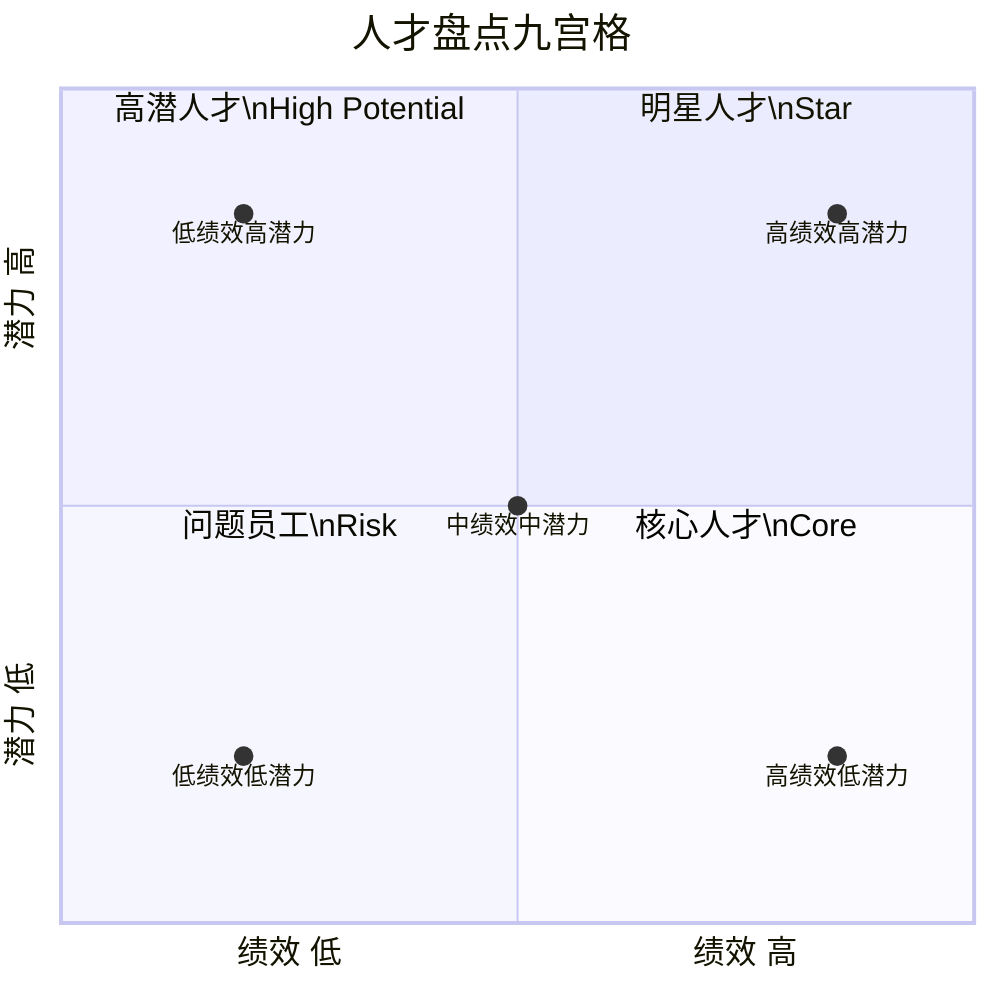
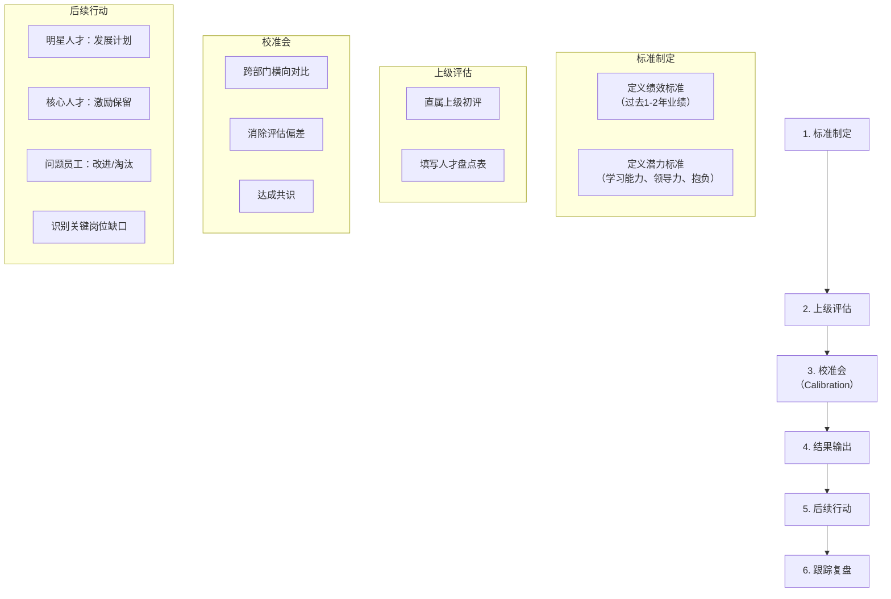
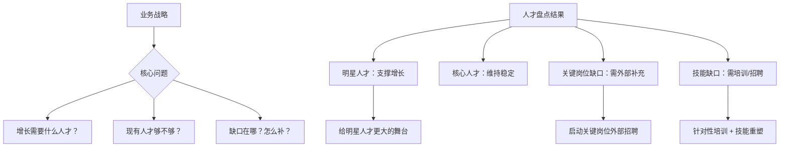

# 12 - 人才盘点九宫格

> [!abstract] 核心定义
> 人才盘点九宫格（9-Box Grid）是人才管理中**最经典的工具**，以"绩效"和"潜力"两个维度，将组织中的人才分为 9 个格子，对应 4 类人才。它不是"给人贴标签"，而是**回答 CEO 最关心的问题：谁是我们最核心的人？谁有风险？我们的人才缺口在哪？**

---

## 一、绩效 x 潜力矩阵



### 1.1 九宫格详解

| 绩效\潜力 | 低（1-3） | 中（4-6） | 高（7-9） |
|:---:|:---:|:---:|:---:|
| **高（7-9）** | **核心人才**（Core）<br/>当前贡献大，但成长空间有限<br/>策略：保留、激励、发挥价值 | **核心人才+**（Core+）<br/>稳定贡献，有一定成长空间<br/>策略：重点培养、扩大职责 | **明星人才**（Star）<br/>业绩好 + 潜力高<br/>策略：加速发展、重点保留、给挑战性任务 |
| **中（4-6）** | **待提升者**（Underperformer）<br/>业绩一般，潜力有限<br/>策略：绩效改进计划（PIP） | **稳定贡献者**（Solid）<br/>中规中矩<br/>策略：维持并逐步提升 | **高潜人才**（High Potential）<br/>潜力高但业绩尚未充分释放<br/>策略：轮岗锻炼、导师辅导 |
| **低（1-3）** | **问题员工**（Risk）<br/>业绩差、潜力低<br/>策略：限期改进或淘汰 | **待观察者**（Watch）<br/>业绩差但有一定潜力<br/>策略：分析根因、针对性辅导 | **错位者**（Mismatch）<br/>潜力高但业绩差<br/>策略：岗位调整、找对位置 |

### 1.2 四类人才画像

| 类别 | 特征 | 比例参考 | 人才策略 |
|------|------|----------|----------|
| **明星人才** | 高绩效 x 高潜力，是组织的未来 | 10-15% | 加速发展、给挑战性任务、重点保留、高激励 |
| **核心人才** | 高绩效 x 中低潜力，是组织的现在 | 25-30% | 保留、激励、发挥价值、适当授权带教 |
| **问题员工** | 低绩效 x 低潜力 | 5-10% | 限期改进（PIP）、调岗、或淘汰 |
| **高潜人才** | 中低绩效 x 高潜力，是组织的储备 | 10-15% | 轮岗锻炼、导师辅导、找对位置释放潜力 |

> [!tip] 九宫格不是数学公式
> 九宫格的价值不在于"精确地把人放在哪个格子"，而在于**引发关于人才的深度对话**。放的位置对错不重要，重要的是围绕这个位置展开的讨论——"这个人我们怎么判断的？有没有不同的看法？"

---

## 二、盘点流程



### 2.1 绩效标准定义

| 维度 | 高绩效（7-9） | 中绩效（4-6） | 低绩效（1-3） |
|------|--------------|--------------|--------------|
| 业绩达成 | 持续超额完成目标 | 基本完成目标 | 持续未达标 |
| 工作质量 | 高质量、超出预期 | 符合标准 | 频繁返工、有质量问题 |
| 影响力 | 主动推动团队前进 | 做好本职工作 | 消极被动 |

### 2.2 潜力标准定义

潜力不等于"年轻"或"学历高"。潜力在九宫格中通常指三个维度：

| 维度 | 定义 | 高潜力的表现 |
|------|------|-------------|
| **学习敏锐度** | 面对新情境快速学习并应用的能力 | 给一个新任务，能快速上手并做出结果 |
| **领导力潜能** | 影响他人、推动变革的意愿和能力 | 不是管理者但能带动团队，能推动跨部门协作 |
| **抱负与驱动力** | 愿意承担更大责任、追求更高目标 | 主动争取有挑战的工作，不满足于现状 |

---

## 三、校准会（Calibration）

> [!important] 校准会的作用
> 校准会是人才盘点流程中**最重要的环节**。它的核心价值不是"确认谁在哪个格子"，而是**消除评估偏差，让不同管理者对人才标准的理解对齐**。

### 3.1 校准会常见偏差

| 偏差类型 | 表现 | 对策 |
|----------|------|------|
| **仁慈偏差** | 管理者给所有下属都打高分 | 强制分布、跨部门横向对比 |
| **近因效应** | 用最近3个月的表现替代全年评价 | 要求提供全年关键事件记录 |
| **晕轮效应** | 因为某一方面优秀，就认为各方面都优秀 | 逐维度分开评价，绩效和潜力分别讨论 |
| **相似偏差** | 更喜欢和自己相似的人 | 引入多元评委，讨论"TA和我不一样的地方" |
| **中央趋势** | 所有人都放中间，不敢给极端评价 | 要求必须有"明星"和"待改进"人选 |

### 3.2 校准会流程

```
1. HR 主持人说明规则（5分钟）
2. 按部门/团队逐一讨论（每人3-5分钟）
   - 直属上级陈述：绩效亮点 + 潜力判断 + 初步定位
   - 其他管理者提问和补充
   - 跨部门横向对比
3. 达成共识，确定最终位置
4. 讨论后续行动（每类人才的策略）
5. 汇总关键岗位缺口和风险
```

> [!tip] 校准会主持人技巧
> 好的校准会主持人会问这些问题：
> - "如果这个人明天离职，你会多难过？"（测重要性）
> - "如果有一个新业务需要人，你会让 TA 去吗？"（测潜力和信任）
> - "TA 和 XX（同级别同事）比，谁更强？"（横向对比）

---

## 四、战略关联

人才盘点的结果不是 HR 的"内部报告"，而是**业务战略的输入**。



| 战略场景 | 人才盘点关注点 | 后续行动 |
|----------|---------------|----------|
| 业务扩张 | 明星人才够不够？关键岗位有无储备？ | 加速内部培养 + 外部招聘弥补缺口 |
| 业务转型 | 现有人才中有多少人能转型？ | 识别可转型人才，启动技能重塑计划 |
| 降本增效 | 哪些人是必须保留的？哪些人可以优化？ | 保明星、保核心，优化问题员工 |
| 组织调整 | 合并后的人才结构如何？ | 重新盘点，识别冗余和缺口 |

---

## 五、面试应用

### 面试题：「请描述一次你参与的人才盘点」

**STAR 回答框架：**

**Situation**：
- "在之前的公司，我参与了一次年度人才盘点，覆盖 200+ 人的业务团队。公司当时处于快速扩张期，需要识别能支撑下一阶段增长的核心人才。"

**Task**：
- "我的角色是 HR BP，负责推动盘点流程、组织校准会、确保评估标准的一致性。"

**Action**：
1. **标准制定**："我们先和业务负责人对齐了绩效标准和潜力标准。绩效看过去 2 年的业绩达成，潜力看学习能力、领导力潜能和抱负三个维度。"
2. **上级评估**："各团队管理者完成初评，填写人才盘点表。"
3. **校准会**："我主持了 3 场校准会，每场 15-20 人。重点做了三件事：横向对比消除仁慈偏差、追问'为什么这么判断'确保有依据、推动跨部门人才对标。"
4. **结果输出**："最终输出九宫格分布 + 明星人才名单 + 关键岗位缺口报告。"
5. **后续行动**："针对明星人才，制定了加速发展计划；针对关键岗位缺口，启动了外部招聘和内部培养项目。"

**Result**：
- "盘点后 6 个月内，明星人才中有 3 人晋升；关键岗位缺口从 8 个降到 3 个。更重要的是，业务负责人对团队人才状况有了清晰认知，招聘和培养更有方向。"

> [!tip] 加分回答
> "人才盘点中最难的不是'把人放对位置'，而是校准会上的'政治因素'——有些管理者不愿意把'自己人'放低，或者不愿意承认团队有短板。我的经验是：在校准会上用数据说话，而不是主观判断；同时，把盘点结果和业务目标绑定，让管理者意识到'这不是 HR 在挑刺，而是帮业务看清人才家底'。"

---

## 关联笔记

- [[03-HR人事/培训与人才发展/01-战略视角/01_企业生命周期与人才战略]] — 不同阶段的人才盘点侧重
- [[03-HR人事/培训与人才发展/01-战略视角/02_战略人力资源与人才供应链]] — 人才供应链视角下的盘点
- [[03-HR人事/培训与人才发展/01-战略视角/03_不同战略下的人才发展策略]] — 业务战略对盘点结果的影响
- [[03-HR人事/培训与人才发展/04-人才发展/13_继任者计划]] — 盘点结果直接输入继任者计划
- [[03-HR人事/培训与人才发展/04-人才发展/14_IDP个人发展计划]] — 盘点结果为 IDP 提供输入
- [[03-HR人事/培训与人才发展/04-人才发展/15_轮岗与导师制]] — 高潜人才的后续发展动作
- [[03-HR人事/培训与人才发展/07-面试实战/22_面试常见问题]] — 更多面试题
- [[03-HR人事/培训与人才发展/07-面试实战/23_案例：电网培训基地复盘]] — 电网项目的人才盘点实践