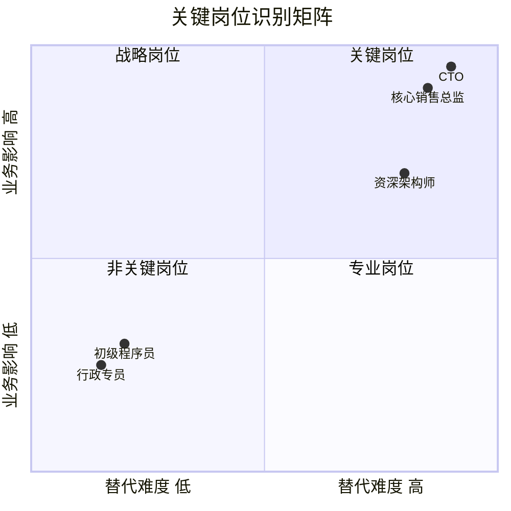
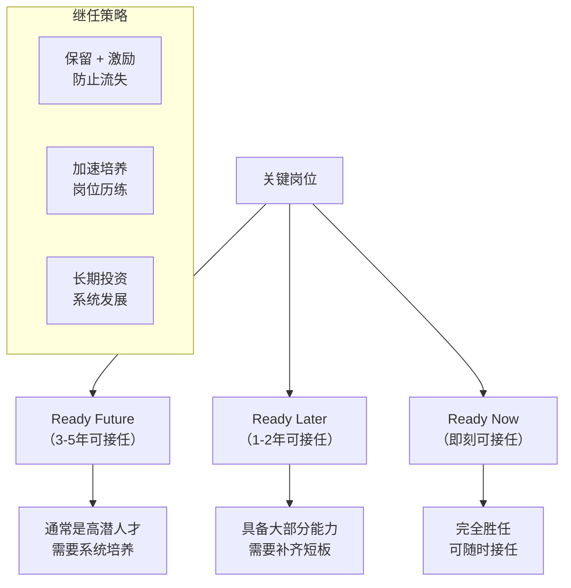
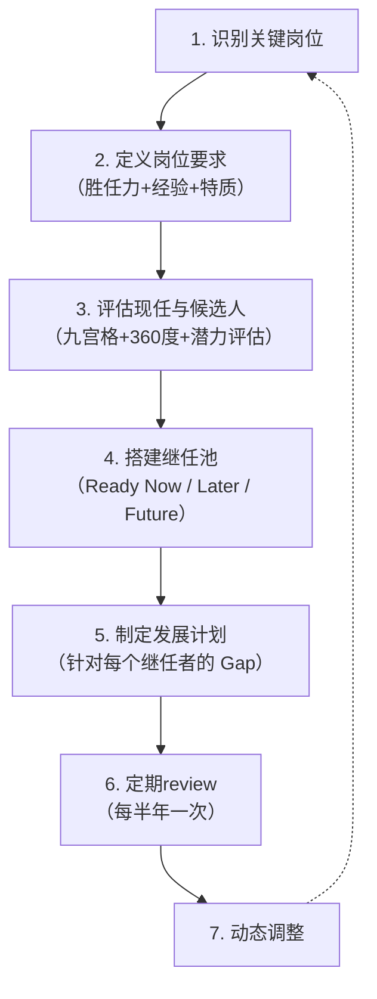
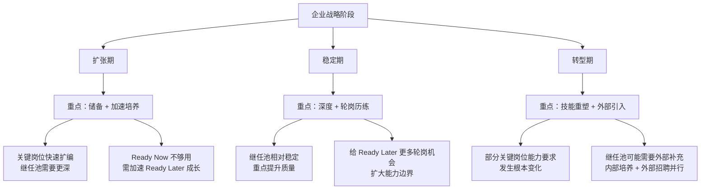

# 13 - 继任者计划

> [!abstract] 核心定义
> 继任者计划（Succession Planning）是确保组织关键岗位在任何时候都有合格继任者的系统性工程。它不是"老板退休了找个人接"，而是**从战略角度回答：如果关键岗位的人明天离开了，组织还能不能正常运转？**

---

## 一、关键岗位识别

### 1.1 什么是关键岗位

> [!important] 关键岗位定义
> 关键岗位不是"级别高的岗位"，而是**对组织影响大 + 替代难度高**的岗位。一个合格的关键岗位识别，不是看职级，而是看两个维度。



| 维度 | 评估标准 | 示例 |
|------|----------|------|
| **业务影响** | 岗位空缺 3 个月，对业务的影响有多大？ | 核心产品线的技术负责人：影响极高 |
| **替代难度** | 外部招聘需要多久？内部培养需要多久？ | 需同时懂行业+技术+管理：替代难度极高 |

### 1.2 关键岗位识别流程

```
1. 列出所有岗位
2. 用"业务影响 x 替代难度"矩阵打分
3. 筛选出关键岗位（通常占全员 10-20%）
4. 与业务负责人确认
5. 形成关键岗位清单，每年更新
```

> [!example] 关键岗位示例
> 
> | 岗位 | 业务影响 | 替代难度 | 是否关键岗位 |
> |------|----------|----------|:--:|
> | CEO | 极高 | 极高 | 是 |
> | 核心产品线负责人 | 高 | 高 | 是 |
> | 首席架构师 | 高 | 高 | 是 |
> | 大客户负责人（掌握核心客户关系） | 高 | 中高 | 是 |
> | 普通项目经理 | 中 | 中 | 否 |
> | 初级开发工程师 | 低 | 低 | 否 |

---

## 二、继任池搭建

继任池按照"准备度"分为三个层级：



### 2.1 三层继任池详解

| 层级 | 定义 | 比例参考 | 核心动作 | 时间周期 |
|------|------|----------|----------|----------|
| **Ready Now** | 完全具备接任能力，随时可上岗 | 每个关键岗位至少 1 人 | 保留、激励、防止流失 | 即刻 |
| **Ready Later** | 具备大部分能力，需 1-2 年培养 | 每个关键岗位 1-2 人 | 针对性补短板、项目历练 | 1-2年 |
| **Ready Future** | 高潜力人才，需 3-5 年系统培养 | 每个关键岗位 2-3 人 | 轮岗、导师辅导、系统课程 | 3-5年 |

> [!warning] 常见误区：继任者计划不等于替补名单
> 继任者计划不是"谁走了找谁顶上"的名单，而是**配套发展动作的系统工程**。如果只是列了一个名单但没有配套的培养计划，那不叫继任者计划，叫"HR 的自我安慰"。

---

## 三、继任者计划的核心流程



### 3.1 关键岗位的"岗位画像"

继任者计划需要为每个关键岗位明确"谁适合接任"：

| 维度 | 内容 | 示例（CTO岗位） |
|------|------|----------------|
| 必备经验 | 必须有的工作经历 | 10 年+技术管理经验，领导过 50 人+团队 |
| 核心能力 | 必须有的能力 | 技术战略规划、跨部门协作、变革管理 |
| 关键特质 | 人格特质 | 系统性思维、抗压能力、商业敏感度 |
| 关键关系 | 需要维护的内外部关系 | 技术委员会、关键客户、生态合作伙伴 |

### 3.2 继任者 Gap 分析

| 继任者 | 当前等级 | 能力差距 | 发展计划 | 目标等级 |
|--------|----------|----------|----------|----------|
| 张XX | Ready Later | 缺乏跨部门项目管理经验 | 安排主导1个跨部门项目，为期6个月 | Ready Now |
| 李XX | Ready Later | 缺乏战略思维训练 | 参加高管战略研讨会 + 外部商学院课程 | Ready Now |
| 王XX | Ready Future | 缺乏团队管理经验 | 从带3人小组开始，逐步扩大 | Ready Later |

---

## 四、战略关联



| 企业阶段 | 继任策略 | 核心挑战 |
|----------|----------|----------|
| 扩张期 | 加速内部培养，继任池扩容 | 人不够用，培养速度跟不上扩张速度 |
| 稳定期 | 深度历练，提升继任者准备度 | 人才容易"等太久"，缺乏足够挑战性岗位 |
| 转型期 | 技能重塑 + 外部引入并行 | 现有继任池的能力可能不匹配新业务 |

---

## 五、常见误区

> [!warning] 误区一：继任者计划 = 替补名单
> 只列名单不配发展计划，是继任者计划最常见的失败模式。没有发展动作的继任者，3 年后还是 Ready Later。

> [!warning] 误区二：只关注 CEO 继任
> CEO 继任当然重要，但中层关键岗位的继任同样关键。一个产品线负责人突然离职，对业务的冲击可能比 CEO 离职更直接。

> [!warning] 误区三：继任者计划是 HR 的事
> 继任者计划的第一责任人是业务负责人，HR 是推动者和赋能者。如果业务负责人不参与、不重视，继任者计划必然失败。

> [!warning] 误区四：继任者名单是秘密
> 很多公司把继任者名单视为机密，避免"现任不舒服"。但透明化的继任者计划（至少让继任者本人知道）能更好地激励和发展人才。

> [!warning] 误区五：只看内部，不看外部
> 内部培养是优先选择，但不是唯一选择。当内部人才池确实不够时，要在"外部引入"和"加速内部培养"之间做权衡。

---

## 六、面试应用

### 面试题：「你如何设计继任者计划？」

**STAR 回答框架：**

**Situation**：
- "继任者计划的起点不是'找谁接班'，而是'哪些岗位最关键'。所以我会先判断公司处于什么阶段、业务战略是什么。"

**Task**：
- "继任者计划的核心目标是：确保每个关键岗位在任何时候都至少有 1 个 Ready Now 的继任者。"

**Action**：六步流程。
1. **识别关键岗位**："用'业务影响 x 替代难度'矩阵，筛选出组织的关键岗位，通常占全员 10-20%。"
2. **定义岗位要求**："为每个关键岗位明确胜任力模型，包括必备经验、核心能力、关键特质。"
3. **评估候选人**："结合人才盘点的九宫格结果，对每个关键岗位的潜在继任者进行评估。"
4. **搭建继任池**："按 Ready Now / Ready Later / Ready Future 三层分级，确保每个关键岗位至少 1-2-3 的配置（1个RN、2个RL、3个RF）。"
5. **制定发展计划**："针对每个继任者的 Gap，制定个性化发展计划，配套轮岗、项目历练、导师辅导。"
6. **定期 Review**："每半年做一次继任者 Review，评估进展、调整计划、更新继任池。"

**Result**：
- "最终目标是让组织在任何时候，关键岗位都不会出现'无人可接'的局面。"

> [!tip] 加分回答
> "设计继任者计划时，我会特别注意两个'反直觉'的点：第一，继任者计划不是'给谁升职'，而是'让谁准备好'——所以发展计划比名单更重要；第二，继任者计划需要和业务战略绑定——如果公司明年要开拓新市场，继任者计划就要提前为这个市场储备人才。"

---

## 关联笔记

- [[03-HR人事/培训与人才发展/04-人才发展/12_人才盘点九宫格]] — 盘点结果是继任者计划的直接输入
- [[03-HR人事/培训与人才发展/04-人才发展/14_IDP个人发展计划]] — 继任者的发展计划落地为 IDP
- [[03-HR人事/培训与人才发展/04-人才发展/15_轮岗与导师制]] — 继任者培养的核心手段
- [[03-HR人事/培训与人才发展/01-战略视角/01_企业生命周期与人才战略]] — 不同阶段的继任策略
- [[03-HR人事/培训与人才发展/01-战略视角/02_战略人力资源与人才供应链]] — 人才供应链视角下的继任管理
- [[03-HR人事/培训与人才发展/01-战略视角/03_不同战略下的人才发展策略]] — 业务战略对继任计划的影响
- [[03-HR人事/培训与人才发展/07-面试实战/22_面试常见问题]] — 更多面试题
- [[03-HR人事/培训与人才发展/07-面试实战/23_案例：电网培训基地复盘]] — 电网项目的继任管理实践