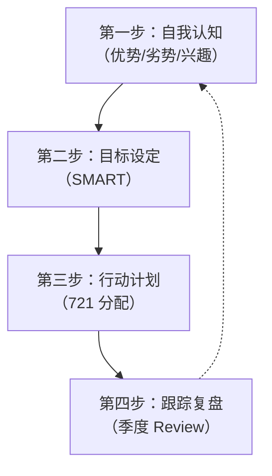
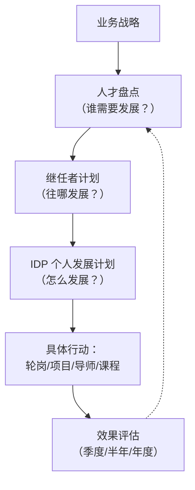

# 14 - IDP 个人发展计划

> [!abstract] 核心定义
> IDP（Individual Development Plan，个人发展计划）是员工与管理者共同制定的、以**能力提升和职业发展**为目标的个性化行动计划。它是人才发展中从"组织需要"到"个人行动"的桥梁，也是继任者计划、人才盘点等上层机制落地的"最后一公里"。

---

## 一、制定四步法



### 1.1 第一步：自我认知

> [!tip] 自我认知的三个维度
> - **优势**：我擅长什么？什么工作让我有成就感？
> - **劣势**：什么能力是短板？什么情境下我会感到吃力？
> - **兴趣**：我真正想往哪个方向发展？是成为技术专家还是管理人才？

| 方法 | 说明 | 示例 |
|------|------|------|
| 360 度反馈 | 从上级、同事、下属收集反馈 | "你在跨部门协作方面需要加强" |
| 性格测评 | MBTI、DISC、霍兰德等 | "你更擅长结构化工作而非创意发散" |
| 绩效面谈 | 上级对能力的客观评价 | "你的执行能力很强，但战略思维需要提升" |
| 自我复盘 | 回顾关键事件中的表现 | "上次项目延期，根本原因是我的风险管理不足" |

### 1.2 第二步：目标设定（SMART）

> [!important] SMART 原则
> | 字母 | 含义 | 示例 |
> |:--:|------|------|
> | **S** | Specific（具体的） | 不是"提升管理能力"，而是"能独立完成团队绩效面谈" |
> | **M** | Measurable（可衡量的） | 不是"学好数据分析"，而是"能用 SQL 独立完成月度销售分析报告" |
> | **A** | Achievable（可实现的） | 不是"半年内成为行业专家"，而是"半年内完成 3 个行业竞品深度分析" |
> | **R** | Relevant（相关的） | 目标与岗位要求和个人发展方向一致 |
> | **T** | Time-bound（有时限的） | 不是"提升谈判能力"，而是"Q3 结束前，独立完成 2 次大客户谈判并达成合作" |

> [!example] 好的 SMART 目标 vs 坏的 SMART 目标
> 
> | 坏的目标 | 好的目标 |
> |----------|----------|
> | 提升沟通能力 | 2026年Q4前，独立主持 3 次跨部门项目会议，会后满意度评分 >= 4.5/5 |
> | 学习数据分析 | 2026年9月前，学会用 SQL 查询业务数据，能独立完成月度销售分析报告 |
> | 增强领导力 | 2026年底前，完成带教 2 名新人，新人试用期绩效达标率 100% |

### 1.3 第三步：行动计划（721 分配）

> [!important] 721 法则在 IDP 中的应用
> 
> ```mermaid
> pie title IDP 中的 721 学习分配
>     "70% 项目实践" : 70
>     "20% 导师反馈" : 20
>     "10% 课程学习" : 10
> ```

| 占比 | 方式 | 具体行动举例 |
|:--:|------|------|
| **70%** | 项目实践 | 主导一个跨部门项目、轮岗到新业务线、承担一个挑战性任务、带领一个临时团队 |
| **20%** | 导师反馈 | 每月与导师 1v1 复盘、参加上级的客户会议并观察学习、定期 360 反馈 |
| **10%** | 课程学习 | 外部培训课程、线上学习平台、行业会议、专业书籍阅读 |

> [!warning] 常见误区：IDP 变成了"报课清单"
> 很多 IDP 的行动计划全是"参加 XX 培训""学习 XX 课程"，这是典型的 10% 思维。真正有效的 IDP，70% 的行动应该是在真实工作中完成的。

### 1.4 第四步：跟踪复盘

| 环节 | 频率 | 内容 |
|------|------|------|
| 月度自检 | 每月 | 员工自查：本月完成了哪些行动？效果如何？ |
| 季度 Review | 每季度 | 员工+上级正式复盘：目标进展、遇到的困难、是否需要调整计划 |
| 半年度校准 | 每半年 | 结合人才盘点结果，校准 IDP 方向 |
| 年度总结 | 每年 | 全面回顾 IDP 达成情况，制定下一年度 IDP |

---

## 二、IDP 在组织中的定位



IDP 不是孤立存在的，它是人才发展体系中的执行层：

| 层级 | 机制 | 回答的问题 |
|------|------|-----------|
| 战略层 | 业务战略 + 人才战略 | 组织需要什么能力？ |
| 识别层 | 人才盘点 | 谁需要发展？差距在哪？ |
| 方向层 | 继任者计划 | 往哪个方向发展？ |
| 执行层 | IDP | 具体怎么发展？做什么？ |
| 手段层 | 轮岗/导师/培训 | 用什么方式发展？ |

---

## 三、常见问题与对策

> [!warning] 问题一：IDP 变成填表
> **表现**：员工和上级花 30 分钟填完 IDP 表格，然后放进抽屉再也不看。
> **对策**：IDP 必须和绩效面谈、季度 Review 绑定，有检查才有执行。建议把 IDP 完成度纳入管理者的考核指标。

> [!warning] 问题二：目标太大不落地
> **表现**："提升战略思维""增强领导力"——听起来很对，但无从下手。
> **对策**：用 SMART 原则把大目标拆解为可执行的小行动。"提升战略思维"可以拆成"每季度完成 1 份行业趋势分析报告，向 VP 汇报"。

> [!warning] 问题三：没有跟踪机制
> **表现**：IDP 制定了，但半年后谁都不记得里面写了什么。
> **对策**：建立强制 Review 机制——季度 Review 时，IDP 进展是固定议程。推荐用"红黄绿灯"标记每个目标的进展状态。

> [!warning] 问题四：10% 依赖症
> **表现**：IDP 的行动计划全是"参加培训"，忽略 70% 的项目实践和 20% 的导师反馈。
> **对策**：在 IDP 模板中设置"721 占比检查"——如果 70% 的行动不是实践类，退回重做。

> [!warning] 问题五：IDP 与业务脱节
> **表现**：员工想学 AI，但岗位根本用不到；组织需要数字化转型能力，但 IDP 里没有相关内容。
> **对策**：IDP 的目标设定需要"个人意愿 + 组织需要"双向对齐，不能只满足一端。

---

## 四、面试应用

### 面试题：「你如何帮助员工制定 IDP？」

**STAR 回答框架：**

**Situation**：
- "IDP 的核心价值在于把'组织需要'和'个人意愿'结合起来。一个好的 IDP 不是 HR 替员工填的，而是员工和上级共同制定的。"

**Task**：
- "我的角色是赋能者和推动者——提供工具、方法、流程，确保 IDP 的质量和执行。"

**Action**：四步法。
1. **自我认知（启动）**："我会先让员工做自我评估，可以结合 360 反馈、性格测评、绩效面谈，帮助员工看清自己的优势、劣势和兴趣方向。"
2. **目标设定（对齐）**："然后和员工+上级一起，用 SMART 原则设定 3-5 个发展目标。目标要同时满足'个人意愿'和'组织需要'——不能只学自己想学的，也不能只学组织需要的。"
3. **行动计划（721）**："按照 721 法则分配行动：70% 来自项目实践（比如主导一个跨部门项目），20% 来自导师反馈（每月 1v1 复盘），10% 来自课程学习。我会特别检查 70% 的部分是否足够具体。"
4. **跟踪复盘（闭环）**："建立季度 Review 机制，强制要求每次绩效面谈时同步 Review IDP 进展。用红黄绿灯标记每个目标的状态，让进展可视化。"

**Result**：
- "一个好的 IDP 不是'填完就忘'的表格，而是每月都在用的'成长地图'。"

> [!tip] 加分回答
> "我特别强调 IDP 的'721 检查'——如果一个人的 IDP 里 70% 的行动是'参加培训'，我一定会打回去。因为真正让一个人成长的不是听课，而是做有挑战的事。同时，IDP 需要和人才盘点、继任者计划打通——盘点告诉你'需要发展什么'，继任告诉你'往哪发展'，IDP 告诉你'怎么发展'。"

---

## 关联笔记

- [[03-HR人事/培训与人才发展/04-人才发展/12_人才盘点九宫格]] — 盘点结果决定 IDP 的方向
- [[03-HR人事/培训与人才发展/04-人才发展/13_继任者计划]] — 继任者计划通过 IDP 落地
- [[03-HR人事/培训与人才发展/04-人才发展/15_轮岗与导师制]] — IDP 中 70% 实践和 20% 导师的核心手段
- [[03-HR人事/培训与人才发展/02-核心理论/04_成人学习理论]] — IDP 设计如何符合成人学习规律
- [[03-HR人事/培训与人才发展/02-核心理论/05_70-20-10法则]] — IDP 中 721 分配的理论基础
- [[03-HR人事/培训与人才发展/01-战略视角/02_战略人力资源与人才供应链]] — 人才供应链视角下的 IDP
- [[03-HR人事/培训与人才发展/07-面试实战/22_面试常见问题]] — 更多面试题
- [[03-HR人事/培训与人才发展/07-面试实战/23_案例：电网培训基地复盘]] — 电网项目的 IDP 实践