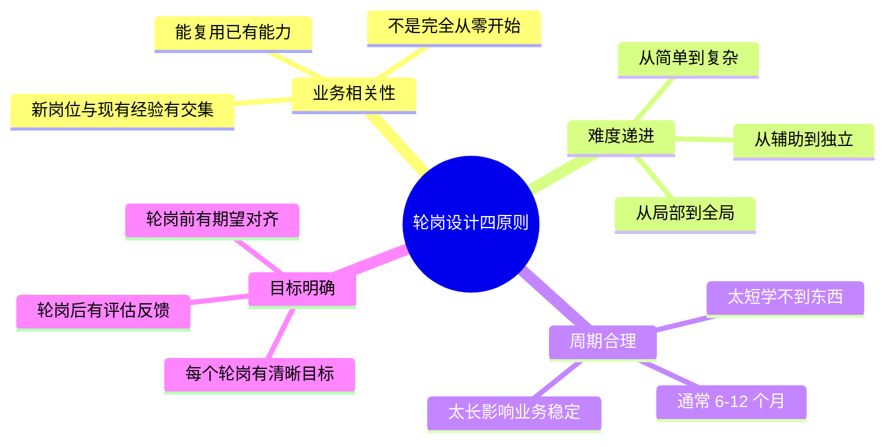
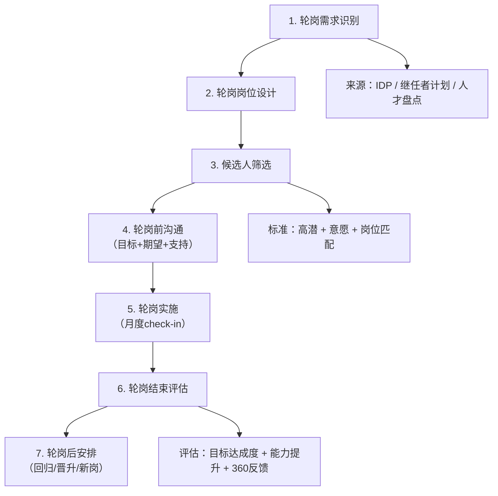
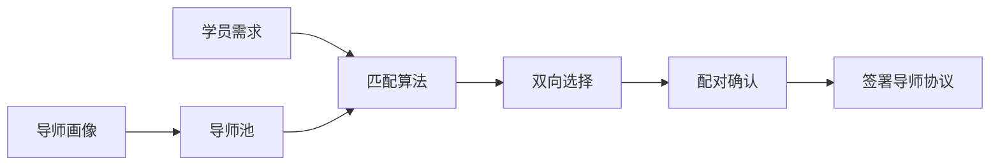
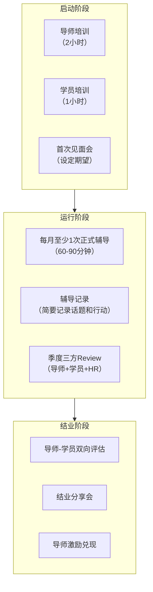

# 15 - 轮岗与导师制

> [!abstract] 核心定义
> 轮岗（Job Rotation）和导师制（Mentorship）是人才发展中**最直接、最有效的两种发展手段**。它们分别对应 721 法则中的 70%（实践）和 20%（反馈），是 IDP 落地的核心抓手。一个优秀的轮岗和导师机制，能让人才成长速度提升 2-3 倍。

---

## 一、轮岗机制

### 1.1 轮岗设计原则

### 1.2 轮岗类型

| 类型 | 定义 | 适用场景 | 典型周期 | 举例 |
|------|------|----------|----------|------|
| **项目制轮岗** | 在原岗位基础上，参与跨部门项目 | 首次尝试轮岗、能力拓展 | 3-6个月 | 销售经理参与产品需求评审项目 |
| **部门轮岗** | 正式调岗到另一个部门工作 | 深度能力拓展、管理储备 | 6-12个月 | 研发经理轮岗到产品部门 |
| **跨区域轮岗** | 调岗到不同城市/国家的业务单元 | 高阶管理储备、全球化视野 | 1-2年 | 中国区经理轮岗到东南亚区 |
| **职能轮岗** | 从业务岗位轮岗到职能岗位（或反之） | 培养全局视角 | 6-12个月 | 业务负责人轮岗到战略部 |

### 1.3 轮岗全流程

### 1.4 轮岗成功的关键因素

> [!tip] 轮岗成功的 5 个关键
> 1. **目标先行**：轮岗前必须有明确的"轮岗目标卡"，包含要达成的 3-5 个能力目标
> 2. **接收方支持**：接收部门负责人必须愿意投入时间带教，而非把轮岗者当"免费劳动力"
> 3. **原岗位安排**：原岗位要有明确的交接方案，避免"轮岗前没人交接，轮岗后位置没了"
> 4. **定期 Check-in**：每月至少一次三方（轮岗者+原上级+接收上级）同步进展
> 5. **明确出口**：轮岗结束后有明确安排——回归原岗位、晋升、或留在新岗位

> [!warning] 轮岗常见失败模式
> - **"放羊式"轮岗**：把人扔过去就不管了，6个月后回来什么都没学到
> - **"填坑式"轮岗**：把轮岗当临时补位，哪个部门缺人就往哪轮
> - **"惩罚式"轮岗**：把表现不好的员工"轮出去"，轮岗变成了变相调岗

---

## 二、导师制

### 2.1 导师选拔与匹配

**导师画像（四维评估）：**

| 维度 | 标准 | 评估方式 |
|------|------|----------|
| 专业能力 | 在所在领域有 5 年以上经验，绩效排名前 30% | 绩效数据 + 上级评价 |
| 带教意愿 | 愿意投入时间指导他人，乐于分享 | 面试 + 过往带教记录 |
| 带教能力 | 能引导而非灌输，能倾听而非说教 | 带教案例 + 学员反馈 |
| 时间投入 | 每月能保证 2-4 小时用于学员辅导 | 自我承诺 + 上级确认 |

**导师-学员匹配原则：**

| 原则 | 说明 |
|------|------|
| 跨部门优先 | 导师最好来自不同部门，提供不同视角 |
| 经验互补 | 导师在学员的短板领域有优势 |
| 性格匹配 | 沟通风格和学习方式匹配度 |
| 非直属上级 | 导师最好不是学员的直属上级，避免绩效评估角色冲突 |

### 2.2 Mentor vs Coach 区别

> [!important] 核心区别
> Mentor（导师）和 Coach（教练）是两种完全不同的角色，很多人容易混淆。在人才发展中，两者各有适用的场景。

| 维度 | Mentor（导师） | Coach（教练） |
|------|:---:|:---:|
| **核心方式** | 经验传授——"我做过，我告诉你" | 引导发现——"我相信你有答案，我帮你找到" |
| **关系特点** | 长期、深度、一对一 | 阶段性、目标导向 |
| **内容来源** | 导师的个人经验 | 被教练者自身 |
| **典型场景** | 职业发展指导、行业经验分享、人脉引荐 | 特定能力提升、解决具体问题、突破思维瓶颈 |
| **典型问题** | "在这个行业怎么发展？" | "你真正想要的是什么？" |
| **导师/教练角色** | 某个领域的资深人士 | 不一定是领域专家，但擅长引导 |
| **时间周期** | 6个月-2年 | 1-6个月（按项目周期） |

> [!example] 场景举例
> 
> **Mentor 场景**：一个产品经理想了解"如何从产品经理成长为产品总监"。她找了一位有 10 年经验的产品VP 做 Mentor，每两周聊一次，Mentor 分享自己的成长经历、踩过的坑、做过的关键决策。
> 
> **Coach 场景**：同一个产品经理在做一个重要的产品规划，但总是被各种意见干扰，无法做出决策。她找了一位专业 Coach，通过 4 次教练对话，Coach 帮她理清了"哪些是别人的期待，哪些是自己真正想要的"，最终她自主做出了决策。

> [!tip] 何时用 Mentor，何时用 Coach？
> - 需要行业经验、职业路径指导 → 找 Mentor
> - 需要突破思维局限、解决具体困境 → 找 Coach
> - 两者不是互斥的，一个员工可以同时有 Mentor 和 Coach

### 2.3 导师制运行机制

---

## 三、面试应用

### 面试题：「你如何设计轮岗机制 / 导师制？」

**STAR 回答框架：**

**Situation**：
- "轮岗和导师制是人才发展中 721 法则的落地抓手——轮岗对应 70% 实践，导师制对应 20% 反馈。它们的共同目标是加速关键人才的成长。"

**Task**：
- "设计轮岗机制的核心是'让对的人在对的时间去到对的岗位'；设计导师制的核心是'让对的人在对的时间遇到对的导师'。"

**Action（轮岗机制）**：
1. **需求识别**："轮岗需求来自人才盘点和继任者计划——哪些高潜人才需要拓展能力边界？"
2. **岗位设计**："按照业务相关性和难度递进原则，设计轮岗岗位。不是所有岗位都适合轮岗，需要挑选'有学习价值'的岗位。"
3. **流程管理**："建立轮岗全流程：需求识别→岗位设计→候选人筛选→轮岗前沟通（目标卡）→实施（月度check-in）→结束评估→轮岗后安排。"
4. **关键保障**："确保三个关键点：目标先行（每个轮岗有明确的能力目标）、接收方支持（接收部门愿意带教）、明确出口（轮岗结束后有安排）。"

**Action（导师制）**：
1. **导师选拔**："按专业能力+带教意愿+带教能力+时间投入四维标准选拔导师，建立导师池。"
2. **匹配机制**："遵循跨部门优先、经验互补、非直属上级原则，做导师-学员匹配。"
3. **运行保障**："提供导师培训（2小时）、每月至少1次正式辅导、季度三方Review。"
4. **激励闭环**："导师激励包括荣誉（年度优秀导师）、发展（优先参加外部学习）、物质（导师津贴）。"

**Result**：
- "最终目标是让轮岗和导师制成为人才发展的'加速器'，而不是'走过场'。"

> [!tip] 加分回答
> "轮岗和导师制最容易被忽略的问题是'资源错配'——轮岗变成了填坑，导师变成了摆设。我的经验是：第一，轮岗必须有明确的'能力目标卡'，没有目标不上岗；第二，导师必须经过培训，不是'给他配个导师'就完事了，导师也需要学习'如何做导师'；第三，建立退出机制——如果导师或学员觉得不合适，可以申请更换，不要硬撑。"

---

## 关联笔记

- [[03-HR人事/培训与人才发展/02-核心理论/05_70-20-10法则]] — 轮岗（70%）和导师（20%）的理论基础
- [[03-HR人事/培训与人才发展/04-人才发展/12_人才盘点九宫格]] — 盘点结果决定谁需要轮岗/导师
- [[03-HR人事/培训与人才发展/04-人才发展/13_继任者计划]] — 轮岗和导师是继任者培养的核心手段
- [[03-HR人事/培训与人才发展/04-人才发展/14_IDP个人发展计划]] — IDP 通过轮岗和导师落地
- [[03-HR人事/培训与人才发展/02-核心理论/04_成人学习理论]] — 成人学习特点对轮岗和导师设计的启示
- [[03-HR人事/培训与人才发展/01-战略视角/01_企业生命周期与人才战略]] — 不同阶段的轮岗和导师策略
- [[03-HR人事/培训与人才发展/01-战略视角/03_不同战略下的人才发展策略]] — 业务战略对轮岗方向的影响
- [[03-HR人事/培训与人才发展/07-面试实战/22_面试常见问题]] — 更多面试题
- [[03-HR人事/培训与人才发展/07-面试实战/23_案例：电网培训基地复盘]] — 电网项目的轮岗与导师实践