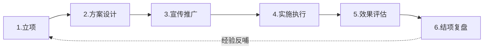
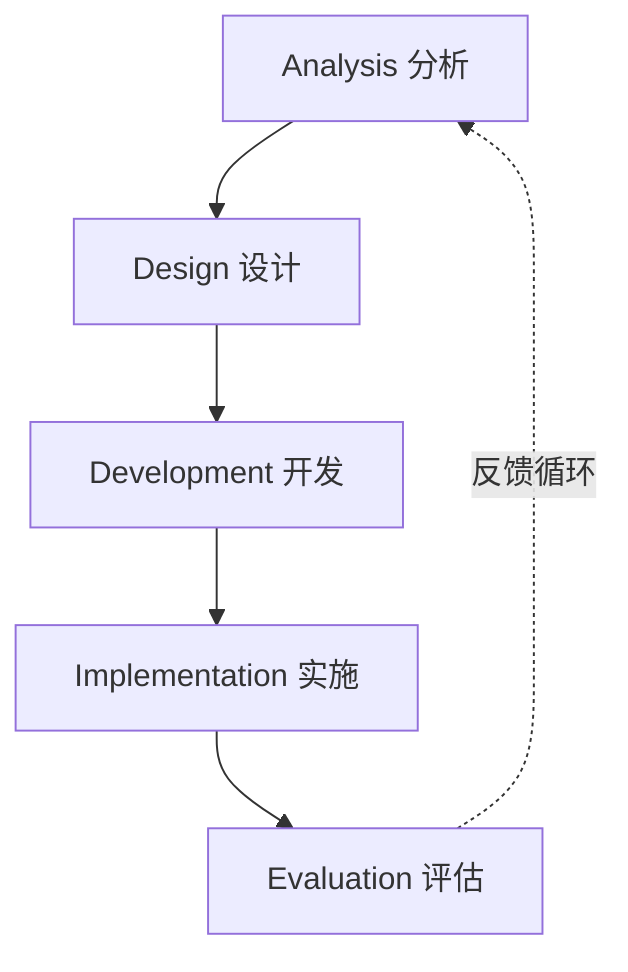
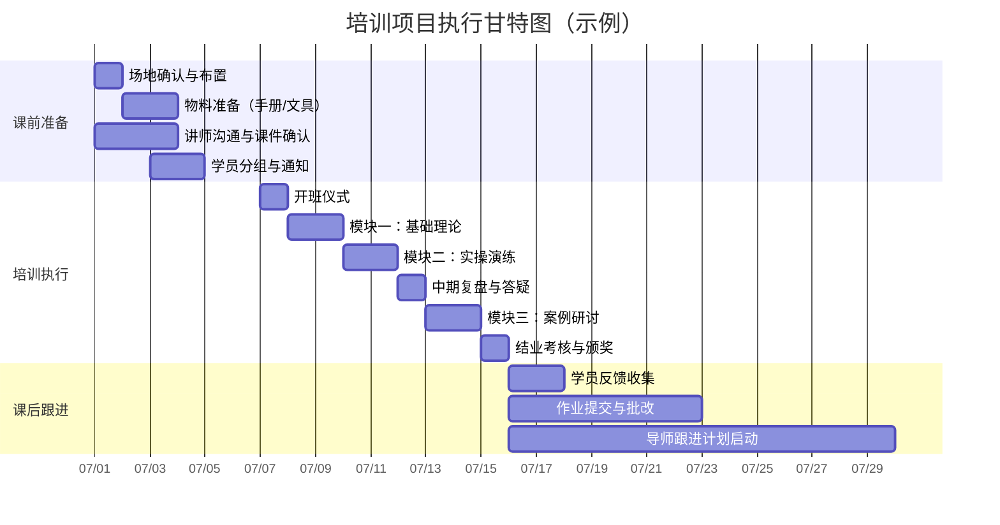
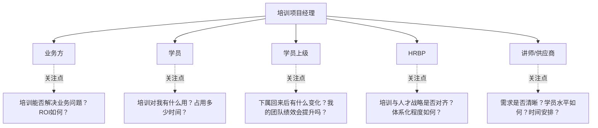

# 培训项目全流程管理

## 一、全流程概览

培训项目全流程管理，是指从项目立项到结项复盘的完整闭环管理。一个成熟的培训项目，必然经历以下六个阶段。

> [!abstract] 核心原则
> 培训项目管理不同于一般项目管理，其核心难点在于**效果不可见性**和**利益相关方多元性**。优秀的培训PM需要同时具备产品思维（把培训当作产品来设计）、运营思维（持续推动参与和转化）和商业思维（衡量投入产出）。

---

## 二、六大阶段详解

### 阶段一：立项（Initiation）

| 维度 | 具体内容 |
|------|----------|
| **核心任务** | 需求调研、可行性分析、项目立项审批 |
| **关键产出** | 培训需求调研报告、项目立项书、干系人分析表 |
| **关键节点** | 业务方确认需求 → 与HRBP对齐 → 提交立项申请 → 获得审批 |
| **周期** | 通常1-4周，取决于项目复杂度 |

**立项书的必备要素**：

- **业务背景**：为什么现在要做这个培训？（关联业务战略）
- **目标人群**：谁需要参加？多少人？分几批？
- **培训目标**：可量化的业务目标（如：新员工上手时间从4周缩短至2周）
- **资源需求**：预算、讲师、场地、时间
- **预期ROI**：投入产出初步估算
- **风险预判**：主要风险及预案

> [!tip] 立项阶段的常见陷阱
> 1. **需求伪命题**：业务方说"员工沟通能力差"，实际可能是流程问题或激励机制问题，培训不是万能药。
> 2. **目标空泛**：「提升员工能力」是不可衡量的目标；应该写「使90%学员在模拟场景中达到合格标准」。
> 3. **忽略干系人**：只和业务负责人沟通，忽略了HRBP和学员上级的诉求。

---

### 阶段二：方案设计（Design）

| 维度 | 具体内容 |
|------|----------|
| **核心任务** | 课程体系设计、教学策略制定、评估方案设计 |
| **关键产出** | 培训方案书、课程大纲、讲师手册、学员手册、评估工具 |
| **关键节点** | 课程设计评审 → 讲师确认 → 试讲/内测 → 方案定稿 |

**方案设计的核心模型**：

**1. ADDIE模型**（最经典的教学设计模型）：

**2. 70-20-10法则**：
- **70%** 来自实践任务（在岗锻炼、项目实战）
- **20%** 来自社交学习（导师辅导、同伴交流）
- **10%** 来自正式学习（课堂培训、在线课程）

> [!example] 方案设计示例：新员工培训项目
> - **70% 实践**：分配导师 + 新人任务清单（30天内完成5个关键任务）
> - **20% 社交**：新员工融入计划（跨部门午餐会、新人社群）
> - **10% 正式**：集中培训3天（企业文化 + 产品知识 + 制度流程）

---

### 阶段三：宣传推广（Promotion）

培训项目的成败，**宣传推广占50%**。再好的课程，没人报名、没人重视，就是失败。

**宣传推广四步法**：

| 步骤 | 动作 | 示例 |
|------|------|------|
| **1. 造势** | 制造需求感 | 发布「为什么顶尖销售都在用这个方法」预热文章 |
| **2. 精准触达** | 定向邀请 + 上级推荐 | 给目标学员发个性化邀请，同时抄送其上级 |
| **3. 口碑传播** | 种子学员证言 | 邀请往期学员录制30秒推荐视频 |
| **4. 持续唤醒** | 倒计时 + 名额稀缺 | 「最后5个名额」「报名截止倒计时3天」 |

**宣传素材清单**：
- 培训海报（企业微信/钉钉群 + 线下易拉宝）
- 推文/邮件（正式通知 + 亮点提炼）
- 短视频（往期花絮/讲师介绍/学员感言）
- 报名问卷（含课程期待调研，一箭双雕）

> [!warning] 宣传推广的常见错误
> - 只在群里发一次通知就完事——需要多轮触达，至少3次
> - 只用行政命令驱动——用「价值吸引」替代「强制参加」
> - 忽略学员上级——上级一句话「你去参加吧」，效果远超HR的十封邮件

---

### 阶段四：实施执行（Execution）

**实施阶段的核心工作**：

**实施执行的检查清单**：

- [ ] **课前3天**：场地确认、设备测试、物料到位、学员二次提醒
- [ ] **课前1天**：讲师抵达确认、课件最终版本、签到表/分组表打印
- [ ] **培训当天**：提前1小时到场、设备再次测试、接待引导
- [ ] **每天结束**：收集当日反馈、与讲师复盘、调整次日安排
- [ ] **培训结束**：作业布置、后续跟进计划同步、结业证书发放

---

### 阶段五：效果评估（Evaluation）

培训效果评估不止于满意度问卷。推荐使用**柯氏四级评估模型**，详见 [[01_培训与人才发展理论基础]]。

| 评估层级 | 评估内容 | 评估方法 | 评估时机 |
|----------|----------|----------|----------|
| **L1 反应层** | 学员满意度 | 问卷（NPS/评分）、访谈 | 培训结束时 |
| **L2 学习层** | 知识/技能掌握 | 考试、实操考核、模拟演练 | 培训结束时 |
| **L3 行为层** | 工作行为改变 | 360度反馈、上级评价、绩效数据 | 培训后1-3个月 |
| **L4 结果层** | 业务结果改善 | 销售数据、客户满意度、生产效率 | 培训后3-6个月 |

> [!important] 评估的实操建议
> 大多数企业能做到L1和L2，L3和L4是关键分水岭。建议：
> 1. **L3行为层**：在培训前就与学员上级达成共识——「培训后你希望看到学员哪些行为变化？」然后将这些行为变化设为观察指标。
> 2. **L4结果层**：不建议每个培训都追求ROI计算，选择战略级项目做深度评估即可。

---

### 阶段六：结项复盘（Review）

**复盘四步法**（基于AAR框架）：

| 步骤 | 核心问题 | 产出 |
|------|----------|------|
| **回顾目标** | 最初设定的目标是什么？ | 目标对照表 |
| **评估结果** | 实际达成了什么？亮点和不足？ | 数据对比 + 典型案例 |
| **分析原因** | 成功/失败的关键因素是什么？ | 根因分析（5 Whys） |
| **总结规律** | 哪些做法可以固化？哪些需要改进？ | 经验沉淀（SOP/checklist） |

**结项报告模板**（一页纸）：
1. 项目概况（1段话）
2. 核心数据（参训人数、覆盖率、满意度、完成率）
3. 亮点与不足（各3-5条）
4. 经验沉淀（可复用的模板/流程/工具）
5. 下一步建议

---

## 三、风险预案

| 风险类型 | 具体场景 | 预案 |
|----------|----------|------|
| **讲师风险** | 讲师临时取消/迟到 | 储备1-2名备选讲师；准备录播课程作为应急；培训合同中明确违约条款 |
| **学员风险** | 参与度低、中途退出 | 设置报名押金/承诺金；与上级联动（上级推荐+上级验收）；设计互动环节提升参与感 |
| **预算风险** | 预算超支 | 方案设计阶段预留10-15%应急金；建立预算周报制度，实时监控 |
| **技术风险** | 线上平台故障 | 提前测试+备用平台（如腾讯会议备用）；线下资料包作为兜底 |
| **内容风险** | 课程内容与需求不符 | 培训前进行试讲/内测，邀请3-5名目标学员参与反馈 |
| **转化风险** | 培训后无人跟进落地 | 培训前与学员上级签订「培训转化承诺书」，明确跟进责任 |

---

## 四、干系人管理

**沟通策略矩阵**：

| 干系人 | 沟通频率 | 沟通方式 | 核心信息 |
|--------|----------|----------|----------|
| 业务方 | 立项+结项+里程碑 | 面对面汇报 + 数据报告 | 投入产出、业务影响 |
| 学员 | 培训前中后各1次 | 邮件+社群 | 价值说明、日程安排、成果反馈 |
| 学员上级 | 培训前+培训后 | 一对一沟通 | 培训目标对齐、行为观察清单 |
| HRBP | 每周 | 周报+例会 | 进度、风险、协调需求 |
| 讲师/供应商 | 按需 | 微信/电话 | 需求确认、日程协调、反馈闭环 |

---

## 五、面试应用

### 高频面试题：「请描述一个你主导的培训项目」

**STAR回答框架**：

| 维度 | 回答要点 | 示例 |
|------|----------|------|
| **S-情境** | 公司/业务背景，为什么需要这个培训 | "公司正处于业务转型期，从传统销售转向解决方案销售，一线销售团队200人，转型成功率不足30%..." |
| **T-任务** | 你的角色和目标 | "我作为项目负责人，需要在6个月内完成全员转型培训，目标是将方案销售能力达标率提升至80%" |
| **A-行动** | 你做了什么（按全流程展开） | "立项阶段我做了需求调研...方案设计阶段用了ADDIE模型...实施阶段我做了以下风险预案..." |
| **R-结果** | 量化成果 + 个人反思 | "最终达标率82%，超额完成目标。如果重来，我会在立项阶段更早引入业务方深度参与..." |

**加分项提示**：
- 提到**干系人管理**（不只是执行，而是「管理」项目）
- 提到**风险预案**（展示项目管理成熟度）
- 提到**数据驱动**（用数据说话，而非主观感受）
- 提到**经验沉淀**（展示系统性思维，不只做一次性项目）

> [!tip] 面试官真正想听什么
> 面试官不关心你办了多少场培训，他们关心的是：
> 1. 你的**项目管理能力**（全流程把控、风险管理）
> 2. 你的**业务思维**（不是为了培训而培训，而是为了解决业务问题）
> 3. 你的**复盘能力**（能从经验中提炼方法论）

---

## 关联笔记

- [[01_培训与人才发展理论基础]] — 柯氏四级评估、ADDIE模型、70-20-10法则
- [[02_培训需求分析TNA]] — 培训需求调研方法论
- [[03-HR人事/培训与人才发展/05-培训运营/17_数字化学习平台]] — 混合式学习项目的线上部分设计
- [[03-HR人事/培训与人才发展/05-培训运营/18_培训数据分析]] — 培训项目的数据监控与效果评估
- [[03-HR人事/培训与人才发展/07-面试实战/22_面试常见问题]] — 培训项目管理类面试题汇总
- [[03-HR人事/培训与人才发展/07-面试实战/24_案例：从零搭建培训体系]] — 培训体系搭建中的项目管理实践