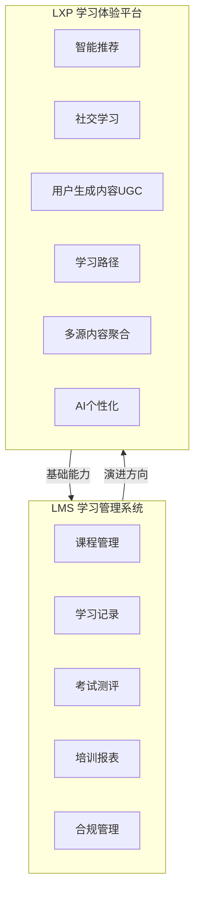
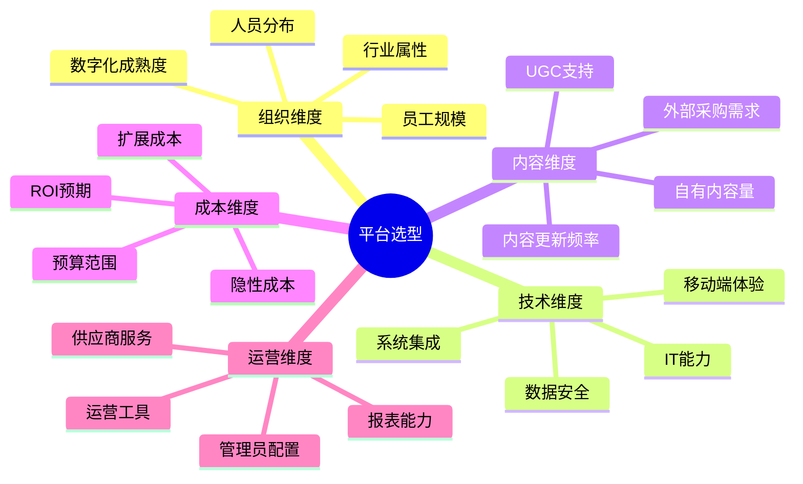
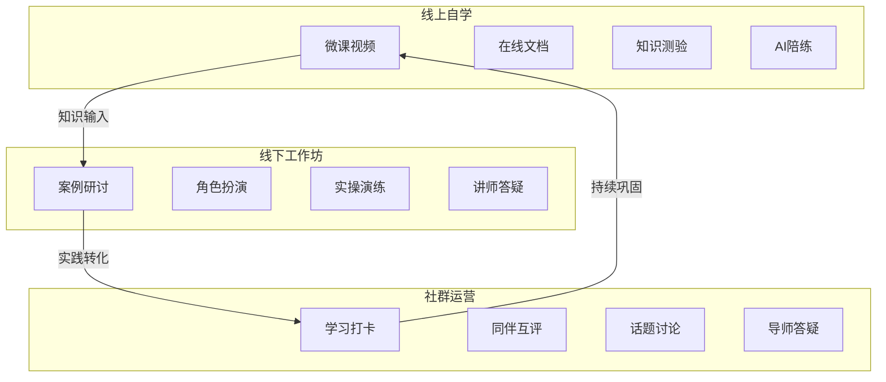

# 数字化学习平台

## 一、核心概念：LMS vs LXP

数字化学习平台是培训体系的技术底座。理解LMS和LXP的区别，是判断一个培训管理者是否具备数字化视野的关键指标。

**LMS vs LXP 对比表**：

| 维度 | LMS（学习管理系统） | LXP（学习体验平台） |
|------|---------------------|---------------------|
| **核心定位** | 以「管理」为中心 | 以「学习者」为中心 |
| **内容来源** | 管理员上传（自上而下） | 多元聚合：内部+外部+UGC |
| **学习路径** | 预设的学习计划 | AI推荐的个性化路径 |
| **交互方式** | 单向推送 | 社交互动、协作学习 |
| **数据维度** | 完成率、考试分数 | 学习行为、技能图谱、兴趣标签 |
| **典型用户** | 培训管理员 | 员工（自主学习者） |
| **典型场景** | 合规培训、新员工入职 | 技能提升、职业发展、知识社区 |
| **代表产品** | Moodle、SAP SuccessFactors | Degreed、EdCast、得到企业版 |

> [!abstract] 趋势判断
> 现代企业学习平台正在从「LMS为主、LXP为辅」向「LXP为主、LMS为基座」演进。未来3-5年，纯粹的LMS将逐步被具备LXP能力的平台替代。但要注意：**LXP不是替代LMS，而是在LMS基础上的体验升级**。一个没有课程管理、考试测评、学习记录等基础能力的LXP，是无法独立支撑企业培训体系的。

---

## 二、主流平台对比

### 国内市场主流平台

| 平台 | 定位 | 核心优势 | 适用场景 | 参考价格 |
|------|------|----------|----------|----------|
| **云学堂** | 企业学习一站式平台 | 内容生态丰富、行业解决方案成熟 | 中大型企业，有成熟培训体系 | 中高 |
| **魔学院** | 轻量级企业培训平台 | 性价比高、部署快、操作简单 | 中小企业、快速上线 | 中低 |
| **企业微信** | 办公协同+轻学习 | 天然触达、零学习成本、与工作流融合 | 全员推送、碎片化学习 | 低（已采购企微） |
| **钉钉** | 办公协同+生态学习 | 应用市场丰富、宜搭低代码 | 中型企业、钉钉深度用户 | 低~中 |
| **飞书** | 协作+知识管理+学习 | 文档协作强、知识库融合、国际化 | 科技公司、知识密集型 | 中 |
| **腾讯乐享** | 社区化学习 | 社区运营强、UGC活跃 | 注重知识沉淀和分享 | 中 |

### 平台选型考量框架

> [!tip] 选型实战建议
> 1. **不要追求功能最全**：功能越多，实施难度越大，使用率越低。选「够用+易用」的。
> 2. **一定要做POC（概念验证）**：让真实用户试用1-2周，收集反馈后再决策。
> 3. **关注移动端体验**：一线员工（工厂、门店、外勤）是培训主力，他们只用手机学习。
> 4. **考虑集成能力**：平台能否与HR系统（考勤、绩效、组织架构）打通？能否与飞书/企微/钉钉无缝集成？
> 5. **评估供应商持续服务能力**：SaaS平台不是买断制，选平台就是选长期合作伙伴。

---

## 三、混合式学习（Blended Learning）设计

混合式学习不是简单地把线上和线下拼在一起，而是**根据不同学习目标的特性，选择最有效的交付方式**。

### 设计模型

### 混合式学习设计四步法

| 步骤 | 动作 | 示例（产品经理培训） |
|------|------|----------------------|
| **1. 目标分解** | 将学习目标拆分为知识/技能/态度三类 | 知识：产品方法论；技能：PRD撰写、数据分析；态度：用户导向思维 |
| **2. 方式匹配** | 为每类目标选择最佳交付方式 | 知识→线上自学；技能→线下工作坊+实操；态度→社群讨论+案例 |
| **3. 路径设计** | 设计学习旅程（线上线下如何衔接） | 线上预习(1周) → 线下工作坊(2天) → 线上实战作业(2周) → 社群答辩(1天) |
| **4. 运营设计** | 设计每个环节的运营机制 | 线上：打卡+积分；线下：小组PK；社群：导师点评+优秀作业展示 |

### 实战案例：销售培训混合式学习

| 阶段 | 周期 | 线上 | 线下 | 社群 |
|------|------|------|------|------|
| **预热** | 课前1周 | 产品知识微课 + 前测 | — | 学习群建立 + 破冰 |
| **集中培训** | 2天 | — | 方法论讲解 + 情景演练 + 标杆分享 | 每日复盘打卡 |
| **实战转化** | 2周 | AI陪练（模拟客户对话） | 导师1v1辅导 | 优秀案例分享 |
| **巩固评估** | 第3周 | 后测 + 认证考试 | 结业答辩 | 结业典礼 + 社群持续运营 |

> [!important] 混合式学习的核心原则
> 1. **线上解决「知道」**：知识传递放在线上，让学员自主安排时间。
> 2. **线下解决「做到」**：集中时间用于需要互动、演练、反馈的高价值环节。
> 3. **社群解决「持续」**：用社群维持学习热度，推动从「知道」到「持续做到」。
> 4. **数据贯穿全程**：线上数据（学习时长、测验分数）+ 线下数据（出勤、表现）+ 社群数据（活跃度）= 完整的学习画像。

---

## 四、数字化学习的常见误区

| 误区 | 真相 |
|------|------|
| 「买了平台就是数字化」 | 平台只是工具，核心是内容+运营+文化。买了平台但没人用，等于没买。 |
| 「线上培训可以替代线下」 | 线上解决信息传递，线下解决行为改变。关键技能培训（如领导力、销售技巧）仍然需要线下。 |
| 「录了课就是内容」 | 录制≠学习。需要教学设计（知识点拆分、练习、反馈、评估）才能成为有效课程。 |
| 「数字化就是省成本」 | 短期看线上确实省差旅费，但长期看内容生产、平台维护、运营也是成本。 |
| 「员工会主动学习」 | 不会。需要运营驱动：推送、提醒、积分、排名、上级督促——缺一不可。 |

---

## 五、面试应用

### 高频面试题：「你如何看待数字化学习？」

这道题考察的是**系统性思维**和**对趋势的判断力**，而非简单的工具使用经验。

**STAR回答框架**：

| 维度 | 回答要点 | 示例表达 |
|------|----------|----------|
| **观点立场** | 数字化学习是趋势，但不是万能药 | "数字化学习不是简单地把线下课搬到线上，而是重新设计学习体验。它的核心价值在于三个突破：打破时间限制（随时随地学）、打破空间限制（跨地域覆盖）、打破规模限制（一次投入，无限复用）。" |
| **实践案例** | 举一个你推动的数字化学习项目 | "我在XX项目中，将原来3天的线下培训重构为混合式学习：线上预习+线下工作坊+线上AI陪练+社群跟进。结果：培训覆盖人数从每期50人提升至200人，培训成本降低40%，而学习效果（考试通过率）反而提升了15%。" |
| **深度思考** | 数字化学习的局限和挑战 | "但数字化学习也面临挑战：第一，员工的自主学习动力不足，需要精细化运营；第二，某些软技能（如领导力、沟通）很难完全数字化；第三，数据安全和使用合规也需要关注。所以我的观点是：数字化是手段，不是目的；解决业务问题才是目的。" |
| **未来展望** | 你看到的趋势 | "我认为未来2-3年，AI+数字化学习是最大变量。AI可以做个性化推荐、智能陪练、自动出题阅卷，这会让数字化学习从'千人一面'走向'千人千面'。" |

**加分项提示**：
- 提到**LMS vs LXP**的区别，展示专业深度
- 提到**混合式学习（Blended Learning）**，而非单一线上
- 提到**运营驱动**（不只是上平台，更是运营内容）
- 提到**AI赋能**（展示前瞻性，关联到 [[03-HR人事/培训与人才发展/06-前沿趋势/19_AI在培训中的应用]]）
- 能用**数据说话**（降本、提效、扩覆盖的具体数字）

> [!tip] 面试官真正想区分什么
> 面试官通过这道题区分三类人：
> 1. **工具操作者**：「我用过云学堂/钉钉培训」——只看到工具层面
> 2. **项目执行者**：「我做过几个线上培训项目」——有实践经验但缺乏系统思考
> 3. **体系构建者**：「我理解数字化学习的战略价值、设计逻辑和运营方法」——这才是面试官想要的

---

## 关联笔记

- [[01_培训与人才发展理论基础]] — 成人学习理论、70-20-10法则
- [[03-HR人事/培训与人才发展/05-培训运营/16_培训项目全流程管理]] — 培训项目的全流程管理，线上部分的设计
- [[03-HR人事/培训与人才发展/05-培训运营/18_培训数据分析]] — 数字化学习平台的数据指标与看板
- [[03-HR人事/培训与人才发展/06-前沿趋势/19_AI在培训中的应用]] — AI如何赋能数字化学习平台
- [[03-HR人事/培训与人才发展/06-前沿趋势/20_微学习与移动学习]] — 微学习内容的数字化分发
- [[03-HR人事/培训与人才发展/06-前沿趋势/21_游戏化学习设计]] — 平台中的游戏化机制设计
- [[03-HR人事/培训与人才发展/07-面试实战/22_面试常见问题]] — 数字化学习相关面试题