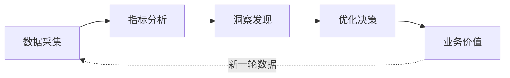
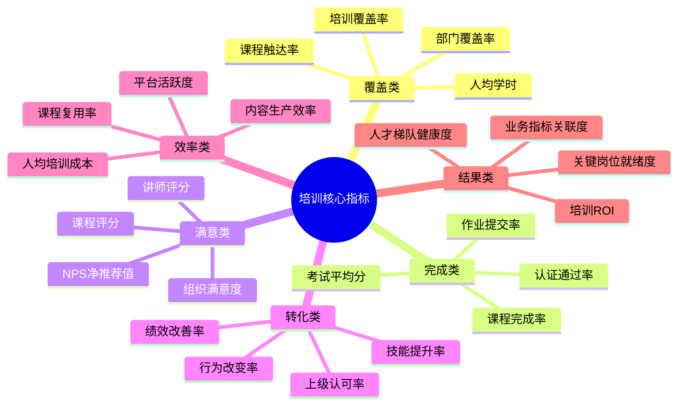
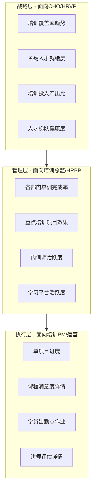
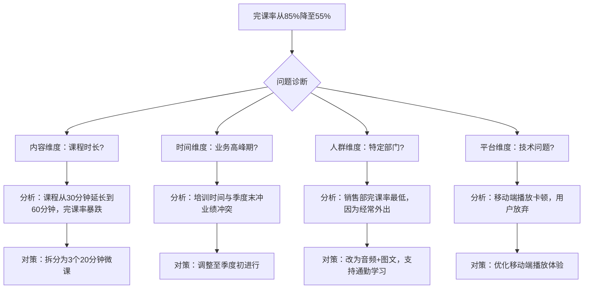

# 培训数据分析

## 一、培训数据的战略价值

培训数据分析的核心价值不在于「证明培训做了什么」，而在于**用数据驱动培训决策，让培训从成本中心转变为价值中心**。

> [!abstract] 培训数据分析的三个层次
> - **Level 1 描述性分析**：「发生了什么？」——覆盖率、完成率、满意度
> - **Level 2 诊断性分析**：「为什么会发生？」——完成率低的原因是什么？哪类课程满意度最低？
> - **Level 3 预测性分析**：「未来会发生什么？」——哪些员工最可能流失？什么培训最能提升绩效？

---

## 二、核心指标体系

### 指标全景图

### 核心指标详解

#### 1. 覆盖率（培训覆盖率）

**定义**：实际参训人数 / 目标参训人数 × 100%

**分层标准**：
- 全员覆盖率：适用于合规培训、企业文化培训
- 关键岗位覆盖率：适用于专业技能培训、领导力培训
- 新人覆盖率：适用于新员工入职培训

**Benchmark参考**：
- 合规培训覆盖率目标：100%
- 专业技能培训覆盖率目标：80%+
- 领导力培训覆盖率目标：目标人群100%

#### 2. 完成率（课程完成率）

**定义**：完成全部学习任务的人数 / 报名人数 × 100%

**分析维度**：
- 按课程类型：线上课程 vs 线下课程 vs 混合式
- 按时间维度：季度趋势、月度波动
- 按人群维度：部门、职级、入职年限

> [!warning] 完成率低的分析思路
> 如果某课程完成率低于60%，不要直接下结论「学员不重视培训」。需要深入分析：
> 1. **内容问题**：课程时长是否合理？内容是否太枯燥？难度是否匹配？
> 2. **时间问题**：培训时间是否与业务高峰期冲突？
> 3. **动力问题**：培训是否与绩效/晋升挂钩？是否有上级督促？
> 4. **平台问题**：移动端体验是否流畅？推送提醒是否到位？

#### 3. 满意度（NPS/评分）

**NPS（净推荐值）**：你有多大可能向同事推荐这个培训？（0-10分）

- 9-10分：推荐者（Promoter）
- 7-8分：被动者（Passive）
- 0-6分：贬损者（Detractor）

**NPS = 推荐者占比 - 贬损者占比**

**Benchmark参考**：
- NPS > 50：优秀
- NPS 30-50：良好
- NPS < 30：需要改进

#### 4. 转化率（行为改变率）

**定义**：培训后在工作中表现出目标行为改变的学员比例

**测量方法**：
- 学员上级问卷调查（培训后1-3个月）
- 360度反馈（培训前后对比）
- 关键行为数据追踪（如：销售培训后，方案式销售的提案数量变化）

> [!important] 行为改变率是培训价值的关键指标
> 满意度高不代表培训有效。一个培训可能「体验很好」但「什么都没改变」。
> 行为改变率才是培训真正创造价值的证据。建议每个重点培训项目都设置2-3个关键行为指标，与学员上级确认后在培训后追踪。

#### 5. 培训ROI（投资回报率）

**计算公式**：ROI = (培训收益 - 培训成本) / 培训成本 × 100%

**培训成本构成**：
- 显性成本：讲师费、场地费、差旅费、平台费、物料费
- 隐性成本：学员时间成本、管理者时间成本、培训团队人力成本

**培训收益衡量**（按难度递增）：
1. 直接可量化：销售额提升、生产效率提升、错误率降低
2. 间接可推算：离职率降低节省的招聘成本、客户满意度提升带来的复购
3. 战略价值（难以量化）：人才梯队建设、组织能力提升、文化塑造

> [!tip] ROI计算的实操建议
> 不要每个培训都算ROI，那会累死且不准。建议：
> 1. **只对战略级项目计算ROI**（如年度预算>50万的项目）
> 2. **使用简化版ROI**：聚焦1-2个最相关的业务指标
> 3. **与业务方共同确认收益**：避免自说自话，让业务方认可收益计算逻辑

---

## 三、数据看板搭建

### 指标分层设计

### 看板可视化设计

| 层级 | 更新频率 | 可视化形式 | 核心关注 |
|------|----------|-----------|----------|
| **战略层** | 季度 | 趋势图、仪表盘、对标图 | 趋势、健康度、行业对标 |
| **管理层** | 月度 | 柱状图、对比图、热力图 | 完成情况、差距分析、部门对比 |
| **执行层** | 周/日 | 进度条、明细表、预警灯 | 进度跟踪、异常预警、行动清单 |

> [!example] 培训数据看板示例（管理层-月度）
> - **核心指标卡片**：本月培训覆盖率 85% ▲5%、NPS 62 ▲3、人均学时 4.2h
> - **部门完成率排行**：柱状图展示各部门培训完成率，红黄绿灯标注
> - **课程满意度TOP5/BOTTOM5**：识别优质课程和待改进课程
> - **重点培训项目进度**：甘特图展示关键里程碑
> - **异常预警**：自动标记完成率<60%的课程、NPS<30的课程

---

## 四、数据驱动优化

### 典型分析场景

**场景一：某课程完课率持续走低**

**场景二：培训与业务指标关联分析**

| 分析维度 | 方法 | 示例 |
|----------|------|------|
| **培训前后对比** | 对比培训组与对照组的关键业务指标 | 参加销售培训的团队，季度销售额增长15%，对照组增长5%，培训净贡献10% |
| **相关性分析** | 分析学习数据与绩效数据的相关性 | 学习时长TOP20%的员工，绩效评分平均高出12% |
| **分层分析** | 按不同人群切分，看培训效果差异 | 入职1年内的员工培训效果最显著，3年以上效果递减——提示需要分层设计 |

---

## 五、面试应用

### 高频面试题：「你们怎么用数据衡量培训效果？」

**STAR回答框架**：

| 维度 | 回答要点 | 示例表达 |
|------|----------|----------|
| **框架先行** | 先亮出你的评估框架 | "我使用柯氏四级评估框架，对应不同层级的数据指标。L1反应层看NPS和满意度评分，L2学习层看考试通过率和技能考核成绩，L3行为层看360度反馈和上级评价，L4结果层看业务指标变化。" |
| **数据驱动** | 举一个用数据发现问题并优化的例子 | "比如我们发现某课程的完课率从85%降到55%，通过数据分析发现核心原因是课程时长从30分钟延长到60分钟。我们将课程拆分为3个20分钟微课后，完课率回升到82%。" |
| **业务关联** | 展示你如何将培训数据与业务数据关联 | "在销售培训项目中，我们对比了培训组和对照组的季度销售数据，培训组销售额增长15%，对照组仅增长5%，培训净贡献约10%，直接验证了培训价值。" |
| **系统思维** | 展示数据看板和指标体系 | "我搭建了三级数据看板：战略层面向CHO展示人才梯队健康度，管理层面向培训总监展示各部门数据，执行层面向培训PM展示单项目进度。不同层级看不同指标，避免信息过载。" |

**加分项提示**：
- 提到**指标分层**（战略层/管理层/执行层），展示系统性思维
- 提到**数据驱动优化**的具体案例（不是只看数据，而是用数据做决策）
- 提到**业务指标关联**（不是只看培训指标，而是看培训对业务的实际影响）
- 提到**NPS**（展示你了解行业通行的满意度衡量标准）
- 提到**行为改变率**（展示你关注的是培训的最终效果，而非仅停留在满意度）

> [!tip] 面试官在考察什么
> 这道题的核心是考察你是否有「数据思维」——不是问你「会不会用Excel」，而是：
> 1. 你是否能用数据衡量培训的**真实价值**（而非活动数量）
> 2. 你是否能通过数据**发现问题和机会**（而非只做报表）
> 3. 你是否能把培训数据与**业务语言**打通（而非自说自话）

---

## 关联笔记

- [[01_培训与人才发展理论基础]] — 柯氏四级评估模型详解
- [[03-HR人事/培训与人才发展/05-培训运营/16_培训项目全流程管理]] — 培训项目中的效果评估阶段
- [[03-HR人事/培训与人才发展/05-培训运营/17_数字化学习平台]] — 数字化学习平台的数据采集与分析
- [[03-HR人事/培训与人才发展/06-前沿趋势/19_AI在培训中的应用]] — AI在培训数据分析中的应用（学习效果预测）
- [[03-HR人事/培训与人才发展/07-面试实战/22_面试常见问题]] — 数据驱动相关的面试题
- [[03-HR人事/培训与人才发展/07-面试实战/23_案例：电网培训基地复盘]] — 培训项目效果评估实战案例
- [[03-HR人事/培训与人才发展/07-面试实战/24_案例：从零搭建培训体系]] — 培训体系搭建中的指标体系设计