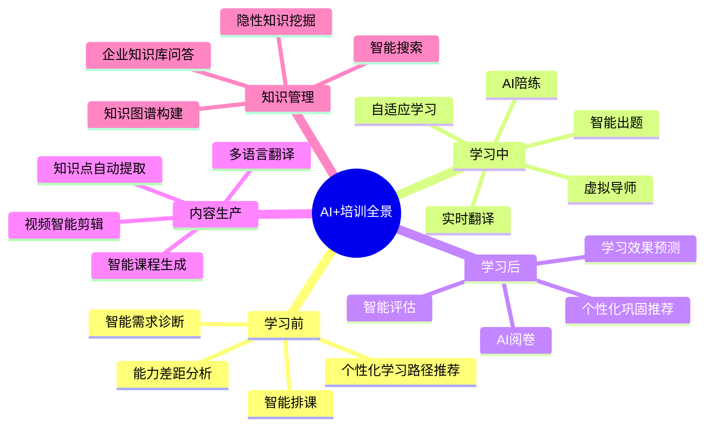
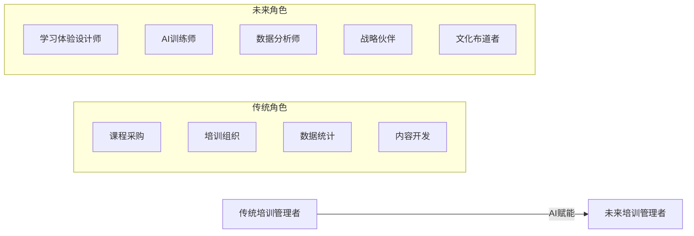

# AI在培训中的应用

## 一、AI培训应用全景

AI正在重塑培训与人才发展的每一个环节。这不是一个「未来趋势」，而是**正在发生的现实**。

---

## 二、六大核心应用场景

### 1. 智能推荐学习路径

**传统模式**：所有员工学同一套课程，千人一面。

**AI模式**：基于员工的岗位、职级、能力差距、学习偏好、职业发展目标，智能推荐个性化学习路径。

**技术原理**：
- 协同过滤：相似岗位/能力的员工学了什么
- 内容标签：课程的知识点、难度、时长与员工画像匹配
- 强化学习：根据学习效果不断优化推荐策略

**落地场景**：
- 新员工入职：根据岗位和背景自动生成90天学习路径
- 管理者晋升：根据360度评估结果推荐有针对性的领导力课程
- 技能转型：识别员工现有技能与目标岗位的差距，推荐补缺课程

### 2. AI出题 / AI阅卷

**传统模式**：培训师手动出题、手动批改，耗时且标准不一。

**AI模式**：

| 能力 | 说明 | 示例 |
|------|------|------|
| **AI出题** | 基于课程内容自动生成选择题、判断题、填空题、简答题 | 上传产品手册，AI自动生成50道产品知识考题 |
| **AI阅卷** | 自动批改客观题，辅助批改主观题（简答、论述） | AI给出评分建议+评分依据，讲师审核确认 |
| **智能组卷** | 根据考试目标（知识点覆盖、难度分布）自动组卷 | 要求覆盖80%知识点，难度比例3:5:2，AI一键生成 |
| **防作弊** | 人脸识别、行为分析、抄袭检测 | 异常行为（频繁切屏、多人同IP）自动标记 |

### 3. AI陪练（核心差异化场景）

AI陪练是当前AI+培训中**最具业务价值**的应用场景，可替代传统角色扮演中的人力成本。

**适用场景**：

| 场景 | 传统做法 | AI陪练做法 | 优势 |
|------|----------|-----------|------|
| **销售谈判** | 同事扮演客户，反馈有限 | AI模拟各类客户（挑剔型、犹豫型、专业型），实时反馈 | 规模化、标准化、7x24可用 |
| **客服话术** | 照着脚本读，缺乏真实感 | AI模拟真实客户投诉，学员需即时应对 | 真实感强、可反复练习 |
| **管理沟通** | 讲师讲原则，缺少实操 | AI模拟绩效面谈、离职面谈等场景，学员练习对话 | 安全失败、即时反馈 |
| **面试模拟** | HR模拟面试，成本高 | AI模拟面试官，根据岗位JD出题，评估回答质量 | 成本低、覆盖广、数据化 |

> [!example] 落地案例：AI陪练在销售培训中的应用
> **背景**：某公司300人销售团队，需要从产品销售转型为方案销售。传统培训方式：2天集中培训+角色扮演，每年只能覆盖50人，且效果难以追踪。
>
> **AI陪练方案**：
> 1. 构建AI客户库：基于真实客户数据，创建10类典型客户画像（CIO、采购经理、业务部门负责人等）
> 2. 设计对话场景：首次拜访、需求挖掘、方案演示、异议处理、商务谈判等5个关键场景
> 3. AI陪练流程：学员与AI客户对话 → AI实时评估（话术准确性、沟通技巧、逻辑清晰度） → 生成改进建议
> 4. 数据追踪：每位学员的练习次数、进步曲线、薄弱环节自动记录
>
> **效果**：6个月内覆盖300人，方案销售认证通过率从45%提升至78%，人均练习次数15次。

### 4. 知识库问答

**企业知识库的痛点**：知识散落在各个系统（Wiki、文档、邮件、聊天记录），员工找不到、找不准。

**AI解决方案**：基于RAG（检索增强生成）技术，构建企业智能知识库。

**核心能力**：
- 自然语言提问：员工用口语化问题提问，AI给出精准答案
- 多源知识整合：接入企业Wiki、培训文档、制度文件、SOP等
- 溯源引用：每个答案附带来源链接，确保可信度
- 持续学习：根据员工提问频率和满意度，优化知识库

> [!example] 落地案例：AI知识库在岗前培训中的应用
> **背景**：某连锁零售企业，新员工岗前培训需要记忆大量产品知识、SOP流程、服务规范，传统培训周期长、遗忘率高。
>
> **AI知识库方案**：
> 1. 将产品手册、SOP、服务规范、FAQ等全部导入AI知识库
> 2. 新员工入职后，在岗期间遇到问题直接问AI（「XX产品怎么介绍给顾客？」「退货流程是什么？」）
> 3. AI根据新员工的提问频率和内容，判断其知识薄弱点，推送针对性学习内容
>
> **效果**：新员工独立上岗时间从4周缩短至2周，客户投诉率下降30%。

### 5. 虚拟导师

**概念**：AI驱动的虚拟导师，7x24小时陪伴学员，提供个性化学习支持。

**核心能力**：
- 学习进度追踪：实时了解学员学习状态，主动提醒和鼓励
- 答疑解惑：学员遇到问题随时提问，AI给出解答
- 学习建议：根据学员的学习数据和薄弱环节，推荐学习策略
- 情感支持：用鼓励性语言激励学员坚持学习

### 6. 学习效果预测

**概念**：基于学员的学习行为数据，提前预测学习效果和风险。

**预测维度**：
- 完课风险预测：哪些学员可能中途放弃？
- 学习效果预测：哪些学员在后续考核中可能不达标？
- 技能缺口预测：未来6个月，哪些岗位会出现技能缺口？

**应用价值**：从「事后评估」变为「事前干预」，主动辅导高风险学员。

---

## 三、AI的边界与局限

> [!warning] AI不能替代什么
> 在拥抱AI的同时，必须清醒认识到AI的边界：
>
> **1. 情感连接**
> 培训不仅是知识传递，更是人与人之间的信任建立、情感共鸣。AI可以模拟对话，但无法真正理解学员的焦虑、困惑和成长喜悦。
>
> **2. 复杂决策**
> 领导力、战略思维、危机处理等能力的培养，需要面对模糊、不确定、多变的真实场景。AI可以提供框架和工具，但无法替代人的判断力。
>
> **3. 价值观传递**
> 企业文化、价值观、使命感的传递，需要真实的人（尤其是领导者）的身体力行。AI可以「说」价值观，但无法「活出」价值观。
>
> **4. 创造性启发**
> 最好的培训往往不是「教」，而是「启发」——激发学员的思考、唤醒内在动力。AI可以回答问题，但很难提出直击灵魂的好问题。

**AI+培训的黄金法则**：

| 适合AI做的 | 不适合AI做的 |
|-----------|-------------|
| 知识传递 | 情感连接 |
| 标准化练习 | 复杂决策训练 |
| 数据分析和预测 | 价值观塑造 |
| 重复性答疑 | 创造性启发 |
| 个性化推荐 | 深度教练辅导 |

---

## 四、未来趋势：AI + 培训管理者的角色转变

**培训管理者需要的新能力**：

| 能力 | 说明 | 如何培养 |
|------|------|----------|
| **AI素养** | 理解AI的能力边界，知道什么场景适合用AI | 学习AI基础知识，关注行业案例 |
| **数据思维** | 能从数据中发现洞察，用数据驱动决策 | 学习数据分析方法，掌握BI工具 |
| **体验设计** | 设计人机协作的学习体验，AI+人=最佳效果 | 学习UX设计思维，关注学习体验设计 |
| **变革管理** | 推动AI在组织中的落地，管理变革阻力 | 学习变革管理方法论（如ADKAR模型） |
| **战略思维** | 从战略高度思考AI如何赋能人才发展 | 参与业务战略讨论，理解业务痛点 |

---

## 五、面试应用

### 高频面试题：「AI会给培训带来什么变化？」

> [!tip] 这是你的差异化亮点
> 大多数培训从业者只能泛泛而谈「AI能提高效率」。如果你能展示系统性的思考——从应用场景、到边界局限、再到角色转变——你会立刻脱颖而出。

**STAR回答框架**：

| 维度 | 回答要点 | 示例表达 |
|------|----------|----------|
| **全景认知** | 展示你了解AI在培训的全景应用 | "AI正在重塑培训的每一个环节：学习前有智能推荐和需求诊断，学习中有AI陪练和虚拟导师，学习后有智能评估和效果预测，内容生产层面有AI课程生成和知识库问答。这不是一个点，而是一个面。" |
| **深度案例** | 举一个你了解或参与过的AI应用案例 | "比如AI陪练在销售培训中的应用。我们构建了AI客户库，模拟10类典型客户画像，学员可以随时与AI进行对话练习，AI实时评估话术和沟通技巧。这个方案让培训覆盖率从每期50人提升到300人，认证通过率从45%提升到78%。" |
| **边界思考** | 展示你清醒认识到AI的局限 | "但AI不是万能的。情感连接、复杂决策训练、价值观传递、创造性启发，这些还是需要真实的人来完成。AI是工具，优秀的培训管理者是使用工具的人。AI+人，1+1>2。" |
| **角色进化** | 展示你对自身角色转变的思考 | "我认为AI时代，培训管理者的角色将从'课程采购+培训组织'转向'学习体验设计师+AI训练师+数据分析师+战略伙伴'。我们需要拥抱AI，同时发展AI无法替代的能力。" |

**加分项提示**：
- 提到**具体技术**（RAG、协同过滤、强化学习），展示技术理解
- 提到**落地案例**（不是空谈概念，而是有具体场景和效果数据）
- 提到**边界与局限**（展示批判性思维，而非一味追捧AI）
- 提到**角色转变**（展示你对自身职业发展的思考）
- 关联到**HR+AI转型**（展示战略视野，关联到 [[03-HR人事/培训与人才发展/06-前沿趋势/19_AI在培训中的应用]]）

> [!important] 面试官真正想听什么
> 面试官通过这道题想判断：
> 1. 你是否具备**前瞻性视野**——不只是会做培训，还能看到趋势
> 2. 你是否具备**落地能力**——不只是谈概念，还能落地执行
> 3. 你是否具备**批判性思维**——不只是追热点，还能理性分析
> 4. 你是否具备**自我进化意识**——不只是守旧，还能拥抱变化

---

## 关联笔记

- [[01_培训与人才发展理论基础]] — 成人学习理论与AI个性化学习的关系
- [[03-HR人事/培训与人才发展/05-培训运营/17_数字化学习平台]] — AI赋能的数字化学习平台
- [[03-HR人事/培训与人才发展/05-培训运营/18_培训数据分析]] — AI驱动的学习效果预测与数据洞察
- [[03-HR人事/培训与人才发展/06-前沿趋势/20_微学习与移动学习]] — AI在微学习内容推荐中的应用
- [[03-HR人事/培训与人才发展/06-前沿趋势/21_游戏化学习设计]] — AI在游戏化学习中的自适应难度调整
- [[03-HR人事/培训与人才发展/07-面试实战/22_面试常见问题]] — AI+培训相关面试题
- [[03-HR人事/培训与人才发展/07-面试实战/24_案例：从零搭建培训体系]] — 在培训体系中融入AI能力