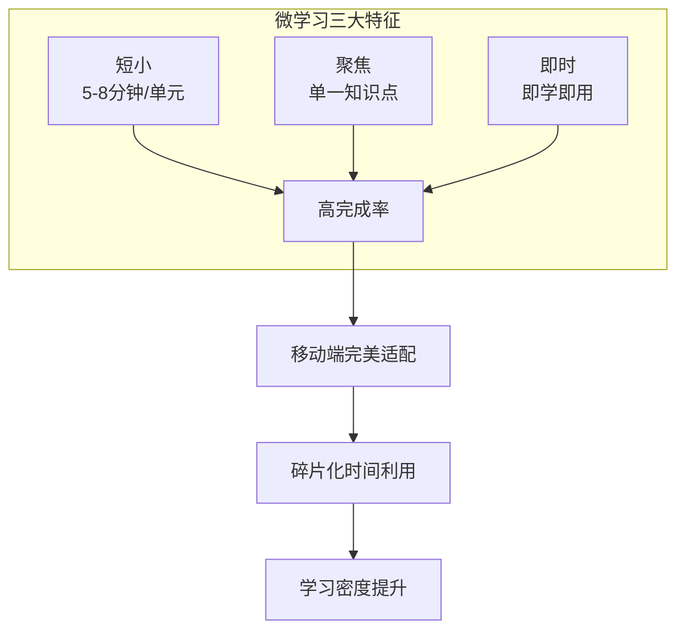
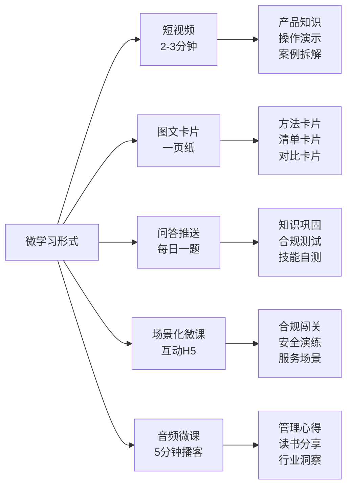
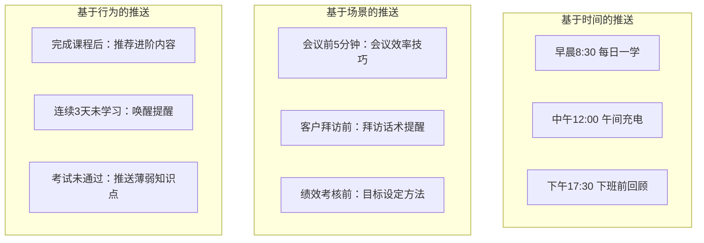

# 微学习与移动学习

## 一、核心概念

微学习（Microlearning）是一种将学习内容拆分为**短小、聚焦、即时可用**的学习单元的教学策略。移动学习（Mobile Learning）是利用移动设备（手机、平板）在任何时间、任何地点进行学习的方式。

两者天然融合：**移动设备是微学习的最佳载体，微学习是移动设备上最高效的学习形式。**



> [!abstract] 微学习不是「把长课程切短」
> 微学习的关键不是时长，而是**设计逻辑**：
> - 传统课程：知识体系驱动（先讲概念，再讲方法，最后讲应用）
> - 微学习：问题/场景驱动（遇到什么问题，直接给出解决方案）
> - 每个微学习单元必须**独立完整**：一个知识点、一个工具、一个方法、一个案例

---

## 二、微学习设计原则

### 五大设计原则

| 原则 | 说明 | 反例 |
|------|------|------|
| **单一知识点** | 每个微课只讲一个知识点，最多一个 | 一个微课讲「时间管理的四个象限+番茄工作法+GTD」 |
| **5-8分钟** | 最佳时长，超过8分钟完成率断崖式下降 | 一个「微课」讲了15分钟 |
| **即时可用** | 学完就能用，提供可操作的步骤/工具/模板 | 只讲理论，没有实操指导 |
| **多感官** | 视觉（图文）+ 听觉（音频）+ 互动（问答）= 最佳记忆 | 纯文字或纯语音 |
| **问题导向** | 以「解决什么问题」开头，而非「今天讲什么」 | 开头说「今天我们来学习沟通技巧」 |

### 微学习设计公式

```
微学习 = 一个具体问题 + 一个核心方法 + 一个实操示例 + 一个行动清单
```

**示例**：

| 问题 | 核心方法 | 实操示例 | 行动清单 |
|------|----------|----------|----------|
| 如何给客户做产品演示？ | FAB法则（特性-优势-利益） | 以CRM系统为例演示FAB话术 | 写下你核心产品的FAB，明天拜访客户时试用 |
| 如何处理客户投诉？ | LATER模型（倾听-道歉-感谢-共情-解决） | 模拟一个客户投诉对话，展示LATER五步 | 下次收到投诉，按LATER五步回应，记录反馈 |
| 如何写好周报？ | 三段式：成果-问题-计划 | 展示一个「好周报」和一个「差周报」对比 | 本周周报用三段式写法，观察上级反馈 |

---

## 三、常见微学习形式



### 各形式详解

| 形式 | 最佳时长 | 制作成本 | 最佳场景 | 示例 |
|------|----------|----------|----------|------|
| **短视频** | 2-3分钟 | 中 | 产品知识、操作演示、案例拆解 | 产品经理录制「如何做竞品分析」3分钟教学视频 |
| **图文卡片** | 1-2分钟阅读 | 低 | 方法工具、清单、对比 | 一张图讲清楚「SWOT分析的四个维度」 |
| **问答推送** | 30秒-1分钟 | 低 | 知识巩固、合规测试 | 每日早上9点推送一道产品知识题，答对积分+1 |
| **场景化微课** | 3-5分钟 | 高 | 合规培训、安全演练、服务场景 | H5互动：模拟一个客户投诉场景，学员选择应对方式，不同选择导致不同结果 |
| **音频微课** | 5-8分钟 | 低 | 管理心得、读书分享、行业洞察 | 管理者录制「我如何做一对一沟通」5分钟音频 |

---

## 四、推送策略

微学习的内容再好，如果推送时机不对，效果大打折扣。推送策略是微学习运营的核心。

### 三种推送策略



### 推送策略设计表

| 策略类型 | 推送时机 | 推送内容 | 推送频率 | 适用场景 |
|----------|----------|----------|----------|----------|
| **时间驱动** | 固定时间（如每天9:00） | 每日一学（知识卡片/问答） | 每天1次 | 全员知识普及、合规意识培养 |
| **场景驱动** | 业务节点前 | 场景化工具/话术/checklist | 按需触发 | 销售拜访、客户服务、项目管理 |
| **行为驱动** | 学习行为触发 | 个性化推荐/提醒/鼓励 | 智能触发 | 学习路径推进、完课率提升、薄弱项强化 |

> [!tip] 推送策略的黄金法则
> 1. **少即是多**：每天推送不超过2次，否则变成骚扰
> 2. **价值优先**：每次推送必须提供价值，不能是纯提醒
> 3. **允许退订**：给员工选择权，不同人群不同推送频率
> 4. **A/B测试**：测试不同推送时间、标题、内容形式的效果
> 5. **数据驱动**：根据打开率、完成率持续优化推送策略

---

## 五、适用场景与不适用场景

### 适用场景

| 场景 | 为什么适合微学习 | 设计建议 |
|------|-----------------|----------|
| **产品知识** | 产品更新频繁，需要快速传递 | 每个产品/功能一个微课，版本更新时局部替换 |
| **流程操作** | 步骤明确，适合分步演示 | 用短视频展示操作步骤，附checklist |
| **合规培训** | 知识点分散，需要持续强化 | 每日推送一个合规知识问答，持续100天 |
| **软技能碎片化** | 沟通、时间管理等可以拆分为具体技巧 | 每周一个沟通技巧卡片，附场景化练习 |
| **新员工入职** | 信息量大，需要分阶段消化 | 第1天到第30天，每天推送一个入职知识卡片 |

### 不适用场景

| 场景 | 为什么不适合微学习 | 建议替代方案 |
|------|-------------------|-------------|
| **深度领导力发展** | 需要系统思考、案例讨论、行为演练 | 线下工作坊 + 行动学习 |
| **复杂技能训练** | 需要反复练习、即时反馈、教练指导 | 线下实操 + AI陪练 |
| **战略思维培养** | 需要多维度思考、群体讨论、视角碰撞 | 高管研讨会 + 案例研究 |
| **团队建设** | 需要真实的人际互动和情感连接 | 线下团建 + 团队教练 |

---

## 六、面试应用

### 高频面试题：「你如何设计微学习？」

**STAR回答框架**：

| 维度 | 回答要点 | 示例表达 |
|------|----------|----------|
| **设计原则** | 先亮出你的设计方法论 | "我遵循微学习五大设计原则：单一知识点、5-8分钟、即时可用、多感官、问题导向。每个微课必须包含四个要素：一个具体问题、一个核心方法、一个实操示例、一个行动清单。" |
| **场景匹配** | 说明什么场景适合微学习 | "微学习最适合三类场景：一是产品知识更新（快速传递新功能），二是流程操作（分步演示），三是合规意识（持续强化）。但不是所有培训都适合微学习，深度领导力、复杂技能训练还是需要线下工作坊。" |
| **推送策略** | 展示你的运营思维 | "推送策略是微学习成功的关键。我设计了三层推送：时间驱动（每天9点推送）、场景驱动（会议前推送会议效率技巧）、行为驱动（连续3天未学习推送唤醒提醒）。通过A/B测试持续优化推送时间、标题和内容形式。" |
| **效果数据** | 用数据证明效果 | "通过微学习+精准推送，我们将某产品知识培训的完成率从45%提升到82%，人均学习时长从1.2小时降到每天5分钟但覆盖天数从1天延伸至30天，知识留存率提升40%。" |

**加分项提示**：
- 提到**微学习不是简单切短**，而是重新设计学习逻辑
- 提到**推送策略**的三种驱动方式，展示运营思维
- 提到**适用场景判断**，展示你知道什么场景不适合微学习
- 提到**A/B测试**和**数据驱动**，展示精细化运营能力
- 关联到**移动学习**，展示对学习形式的整体理解

> [!tip] 面试官在考察什么
> 这道题考察的核心是：
> 1. 你是否理解微学习的**本质**（不是时长短，而是设计逻辑不同）
> 2. 你是否具备**运营思维**（不只是生产内容，更要推动内容被消费）
> 3. 你是否能**判断场景**（知道什么适合/不适合微学习，而非一刀切）

---

## 关联笔记

- [[01_培训与人才发展理论基础]] — 成人学习理论、注意力曲线与微学习时长的关系
- [[03-HR人事/培训与人才发展/05-培训运营/17_数字化学习平台]] — 微学习内容的数字化分发平台
- [[03-HR人事/培训与人才发展/05-培训运营/18_培训数据分析]] — 微学习的数据指标（打开率、完成率、留存率）
- [[03-HR人事/培训与人才发展/06-前沿趋势/19_AI在培训中的应用]] — AI在微学习内容推荐中的应用
- [[03-HR人事/培训与人才发展/06-前沿趋势/21_游戏化学习设计]] — 微学习中的游戏化元素（积分、徽章、排行榜）
- [[03-HR人事/培训与人才发展/07-面试实战/22_面试常见问题]] — 微学习相关面试题