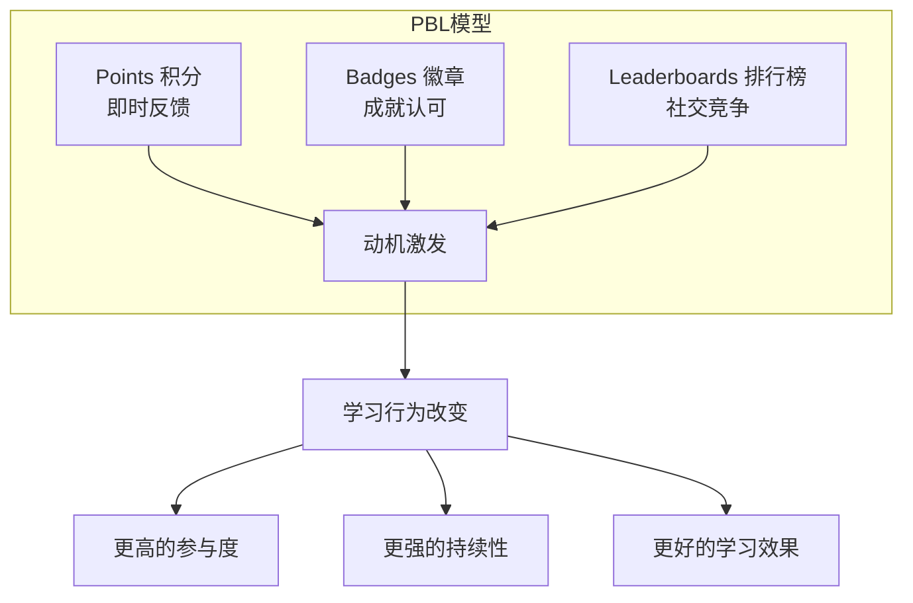
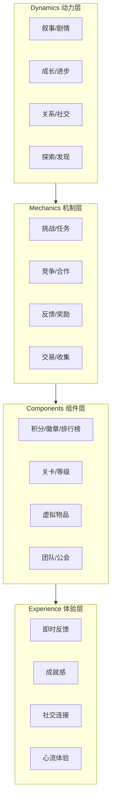
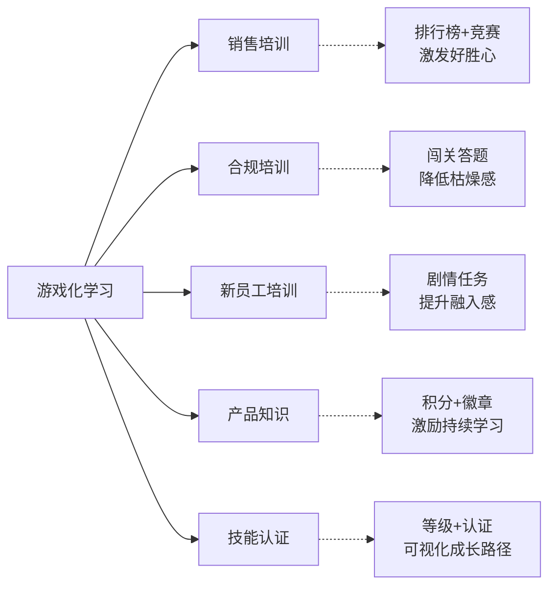

# 游戏化学习设计

## 一、核心概念

游戏化学习（Gamification in Learning）是将游戏设计元素和机制应用于非游戏情境（学习），以**激发学习动机、提升参与度、改善学习效果**的教学策略。

**关键区分**：
- **游戏化（Gamification）**：在学习中加入游戏元素（积分、徽章、排行榜），学习本身不是游戏
- **游戏式学习（Game-Based Learning）**：学习本身就是游戏（如模拟经营、角色扮演）
- **严肃游戏（Serious Game）**：为教育/培训目的设计的完整游戏

> [!abstract] 游戏化学习的本质
> 游戏化学习的核心不是「好玩」，而是**激活内在动机**。根据自我决定理论（Self-Determination Theory），人类的内在动机来自三个需求：
> - **自主性（Autonomy）**：我能选择学什么、怎么学
> - **胜任感（Competence）**：我能感受到进步和成长
> - **归属感（Relatedness）**：我与他人有连接和互动
>
> 好的游戏化设计，就是通过游戏机制满足这三个需求。

---

## 二、PBL模型：游戏化的核心框架

PBL是游戏化设计最经典的框架，由Points（积分）、Badges（徽章）、Leaderboards（排行榜）构成。

### 三要素详解

| 要素 | 心理机制 | 设计要点 | 正面示例 | 反面示例 |
|------|----------|----------|----------|----------|
| **Points 积分** | 即时反馈、量化进步 | 积分规则清晰、获取即时、有明确用途 | 完成课程+10分，分享笔记+5分，积分可兑换学习资源 | 积分规则模糊、积分没有用途、只有排名没有实质奖励 |
| **Badges 徽章** | 成就认可、身份标识 | 徽章有设计感、有稀缺性、有展示价值 | 「连续学习30天」金徽章、「课程达人」银徽章，在个人主页展示 | 参与就给徽章（通货膨胀）、徽章太丑没人想要 |
| **Leaderboards 排行榜** | 社会比较、竞争驱动 | 多维度排行、可追赶、保护低分者 | 周榜/月榜/总榜、部门排行、进步最快排行 | 只有总榜、差距过大导致放弃、只有排名没有奖励 |

> [!tip] PBL设计的三个陷阱
> 1. **积分通胀**：积分太容易获得，失去激励价值。解法：设定积分获取难度梯度，稀缺性创造价值感。
> 2. **排行榜固化**：前几名永远是那几个人，其他人放弃竞争。解法：设置周榜重置、进步最快榜、新人榜等多维度排行。
> 3. **外在动机挤出内在动机**：过度依赖积分奖励，学习者「为了积分而学」而非「为了成长而学」。解法：积分是辅助，核心是学习内容本身的价值。

---

## 三、游戏化设计元素

### 四层游戏化设计框架

### 核心设计元素

| 元素 | 说明 | 设计示例 |
|------|------|----------|
| **剧情任务** | 将学习过程包装为故事，学员是「主角」 | 新员工培训：你是「新加入的探险者」，需要完成7个任务，解锁公司地图，最终获得「转正资质」 |
| **关卡挑战** | 将学习内容拆分为关卡，逐级解锁 | 产品知识培训：青铜→白银→黄金→钻石，每级10道题，通过解锁下一级 |
| **即时反馈** | 每完成一个动作立即获得反馈 | 答对题目：烟花特效+「太棒了！！」；答错：提示+「再试一次，你可以的！」 |
| **社交竞争** | 团队PK、好友挑战、协作任务 | 销售培训：以区域为单位PK，获胜区域获得「金牌团队」称号+团建基金 |
| **进度可视化** | 让学员看到自己的学习进度和成长 | 学习地图：显示已解锁/未解锁关卡、已完成/未完成课程、当前排名 |
| **惊喜机制** | 随机奖励、隐藏成就、彩蛋 | 连续学习7天触发「隐藏成就」：解锁一张知识大咖的金句海报 |

---

## 四、适用场景与边界

### 适用场景

**各场景设计要点**：

| 场景 | 核心游戏化机制 | 设计示例 | 成功指标 |
|------|---------------|----------|----------|
| **销售培训** | 排行榜+竞赛+团队PK | 以区域/团队为单位PK，周榜更新，TOP团队获「金牌销售团」称号+实物奖励 | 参与率、练习次数、认证通过率 |
| **合规培训** | 闯关答题+剧情任务 | 将合规知识点设计为「合规大闯关」，10关，每关5道题，通过解锁下一关 | 完成率、考试通过率 |
| **新员工培训** | 剧情任务+进度地图 | 30天新人任务地图，每天解锁一个任务，完成获得经验值和徽章 | 任务完成率、新员工留存率 |
| **产品知识** | 积分+徽章+等级 | 产品知识学习路径：青铜→白银→黄金→钻石，每级需要完成指定课程和考试 | 学习时长、认证率 |
| **技能认证** | 等级+认证+展示 | 技能等级体系（L1-L5），通过考试获得数字徽章，可展示在个人主页和签名 | 认证通过率、认证覆盖率 |

### 不适用场景

| 场景 | 为什么不适用 | 风险 |
|------|-------------|------|
| **高管领导力发展** | 高管对外在激励（积分/徽章）不敏感，游戏化反而显得幼稚 | 损害培训品牌，降低高管参与意愿 |
| **敏感话题培训** | 如反性骚扰、心理健康等，游戏化会显得轻浮 | 引发价值观争议，造成负面影响 |
| **深度反思类培训** | 需要安静思考、内省，游戏化分散注意力 | 干扰深度思考，降低学习效果 |
| **强制合规培训** | 如果员工必须参加，游戏化是锦上添花，不是核心 | 资源浪费，核心问题不解决 |

> [!warning] 游戏化的边界：强迫游戏化是毒药
> 不是所有培训都适合游戏化。强迫游戏化（如把严肃的合规培训做成「打怪升级」）反而会降低学习体验，甚至引发抵触。
>
> **判断标准**：问自己三个问题——
> 1. 游戏化是否**增强**了学习目标？（而非稀释）
> 2. 目标学员是否**接受**游戏化？（而非觉得幼稚）
> 3. 游戏化机制是否**可持续**？（而非一次性噱头）
>
> 三个问题都回答「是」，才适合做游戏化。

---

## 五、面试应用

### 高频面试题：「游戏化学习真的有效吗？」

这道题面试官大概率会以「质疑」的口吻抛出，实际是在考察你是否能**理性分析**而非盲目追捧。

**STAR回答框架**：

| 维度 | 回答要点 | 示例表达 |
|------|----------|----------|
| **理性认可** | 先承认游戏化不是万能药 | "游戏化学习不是万能药，它有效，但有边界。我首先承认：不是所有培训都适合游戏化。敏感话题、深度反思类培训就不适合。" |
| **理论支撑** | 用理论解释为什么有效 | "游戏化学习的有效性有理论支撑。根据自我决定理论，人的内在动机来自三个需求：自主性、胜任感、归属感。好的游戏化设计——比如让学员选择学习路径（自主性）、看到自己的进步（胜任感）、参与团队竞赛（归属感）——正好满足这三个需求。" |
| **实践案例** | 举一个你设计或参与的游戏化案例 | "比如我在销售培训中设计了团队PK机制：以区域为单位，每周更新排行榜，获胜团队获得'金牌销售团'称号。这个机制让培训参与率从60%提升到92%，人均练习次数从3次提升到15次。但关键不是排行榜本身，而是排行榜激发了团队荣誉感和竞争意识。" |
| **边界意识** | 展示你知道什么时候不该用 | "但我也遇到过游戏化失败的案例。我们把合规培训做成了闯关游戏，学员反馈'太儿戏了'。后来我们调整为'场景化微课+案例讨论'，效果反而更好。这让我深刻认识到：游戏化是手段，不是目的；学习目标第一，游戏化第二。" |

**加分项提示**：
- 提到**自我决定理论**（SDT），展示理论深度
- 提到**外在动机挤出内在动机**的问题，展示批判性思维
- 提到**PBL模型**的具体设计细节，展示实操能力
- 提到**游戏化失败案例**，展示真实经验和反思能力
- 提到**场景判断**（什么适合/什么不适合），展示成熟度

> [!tip] 面试官在考察什么
> 这道题的核心是考察你的**批判性思维**和**成熟度**：
> 1. 你是否能**理性分析**一个热门概念（而非盲目追捧）
> 2. 你是否能**用理论解释实践**（而非仅凭感觉）
> 3. 你是否能**从失败中学习**（而非只讲成功案例）
> 4. 你是否能**判断场景**（而非一刀切）

---

## 关联笔记

- [[01_培训与人才发展理论基础]] — 自我决定理论、成人学习动机
- [[03-HR人事/培训与人才发展/05-培训运营/17_数字化学习平台]] — 游戏化学习在数字化平台中的实现
- [[03-HR人事/培训与人才发展/05-培训运营/18_培训数据分析]] — 游戏化学习的数据指标（参与率、活跃度、留存率）
- [[03-HR人事/培训与人才发展/06-前沿趋势/19_AI在培训中的应用]] — AI在游戏化中的自适应难度调整
- [[03-HR人事/培训与人才发展/06-前沿趋势/20_微学习与移动学习]] — 微学习中的游戏化元素（积分、打卡、徽章）
- [[03-HR人事/培训与人才发展/07-面试实战/22_面试常见问题]] — 游戏化学习相关面试题