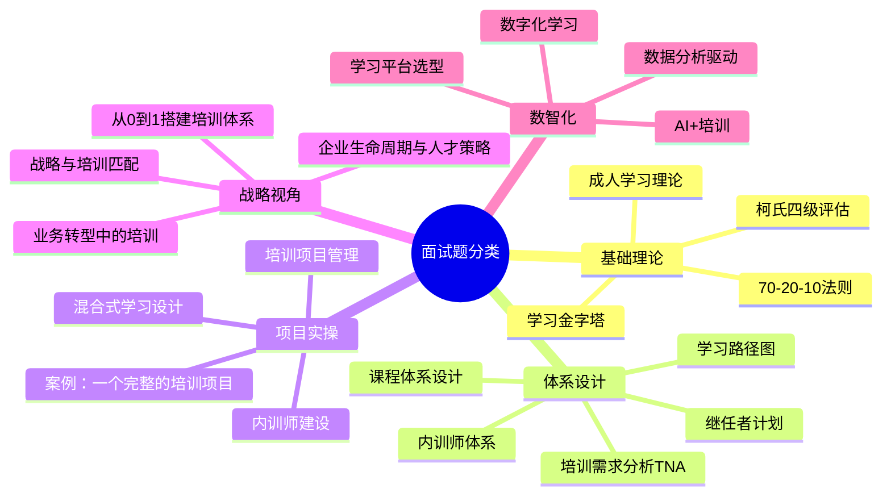

# 面试常见问题

## 一、面试题分类总览

本文档梳理了30+高频面试题，按五大类别分组，每道题提供STAR回答框架、参考答案要点和加分项提示。

> [!abstract] 面试备考策略
> 1. **基础理论类**：必须能用自己的话讲清楚，不要背诵定义
> 2. **体系设计类**：展示系统性思维，从战略到落地的完整链路
> 3. **项目实操类**：准备2-3个真实案例，用STAR框架结构化表达
> 4. **战略视角类**：这是区分初中级和高级候选人的关键分水岭
> 5. **数智化类**：这是你的差异化亮点，展示前瞻性视野

---

## 二、基础理论类（5题）

### Q1：请用你自己的话解释成人学习理论，以及在培训设计中如何应用？

**STAR回答框架**：

| 维度 | 要点 |
|------|------|
| **理论核心** | 成人学习理论（诺尔斯Andragogy）的核心假设：成人学习者具有自我导向性、丰富的经验、以问题为中心的学习取向、内在动机驱动。他们需要知道「为什么学」和「学了能解决什么问题」。 |
| **应用举例** | 我在设计培训时，会做到四个「不」：不照本宣科（从问题出发）、不脱离经验（引导学员分享自己的案例）、不做纯理论（每个知识点配实操练习）、不只讲一次（培训后设置跟进机制） |
| **具体做法** | 比如在设计管理培训时，我会在课前收集学员的真实管理困境作为案例素材，课堂上用这些真实案例做研讨，课后设置「30天行为改变计划」持续跟进 |

**加分项**：提到诺尔斯（Malcolm Knowles）的名字；提到与儿童教育学（Pedagogy）的对比；能举出具体的、非泛泛的应用案例。

---

### Q2：柯氏四级评估模型是什么？你觉得在实际工作中，是否需要每一级都做评估？

**STAR回答框架**：

| 维度 | 要点 |
|------|------|
| **模型解释** | 柯氏四级：L1反应层（满意度）、L2学习层（知识掌握）、L3行为层（行为改变）、L4结果层（业务结果）。层级递进，评估难度和成本递增。 |
| **核心观点** | 不需要每个培训都做四级评估。L1和L2是基础，所有培训都应该做；L3行为层我建议重点培训项目都做，做法是在培训前与学员上级确认「期望的行为改变清单」，培训后1-3个月追踪；L4结果层只对战略级项目做，因为成本高且归因复杂。 |
| **举例** | 比如新员工培训，我们做到了L3：跟踪新员工30天、60天、90天的独立上岗率和工作表现评分，发现培训后90天独立上岗率从65%提升到85%。 |

**加分项**：提到菲利普斯ROI（第五级）；提到「归因困难」问题（如何证明是培训带来的效果）；提到自己真实的评估实践。

---

### Q3：什么是70-20-10法则？你认为这个比例是固定的吗？

**STAR回答框架**：

| 维度 | 要点 |
|------|------|
| **法则解释** | 70-20-10法则认为，有效学习70%来自在岗实践（项目、任务），20%来自社交学习（导师、同伴），10%来自正式学习（课堂、在线课程）。 |
| **核心观点** | 这个比例不是固定公式，而是提醒我们：培训部门通常只关注10%的正式学习，但真正改变行为的是70%的实践和20%的社交。 |
| **应用举例** | 我在设计培训项目时，会用70-20-10检查自己的方案：如果方案里只有课堂培训（10%），那就是不合格的；必须设计实践任务（70%）和社交机制（20%）。比如新员工培训，我们设计了30天实践任务清单（70%）+导师辅导（20%）+集中培训（10%）。 |

**加分项**：提到这个法则的起源（Center for Creative Leadership）；提到在不同场景下比例可以调整（领导力培训可能更依赖70%的实践）；能举出自己设计的70-20-10方案。

---

### Q4：学习金字塔理论对我们设计培训有什么启示？

**STAR回答框架**：

| 维度 | 要点 |
|------|------|
| **理论解释** | 学习金字塔表明：被动学习（听讲5%、阅读10%、视听20%）留存率远低于主动学习（讨论50%、实践75%、教授他人90%）。 |
| **核心启示** | 这个理论告诉我们：培训设计的关键不是讲师讲了多少，而是学员做了多少。如果一堂培训课80%的时间是讲师在讲，那效果一定很差。 |
| **应用举例** | 我在设计培训时，强制要求每个模块的「学员参与时间」不低于50%。比如一个2小时的课程，至少1小时是学员在讨论、练习、分享。具体做法：用「翻转课堂」模式——课前发预习材料，课堂上主要做讨论和练习。 |

**加分项**：能批判性地指出「学习金字塔的具体百分比有争议，但主动学习优于被动学习的原则是对的」；提到翻转课堂、案例教学等主动学习方式。

---

### Q5：你如何理解「培训不是万能药」这句话？

**STAR回答框架**：

| 维度 | 要点 |
|------|------|
| **核心观点** | 培训只能解决「会不会」的问题，不能解决「愿不愿」（激励问题）、「能不能」（资源/流程问题）、「知不知」（反馈/信息问题）。很多业务问题表面上是能力问题，实际上是机制问题。 |
| **举例说明** | 曾经有业务方提出「员工沟通能力差，需要培训」。我做了需求调研后发现，真正的问题是：跨部门协作流程不清晰，导致信息传递不畅，被误读为「沟通能力差」。我们最终推动的是流程优化+沟通协作机制搭建，而非培训。 |
| **方法论** | 我使用绩效改进（HPI）框架：先诊断问题的根因（能力/动机/环境/信息），只有确认是能力问题时，才用培训解决。 |

**加分项**：提到绩效改进（HPI/HPT）框架；举出真实案例说明「用非培训手段解决了看似培训的问题」；展示批判性思维和业务伙伴意识。

---

## 三、体系设计类（6题）

### Q6：请描述你如何做培训需求分析（TNA）？

**STAR回答框架**：

| 维度 | 要点 |
|------|------|
| **方法论** | 我使用三层次TNA：组织分析（战略→能力需求）、任务分析（岗位→技能需求）、人员分析（个体→差距分析）。三个层次从上到下，确保培训需求对齐战略。 |
| **具体做法** | 组织分析：解读公司战略/年度经营计划，识别关键能力缺口；任务分析：访谈业务专家，梳理关键岗位的能力模型和工作任务；人员分析：通过绩效数据、360度反馈、上级评价识别个体差距。 |
| **工具** | 常用工具：战略解码工作坊、岗位任务分析访谈、能力差距评估矩阵、调研问卷+焦点小组。 |
| **举例** | 比如某次为销售团队做TNA，组织分析发现公司战略从「跑马圈地」转向「深耕存量」，任务分析发现客户成功经理岗位需要从「被动响应」转向「主动经营」，人员分析发现80%的CSM缺乏客户经营方法论。基于此设计了「客户成功经理能力提升项目」。 |

**加分项**：提到三层次TNA（组织/任务/人员）；提到绩效差距 vs 学习差距的区分；能举出从战略到培训的完整推导案例。

---

### Q7：如何设计一个公司的课程体系？

**STAR回答框架**：

| 维度 | 要点 |
|------|------|
| **设计思路** | 课程体系设计遵循「战略→能力→课程」逻辑。先明确公司需要什么能力，再设计培养这些能力的课程。 |
| **分层设计** | 我通常按「三横三纵」设计课程体系：三横（按职级：新员工-骨干-管理者），三纵（按序列：技术-产品-销售-职能）。每个交叉点对应一个学习路径。 |
| **具体产出** | 每个学习路径包含：必修课+选修课、线上+线下、课程+实践+导师。以「初级产品经理学习路径」为例：必修课包括需求分析、PRD撰写、数据分析、用户研究；选修课包括技术基础、商业思维；实践任务包括独立完成一个需求的从0到1。 |
| **持续迭代** | 课程体系不是一次性设计，需要每年review。基于业务变化、能力模型更新、学员反馈持续迭代。 |

**加分项**：提到「三横三纵」或「学习地图」；提到课程体系与能力模型、任职资格体系的关联；提到课程体系的选代机制。

---

### Q8：如何搭建内训师体系？

**STAR回答框架**：

| 维度 | 要点 |
|------|------|
| **选** | 选拔标准：业务能力（TOP 20%）+ 分享意愿 + 表达能力。选拔方式：业务推荐 + 试讲评估。关键：让业务负责人推荐，而不是HR自己选。 |
| **育** | 培训内训师：TTT（Training the Trainer）课程，包括课程设计、授课技巧、互动引导。实践：安排内训师在内部做分享，从1小时分享开始，逐步到半天课程。 |
| **用** | 激励机制：不要只靠「荣誉」激励，要设计实质性激励。如：课时费、内训师积分（可兑换学习资源/外部培训机会）、年度评优、与晋升挂钩。 |
| **留** | 内训师社区：定期组织内训师交流和赋能活动，形成身份认同和归属感。退出机制：年度评估，不合格的友好退出，保持内训师团队质量。 |
| **举例** | 我在某公司搭建内训师体系，第一年从0到30人，关键动作：找了3位业务负责人做「种子讲师」，用他们的影响力吸引更多人加入；设计了「金牌内训师」评选，获奖者由CEO亲自颁奖。 |

**加分项**：提到「选育用留」完整闭环；提到内训师激励不能只靠荣誉；提到种子讲师策略；提到与业务负责人联动。

---

### Q9：什么是继任者计划？如何设计？

**STAR回答框架**：

| 维度 | 要点 |
|------|------|
| **概念** | 继任者计划是确保关键岗位有合格继任者的系统性人才管理机制。核心回答三个问题：哪些岗位是关键岗位？谁可以成为继任者？如何培养继任者？ |
| **设计步骤** | 第一步：识别关键岗位（使用「岗位稀缺性×业务影响度」矩阵，而非仅看职级高低）；第二步：人才盘点（九宫格：绩效×潜力）；第三步：为每个关键岗位匹配2-3名继任者（不同就绪度：Ready Now / Ready in 1-2 Years / Ready in 3-5 Years）；第四步：制定IDP（个人发展计划），针对差距设计培养方案；第五步：定期review（每季度检查继任者发展进度）。 |
| **举例** | 关键岗位不仅是VP级别，也包括技术架构师、区域销售总监等「一个萝卜一个坑」的岗位。某公司CTO岗位的继任者计划：识别了3位候选继任者，分别安排了不同的培养路径（轮岗/导师/外部学习/战略项目），18个月后1位达到Ready Now状态。 |

**加分项**：提到「关键岗位不等于高管岗位」；提到九宫格和IDP；提到不同就绪度的继任者梯队；提到定期review机制。

---

### Q10：如何设计员工的学习路径图？

**STAR回答框架**：

| 维度 | 要点 |
|------|------|
| **概念** | 学习路径图是以时间为轴，为特定岗位/角色设计的学习发展路线图，明确每个阶段学什么、怎么学、学到什么标准。 |
| **设计步骤** | 1. 明确岗位角色和发展阶段（如：入门→独立→骨干→专家）；2. 定义每个阶段的能力标准（能做什么、做到什么程度）；3. 设计学习内容（课程+实践+导师）；4. 设计评估方式（认证/考核）；5. 设定时间节点（如：入职3个月达到入门水平）。 |
| **举例** | 产品经理学习路径图：0-3个月（入门期）→ 学习需求分析、PRD撰写、基础数据分析，完成1个需求全流程；3-12个月（成长期）→ 学习用户研究、竞品分析、A/B测试，独立负责一个小模块；12-24个月（成熟期）→ 学习商业思维、产品规划、团队管理，独立负责一个产品线。 |

**加分项**：提到不同阶段的学习方式差异（初期以正式学习为主，后期以实践和社交为主）；提到与任职资格/晋升体系的关联；能举出具体的学习路径图案例。

---

### Q11：你如何评估培训体系的健康度？

**STAR回答框架**：

| 维度 | 要点 |
|------|------|
| **评估维度** | 我设计了培训体系健康度评估的五个维度：战略对齐度（培训是否支撑业务战略）、覆盖完整度（关键岗位/人群是否都有对应的学习路径）、执行有效性（培训项目的完成率和效果）、资源充足性（预算、讲师、平台）、持续进化力（体系是否有迭代机制）。 |
| **评估方法** | 每个维度设定2-3个量化指标。如战略对齐度：关键战略能力覆盖率达80%以上；覆盖完整度：关键岗位学习路径覆盖率达90%以上。 |
| **举例** | 每半年做一次培训体系健康度评估，输出「培训体系健康度报告」，类似体检报告，每个维度给出评分（红黄绿灯）和改进建议。 |

**加分项**：提到多维度评估（而非只看覆盖率）；提到量化指标和定期评估机制；提到体检报告类比。

---

## 四、项目实操类（6题）

### Q12：请描述一个你主导的培训项目（从立项到结项）

详见 [[03-HR人事/培训与人才发展/05-培训运营/16_培训项目全流程管理]] 的面试应用部分。

**核心要点**：按六大阶段展开（立项→方案设计→宣传推广→实施执行→效果评估→结项复盘），用STAR框架，量化结果，展示干系人管理和风险预案。

---

### Q13：你如何设计一个混合式学习项目？

详见 [[03-HR人事/培训与人才发展/05-培训运营/17_数字化学习平台]] 的混合式学习设计部分。

**核心要点**：不是简单拼凑线上线下，而是根据学习目标特性选择最佳交付方式。线上解决「知道」，线下解决「做到」，社群解决「持续」。

---

### Q14：你如何推动一个培训项目的内部宣传推广？

**STAR回答框架**：

| 维度 | 要点 |
|------|------|
| **核心策略** | 宣传推广不是「发通知」，而是「制造需求」。四步法：造势（制造需求感）→ 精准触达（定向邀请+上级推荐）→ 口碑传播（种子学员证言）→ 持续唤醒（倒计时+稀缺感）。 |
| **具体做法** | 预热阶段：发布「为什么参加这个培训的人晋升更快」数据文章；报名阶段：给目标学员发个性化邀请，抄送其上级；进行中：每日发布学员精彩分享和学习数据；结项后：发布学员成长故事和成果数据。 |
| **举例** | 某领导力培训项目，报名人数从预期的30人增加到80人，关键动作是请了3位参加过上一期的学员录制了「我的改变」视频，在全员群发布后引发强烈反响。 |

**加分项**：提到上级联动（上级推荐效果远超HR通知）；提到数据驱动（用数据证明培训价值）；提到多轮触达（不是一次通知）。

---

### Q15：如何处理培训项目中出现的突发情况？

**STAR回答框架**：

| 维度 | 要点 |
|------|------|
| **方法论** | 风险管理的核心不是「不出事」，而是「出事有预案」。我在项目启动前会做风险预判，列出TOP5风险及其预案。 |
| **举例** | 讲师临时取消：提前储备1-2名备选讲师，准备录播课程作为应急。学员参与度低：培训前与学员上级签订「培训转化承诺书」，明确上级的跟进责任。技术故障：提前测试+备用平台+线下资料包。 |
| **核心原则** | 第一时间沟通（不隐瞒）、快速决策（不拖延）、事后复盘（不长记性）。 |

**加分项**：提到具体风险预案（而非泛泛的风险管理）；提到培训前与学员上级联动；提到复盘和改进。

---

### Q16：你如何选择和评估外部培训供应商？

**STAR回答框架**：

| 维度 | 要点 |
|------|------|
| **选择标准** | 六大维度：行业经验（是否有同行业/同规模客户案例）、讲师资质（实战经验>理论知识）、课程内容（是否可定制化）、交付能力（覆盖区域、响应速度）、性价比（不只比价格，比价值）、口碑（老客户评价）。 |
| **评估流程** | 需求确认→供应商筛选（3-5家）→方案对比→试听/试讲→合同谈判→确定合作。 |
| **举例** | 选择销售培训供应商时，我特别看重讲师是否有真实的销售背景。拒绝了一位「名头很大」但从未做过销售的讲师，最终选择了一位「做过10年销售总监」的实战派讲师，学员反馈非常好。 |

**加分项**：提到试听/试讲环节；提到讲师实战经验优先于理论背景；提到供应商管理而非一次性采购。

---

### Q17：你如何管理培训预算？

**STAR回答框架**：

| 维度 | 要点 |
|------|------|
| **预算编制** | 自上而下（公司总预算→培训占比）和自下而上（项目需求汇总）结合。预算分类：固定成本（平台、团队）+ 可变成本（项目、外采）。 |
| **预算管理** | 建立预算周报制度，实时监控执行率。设置预警线：预算执行率超过80%时触发预警。预留10-15%的应急金。 |
| **ROI思维** | 每个项目立项时就需要估算ROI，不是事后算账。预算分配遵循「二八原则」：80%预算投向20%战略级项目。 |
| **举例** | 年度培训预算500万，我按「战略项目60% + 常规项目30% + 创新探索10%」分配。每季度review预算执行情况，Q3发现某项目ROI远低于预期，果断调整预算到高ROI项目。 |

**加分项**：提到预算分类和分配原则；提到ROI思维前置（立项时估算）；提到动态调整机制。

---

## 五、战略视角类（7题）

> [!important] 战略视角类题目是关键分水岭
> 这类题目区分的是「培训执行者」和「培训策略伙伴」。面试官通过这类题目判断你是否具备从战略高度思考培训的能力。

### Q18：如果公司要从传统业务转型，培训如何支撑？

**STAR回答框架**：

| 维度 | 要点 |
|------|------|
| **分析框架** | 我的分析框架是「三阶转型模型」：第一阶段（认知转变）→ 文化宣导、标杆分享、高管对话，让员工「看到」转型的必要性和方向；第二阶段（能力重建）→ 新业务知识培训、新技能训练、新流程演练，让员工「学会」新工作方式；第三阶段（行为固化）→ 认证考核、绩效挂钩、激励机制，让员工「习惯」新行为模式。 |
| **举例** | 某公司从产品销售转型为解决方案销售，我设计了三阶段培训方案：第一阶段（1个月）——高管直播+外部案例分享，建立转型共识；第二阶段（3个月）——方案销售方法论培训+AI陪练+实战演练，覆盖200人销售团队；第三阶段（6个月）——方案销售认证+绩效挂钩+每月复盘，认证通过率从45%提升至78%。 |
| **关键洞察** | 转型培训最大的挑战不是「教不会」，而是「不愿学」。老员工习惯了旧模式，本能抵触新方法。所以第一阶段「认知转变」比第二阶段「能力重建」更重要。 |

**加分项**：提到三阶段转型模型；提到认知转变先于能力重建；提到「不愿学」比「教不会」更关键；能举出真实或模拟的转型培训案例。

---

### Q19：企业不同生命周期阶段的培训策略有何不同？

**STAR回答框架**：

| 维度 | 要点 |
|------|------|
| **初创期（0-1）** | 培训策略：生存导向，快速复制核心能力。重点：创始人理念传递、核心岗位技能速成、师徒制。预算少，靠「人带人」。 |
| **成长期（1-10）** | 培训策略：规模化导向，建立可复制的培训体系。重点：新员工标准化培训、管理者培养、SOP体系化。开始搭建培训团队和平台。 |
| **成熟期（10-100）** | 培训策略：精细化导向，培训体系+人才梯队。重点：领导力发展、继任者计划、专业力认证、培训数据分析。 |
| **转型期/第二曲线** | 培训策略：变革导向，新能力+新文化。重点：创新思维、新业务知识、变革领导力。需要快速响应，不能照搬成熟期体系。 |
| **举例** | 我曾在成长期公司搭建培训体系，核心策略是「先标准化，再个性化」。先用标准化新员工培训和基础管理培训解决80%的共性问题，随着公司发展到成熟期，再引入领导力发展项目和继任者计划。 |

**加分项**：提到四个生命周期而非简单二分；提到每个阶段的培训重点和资源分配逻辑；能举出跨阶段的实际案例。

---

### Q20：如何将培训与公司战略对齐？

**STAR回答框架**：

| 维度 | 要点 |
|------|------|
| **方法论** | 我使用「战略解码→能力地图→培训计划」的三步法：第一步，解读公司战略/年度经营计划，识别3-5个关键战略主题；第二步，为每个战略主题画出「需要什么关键能力」，生成能力地图；第三步，根据能力差距设计培训计划。 |
| **举例** | 公司战略是「从区域市场拓展到全国市场」，战略解码后发现关键能力缺口：区域总经理的经营管理能力、新市场开拓能力。据此设计了「区域总经理培养计划」和「新市场拓展特训营」。 |
| **持续对齐** | 每季度与业务负责人开一次「战略对齐会」，检查培训计划是否仍然支撑业务战略。如果战略调整，培训计划也跟着调整。 |

**加分项**：提到「战略解码→能力地图→培训计划」三步法；提到季度战略对齐机制；能举出从战略到培训的完整推演案例。

---

### Q21：你如何看待培训部门的定位和价值？

**STAR回答框架**：

| 维度 | 要点 |
|------|------|
| **核心观点** | 培训部门的定位不是「课程供应商」，而是「业务合作伙伴」和「人才引擎」。价值不在于做了多少场培训，而在于解决了多少业务问题、培养了多少关键人才。 |
| **三个层次** | 初级：培训服务商（业务要什么就给什么）；中级：培训专家（用专业方法论设计方案）；高级：业务伙伴（从业务战略出发，主动识别人才需求，提供解决方案）。 |
| **价值证明** | 培训部门需要主动证明自己的价值，而不是等着被认可。方式：用数据说话（培训覆盖率、NPS、行为改变率、业务指标关联度）；讲好故事（用学员成长案例证明培训价值）；与业务绑定（培训的KPI应该与业务KPI关联）。 |

**加分项**：提到三个层次的定位演进；提到「培训的KPI应该与业务KPI关联」；提到主动证明价值的方法。

---

### Q22：如果公司的培训预算被砍掉50%，你会怎么做？

**STAR回答框架**（压力测试题）：

| 维度 | 要点 |
|------|------|
| **核心原则** | 砍预算不是砍价值，而是倒逼我们重新思考「什么最重要」。 |
| **具体策略** | 1. 砍外部采购，留内部开发：外部讲师/课程费用占大头，转而激活内训师资源；2. 砍面授，留混合式：线下培训的差旅/场地成本高，转为线上+线下混合；3. 砍全面覆盖，留关键项目：停止「撒胡椒面」式的全员培训，聚焦3-5个战略级项目；4. 砍买内容，留建生态：减少外部课程采购，加大内训师建设和UGC内容。 |
| **举例** | 预算从500万砍到250万，我做了以下调整：外部采购从200万砍到50万（激活30位内训师替代）；线下培训从200万砍到100万（转为混合式学习）；保留3个战略级项目（150万），砍掉10个常规项目。培训覆盖率反而提升了（因为线上化扩大了覆盖），NPS没有下降（内训师更懂业务）。 |

**加分项**：不抱怨，而是展示「资源有限，创意无限」的思维；提到具体策略而非泛泛而谈；提到「内训师替代外部采购」的杠杆效应。

---

### Q23：你如何说服业务负责人投入时间和资源参与培训？

**STAR回答框架**：

| 维度 | 要点 |
|------|------|
| **核心策略** | 不要用「培训很重要」去说服，要用「能解决你的业务问题」去说服。 |
| **具体方法** | 1. 用业务语言，不用培训语言：不说「培训覆盖率」，说「新人上手时间缩短2周」；2. 先解决一个小问题，建立信任：先做一个「轻量级」的培训方案，快速见效，再谈更大的合作；3. 让业务负责人「看到」培训的价值：邀请他们旁听/参与培训，感受学员的变化；4. 与业务KPI绑定：培训的KPI设置成业务关心的指标（如销售额、客户满意度）。 |
| **举例** | 说服销售VP支持销售培训项目，我做了三件事：第一，用数据说明「培训后销售团队的平均客单价提升15%」；第二，请他参与了一堂培训课的学员分享环节，他看到学员的真实改变；第三，把培训项目的KPI设为「培训后6个月销售达标率」，与他的KPI一致。 |

**加分项**：提到用业务语言而非培训语言；提到「先做小，再做大」的信任建立策略；能举出真实的「说服」案例。

---

### Q24：如果让你从零搭建一个公司的培训体系，你会怎么做？

详见 [[03-HR人事/培训与人才发展/07-面试实战/24_案例：从零搭建培训体系]]。

**核心要点**：展示「战略→人才→培训」的完整思考链路，而非从培训功能出发。分阶段落地（0-3月/3-6月/6-12月），每个阶段有明确的目标和产出。

---

## 六、数智化类（6题）

### Q25：AI会给培训带来什么变化？

详见 [[03-HR人事/培训与人才发展/06-前沿趋势/19_AI在培训中的应用]] 的面试应用部分。

**核心要点**：展示全景认知（六大应用场景）→ 深度案例（AI陪练）→ 边界思考（AI不能替代什么）→ 角色进化（培训管理者的角色转变）。这是你的差异化亮点。

---

### Q26：你如何看待数字化学习？

详见 [[03-HR人事/培训与人才发展/05-培训运营/17_数字化学习平台]] 的面试应用部分。

**核心要点**：展示LMS vs LXP的区别、混合式学习设计、运营驱动思维、AI赋能展望。

---

### Q27：你们怎么用数据衡量培训效果？

详见 [[03-HR人事/培训与人才发展/05-培训运营/18_培训数据分析]] 的面试应用部分。

**核心要点**：展示柯氏四级框架、指标分层（战略/管理/执行）、数据驱动优化案例、业务指标关联。

---

### Q28：你如何设计微学习？

详见 [[03-HR人事/培训与人才发展/06-前沿趋势/20_微学习与移动学习]] 的面试应用部分。

**核心要点**：五大设计原则、微学习设计公式、三种推送策略、场景判断（什么适合/不适合）。

---

### Q29：游戏化学习真的有效吗？

详见 [[03-HR人事/培训与人才发展/06-前沿趋势/21_游戏化学习设计]] 的面试应用部分。

**核心要点**：理性认可、理论支撑（自我决定理论）、实践案例、边界意识（游戏化失败案例）。

---

### Q30：你如何选择学习平台？

**STAR回答框架**：

| 维度 | 要点 |
|------|------|
| **选型框架** | 五维选型模型：组织维度（员工规模、分布、数字化成熟度）、技术维度（IT能力、系统集成、安全）、内容维度（自有内容量、UGC支持）、成本维度（预算、隐性成本、扩展成本）、运营维度（管理员配置、报表、供应商服务）。 |
| **核心原则** | 不要追求功能最全，选「够用+易用」的；一定要做POC；关注移动端体验；考虑集成能力；评估供应商持续服务能力。 |
| **举例** | 某公司选型时，候选平台功能都很强，但最终选择了一个「功能70分，但移动端体验90分」的平台，因为一线员工（工厂、门店）只用手机学习。事实证明这个决策是正确的——上线后移动端学习活跃度是PC端的5倍。 |

**加分项**：提到五维选型模型；提到POC（概念验证）；提到移动端优先；提到「够用+易用」而非「功能最全」。

---

## 七、面试准备清单

### 面试前必做五件事

- [ ] **准备3个核心案例**：一个成功的培训项目、一个从0到1的体系搭建、一个失败但有反思的案例
- [ ] **熟读本知识库的核心文档**：[[01_培训与人才发展理论基础]]、[[03-HR人事/培训与人才发展/05-培训运营/16_培训项目全流程管理]]、[[03-HR人事/培训与人才发展/06-前沿趋势/19_AI在培训中的应用]]
- [ ] **了解目标公司**：行业、规模、发展阶段、业务战略、培训痛点
- [ ] **准备5个「反问面试官」的问题**：如「公司当前培训体系最大的挑战是什么？」「培训部门在公司内的定位是服务商还是合作伙伴？」
- [ ] **STAR框架练习**：用STAR框架重新组织你的每个案例，控制每个回答在2-3分钟

### 面试中的加分行为

| 行为 | 为什么加分 |
|------|-----------|
| 先给框架，再给细节 | 展示结构化思维 |
| 用数据说话，而非感受 | 展示数据驱动意识 |
| 提到失败案例和反思 | 展示真实经验和成长心态 |
| 关联业务战略 | 展示战略视野 |
| 提到AI和数字化 | 展示前瞻性 |

---

## 关联笔记

- [[01_培训与人才发展理论基础]] — 面试中必须能讲清楚的核心理论
- [[03-HR人事/培训与人才发展/05-培训运营/16_培训项目全流程管理]] — 项目实操类面试题
- [[03-HR人事/培训与人才发展/05-培训运营/17_数字化学习平台]] — 数字化学习类面试题
- [[03-HR人事/培训与人才发展/05-培训运营/18_培训数据分析]] — 数据驱动类面试题
- [[03-HR人事/培训与人才发展/06-前沿趋势/19_AI在培训中的应用]] — AI+培训类面试题（差异化亮点）
- [[03-HR人事/培训与人才发展/06-前沿趋势/20_微学习与移动学习]] — 微学习类面试题
- [[03-HR人事/培训与人才发展/06-前沿趋势/21_游戏化学习设计]] — 游戏化类面试题
- [[03-HR人事/培训与人才发展/07-面试实战/23_案例：电网培训基地复盘]] — 面试中可直接使用的项目案例
- [[03-HR人事/培训与人才发展/07-面试实战/24_案例：从零搭建培训体系]] — 体系搭建类面试题