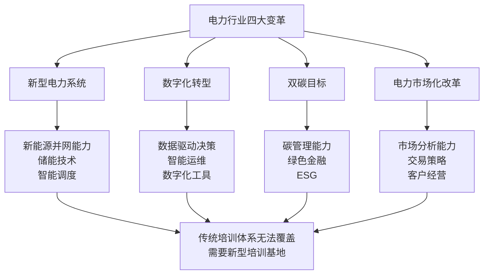
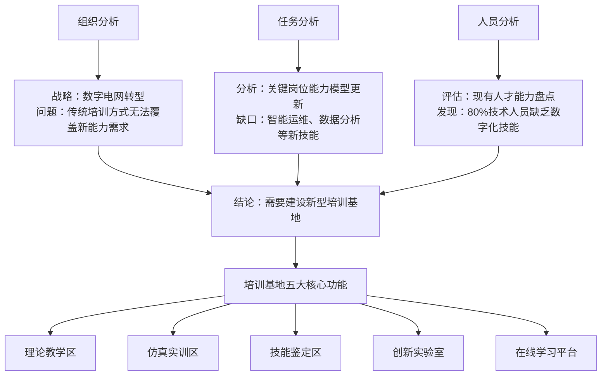
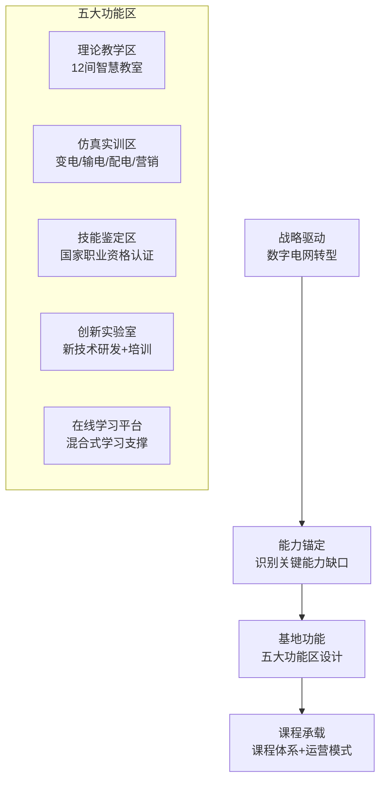
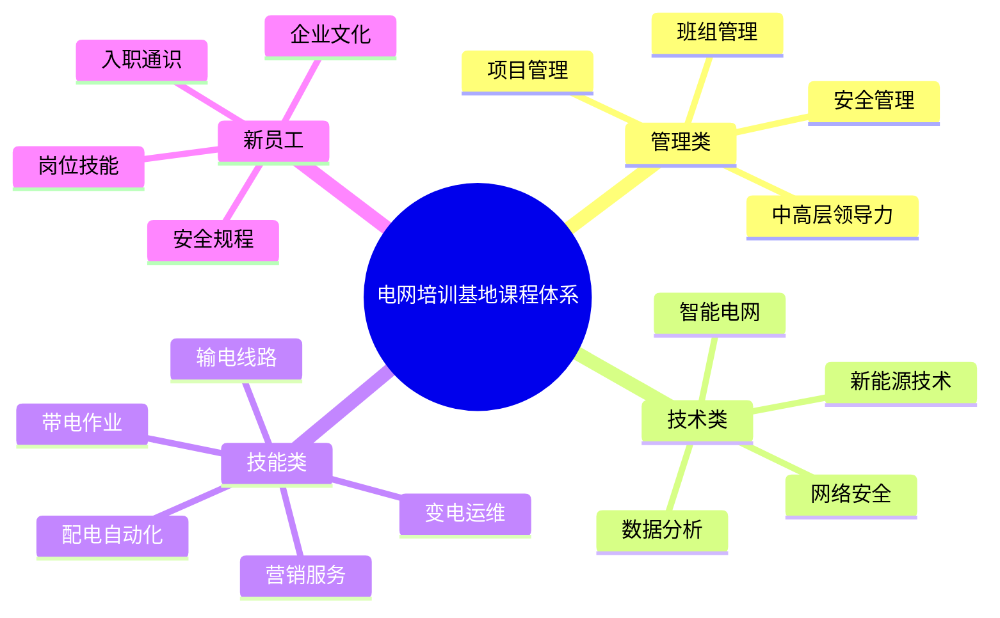
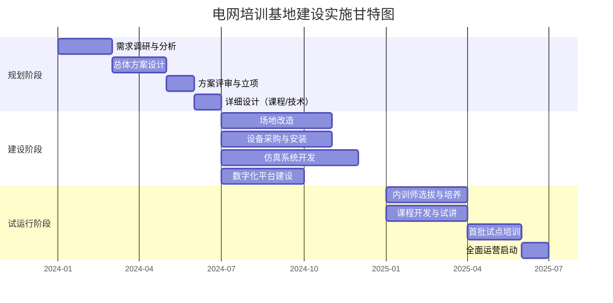

# 案例：电网培训基地复盘

## 一、项目背景：为什么电网需要培训基地？

### 行业战略背景

电网行业正处于深刻的变革期：新型电力系统建设、数字化转型、双碳目标、电力市场化改革——四大变革叠加，对电网人才的能力要求发生了根本性变化。



> [!abstract] 核心洞察
> 电网培训基地项目的本质不是「建一个培训场地」，而是**构建一个支撑战略转型的人才培养基础设施**。从战略需求出发，而非从培训功能出发——这是本项目最核心的设计逻辑。

### 项目基本信息

| 维度 | 内容 |
|------|------|
| **项目名称** | 省级电网公司综合培训基地建设 |
| **项目周期** | 18个月（规划6个月 + 建设12个月） |
| **项目目标** | 建成覆盖「管理+技术+技能」三类人才的省级培训基地，年培训能力5000人次 |
| **项目投资** | 约XXX万元（含场地改造、设备采购、系统建设） |
| **我的角色** | 培训方案设计负责人，负责需求分析、课程体系设计、运营模式设计 |

---

## 二、需求分析：从战略需求出发

### 为什么必须建培训基地？（而非继续用现有培训方式）

我使用了**三层次TNA**方法进行需求分析：



**关键需求发现**：

| 需求维度 | 传统培训的局限 | 培训基地的解决方案 |
|----------|---------------|-------------------|
| **实操训练** | 只有理论课，缺少真实设备操作 | 1:1仿真实训环境，涵盖变电、输电、配电、营销四大专业 |
| **新技术培训** | 缺乏数字化、智能化培训内容 | 创新实验室：智能电网、AI巡检、大数据分析 |
| **技能认证** | 认证依赖外部机构，效率低 | 自建技能鉴定中心，实现「培训-考核-认证」一体化 |
| **规模覆盖** | 每年只能培训2000人次 | 年培训能力5000人次，覆盖全省 |
| **培训质量** | 依赖个别讲师，质量不稳定 | 标准化课程体系 + 内训师团队 + 数字化学习平台 |

---

## 三、方案设计：用了什么模型和方法论

### 设计理念

培训基地的设计遵循**「战略驱动→能力锚定→基地功能→课程承载」**四层逻辑：



### 核心方法论应用

| 方法论 | 如何应用 | 具体体现 |
|--------|----------|----------|
| **ADDIE模型** | 课程体系设计 | 分析（岗位能力模型）→ 设计（课程大纲）→ 开发（课件/教材）→ 实施（培训交付）→ 评估（考核认证） |
| **70-20-10法则** | 培训方式设计 | 70%仿真实训（在岗实践）+ 20%导师带教（社交学习）+ 10%理论授课（正式学习） |
| **柯氏四级评估** | 效果评估设计 | L1满意度（每期问卷）、L2学习（技能考核）、L3行为（返岗后6个月绩效追踪）、L4结果（事故率、运维效率等业务指标） |
| **混合式学习** | 线上线下融合 | 线上：理论预习+知识考试；线下：仿真实训+技能考核；社群：技术交流社区+导师答疑 |

### 课程体系设计



---

## 四、实施过程：关键节点



### 关键里程碑

| 时间节点 | 关键事件 | 产出 | 关键决策 |
|----------|----------|------|----------|
| **M1-M2** | 需求调研完成 | 需求调研报告、能力缺口分析 | 确认培训基地五大功能定位 |
| **M3-M4** | 总体方案设计完成 | 培训基地建设方案、课程体系框架 | 确认「仿真实训」为核心差异化优势 |
| **M5-M6** | 方案评审通过 | 立项批复、预算批复 | 确认分阶段建设（先核心功能区，再扩展） |
| **M7-M12** | 建设施工完成 | 场地改造、设备安装、系统上线 | 关键风险：设备采购延期，应急预案启动 |
| **M13-M15** | 内训师培养完成 | 30位认证内训师、50门标准化课程 | 确认内训师激励机制（课时费+评优） |
| **M16-M18** | 试运行+全面运营 | 首批培训完成、运营SOP | 正式运营启动，年培训目标5000人次 |

---

## 五、效果评估：数据与反馈

### 核心指标达成情况

| 指标 | 目标值 | 实际值 | 达成情况 |
|------|--------|--------|----------|
| 年培训能力 | 5000人次 | 5200人次 | 超额达成 |
| 培训覆盖率（关键岗位） | 80% | 85% | 超额达成 |
| 学员满意度（NPS） | 50 | 62 | 超额达成 |
| 技能认证通过率 | 90% | 92% | 超额达成 |
| 仿真实训占比 | 60% | 65% | 超额达成 |
| 内训师授课占比 | 70% | 75% | 超额达成 |

### 定性反馈

> [!example] 学员反馈精选
> 「以前培训就是听老师讲，回去还是不会操作。现在在仿真设备上练了三天，回去就能上手。」——变电运维学员
>
> 「创新实验室让我第一次接触到了AI巡检，这是以前想都不敢想的。」——输电线路学员

> [!example] 业务方反馈
> 「新员工上岗时间从4周缩短到2周，培训基地的仿真训练功不可没。」——运维部主任
>
> 「培训基地的课程体系很实用，我们部门的技术短板都覆盖到了。」——营销部主任

---

## 六、个人反思：如果重来，我会怎么做

### 做得好的地方

1. **从战略出发**：培训基地的设计逻辑是从电网战略转型需求出发，而非从培训功能出发。这让我在向领导汇报时，用的是「业务语言」而非「培训语言」，获得了高度认可。
2. **仿真训练为核心**：抓住了电力行业「实操为王」的特点，将仿真实训作为核心差异化优势，这是培训基地区别于传统培训的最大亮点。
3. **干系人管理**：在项目初期就建立了与业务部门的定期沟通机制，确保培训基地的设计始终对齐业务需求。

### 可以改进的地方

| 改进点 | 当时的做法 | 如果重来 |
|--------|-----------|----------|
| **数字化平台** | 将数字化平台作为「配套」来建设，优先级较低 | 将数字化平台与培训基地同步规划，实现「线上+线下」一体化 |
| **内训师培养** | 在建设后期才开始培养内训师，导致试运行时师资不足 | 在项目启动时就启动内训师选拔和培养，与建设同步进行 |
| **用户参与** | 设计方案主要由专家组完成，一线员工参与较晚 | 在设计阶段就引入一线员工参与，让使用者参与设计 |
| **数据体系** | 数据采集和分析体系在运营后才开始搭建 | 在建设阶段就预埋数据采集点，确保运营时有完整的数据基线 |
| **AI应用** | 当时没有考虑AI应用 | 现在会考虑引入AI陪练（模拟故障处理场景）、AI知识库（智能问答） |

### 核心方法论提炼

通过这个项目，我提炼了一套「战略驱动型培训体系建设方法论」：

```
战略解读 → 能力缺口识别 → 培训基础设施设计 → 课程体系搭建 → 运营模式设计 → 持续迭代
```

这套方法论不限于电网行业，适用于任何「从战略出发建设培训体系」的场景。

---

## 七、面试应用

### 如何使用这个案例

> [!tip] 面试中讲述这个案例的黄金结构
> **1. 背景（30秒）**：「电网行业正处于数字化转型期，传统培训方式无法覆盖新能力需求……」
> **2. 我的角色（15秒）**：「我作为培训方案设计负责人，负责需求分析、课程体系设计和运营模式设计……」
> **3. 核心挑战（30秒）**：「最大的挑战不是'建一个培训场地'，而是'如何确保培训基地真正支撑战略转型'……」
> **4. 我的做法（2分钟）**：按「需求分析→方案设计→实施过程→效果评估」展开，重点讲战略驱动的设计逻辑
> **5. 结果与反思（45秒）**：量化成果 + 如果重来会怎么做

### 面试中可能被追问的问题

| 追问 | 你的回答要点 |
|------|-------------|
| 「这个项目最大的挑战是什么？」 | 最大的挑战是平衡「理想方案」和「现实约束」。比如预算有限，各专业都想建自己的实训室，我通过「需求优先级评估矩阵」说服大家分期建设。 |
| 「你在这个项目中的角色是什么？你具体做了什么？」 | 我是培训方案设计负责人，不是项目经理。我具体负责：需求调研、课程体系设计、功能区域规划、运营模式设计。我推动的关键决策是：将「仿真实训」作为核心定位。 |
| 「如果预算被砍一半，你会怎么做？」 | 我会优先保证核心仿真实训区（因为这是差异化价值），缩减理论教学区（可以与其他培训共享），延迟创新实验室建设（二期再做）。 |
| 「你怎么衡量这个项目的成功？」 | 我用四个维度：规模（年培训人次）、质量（满意度NPS+认证通过率）、效率（人均培训成本）、业务影响（新员工上岗时间缩短）。 |

---

## 关联笔记

- [[01_培训与人才发展理论基础]] — 项目中使用的ADDIE、70-20-10、柯氏四级等模型
- [[02_培训需求分析TNA]] — 三层次TNA在项目中的实践
- [[03-HR人事/培训与人才发展/05-培训运营/16_培训项目全流程管理]] — 大型培训项目的全流程管理
- [[03-HR人事/培训与人才发展/05-培训运营/17_数字化学习平台]] — 培训基地的数字化平台建设
- [[03-HR人事/培训与人才发展/05-培训运营/18_培训数据分析]] — 培训基地的数据指标与效果评估
- [[03-HR人事/培训与人才发展/07-面试实战/22_面试常见问题]] — 面试中如何讲述这个案例
- [[03-HR人事/培训与人才发展/07-面试实战/24_案例：从零搭建培训体系]] — 培训体系搭建的另一种思路（从0到1）
- 电网公司项目知识库 — 关联到已有电网项目文档