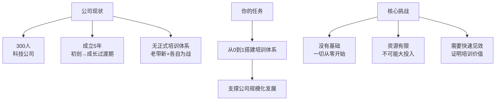
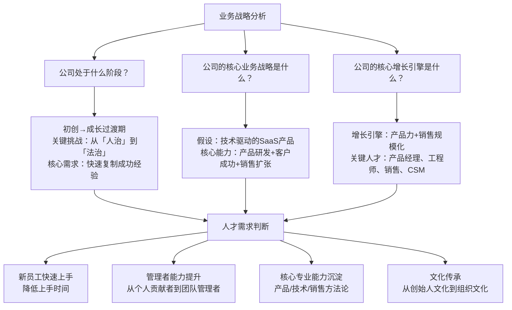
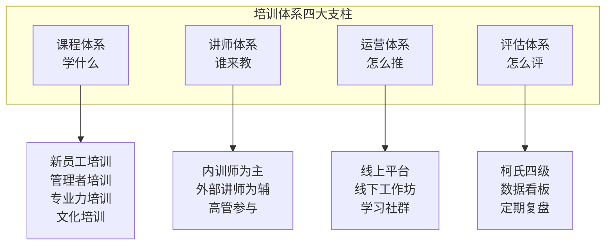
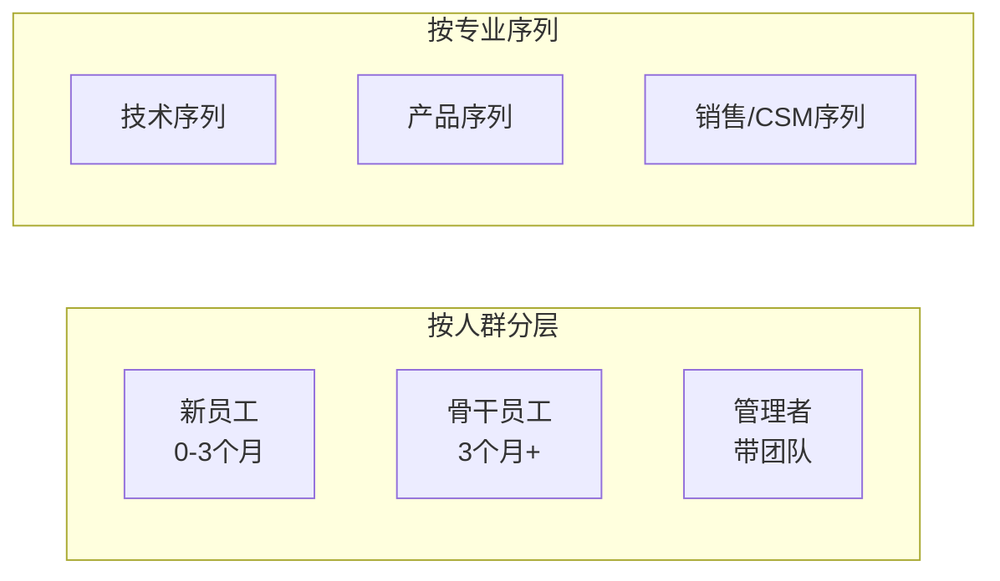
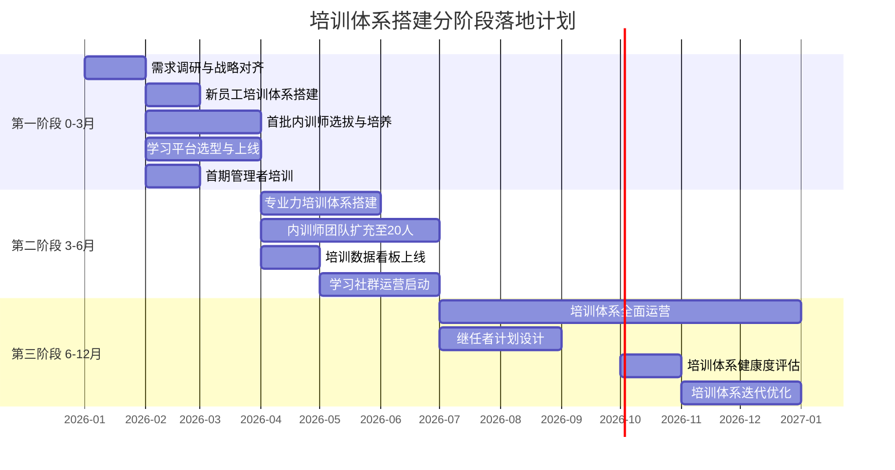

# 案例：从零搭建培训体系

## 一、场景设定

> [!abstract] 假设场景
> 你加入了一家300人的科技公司，担任培训负责人。公司成立5年，正处于从「初创期」向「成长期」过渡的关键阶段。公司之前没有正式的培训体系，培训主要靠「老带新」和「部门各自为战」。
>
> **你的任务**：从0到1搭建培训体系。
>
> 这是面试中非常高频的假设题，面试官通过这道题考察你的**系统性思维**和**战略落地能力**。



---

## 二、战略分析：先理解业务，再设计培训

> [!important] 核心原则
> 从零搭建培训体系，第一步不是「设计课程」，而是「理解战略」。培训是为战略服务的，不理解战略就设计培训，大概率是「自嗨」。

### 战略分析框架



### 战略分析输出：四大培训需求

| 需求 | 优先级 | 业务影响 | 紧迫性 |
|------|--------|----------|--------|
| **新员工快速上手** | P0 | 直接影响团队扩张速度 | 高（每月入职10-20人） |
| **管理者能力提升** | P0 | 影响团队效能和员工留存 | 高（新任管理者占比高） |
| **核心专业能力沉淀** | P1 | 影响产品/技术/销售竞争力 | 中 |
| **文化传承** | P1 | 影响组织凝聚力和员工留存 | 中 |

---

## 三、培训体系设计：课程/讲师/运营/评估

### 体系全景图



### 课程体系设计（三横三纵）



**课程体系详细设计**：

| 人群 | 必修课 | 选修课 | 学习方式 | 评估方式 |
|------|--------|--------|----------|----------|
| **新员工** | 企业文化、产品知识、制度流程、岗位技能 | 行业知识、工具使用 | 集中培训3天 + 30天在岗实践 + 导师辅导 | 入职30天考试 + 导师评价 |
| **骨干-技术** | 代码规范、系统设计、技术分享 | 新技术学习、开源贡献 | 技术分享会 + 在线课程 + 项目实战 | Code Review + 技术评审 |
| **骨干-产品** | 需求分析、PRD撰写、数据分析、用户研究 | 技术基础、商业思维、项目管理 | 案例研讨 + 实操练习 + 导师辅导 | 需求文档评审 + 数据分析考试 |
| **骨干-销售** | 产品知识、销售方法论、客户管理 | 行业知识、谈判技巧 | 情景演练 + AI陪练 + 标杆分享 | 销售认证 + 业绩数据 |
| **管理者** | 管理基本功、绩效管理、团队建设、招聘面试 | 战略思维、财务管理、领导力 | 管理培训 + 案例研讨 + 行动学习 | 360度反馈 + 团队绩效 |

### 讲师体系设计

**讲师来源策略**：

| 讲师类型 | 占比 | 承担课程 | 激励机制 |
|----------|------|----------|----------|
| **内训师（业务骨干）** | 60% | 岗位技能、专业方法、实操演练 | 课时费 + 年度评优 + 内训师积分可兑换外部学习机会 |
| **高管讲师** | 20% | 企业文化、战略分享、管理经验 | 荣誉激励 + 高管身份认同 |
| **外部讲师** | 20% | 专业深度课程、行业前沿 | 按次采购 + 长期合作框架 |

**内训师培养路径**：

```
选拔（业务TOP 20%+分享意愿）→ TTT培训（课程设计+授课技巧）→ 试讲评估 → 正式认证 → 持续赋能
```

### 运营体系设计

| 运营维度 | 策略 | 具体做法 |
|----------|------|----------|
| **宣传推广** | 价值驱动+上级联动 | 培训前：发布「为什么参加」的预热内容；培训中：每日发布学员精彩分享；培训后：发布学员成长故事 |
| **学习社群** | 互助+竞争+归属 | 建立学习社群（按人群/专业），定期组织分享会、学习打卡、优秀学员评选 |
| **平台运营** | 内容+数据+体验 | 选择轻量级学习平台（如企微/飞书+轻量LMS），逐步积累内容，用数据驱动运营 |
| **制度保障** | 培训与晋升/绩效关联 | 关键岗位晋升需完成指定培训；管理者晋升需通过管理培训认证 |

### 评估体系设计

| 评估层级 | 评估内容 | 评估方法 | 评估频率 |
|----------|----------|----------|----------|
| **L1 反应层** | 学员满意度 | 课后问卷（NPS+评分） | 每期培训 |
| **L2 学习层** | 知识/技能掌握 | 考试、实操考核、认证 | 每期培训 |
| **L3 行为层** | 行为改变 | 上级评价、360度反馈 | 培训后1-3个月 |
| **L4 结果层** | 业务结果 | 新员工上手时间、管理者团队绩效、销售达标率 | 每季度 |

---

## 四、分阶段落地计划



### 第一阶段：0-3个月（快速见效，建立信任）

| 维度 | 目标 | 关键动作 |
|------|------|----------|
| **战略对齐** | 与CEO/业务负责人对齐培训策略 | 访谈CEO+各业务负责人，了解战略方向和培训期望 |
| **新员工培训** | 建立标准化新员工培训流程 | 设计3天集中培训+30天在岗实践计划，首月覆盖所有新入职员工 |
| **管理者培训** | 完成首期管理者基础培训 | 面向新任管理者，设计「管理基本功」课程，每月1次 |
| **内训师启动** | 选拔首批10位内训师 | 从业务骨干中选拔，完成TTT培训，开始承担授课 |
| **平台上线** | 学习平台上线并运营 | 选择轻量级平台，快速上线，承载课程和考试 |

**第一阶段成功指标**：
- 新员工培训覆盖率100%，满意度NPS > 50
- 首期管理者培训完成，满意度NPS > 60
- 学习平台上线，月度活跃率 > 60%

### 第二阶段：3-6个月（扩展覆盖，深化体系）

| 维度 | 目标 | 关键动作 |
|------|------|----------|
| **专业力培训** | 搭建技术/产品/销售三大专业序列课程 | 与业务负责人合作，梳理各序列核心能力，开发首批专业课程 |
| **内训师扩充** | 内训师团队扩充至20人 | 继续选拔培养，建立内训师社区和激励机制 |
| **数据看板** | 上线培训数据看板 | 建立培训数据指标体系，月度输出培训数据报告 |
| **学习社群** | 启动学习社群运营 | 建立技术/产品/销售学习社群，组织分享和学习活动 |

**第二阶段成功指标**：
- 专业力培训覆盖关键岗位80%以上
- 内训师团队20人，授课占比 > 60%
- 培训数据看板上线，月度数据报告输出

### 第三阶段：6-12个月（体系成熟，持续进化）

| 维度 | 目标 | 关键动作 |
|------|------|----------|
| **全面运营** | 培训体系进入常态化运营 | 新员工/管理者/专业力三大培训线稳定运行 |
| **继任者计划** | 设计关键岗位继任者计划 | 识别关键岗位，完成人才盘点，制定继任者培养计划 |
| **健康度评估** | 完成首次培训体系健康度评估 | 从战略对齐度、覆盖完整度、执行有效性、资源充足性、持续进化力五个维度评估 |
| **迭代优化** | 基于评估结果优化培训体系 | 调整课程内容、优化运营方式、升级平台功能 |

**第三阶段成功指标**：
- 培训体系健康度评分 > 80分
- 继任者计划覆盖TOP 10关键岗位
- 内训师授课占比 > 70%
- 培训NPS > 60

---

## 五、预算与ROI预估

### 预算预估（年度）

| 预算项目 | 金额（万元） | 占比 | 说明 |
|----------|-------------|------|------|
| **学习平台** | 10-15 | 15% | SaaS平台年费（300人规模） |
| **外部讲师/课程** | 15-20 | 25% | 专业课程采购、外部讲师费 |
| **内训师激励** | 8-10 | 10% | 课时费、评优奖金、外部学习机会 |
| **培训活动** | 15-20 | 25% | 线下培训场地、物料、差旅 |
| **内容开发** | 5-8 | 10% | 课件制作、视频录制、微课开发 |
| **团队人力** | 10-15 | 15% | 培训团队（2-3人）人力成本 |
| **合计** | **63-88** | 100% | 约占公司营收的1-2%（科技公司合理范围） |

> [!tip] 预算策略
> 第一年预算偏重「建立基础」（平台+内容），第二年起外部采购占比下降，内训师占比上升，整体预算趋于稳定。ROI主要体现在：新员工上手时间缩短（节省隐性成本）、管理者能力提升（提升团队效能）、关键人才留存（降低招聘成本）。

### ROI预估

| 收益维度 | 计算方法 | 预估年收益 |
|----------|----------|-----------|
| **新员工上手时间缩短** | 从4周缩短到2周，节省2周人力成本 × 年入职人数 | 约30-50万 |
| **管理者效能提升** | 团队绩效提升5-10% × 管理者的团队规模 | 约50-100万 |
| **关键人才留存** | 降低关键岗位离职率2-3% × 替换成本 | 约20-40万 |
| **知识沉淀** | 减少重复犯错和重复沟通成本 | 难以量化 |
| **合计** | — | **100-190万/年** |

**ROI = (100-190) / (63-88) ≈ 150%-250%**

---

## 六、面试应用

### 如何使用这个案例

> [!tip] 面试中讲述这个案例的黄金结构
> **1. 战略分析（1分钟）**：「首先我会理解公司的战略和阶段。300人的科技公司处于成长期，核心挑战是从'人治'到'法治'，培训的核心价值是快速复制成功经验……」
> **2. 体系设计（2分钟）**：「基于战略分析，我识别出四大培训需求：新员工快速上手（P0）、管理者能力提升（P0）、核心专业能力沉淀（P1）、文化传承（P1）。据此设计'三横三纵'课程体系……」
> **3. 分阶段落地（1.5分钟）**：「我采用分阶段策略：0-3月快速见效建立信任（新员工+管理者培训），3-6月扩展覆盖（专业力+内训师扩充），6-12月体系成熟（全面运营+继任者计划）……」
> **4. 预算与ROI（30秒）**：「年度预算约63-88万，ROI预估150%-250%，主要体现在新员工上手时间缩短和管理者效能提升……」

### 面试中可能被追问的问题

| 追问 | 你的回答要点 |
|------|-------------|
| 「为什么第一阶段先做新员工培训和管理者培训？」 | 因为这两个是「最小可行培训体系」——新员工培训直接支撑团队扩张，管理者培训影响面最大（一个管理者影响一个团队）。先做这两件事，能最快证明培训价值。 |
| 「如果CEO说'培训没用'，你怎么说服他？」 | 我不会用「培训很重要」来说服，而是用「业务结果」说服。比如我会说：「我们新员工上手时间平均4周，通过标准化培训可以缩短到2周，每年节省约30-50万隐性成本。我先做一个试点，如果3个月后没效果，我们调整。」 |
| 「如果预算只有你预估的一半，你怎么做？」 | 第一，砍外部采购，激活内训师（从10人快速扩展到20人）；第二，砍线下活动，用线上+社群替代；第三，聚焦P0需求（新员工+管理者），P1需求（专业力）推迟到第二阶段。 |
| 「你怎么评估这个培训体系是否成功？」 | 我用四个维度：覆盖（关键岗位培训覆盖率）、质量（NPS+行为改变率）、效率（人均培训成本）、业务影响（新员工上手时间、管理者团队绩效）。每季度输出培训体系健康度报告。 |
| 「如果一年后你离开，这个体系还能持续运转吗？」 | 能。因为这个体系的核心是「机制」而非「个人」。我设计了标准化流程（SOP）、内训师激励机制、课程更新机制、数据看板自动化。这些机制不依赖某个人，只要有团队执行就能运转。 |

---

## 关联笔记

- [[01_培训与人才发展理论基础]] — 培训体系搭建的理论基础
- [[02_培训需求分析TNA]] — 三层次TNA在体系搭建中的应用
- [[03-HR人事/培训与人才发展/05-培训运营/16_培训项目全流程管理]] — 培训项目管理方法论
- [[03-HR人事/培训与人才发展/05-培训运营/17_数字化学习平台]] — 学习平台选型与运营
- [[03-HR人事/培训与人才发展/05-培训运营/18_培训数据分析]] — 培训数据看板与指标设计
- [[03-HR人事/培训与人才发展/06-前沿趋势/19_AI在培训中的应用]] — 在培训体系中融入AI能力
- [[03-HR人事/培训与人才发展/07-面试实战/22_面试常见问题]] — 培训体系搭建类面试题
- [[03-HR人事/培训与人才发展/07-面试实战/23_案例：电网培训基地复盘]] — 培训体系建设的另一种思路（大型项目）