# 培训与人才发展知识库 — 建设方案

> [!abstract] 目标
> 系统学习人力资源中「培训与人才发展」（Training & Development, T&D）的核心知识，支撑 COE / TD 岗位面试，并与已有项目经验（电网培训基地）形成闭环。

---

## 一、总体设计思路

| 维度 | 说明 |
|---|---|
| **定位** | 面试导向 + 知识体系化，不追求学术完备，追求「能讲清楚 + 能结合案例」 |
| **结构** | 七模块 + 一个 MOC 中枢，自上而下：战略→理论→体系→运营→趋势→面试 |
| **核心视角** | **战略 + 人力 + AI**：不只会做 T&D，还能讲清楚「为什么在这个阶段做这个」 |
| **关联** | 与已有「电网公司项目知识库」中的培训基地经验打通 |
| **特色** | 融入 HR+AI 视角，覆盖 AI 在培训中的落地场景 |

> [!important] 核心差异化
> 市面上大部分 T&D 知识库只讲「怎么做」。本知识库的独特价值在于：**从企业战略出发，理解不同发展阶段的人才策略差异**，再落地到具体方法论。这恰好是「战略+人力」复合背景的面试核心竞争力。

---

## 二、模块规划

```mermaid
flowchart TD
    MOC[📚 MOC 中枢] --> S[🏛️ 战略视角]
    MOC --> A[🧠 核心理论]
    MOC --> B[🏗️ 培训体系]
    MOC --> C[🌱 人才发展]
    MOC --> D[⚙️ 培训运营]
    MOC --> E[🔮 前沿趋势]
    MOC --> F[🎯 面试实战]

    S --> S1["01 企业生命周期与人才战略"]
    S --> S2["02 战略人力资源与人才供应链"]
    S --> S3["03 不同战略下的人才发展策略"]

    S -.->|"为什么做"| A
    S -.->|"为什么做"| B
    S -.->|"为什么做"| C

    A --> A1["04 成人学习理论"]
    A --> A2["05 70-20-10 法则"]
    A --> A3["06 柯氏四级评估"]
    A --> A4["07 ADDIE 教学设计模型"]

    B --> B1["08 培训需求分析 TNA"]
    B --> B2["09 课程体系搭建"]
    B --> B3["10 内训师队伍建设"]
    B --> B4["11 培训预算与 ROI"]

    C --> C1["12 人才盘点九宫格"]
    C --> C2["13 继任者计划"]
    C --> C3["14 IDP 个人发展计划"]
    C --> C4["15 轮岗与导师制"]

    D --> D1["16 培训项目全流程管理"]
    D --> D2["17 数字化学习平台"]
    D --> D3["18 培训数据分析"]

    E --> E1["19 AI 在培训中的应用"]
    E --> E2["20 微学习与移动学习"]
    E --> E3["21 游戏化学习设计"]

    F --> F1["22 面试常见问题"]
    F --> F2["23 案例：电网培训基地复盘"]
    F --> F3["24 案例：从零搭建培训体系"]
```



---

## 三、详细文档清单

### 模块〇：🏛️ 战略视角（3 篇）— 新增

> 回答「为什么做人才发展」的先决问题。培训不是 HR 的自嗨，而是企业战略的落地工具。

| 编号 | 笔记标题 | 核心内容 | 面试价值 |
|---|---|---|---|
| 01 | 企业生命周期与人才战略 | 伊查克·爱迪思企业生命周期理论（创业→成长→成熟→衰退/再生），每个阶段的人才痛点、培训重点、组织能力要求。举例：初创期重「多面手培养」vs 成熟期重「继任与干部梯队」 | ⭐⭐⭐ 差异化亮点 |
| 02 | 战略人力资源与人才供应链 | 战略人力资源模型（SHRM）、人才供应链 vs 传统招聘思维、人才供应链四环节（预测→储备→培养→补给）、make or buy 决策。举例：电网行业为什么必须「make」（内部培养）而非「buy」（外部挖人） | ⭐⭐⭐ |
| 03 | 不同战略下的人才发展策略 | 波特竞争战略（成本领先/差异化/聚焦）→对应的人才策略；不同业务战略（扩张/收缩/转型/多元化）→培训体系设计差异。举例：某企业从传统业务转型数字化，培训如何支撑转型 | ⭐⭐⭐ |

### 模块一：🧠 核心理论（4 篇）

| 编号 | 笔记标题 | 核心内容 | 面试价值 |
|---|---|---|---|
| 04 | 成人学习理论 | 诺尔斯成人学习六原则、经验学习圈（Kolb）、行为主义/认知主义/建构主义对比 | ⭐⭐⭐ 必考 |
| 05 | 70-20-10 法则 | 模型定义、落地场景、常见误区、与培训体系设计的关系 | ⭐⭐⭐ 必考 |
| 06 | 柯氏四级评估 | 反应层→学习层→行为层→结果层，每层评估方法、ROI 计算 | ⭐⭐⭐ 必考 |
| 07 | ADDIE 教学设计模型 | 分析→设计→开发→实施→评估，五阶段实操要点、与其他模型对比（SAM、敏捷） | ⭐⭐ |

### 模块二：🏗️ 培训体系（4 篇）

| 编号 | 笔记标题 | 核心内容 | 面试价值 |
|---|---|---|---|
| 08 | 培训需求分析 TNA | 组织分析→任务分析→人员分析，需求调研方法（访谈/问卷/绩效数据）、差距分析。**战略关联**：不同阶段的 TNA 重点不同（初创期看业务缺口，成熟期看能力溢价） | ⭐⭐⭐ |
| 09 | 课程体系搭建 | 岗前/在岗/晋阶三阶段、通用力/专业力/领导力三支柱、课程开发流程 | ⭐⭐⭐ |
| 10 | 内训师队伍建设 | 选拔标准、TTT 培养、激励与保留、内训师 vs 外聘讲师决策 | ⭐⭐ |
| 11 | 培训预算与 ROI | 预算编制方法、人均培训成本、ROI 计算（含举例）、培训价值论证。**战略关联**：经济下行期如何论证培训预算的合理性 | ⭐⭐⭐ |

### 模块三：🌱 人才发展（4 篇）

| 编号 | 笔记标题 | 核心内容 | 面试价值 |
|---|---|---|---|
| 12 | 人才盘点九宫格 | 绩效×潜力矩阵、盘点流程、校准会、人才分类（明星/核心/问题/淘汰）。**战略关联**：盘点结果如何反馈到业务战略——哪些人支撑增长，哪些缺口需要外部补 | ⭐⭐⭐ 必考 |
| 13 | 继任者计划 | 关键岗位识别、继任池搭建、Ready Now / Ready Later / Ready Future。**战略关联**：企业扩张期 vs 稳定期，继任策略完全不同 | ⭐⭐⭐ |
| 14 | IDP 个人发展计划 | 制定四步法、SMART 目标、721 在 IDP 中的应用、跟踪与复盘 | ⭐⭐ |
| 15 | 轮岗与导师制 | 轮岗设计原则、导师选拔与匹配、Mentor vs Coach 区别 | ⭐⭐ |

### 模块四：⚙️ 培训运营（3 篇）

| 编号 | 笔记标题 | 核心内容 | 面试价值 |
|---|---|---|---|
| 16 | 培训项目全流程管理 | 立项→方案→宣传→实施→评估→结项，甘特图、风险预案、干系人管理 | ⭐⭐ |
| 17 | 数字化学习平台 | LMS/LXP 对比、主流平台（云学堂/魔学院/企业微信）、混合式学习设计 | ⭐⭐ |
| 18 | 培训数据分析 | 核心指标（覆盖率/完成率/满意度/转化率）、数据看板搭建、数据驱动优化 | ⭐⭐ |

### 模块五：🔮 前沿趋势（3 篇）

| 编号 | 笔记标题 | 核心内容 | 面试价值 |
|---|---|---|---|
| 19 | AI 在培训中的应用 | 智能推荐学习路径、AI 出题/AI 陪练、知识库问答、虚拟导师、效果预测 | ⭐⭐⭐ HR+AI 亮点 |
| 20 | 微学习与移动学习 | 碎片化学习设计、短视频/图文/问答卡片、推送策略 | ⭐⭐ |
| 21 | 游戏化学习设计 | PBL（积分/徽章/排行榜）、剧情化任务、即时反馈、适用场景与边界 | ⭐⭐ |

### 模块六：🎯 面试实战（3 篇）

| 编号 | 笔记标题 | 核心内容 | 面试价值 |
|---|---|---|---|
| 22 | 面试常见问题 | 30+ 高频面试题 + STAR 回答框架 + 参考答案。**含战略视角题目**（如：「如果公司要从传统业务转型，培训如何支撑？」） | ⭐⭐⭐ 核心 |
| 23 | 案例：电网培训基地复盘 | 基于已有项目经验，用战略→T&D 框架重新梳理、提炼亮点。**核心亮点**：从「电网行业战略需求」出发讲培训基地为什么这样设计 | ⭐⭐⭐ 差异化 |
| 24 | 案例：从零搭建培训体系 | 假设场景模拟：新公司/新业务线从 0 到 1 搭建培训体系。**含战略分析**：先判断公司处于什么阶段、业务战略是什么，再决定培训怎么搭 | ⭐⭐ |

---

## 四、知识体系层次图

```
┌─────────────────────────────────────────────────┐
│               🏛️ 战略视角（为什么做）              │
│   企业生命周期 · 人才供应链 · 战略-人才匹配        │
├─────────────────────────────────────────────────┤
│               🧠 核心理论（理论基础）              │
│   成人学习 · 70-20-10 · 柯氏评估 · ADDIE         │
├─────────────────────────────────────────────────┤
│         🏗️ 培训体系 + 🌱 人才发展（做什么）        │
│   TNA · 课程体系 · 内训师 · 预算                  │
│   九宫格 · 继任者 · IDP · 轮岗导师                │
├─────────────────────────────────────────────────┤
│            ⚙️ 培训运营 + 🔮 趋势（怎么做）         │
│   项目管理 · 数字化平台 · 数据分析                 │
│   AI应用 · 微学习 · 游戏化                        │
├─────────────────────────────────────────────────┤
│               🎯 面试实战（怎么说）                │
│   高频题 · 电网复盘 · 从零搭建                    │
└─────────────────────────────────────────────────┘
```

> [!tip] 面试中的战略视角
> 当面试官问「你怎么设计培训体系」时，一般候选人的回答从 TNA 开始。你的回答可以从「先看企业处于什么阶段、业务战略是什么」开始——这就是战略+人力复合背景的降维打击。

---

## 五、建设优先级

| 优先级 | 模块 | 篇数 | 理由 |
|---|---|---|---|
| **P0** | 战略视角 + 核心理论 + 面试实战 | 10 篇 | 面试最直接需要，战略视角是差异化核心 |
| **P1** | 培训体系 + 人才发展 | 8 篇 | 体系化知识，面试深度支撑 |
| **P2** | 培训运营 + 前沿趋势 | 6 篇 | 加分项，结合 HR+AI 亮点 |

---

## 六、与已有知识库的关联

| 已有知识 | 如何关联到本知识库 |
|---|---|
| 电网公司项目知识库 — 培训基地建设 | 作为「案例：电网培训基地复盘」的素材，用战略→T&D 框架重新解读 |
| 电网公司项目知识库 — 721 理论 | 直接关联到「05 70-20-10 法则」，补充实战视角 |
| 电网公司项目知识库 — 人才盘点 | 关联到「12 人才盘点九宫格」，已有实战经验 |
| 电网公司项目知识库 — 十五五趋势洞察 | 关联到「01 企业生命周期与人才战略」，电网行业处于什么阶段 |
| 人力资源 — HR AI 转型 | 关联到「19 AI 在培训中的应用」，拓展 HR+AI 场景 |
| 面试经历深挖 — 滴滴 COE | 如果涉及培训相关经历，可关联到面试实战 |

---

## 七、后续步骤

1. **确认方案**：是否增减模块 / 调整优先级
2. **开始建设**：按 P0 → P1 → P2 顺序逐篇撰写
3. **关联打通**：每篇完成时，在 MOC 中枢和已有项目知识库中添加双向链接

---

## 关联笔记

- [[电网公司项目知识库/00-项目总览]] — 培训基地项目全景
- [[人力资源/HR AI转型]] — AI + 人力资源转型