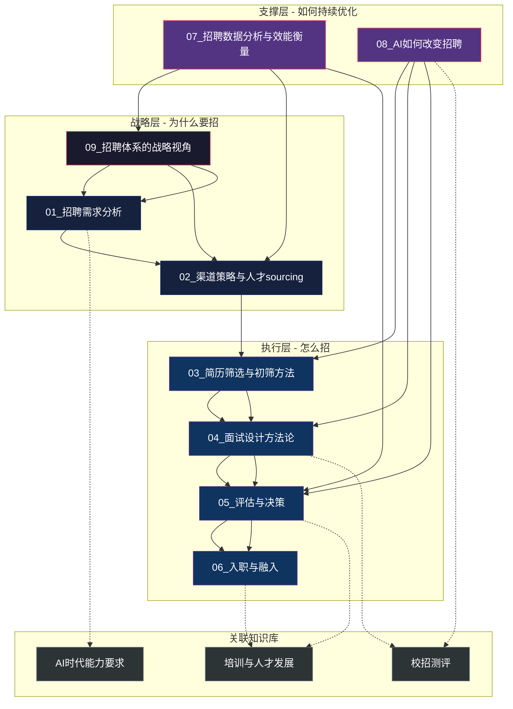
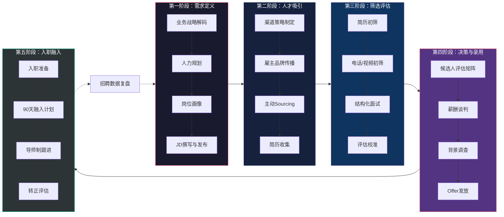
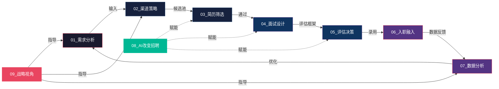
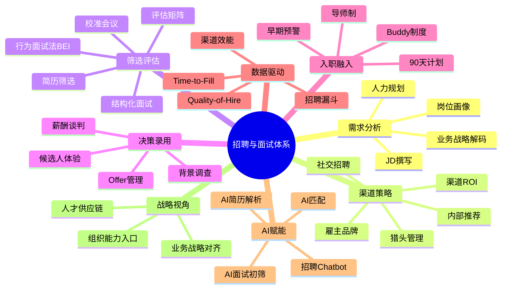
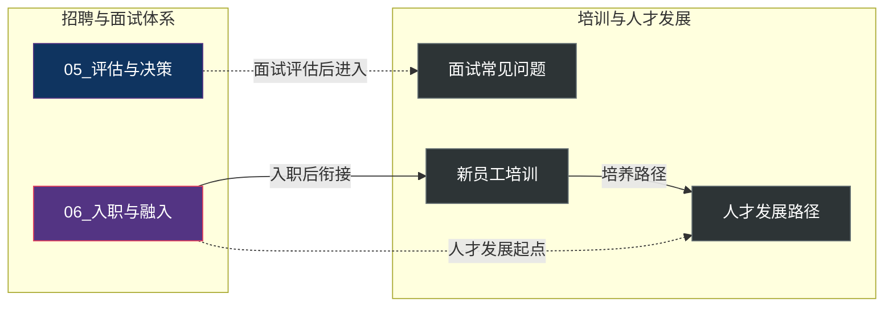
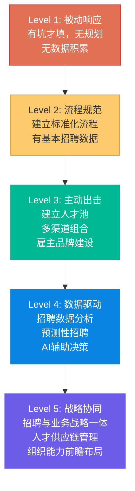
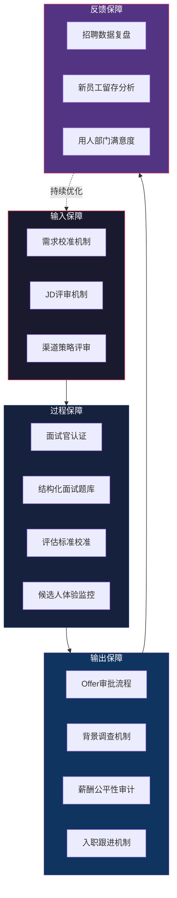

# 招聘与面试体系中枢

> [!abstract] 知识库定位
> 本知识库聚焦**招聘流程方法论**，从战略视角系统梳理从需求分析到入职的全流程。定位为"战略+HR+AI"三位一体的招聘体系知识库，面向HR从业者、业务管理者以及对招聘流程设计感兴趣的专业人士。
>
> **差异化定位**：本知识库不涉及面试回答技巧（已有 [[03-HR人事/培训与人才发展/培训与人才发展_知识库建设方案]] 覆盖）、不涉及行测与性格测评（已有 [[03-HR人事/校招测评/校招测评知识库_建设方案_v2]] 覆盖）、不涉及能力模型构建（已有 [[02-AI趋势与素养/AI时代能力要求/00_MOC_AI时代能力要求中枢]] 覆盖）。聚焦于招聘流程本身的方法论、工具与战略思考。

---

## 一、知识库导航图

---

## 二、招聘全流程概览

---

## 三、文档索引

### 3.1 核心文档清单

| 序号 | 文档 | 核心主题 | 关键问题 |
|:---:|------|----------|----------|
| 01 | [[03-HR人事/招聘与面试体系/01_招聘需求分析：从业务需求到JD]] | 需求定义 | 业务需要什么样的人？如何转化为JD？ |
| 02 | [[03-HR人事/招聘与面试体系/02_渠道策略与人才sourcing]] | 人才获取 | 从哪里找到合适的人？渠道如何组合？ |
| 03 | [[03-HR人事/招聘与面试体系/03_简历筛选与初筛方法]] | 初筛评估 | 如何高效筛选简历？AI筛选的边界在哪？ |
| 04 | [[03-HR人事/招聘与面试体系/04_面试设计方法论]] | 面试设计 | 如何设计一场有效的面试？ |
| 05 | [[03-HR人事/招聘与面试体系/05_评估与决策：从面试到Offer]] | 评估决策 | 如何做出准确的录用决策？ |
| 06 | [[03-HR人事/招聘与面试体系/06_入职与融入：从Offer到生产力]] | 入职融入 | 如何让新人快速产生价值？ |
| 07 | [[03-HR人事/招聘与面试体系/07_招聘数据分析与效能衡量]] | 数据驱动 | 如何用数据衡量和优化招聘？ |
| 08 | [[03-HR人事/招聘与面试体系/08_AI如何改变招聘]] | AI赋能 | AI如何重塑招聘流程？ |
| 09 | [[03-HR人事/招聘与面试体系/09_招聘体系的战略视角]] | 战略思考 | 招聘如何支撑企业战略？ |

### 3.2 文档间关联关系

---

## 四、推荐阅读路径

### 4.1 路径一：HR从业者速通路径（全面掌握）

适合：需要系统掌握招聘全流程的HR专业人员

> [!tip] 阅读建议
> 按序号顺序阅读，每篇预计阅读时间 15-20 分钟。建议在阅读 [[03-HR人事/招聘与面试体系/01_招聘需求分析：从业务需求到JD]] 时，结合 [[03-HR人事/招聘与面试体系/09_招聘体系的战略视角]] 进行交叉阅读，有助于建立战略思维框架。

### 4.2 路径二：业务管理者路径（快速上手）

适合：非HR背景的业务管理者，需要快速了解招聘核心方法论

1. **第一步**：[[03-HR人事/招聘与面试体系/09_招聘体系的战略视角]] —— 理解招聘的战略意义
2. **第二步**：[[03-HR人事/招聘与面试体系/01_招聘需求分析：从业务需求到JD]] —— 学会定义"要什么人"
3. **第三步**：[[03-HR人事/招聘与面试体系/04_面试设计方法论]] —— 掌握面试方法
4. **第四步**：[[03-HR人事/招聘与面试体系/05_评估与决策：从面试到Offer]] —— 学会做录用决策
5. **第五步**（选读）：[[03-HR人事/招聘与面试体系/06_入职与融入：从Offer到生产力]] —— 关注新人落地

### 4.3 路径三：招聘技术探索路径

适合：对招聘技术和AI应用感兴趣的从业者

1. **主线**：[[03-HR人事/招聘与面试体系/08_AI如何改变招聘]] —— 核心文档
2. **关联阅读**：[[03-HR人事/招聘与面试体系/03_简历筛选与初筛方法]] 中的 AI 简历筛选部分
3. **延伸阅读**：[[03-HR人事/招聘与面试体系/07_招聘数据分析与效能衡量]] 中的数据驱动方法
4. **外部关联**：[[03-HR人事/校招测评/校招测评知识库_建设方案_v2]] 中的 AI 面试技术原理

### 4.4 路径四：招聘效能优化路径

适合：希望用数据驱动招聘优化的团队负责人

1. **诊断**：[[03-HR人事/招聘与面试体系/07_招聘数据分析与效能衡量]] —— 了解招聘度量体系
2. **流程优化**：[[03-HR人事/招聘与面试体系/02_渠道策略与人才sourcing]] —— 优化渠道组合
3. **质量提升**：[[03-HR人事/招聘与面试体系/04_面试设计方法论]] —— 提升面试有效性
4. **转化优化**：[[03-HR人事/招聘与面试体系/05_评估与决策：从面试到Offer]] —— 提升 Offer 接受率
5. **留存优化**：[[03-HR人事/招聘与面试体系/06_入职与融入：从Offer到生产力]] —— 降低早期流失

---

## 五、核心概念索引

### 5.1 招聘全流程核心概念

### 5.2 关键概念速查表

| 概念 | 英文 | 所在文档 | 简要说明 |
|------|------|----------|----------|
| 结构化面试 | Structured Interview | [[03-HR人事/招聘与面试体系/04_面试设计方法论]] | 基于岗位能力要求的标准化面试流程 |
| 行为面试法 | BEI (Behavioral Event Interview) | [[03-HR人事/招聘与面试体系/04_面试设计方法论]] | 通过过去行为预测未来表现的面试方法 |
| 招聘漏斗 | Recruitment Funnel | [[03-HR人事/招聘与面试体系/07_招聘数据分析与效能衡量]] | 从候选人触达到最终入职的转化分析 |
| 岗位画像 | Job Portrait | [[03-HR人事/招聘与面试体系/01_招聘需求分析：从业务需求到JD]] | 对目标岗位的全面描述，超越传统JD |
| 雇主品牌 | Employer Branding | [[03-HR人事/招聘与面试体系/02_渠道策略与人才sourcing]] | 企业作为雇主的市场形象和吸引力 |
| 候选人体验 | Candidate Experience | [[03-HR人事/招聘与面试体系/05_评估与决策：从面试到Offer]] [[03-HR人事/招聘与面试体系/06_入职与融入：从Offer到生产力]] | 候选人在招聘全流程中的感受 |
| 人才供应链 | Talent Supply Chain | [[03-HR人事/招聘与面试体系/09_招聘体系的战略视角]] | 将人才管理类比为供应链管理的系统性思维 |
| Quality-of-Hire | 招聘质量 | [[03-HR人事/招聘与面试体系/07_招聘数据分析与效能衡量]] | 衡量招聘效果的核心指标 |
| 招聘Chatbot | Recruitment Chatbot | [[03-HR人事/招聘与面试体系/08_AI如何改变招聘]] | 用于招聘流程自动化的AI对话系统 |
| 校准会议 | Calibration Meeting | [[03-HR人事/招聘与面试体系/05_评估与决策：从面试到Offer]] | 多位面试官统一评估标准的会议 |

---

## 六、与已有知识库的交叉引用

### 6.1 与 [[03-HR人事/培训与人才发展/培训与人才发展_知识库建设方案]] 的关系

> [!note] 边界说明
> [[03-HR人事/培训与人才发展/培训与人才发展_知识库建设方案]] 中的"面试常见问题"侧重**面试者的回答技巧**，本库的 [[03-HR人事/招聘与面试体系/04_面试设计方法论]] 侧重**面试官如何设计面试**。两者互补，形成面试的全视角。

### 6.2 与 [[03-HR人事/校招测评/校招测评知识库_建设方案_v2]] 的关系

| 维度 | 本库 | [[03-HR人事/校招测评/校招测评知识库_建设方案_v2]] |
|------|------|--------------|
| 行测 | 不涉及 | 核心内容 |
| 性格测评 | 不涉及 | 核心内容 |
| AI面试技术原理 | 不涉及（[[03-HR人事/招聘与面试体系/08_AI如何改变招聘]] 聚焦流程应用） | 核心内容 |
| 简历筛选方法 | [[03-HR人事/招聘与面试体系/03_简历筛选与初筛方法]] 覆盖 | 不涉及 |
| 面试设计 | [[03-HR人事/招聘与面试体系/04_面试设计方法论]] 覆盖 | 不涉及 |

### 6.3 与 [[02-AI趋势与素养/AI时代能力要求/00_MOC_AI时代能力要求中枢]] 的关系

> [!important] 关键关联
> [[02-AI趋势与素养/AI时代能力要求/00_MOC_AI时代能力要求中枢]] 定义了"需要什么样的人"（能力模型），本库的 [[03-HR人事/招聘与面试体系/01_招聘需求分析：从业务需求到JD]] 解决"如何将能力要求转化为可执行的招聘需求"。二者形成"能力定义→需求转化"的闭环。

---

## 七、招聘体系核心模型

### 7.1 招聘成熟度模型

> [!question] 自测问题
> 你所在组织的招聘体系处于哪个成熟度级别？阅读本库后，你认为需要优先提升哪个维度？

### 7.2 招聘全流程质量保障体系

---

## 八、常见问题速查

> [!faq] Q1: 招聘流程中最容易被忽视的环节是什么？
> **入职融入**。很多组织将 Offer 发放视为招聘终点，但实际上入职后的前90天是决定新员工留存的关键窗口。详见 [[03-HR人事/招聘与面试体系/06_入职与融入：从Offer到生产力]]。

> [!faq] Q2: 如何判断一个招聘渠道是否值得继续投入？
> 从渠道效能（成本/简历量/面试转化率/最终入职率）和候选人质量（入职后绩效/留存率）两个维度综合评估。详见 [[03-HR人事/招聘与面试体系/07_招聘数据分析与效能衡量]] 和 [[03-HR人事/招聘与面试体系/02_渠道策略与人才sourcing]]。

> [!faq] Q3: 结构化面试和行为面试法（BEI）有什么区别？
> 结构化面试是方法论框架（统一的流程、标准、评分），BEI 是结构化面试中最常用的具体技术（通过STAR法追问过去行为）。详见 [[03-HR人事/招聘与面试体系/04_面试设计方法论]]。

> [!faq] Q4: AI 会取代招聘人员吗？
> AI 不会完全取代，但会重新定义招聘人员的角色——从"筛选者"变为"决策者"和"体验设计师"。详见 [[03-HR人事/招聘与面试体系/08_AI如何改变招聘]]。

> [!faq] Q5: 初创公司和成熟公司的招聘策略有什么本质区别？
> 初创公司需要"多面手"和"创业者心态"，成熟公司需要"专家"和"体系化思维"。详见 [[03-HR人事/招聘与面试体系/09_招聘体系的战略视角]] 和 [[03-HR人事/招聘与面试体系/01_招聘需求分析：从业务需求到JD]]。

> [!faq] Q6: 如何衡量招聘质量（Quality-of-Hire）？
> 招聘质量是综合性指标，通常包括新员工绩效评分、留存率、文化匹配度、用人部门满意度等维度。详见 [[03-HR人事/招聘与面试体系/07_招聘数据分析与效能衡量]]。

---

## 九、工具与模板索引

本知识库各文档中嵌入了以下实用工具和模板：

| 工具/模板 | 所在文档 | 用途 |
|-----------|----------|------|
| 岗位画像模板 | [[03-HR人事/招聘与面试体系/01_招聘需求分析：从业务需求到JD]] | 结构化描述岗位需求 |
| JD评审清单 | [[03-HR人事/招聘与面试体系/01_招聘需求分析：从业务需求到JD]] | JD发布前的质量检查 |
| 渠道ROI计算表 | [[03-HR人事/招聘与面试体系/02_渠道策略与人才sourcing]] | 渠道效能量化分析 |
| 简历筛选清单 | [[03-HR人事/招聘与面试体系/03_简历筛选与初筛方法]] | 结构化简历评估 |
| 面试评分表 | [[03-HR人事/招聘与面试体系/04_面试设计方法论]] | 标准化面试评分 |
| 面试官能力评估 | [[03-HR人事/招聘与面试体系/04_面试设计方法论]] | 面试官认证与培训 |
| 候选人评估矩阵 | [[03-HR人事/招聘与面试体系/05_评估与决策：从面试到Offer]] | 多维度候选人比较 |
| 薪酬谈判策略框架 | [[03-HR人事/招聘与面试体系/05_评估与决策：从面试到Offer]] | Offer谈判指导 |
| 90天融入计划模板 | [[03-HR人事/招聘与面试体系/06_入职与融入：从Offer到生产力]] | 新员工融入规划 |
| 招聘漏斗仪表盘 | [[03-HR人事/招聘与面试体系/07_招聘数据分析与效能衡量]] | 招聘数据可视化 |
| AI招聘工具评估矩阵 | [[03-HR人事/招聘与面试体系/08_AI如何改变招聘]] | AI工具选型参考 |
| 招聘战略对齐矩阵 | [[03-HR人事/招聘与面试体系/09_招聘体系的战略视角]] | 战略与招聘策略匹配 |

---

## 十、版本与更新日志

| 日期 | 版本 | 更新内容 |
|------|------|----------|
| 2026-07-27 | v1.0 | 初始版本，完成全部9篇内容文档 |

---

## 十一、使用建议

> [!tip] 如何使用本知识库
> 1. **建立全局认知**：先阅读本 MOC，了解知识库全貌
> 2. **选择阅读路径**：根据你的角色和需求，选择推荐的阅读路径
> 3. **交叉阅读**：利用文档间的 [[双向链接]] 进行交叉阅读，建立知识关联
> 4. **关联外部知识库**：适时查阅 [[03-HR人事/培训与人才发展/培训与人才发展_知识库建设方案]]、[[03-HR人事/校招测评/校招测评知识库_建设方案_v2]]、[[02-AI趋势与素养/AI时代能力要求/00_MOC_AI时代能力要求中枢]] 等关联知识库
> 5. **实践应用**：将文档中的模板和工具应用到实际工作中
> 6. **反馈迭代**：在实践中积累经验，持续优化招聘体系

> [!warning] 注意
> 本知识库中的所有方法论和工具均为通用框架，具体应用时需要结合组织实际情况进行适配。特别是在 AI 应用部分，技术发展迅速，建议定期更新相关内容。

---

> [!quote] 核心信念
> 招聘不是"填坑"，而是组织能力的入口。每一次招聘决策，都是对未来组织能力的一次投资。
>
> —— 摘自 [[03-HR人事/招聘与面试体系/09_招聘体系的战略视角]]

---

*本 MOC 由 招聘与面试体系 知识库维护，最后更新于 2026-07-27*