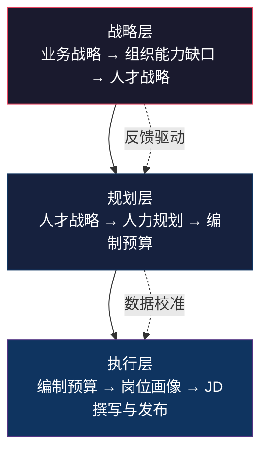
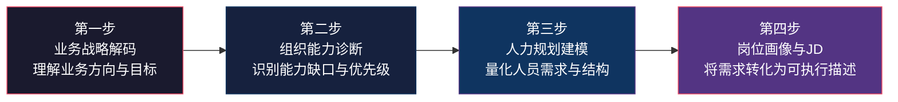
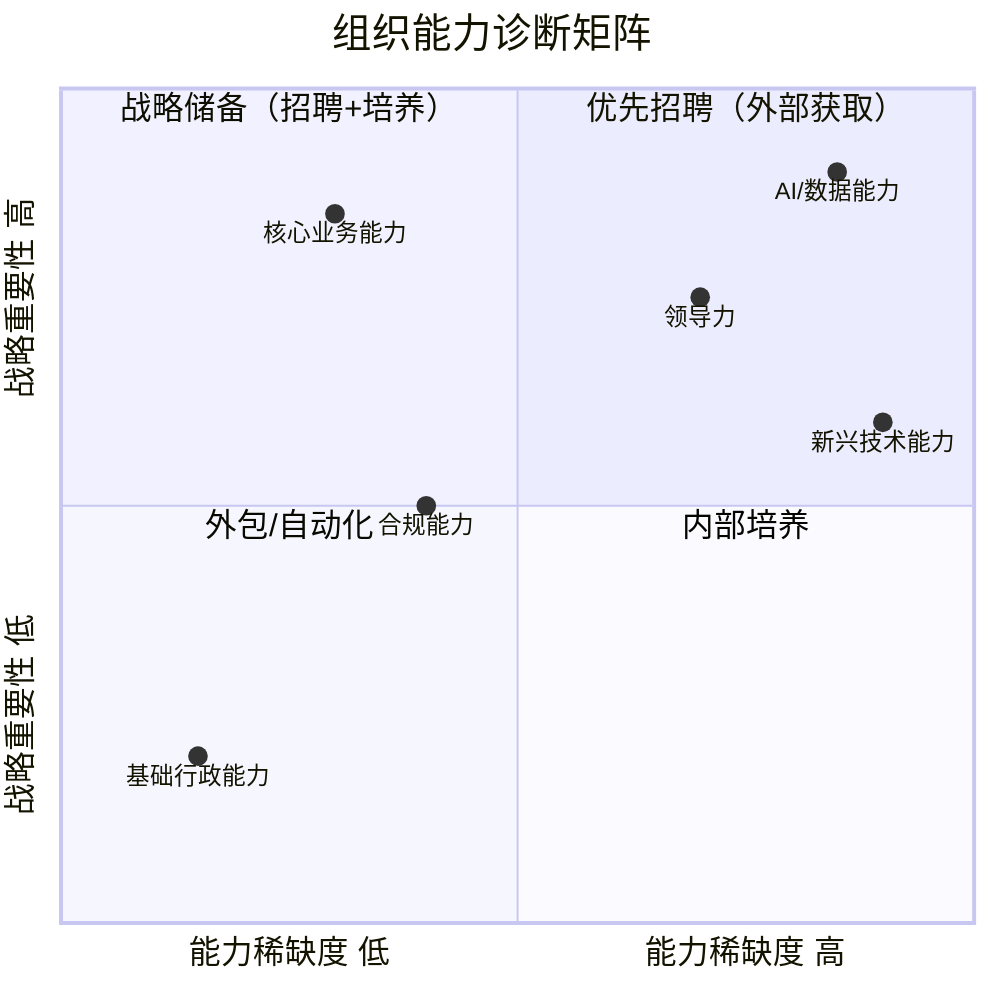
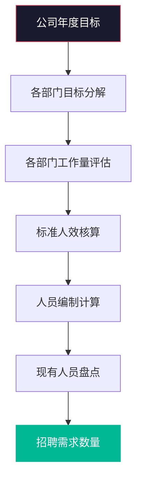
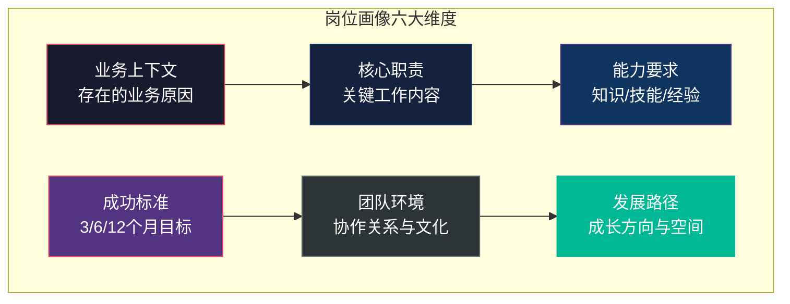
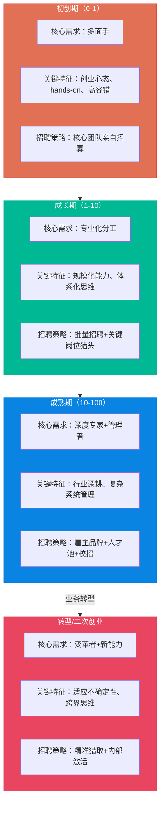
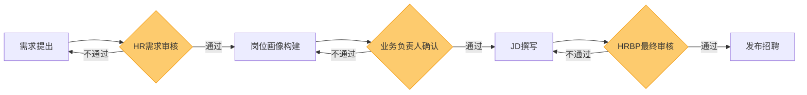

# 招聘需求分析：从业务需求到JD

> [!abstract] 核心问题
> 招聘的起点不是"发JD"，而是回答一个根本问题：**业务为什么需要这个人？** 本章从业务战略出发，系统梳理招聘需求分析的完整方法论，包括人力规划、岗位画像构建、JD撰写原则，以及不同发展阶段组织的需求差异。

---

## 一、招聘需求分析的核心框架

### 1.1 需求分析的三个层次



> [!important] 关键认知
> 很多组织的招聘需求分析停留在"执行层"——业务部门说"缺人"，HR就发JD。真正的需求分析必须向上追溯到**战略层**和**规划层**，否则招聘就是在"填坑"而非"构建能力"。

### 1.2 需求分析四步法



---

## 二、第一步：业务战略解码

### 2.1 业务战略与人才需求的映射关系

> [!note] 战略解码的核心问题
> 招聘需求分析的第一步不是问"要招几个人"，而是问：
> - 公司未来 1-3 年的战略方向是什么？
> - 为实现战略目标，组织需要构建哪些核心能力？
> - 当前组织在这些能力上存在哪些缺口？

| 业务战略类型 | 典型场景 | 人才需求特征 | 招聘策略要点 |
|:---|:---|:---|:---|
| 市场扩张 | 进入新市场/新领域 | 开拓型人才、本地化能力 | 优先招募有当地经验的人才 |
| 产品创新 | 新产品线/技术突破 | 创新型人才、技术深度 | 关注技术社区和学术圈 |
| 效率提升 | 降本增效/流程优化 | 优化型人才、运营能力 | 关注有成熟方法论的人才 |
| 组织转型 | 业务模式变革 | 变革型人才、跨界能力 | 关注有转型经验的人才 |
| 防守维持 | 核心业务稳定 | 稳健型人才、深度专业 | 关注行业深耕者 |

### 2.2 战略解码的实操工具

> [!tip] 战略解码五问
> 1. **方向问**：公司未来一年的三个核心战略目标是什么？
> 2. **能力问**：为实现这些目标，组织需要哪些关键能力？
> 3. **缺口问**：当前团队在这些能力上的最大缺口是什么？
> 4. **优先级问**：哪些缺口是"不补就会阻碍战略推进"的？
> 5. **方式问**：这些缺口应该通过招聘、内部培养还是外包来解决？

---

## 三、第二步：组织能力诊断

### 3.1 能力诊断矩阵



### 3.2 能力缺口的三种类型

| 缺口类型 | 特征 | 最佳解决方式 | 招聘时机 |
|:---|:---|:---|:---|
| **结构性缺口** | 组织当前不具备该能力，且短期内无法内部培养 | 外部招聘 | 立即启动 |
| **规模性缺口** | 组织具备该能力，但人力不足 | 招聘+内部培养并行 | 提前规划，分批到位 |
| **前瞻性缺口** | 当前不需要，但未来6-12个月将需要 | 先行储备或人才Mapping | 提前3-6个月启动 |

> [!warning] 常见误区
> 很多组织将所有缺口都当作"结构性缺口"来处理，直接走外部招聘。但实际上，**规模性缺口**可以通过内部培养和流程优化来解决一部分，**前瞻性缺口**则更需要提前布局而非紧急招聘。

---

## 四、第三步：人力规划建模

### 4.1 人力规划的核心方法

#### 4.1.1 自上而下法（Top-Down）



> [!example] 自上而下法示例
> 某SaaS公司年度营收目标增长50%，客单价不变，意味着客户数需增长50%。按当前每位客户成功经理（CSM）服务100个客户的标准，需要新增CSM数量 = （新增客户数 / 100）。如果考虑管理幅度，还需要增加CSM团队负责人。

#### 4.1.2 自下而上法（Bottom-Up）

- 各业务单元提交人员需求计划
- 汇总后由HR和财务审核
- 与公司战略和预算对齐

#### 4.1.3 对标法（Benchmarking）

- 参考行业标杆的配比（如：研发人员与产品经理的比例）
- 参考同规模公司的组织架构
- 注意：对标是参考而非模板，必须结合自身业务特性

### 4.2 人力规划的关键参数

| 参数 | 定义 | 常见取值参考 |
|:---|:---|:---|
| 人效比 | 人均营收/人均利润 | 视行业而定 |
| 管理幅度 | 一个管理者直接管理的下属数 | 5-12人（知识型） |
| 人员配比 | 不同职能间的人员比例 | 视业务模式而定 |
| 流失率 | 年度主动离职率 | 10%-20%（互联网行业） |
| 招聘周期 | 从需求确认到入职的时间 | 30-90天（视岗位级别） |

> [!tip] 人力规划公式
> **净招聘需求 = （目标编制 - 现有编制）+ 预计流失补充 + 战略储备需求**
>
> 其中：
> - 目标编制 = 基于业务目标核算的人员需求
> - 现有编制 = 当前在职人数
> - 预计流失 = 基于历史流失率的预测
> - 战略储备 = 为未来业务预埋的人才

---

## 五、第四步：岗位画像与JD撰写

### 5.1 岗位画像：超越传统JD

> [!important] 岗位画像 vs 传统JD
> 传统JD往往是一份"职责+要求"的清单，而**岗位画像**是对目标岗位的全面描述，包含：
> - **业务上下文**：这个岗位为什么存在？解决什么业务问题？
> - **成功画像**：怎样才算在这个岗位上做得好？
> - **团队协作关系**：与谁协作？汇报关系如何？
> - **发展路径**：这个岗位的未来发展方向是什么？

### 5.2 岗位画像模板



#### 岗位画像详细模板

**一、业务上下文**
- 岗位名称：
- 所属部门：
- 汇报关系：
- 岗位存在的业务原因（用一句话说清楚为什么需要这个人）：
- 当前团队面临的核心挑战：

**二、核心职责**
- 职责1（权重 %）：
- 职责2（权重 %）：
- 职责3（权重 %）：
- 职责4（权重 %）：

**三、能力要求**
- 必备知识/技能：
- 必备经验：
- 加分项：
- 不需要但常见的误解要求：

**四、成功标准**
- 入职3个月后的关键产出：
- 入职6个月后的关键产出：
- 入职12个月后的关键产出：

**五、团队环境**
- 团队规模与结构：
- 直接协作角色：
- 团队文化特征：
- 工作方式（远程/混合/现场）：

**六、发展路径**
- 该岗位的下一步发展方向：
- 组织能提供的成长资源：
- 该岗位在组织中的战略价值：

### 5.3 JD撰写原则

> [!important] JD撰写的黄金法则
> **JD不是复制粘贴模板，而是营销文案。** 好的JD不仅要描述"你要什么样的人"，更要传达"为什么值得加入"。

#### 5.3.1 JD撰写六原则

| 原则 | 错误做法 | 正确做法 |
|:---|:---|:---|
| **精准** | 罗列十几条要求，堆砌关键词 | 区分"必备"和"加分"，聚焦核心3-5条 |
| **诚实** | 夸大公司前景，隐瞒真实挑战 | 坦诚描述挑战，吸引真正匹配的人 |
| **吸引力** | 只写"需要你做什么" | 同时写"你能获得什么" |
| **差异化** | 千篇一律的JD模板 | 体现公司和团队的独特之处 |
| **结构化** | 大段文字堆砌 | 清晰分段，关键词突出 |
| **包容性** | 使用性别化/年龄化的语言 | 使用中性化、包容性的语言 |

#### 5.3.2 JD结构模板

```
【标题】岗位名称 + 一句话价值主张

【关于我们】2-3句话介绍公司/团队，突出差异化

【岗位价值】这个岗位为什么重要？解决什么问题？

【核心职责】3-5条核心职责，按重要性排序

【必备要求】3-5条必备要求，区分硬技能和软素质

【加分项】2-3条加分项

【我们能提供】薪酬范围、福利亮点、成长机会

【招聘流程】简述面试流程，管理候选人预期
```

### 5.4 JD评审清单

> [!tip] JD发布前自查清单
> - [ ] 岗位存在的业务原因是否清晰？
> - [ ] 核心职责是否不超过5条？
> - [ ] 必备要求是否区分了"硬技能"和"软素质"？
> - [ ] 是否存在"既要又要"的过度要求？
> - [ ] 是否包含了"我们能提供什么"？
> - [ ] 语言是否包容、中性？
> - [ ] 薪酬范围是否明确标注？
> - [ ] 是否避免了歧视性表述？
> - [ ] 是否与岗位画像保持一致？
> - [ ] 是否经过用人部门负责人确认？

---

## 六、不同发展阶段的招聘需求差异

### 6.1 发展阶段与人才需求矩阵



### 6.2 各阶段需求分析要点

| 维度 | 初创期 | 成长期 | 成熟期 | 转型期 |
|:---|:---|:---|:---|:---|
| 需求来源 | 创始人判断 | 业务扩张驱动 | 战略规划+补缺 | 战略转型驱动 |
| 规划精度 | 低（灵活调整） | 中（季度迭代） | 高（年度规划） | 中（快速迭代） |
| 岗位定义 | 模糊、边界宽 | 逐步清晰 | 明确、边界清晰 | 重新定义 |
| JD风格 | 强调使命和机会 | 强调成长和发展 | 强调专业和稳定 | 强调变革和挑战 |
| 能力要求 | 潜力>经验 | 经验+潜力并重 | 经验>潜力 | 适应力>经验 |
| 薪酬策略 | 股权为主 | 现金+股权 | 现金为主 | 灵活组合 |

> [!note] 关联阅读
> 关于不同发展阶段招聘策略的深度讨论，详见 [[03-HR人事/招聘与面试体系/09_招聘体系的战略视角]]。关于能力模型的定义，详见 [[02-AI趋势与素养/AI时代能力要求/00_MOC_AI时代能力要求中枢]]。

---

## 七、需求分析中的常见陷阱

### 7.1 六大常见陷阱

> [!warning] 陷阱一：复制粘贴式JD
> 直接从网上或竞品复制JD，不考虑自身业务实际情况。**后果**：招来的人"看起来都对，用起来都不对"。

> [!warning] 陷阱二：完美候选人综合症
> 要求候选人"既要...又要...还要..."，导致市场上几乎不存在匹配的人选。**后果**：岗位长期空缺，或入职后才发现要求不合理。

> [!warning] 陷阱三：业务部门"拍脑袋"要人
> 业务部门说"缺人"就招，没有经过系统的需求和能力分析。**后果**：招来的人无法解决真正的业务问题。

> [!warning] 陷阱四：忽视内部人才
> 所有缺口都走外部招聘，忽视内部有潜力的员工。**后果**：内部人才流失，外部新人融入成本高。

> [!warning] 陷阱五：需求分析只做一次
> 招聘过程中业务需求发生变化，但JD和评估标准未更新。**后果**：招聘方向和业务实际脱节。

> [!warning] 陷阱六：忽视软性要求
> JD只写硬技能，忽视文化匹配度和软素质。**后果**：技术能力强但不适应团队文化，早期流失。

### 7.2 需求分析的检视机制



---

## 八、需求分析的数据支持

### 8.1 需求分析需要的数据

| 数据类别 | 具体数据 | 来源 | 用途 |
|:---|:---|:---|:---|
| 业务数据 | 营收目标、增长率 | 财务/战略部门 | 人力规划建模 |
| 人效数据 | 人均产出、人效趋势 | HR系统 | 定编依据 |
| 流失数据 | 离职率、离职原因 | HR系统 | 流失预测 |
| 市场数据 | 人才供给、薪酬水平 | 招聘渠道/薪酬报告 | 可行性评估 |
| 历史数据 | 过往招聘周期、转化率 | 招聘系统 | 时间规划 |

### 8.2 需求分析的量化工具

> [!example] 招聘需求合理性评分卡
> 对每个招聘需求从以下维度打分（1-5分），总分低于15分需要重新审视：
>
> 1. **战略关联度**：该需求与公司战略目标的直接关联程度
> 2. **紧迫性**：如果不招聘，对业务的影响程度和时间窗口
> 3. **替代性**：是否可以通过内部调动、外包、流程优化等方式替代
> 4. **可执行性**：市场上是否存在足够的候选人，薪酬是否在预算范围内
> 5. **ROI预估**：预计该岗位的投入产出比

---

## 九、本章小结


> [!quote] 核心原则
> **好的招聘需求分析，是在"招人"之前先回答"为什么要招人"。** 只有把这个问题想清楚，后续的渠道选择、面试设计、评估决策才有根基。

---

## 关联阅读

- [[03-HR人事/招聘与面试体系/02_渠道策略与人才sourcing]] —— 需求明确后，如何找到合适的人
- [[03-HR人事/招聘与面试体系/09_招聘体系的战略视角]] —— 招聘需求与企业战略的深层关联
- [[03-HR人事/招聘与面试体系/07_招聘数据分析与效能衡量]] —— 用数据验证需求分析的准确性
- [[02-AI趋势与素养/AI时代能力要求/00_MOC_AI时代能力要求中枢]] —— 能力模型的定义与参考
- [[03-HR人事/招聘与面试体系/00_MOC_招聘与面试体系中枢]] —— 返回知识库中枢

---

*最后更新于 2026-07-27*