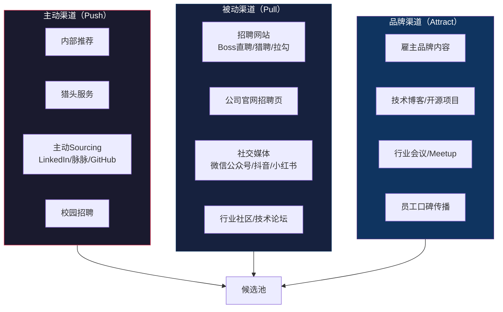
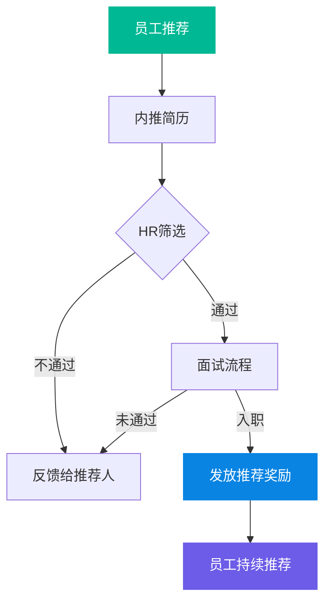
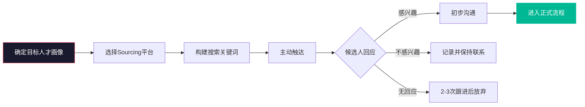
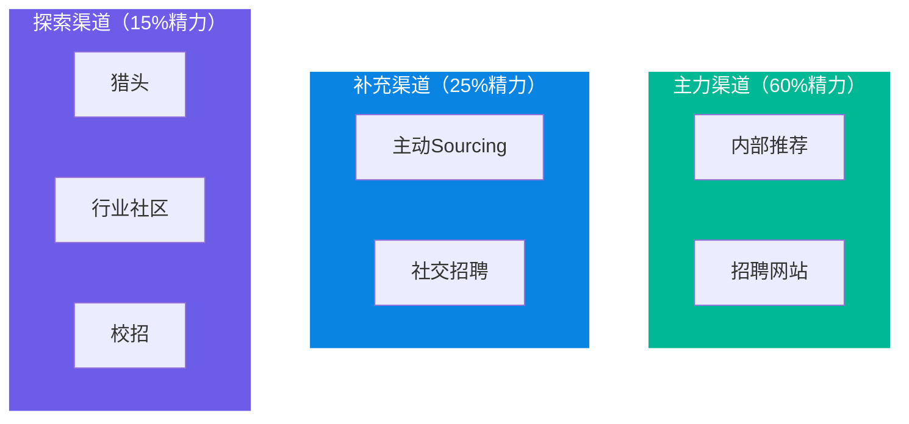
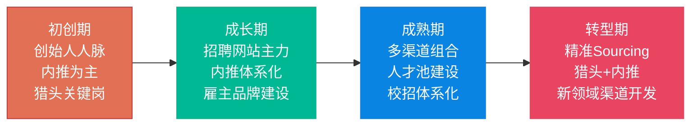
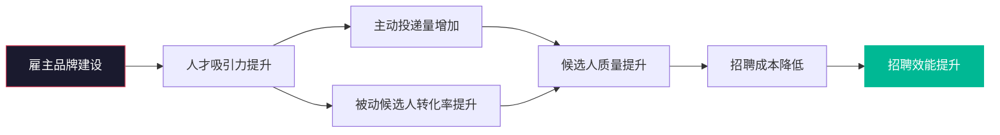
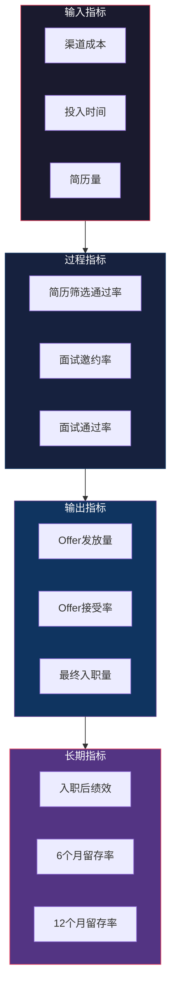
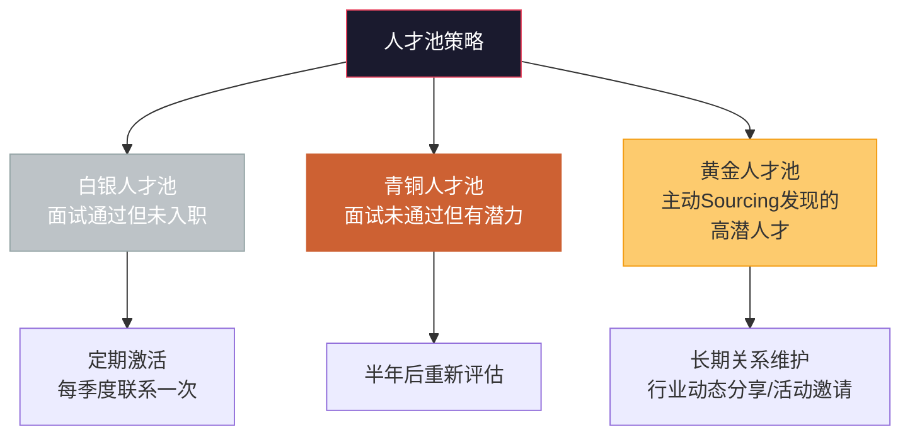
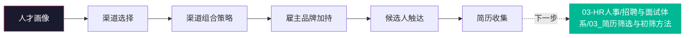

# 渠道策略与人才Sourcing

> [!abstract] 核心问题
> 需求明确之后，下一个关键问题是：**目标人才在哪里？如何高效触达？** 本章系统梳理招聘渠道的分类、对比、选择策略，主动Sourcing方法论，雇主品牌在人才吸引中的作用，以及渠道ROI分析框架。

---

## 一、招聘渠道全景图

### 1.1 渠道分类体系

### 1.2 渠道选择的战略框架

> [!important] 渠道选择的核心逻辑
> 渠道策略不是"所有渠道都铺"，而是基于**目标人才画像**和**渠道特性**做精准匹配。

---

## 二、主要招聘渠道深度对比

### 2.1 渠道全景对比表

| 维度 | 内部推荐 | 猎头 | 招聘网站 | LinkedIn/脉脉 | 校招 | 社交招聘 |
|:---|:---|:---|:---|:---|:---|:---|
| **适用岗位** | 全岗位 | 中高端/稀缺 | 中初级 | 中高级/专业 | 初级/管培 | 全岗位 |
| **单次成本** | 低（3K-10K奖励） | 高（年薪20-30%） | 中（套餐/按效果） | 中（会员费） | 中高 | 低（内容成本） |
| **候选人质量** | 中高 | 高 | 中 | 中高 | 中（潜力高） | 波动大 |
| **响应速度** | 中 | 快 | 快 | 中 | 慢（周期长） | 慢 |
| **被动候选人触达** | 中 | 高 | 低 | 高 | 低 | 中 |
| **文化匹配度** | 高 | 中 | 低 | 中 | 中 | 中 |
| **规模能力** | 中 | 低 | 高 | 中 | 高 | 高 |

### 2.2 内部推荐：最高ROI的渠道

> [!tip] 内推体系设计要点
> 1. **奖励设计**：分层奖励（不同岗位不同金额），分阶段发放（入职/转正各发一部分）
> 2. **降低门槛**：提供一键分享功能，简化推荐流程
> 3. **及时反馈**：推荐后48小时内反馈进展，尊重推荐人的付出
> 4. **文化营造**：将内推打造为"帮助朋友找到好工作"而非"赚外快"
> 5. **数据驱动**：分析内推转化率，优化推荐来源

> [!warning] 内推的潜在风险
> - **同质化风险**：员工倾向于推荐与自己相似的人，可能导致团队多样性下降
> - **关系干扰**：推荐人与被推荐人的关系可能影响管理决策
> - **期望落差**：推荐失败后的员工情绪管理

### 2.3 猎头服务：精准但昂贵

| 使用场景 | 不适合使用猎头的场景 |
|:---|:---|
| 稀缺岗位（市场上公开渠道找不到） | 初级岗位（招聘网站即可覆盖） |
| 高管岗位（保密性和精准度要求高） | 批量招聘（猎头不擅长规模化） |
| 紧急关键岗位（时间紧迫） | 候选人供给充足的岗位 |
| 新领域（内部缺乏判断力） | 内部有足够人才储备的岗位 |

> [!note] 猎头管理最佳实践
> 1. **精选合作伙伴**：2-3家深度合作，而非广撒网
> 2. **明确Brief**：提供详细的岗位画像和公司信息
> 3. **定期校准**：每周同步进展，校准方向
> 4. **评估标准**：不仅看推荐数量，更看面试转化率和入职留存率
> 5. **长期关系**：建立长期合作关系，猎头会主动为你储备人才

### 2.4 社交招聘与主动Sourcing

> [!tip] LinkedIn Sourcing 搜索技巧
> 1. **Boolean搜索**：使用 AND、OR、NOT 组合关键词
> 2. **行业关键词**：不只是岗位名称，还包括技能、工具、行业术语
> 3. **公司对标**：搜索目标公司/Target Company的现任或前任员工
> 4. **社群挖掘**：关注行业群组、技术社区中的活跃者
> 5. **二度人脉**：通过共同联系人建立信任桥梁

---

## 三、渠道策略设计

### 3.1 渠道组合策略

> [!important] 渠道组合原则
> 80/20法则：80%的精力投入到产出最高的20%渠道上。但需要定期评估渠道效能，动态调整组合。

### 3.2 不同岗位的渠道策略

| 岗位类型 | 主力渠道 | 补充渠道 | 不推荐渠道 |
|:---|:---|:---|:---|
| 高管 | 猎头、内推（高管圈） | LinkedIn Sourcing | 招聘网站 |
| 技术研发 | 内推、GitHub/技术社区 | 招聘网站、猎头 | 传统报纸/展会 |
| 产品/运营 | 招聘网站、内推 | LinkedIn、社交招聘 | 猎头 |
| 销售 | 招聘网站、内推 | 行业社群 | 猎头（除销售VP） |
| 职能 | 招聘网站、内推 | 社交招聘 | 猎头 |
| 校招/初级 | 校园招聘、招聘网站 | 内推、社交招聘 | 猎头 |

### 3.3 渠道策略的阶段性调整

---

## 四、雇主品牌在招聘中的作用

### 4.1 雇主品牌的价值链

> [!important] 雇主品牌的核心认知
> 雇主品牌不是"招聘文案"，而是**员工真实体验的外化**。当员工体验与对外宣传不匹配时，雇主品牌反而会成为负面资产。

### 4.2 雇主品牌建设矩阵

| 维度 | 具体行动 | 目标受众 | 衡量指标 |
|:---|:---|:---|:---|
| **内容层** | 技术博客、员工故事、文化视频 | 潜在候选人 | 阅读量、分享量 |
| **体验层** | 面试体验优化、候选人反馈机制 | 正在面试的候选人 | 候选人NPS |
| **社交层** | LinkedIn内容、员工社交分享 | 被动候选人 | 关注量、互动量 |
| **社区层** | 技术Meetup、开源项目、行业会议 | 行业人才 | 参与人数、人才触达 |
| **口碑层** | Glassdoor/看准网评分、员工口碑 | 所有潜在候选人 | 评分、正面评价比例 |

> [!example] 低成本雇主品牌建设
> 1. **员工故事系列**：让员工写/录"我在XX的一天"，真实展示工作体验
> 2. **技术博客**：技术团队分享技术实践，吸引同频工程师
> 3. **面试体验优化**：即使不录用，也提供有价值的反馈
> 4. **社交存在**：创始人和核心团队在社交平台的专业分享
> 5. **开源贡献**：通过开源项目展示技术实力和文化

---

## 五、渠道ROI分析

### 5.1 渠道效能评估模型

### 5.2 渠道ROI计算

> [!tip] 渠道ROI计算公式
>
> **单渠道ROI = （该渠道入职员工的年度贡献价值 - 渠道成本） / 渠道成本**
>
> 简化版（适用于快速评估）：
> **渠道效能指数 = 最终入职人数 / 渠道总成本**
>
> 综合版（考虑质量）：
> **渠道质量指数 = 入职后6个月绩效评级平均数 x 渠道效能指数**

### 5.3 渠道ROI分析模板

| 渠道 | 成本 | 简历量 | 面试量 | Offer量 | 入职量 | 6月留存 | 人均成本 | 质量评分 |
|:---|:---|:---|:---|:---|:---|:---|:---|:---|
| 内部推荐 | | | | | | | | |
| 猎头A | | | | | | | | |
| 猎头B | | | | | | | | |
| Boss直聘 | | | | | | | | |
| 猎聘 | | | | | | | | |
| LinkedIn | | | | | | | | |
| 校招 | | | | | | | | |
| 其他 | | | | | | | | |

> [!warning] ROI分析常见误区
> - **只看成本不看质量**：某些渠道入职成本低，但入职后绩效差、留存低
> - **只看短期不看长期**：校招初期成本高，但长期ROI可能最高
> - **忽视时间成本**：猎头虽然费用高，但节省的时间对关键岗位可能价值更大
> - **一刀切评估**：不同岗位的渠道效能差异巨大，需分类分析

---

## 六、人才池建设

### 6.1 人才池的战略价值

> [!important] 为什么需要人才池？
> 招聘最大的成本不是渠道费用，而是**"当需要时找不到人"**的机会成本。人才池的价值在于将"被动招聘"变为"主动储备"。

### 6.2 人才池建设方法论

> [!tip] 人才池运营要点
> 1. **分类管理**：按岗位、级别、活跃度分类
> 2. **定期激活**：每季度通过邮件/微信/LinkedIn触达一次
> 3. **有价值的内容**：不只是"我们有岗位"，而是分享行业洞察、公司动态
> 4. **系统支持**：使用ATS/CRM系统管理人才池
> 5. **度量效果**：追踪人才池到最终入职的转化率

---

## 七、本章小结

> [!quote] 核心原则
> **最好的渠道策略，是在目标人才出现需求之前，就已经建立了联系。** 渠道管理的终极目标不是"更快地找到人"，而是"让对的人主动找到你"。

---

## 关联阅读

- [[03-HR人事/招聘与面试体系/01_招聘需求分析：从业务需求到JD]] —— 渠道策略的前提：明确的目标人才画像
- [[03-HR人事/招聘与面试体系/03_简历筛选与初筛方法]] —— 候选人进入流程后的筛选方法
- [[03-HR人事/招聘与面试体系/07_招聘数据分析与效能衡量]] —— 渠道效能的量化分析
- [[03-HR人事/招聘与面试体系/09_招聘体系的战略视角]] —— 渠道策略与战略的协同
- [[03-HR人事/招聘与面试体系/08_AI如何改变招聘]] —— AI如何改变渠道策略和Sourcing
- [[03-HR人事/招聘与面试体系/00_MOC_招聘与面试体系中枢]] —— 返回知识库中枢

---

*最后更新于 2026-07-27*