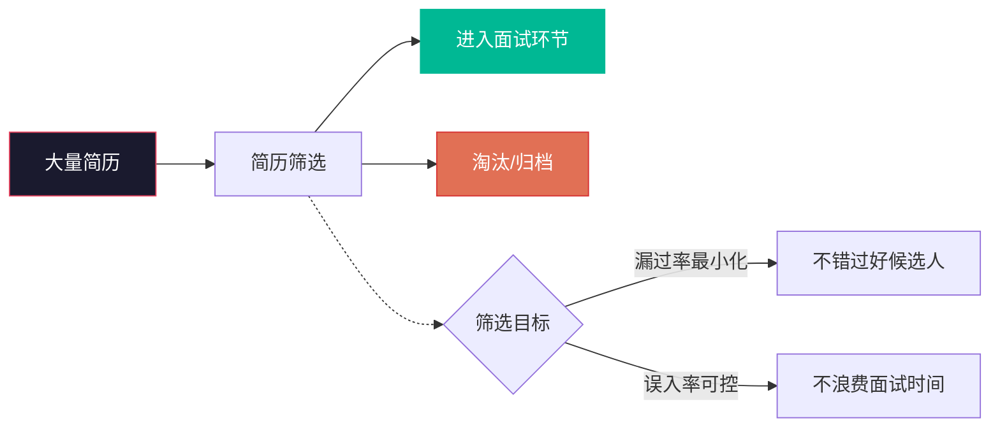
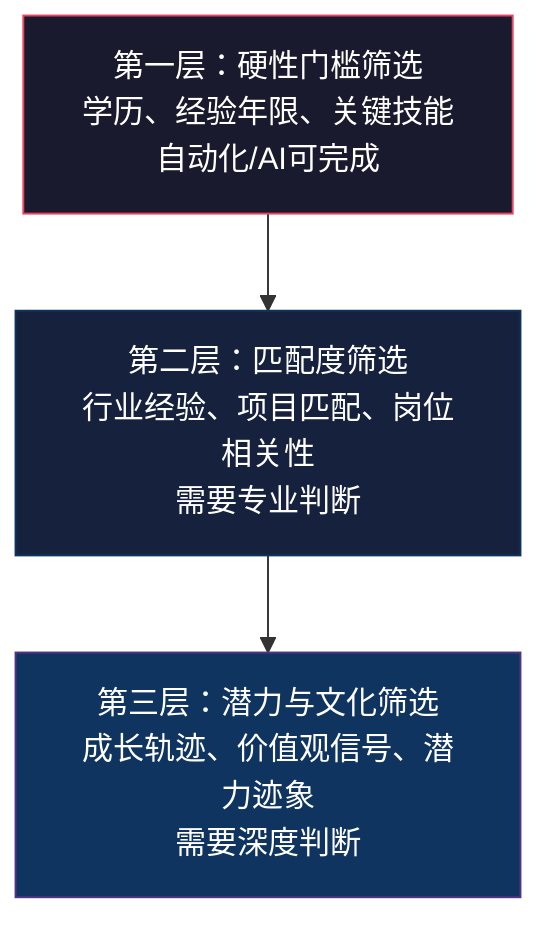
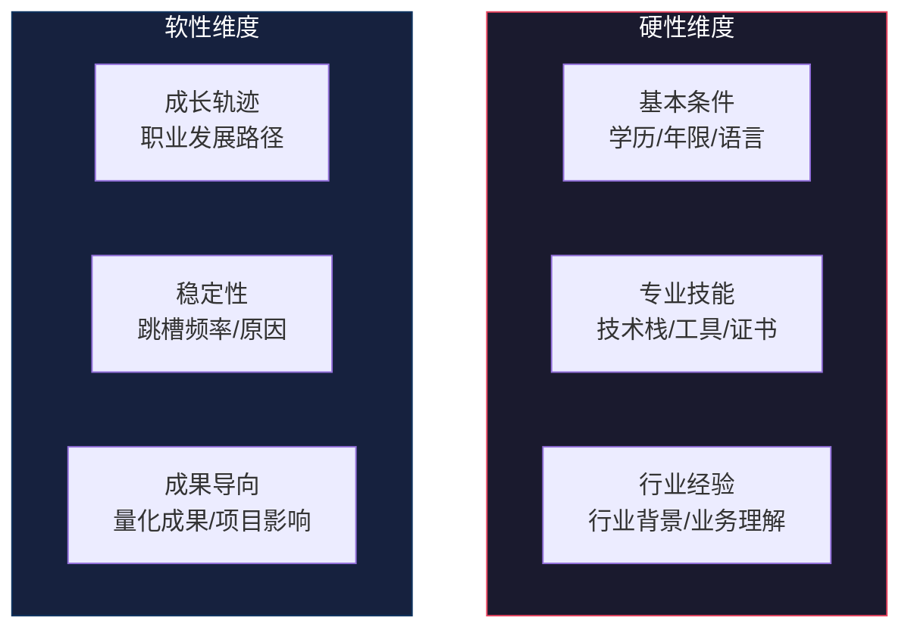
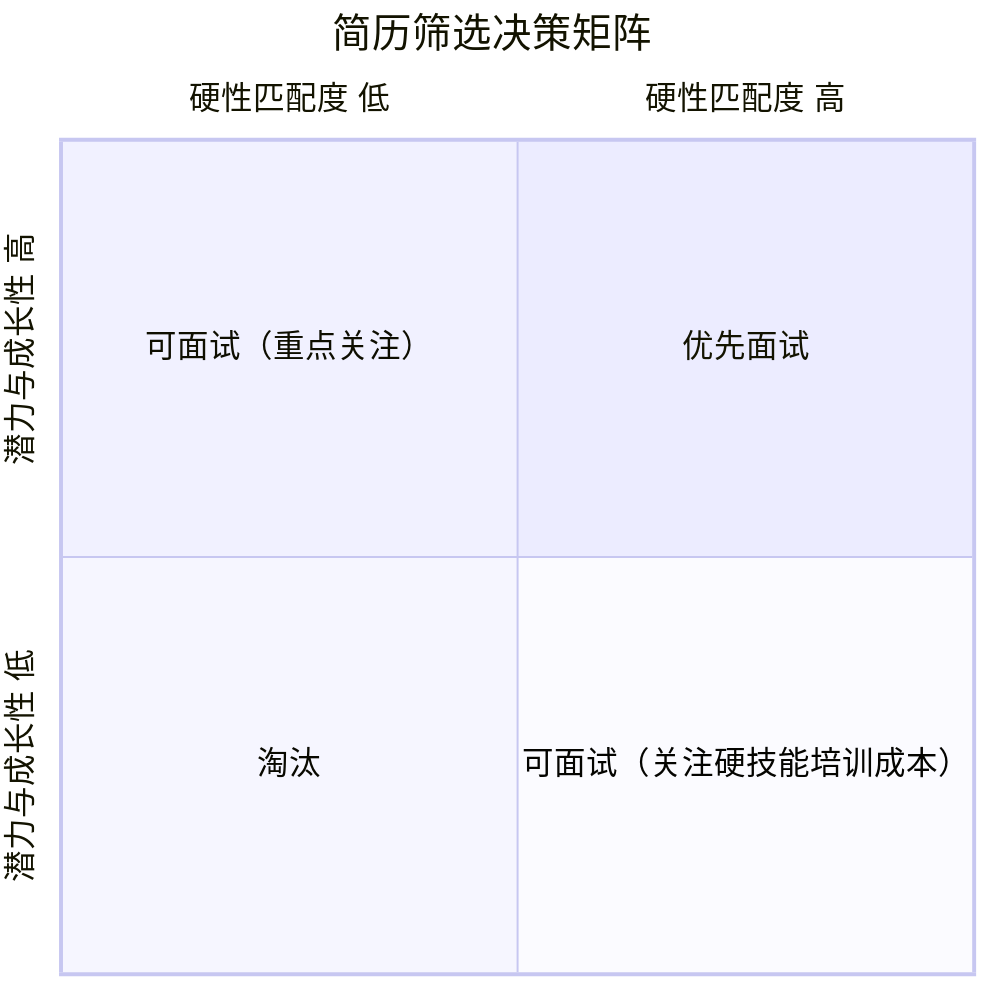
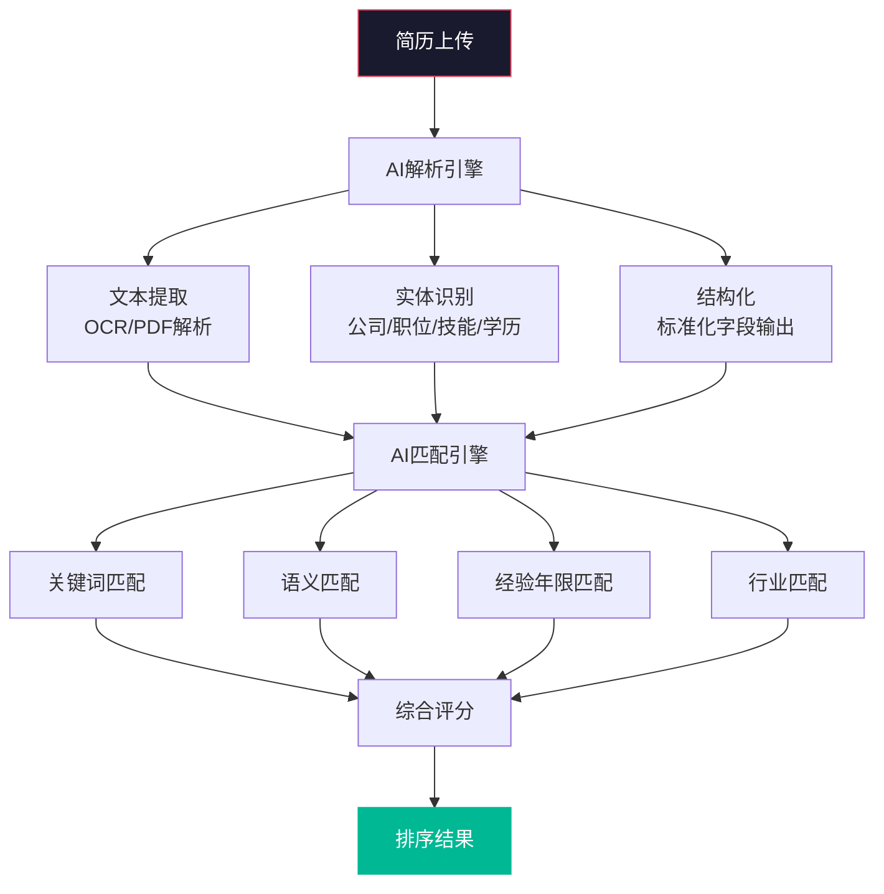
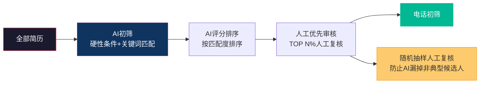

# 简历筛选与初筛方法

> [!abstract] 核心问题
> 简历筛选是招聘漏斗的第一个关键筛选节点。如何在大量简历中高效、准确地识别出值得进一步面试的候选人？本章系统梳理简历筛选的维度、标准、结构化方法，常见简历"陷阱"的判断，以及AI简历筛选的原理与局限。

---

## 一、简历筛选的核心框架

### 1.1 简历筛选的目标

> [!important] 筛选的核心矛盾
> 简历筛选面临一个永恒的矛盾：**如果筛选过于宽松，面试资源被浪费；如果筛选过于严格，可能错过优秀人才。** 好的筛选策略需要在"漏过率"和"误入率"之间找到平衡。

### 1.2 筛选的三个层次

---

## 二、结构化简历筛选清单

### 2.1 简历筛选六维度

### 2.2 结构化筛选清单

#### 一、基本条件（硬性门槛）

| 筛选项 | 评估标准 | 通过/淘汰 | 备注 |
|:---|:---|:---|:---|
| 学历 | 是否满足最低学历要求 | 不满足直接淘汰 | 除非有特别突出的其他条件 |
| 工作年限 | 是否符合岗位经验要求 | 差距过大淘汰 | 考虑经验质量而非单纯年限 |
| 语言能力 | 是否满足岗位语言要求 | 不满足直接淘汰 | 可通过测试验证 |
| 地理位置 | 是否在目标城市或愿意relocate | 标注注明 | 远程岗位除外 |

#### 二、专业技能（匹配度核心）

| 筛选项 | 评估标准 | 评分（1-5） | 备注 |
|:---|:---|:---|:---|
| 核心技术 | 是否掌握岗位核心技术栈 | | 关注熟练度和深度 |
| 工具应用 | 是否使用过相关工具/平台 | | 学习成本低的工具可放宽 |
| 项目经验 | 是否有类似项目经验 | | 关注项目规模和角色 |
| 证书/认证 | 是否有相关专业认证 | | 非必须，加分项 |

#### 三、行业经验（领域匹配度）

| 筛选项 | 评估标准 | 评分（1-5） | 备注 |
|:---|:---|:---|:---|
| 行业背景 | 是否在同行业工作过 | | 跨行业但有可迁移能力可接受 |
| 公司类型 | 是否在类似规模/阶段公司工作过 | | 大公司→创业公司需评估适应性 |
| 业务理解 | 是否展现对业务的理解 | | 从简历描述中判断 |

#### 四、成长轨迹（潜力判断）

| 筛选项 | 评估标准 | 评分（1-5） | 备注 |
|:---|:---|:---|:---|
| 晋升速度 | 是否有明确的晋升轨迹 | | 快速晋升是能力的信号 |
| 职责扩大 | 职责范围是否在扩大 | | 横向发展也有价值 |
| 学习能力 | 是否有新技术/新领域的学习证据 | | 自学、转行、跨领域 |

#### 五、稳定性（风险判断）

| 筛选项 | 评估标准 | 评分（1-5） | 备注 |
|:---|:---|:---|:---|
| 平均在职时长 | 每段工作的时长 | | 低于1年需关注 |
| 跳槽原因 | 跳槽是否合理 | | 面试时可深入了解 |
| 职业空窗期 | 是否有超过3个月的空窗期 | | 空窗期本身不是问题，关键是原因 |

#### 六、成果导向（能力证明）

| 筛选项 | 评估标准 | 评分（1-5） | 备注 |
|:---|:---|:---|:---|
| 量化成果 | 是否有明确的数据化成果 | | "提升了效率"vs"效率提升30%" |
| 项目影响 | 项目对业务/公司的实际影响 | | 关注scope和impact |
| 奖项/认可 | 是否有行业奖项或公司认可 | | 加分项非必须 |

### 2.3 筛选决策矩阵

---

## 三、常见简历"陷阱"识别

### 3.1 简历造假的常见类型

> [!warning] 简历造假的五种典型表现
>
> **1. 学历造假**
> - 表现：虚构学历、将肄业写成毕业、将非全日制写成全日制
> - 识别：要求提供学历证书编号/学信网截图，背景调查核实
>
> **2. 工作经历造假**
> - 表现：拉长在职时间、虚构工作经历、将实习写成正式工作
> - 识别：关注时间线是否连贯，社保记录可交叉验证
>
> **3. 职位/职级夸大**
> - 表现：将"参与"写成"负责"，将"协助"写成"主导"
> - 识别：面试时通过STAR追问具体细节
>
> **4. 业绩/成果夸大**
> - 表现：将团队成果归于个人、夸大数字指标
> - 识别：追问数据口径、个人贡献占比、具体实现路径
>
> **5. 技能/证书造假**
> - 表现：声称掌握并不熟练的技能、伪造证书
> - 识别：技术面试实操验证，证书可在线查询

### 3.2 频繁跳槽的判断

> [!note] 跳槽频率的健康区间
> 不同行业和岗位的"正常跳槽频率"不同：
> - 互联网/科技行业：1.5-2.5年一次属于正常
> - 传统行业/职能岗位：2-3年一次属于正常
> - 早期职业（工作前5年）：跳槽频率通常更高

**判断频繁跳槽的四个维度**：

1. **频率**：平均每段工作时长是否显著低于行业平均水平
2. **趋势**：跳槽频率是在增加还是减少
3. **原因**：每次跳槽是否有合理的职业发展逻辑
4. **行业特性**：是否所在行业本身就具有高流动性

> [!tip] 频繁跳槽的判断框架
> 不是所有频繁跳槽都是"red flag"。关键看：
> - **有逻辑的跳槽**：每次跳槽都有明确的职业发展方向（如从执行→管理、从小公司→大平台）
> - **无逻辑的跳槽**：每次跳槽没有明显的职业发展逻辑，只是薪资小幅提升
> - **逃避型跳槽**：每次都在试用期或不满一年离开，可能在逃避问题

### 3.3 简历中的其他"Red Flag"

| 信号 | 含义 | 处理方式 |
|:---|:---|:---|
| 职业空窗期过长且无合理解释 | 可能有隐藏原因 | 面试时友善询问，不做预设 |
| 频繁转换行业/岗位 | 职业方向不明确 | 关注当前求职动机的稳定性 |
| 简历中有明显的自相矛盾 | 可能存在造假 | 标注后重点验证 |
| 过度使用"负责/主导"但缺乏细节 | 可能夸大实际贡献 | 面试时追问具体细节 |
| 所有工作经历都是"平级跳动" | 缺乏成长性 | 评估成长潜力 |
| 避而不谈前公司信息 | 可能有保密协议或纠纷 | 面试时了解原因 |

---

## 四、AI简历筛选：原理与局限

### 4.1 AI简历筛选的工作原理

> [!note] 关联阅读
> AI简历筛选的技术原理（NLP、语义理解等）在 [[03-HR人事/校招测评/校招测评知识库_建设方案_v2]] 中有更详细的介绍。本章聚焦于AI筛选在流程中的应用和局限。

### 4.2 AI筛选的优势

| 优势 | 说明 |
|:---|:---|
| **效率** | 处理海量简历的速度远超人工 |
| **一致性** | 统一的筛选标准，不会因疲劳而波动 |
| **可追溯** | 筛选决策有据可查，便于复盘 |
| **24/7运行** | 可随时处理新简历，缩短响应时间 |
| **多维度** | 可同时考虑多个维度进行评分 |

### 4.3 AI筛选的局限与风险

> [!warning] AI筛选的六大局限
>
> **1. 关键词依赖陷阱**
> AI可能因为简历中缺少某些关键词而漏掉优秀候选人。例如，一位优秀的后端工程师可能不写"微服务"而是写"分布式系统"。
>
> **2. 偏见放大**
> 如果训练数据包含历史偏见（如偏好某些学校或公司），AI会放大这种偏见。详见 [[03-HR人事/校招测评/校招测评知识库_建设方案_v2]] 中的AI公平性讨论。
>
> **3. 格式敏感**
> 某些简历格式（如创意设计、PDF中的表格）可能被AI错误解析，导致关键信息丢失。
>
> **4. 缺乏上下文理解**
> AI难以理解"从大厂到创业公司"这种职业选择背后的逻辑，可能将合理的职业转型标记为"降级"。
>
> **5. 无法评估"软素质"**
> 领导力、沟通能力、文化匹配度等软素质在简历中本就不容易体现，AI更无法从中提取。
>
> **6. 过度依赖历史数据**
> AI推荐"和历史成功员工相似的候选人"，可能阻碍团队多样性。

### 4.4 人机协同的筛选策略

> [!tip] 人机协同的最佳实践
> 1. **AI做初筛，人工做决策**：AI负责快速过滤明显不匹配的简历，人工负责最终判断
> 2. **设置"人工抽检"机制**：定期从AI淘汰的简历中随机抽取，检查是否有误判
> 3. **持续校准AI模型**：基于人工筛选结果反馈，持续优化AI匹配准确度
> 4. **关注多样性指标**：监控AI筛选后的候选人多样性，避免同质化
> 5. **关键岗位双重确认**：关键岗位必须经过人工复核

---

## 五、电话/视频初筛

### 5.1 初筛的目标

简历筛选通过后，电话或视频初筛是面试前的最后一道筛选。其目标不是"深入评估"，而是：

1. **验证**：简历信息的真实性基本验证
2. **沟通**：评估基本沟通能力和表达清晰度
3. **动机**：了解求职动机和期望
4. **预期**：对齐薪资范围、工作地点等基本预期
5. **体验**：给候选人留下好的第一印象

### 5.2 初筛通话结构

> [!tip] 15分钟初筛通话模板
>
> **第1-2分钟：破冰**
> - 自我介绍和公司简介
> - 确认通话方便
>
> **第3-5分钟：求职动机**
> - "为什么看新机会？"
> - "对下一份工作的期望是什么？"
>
> **第6-8分钟：关键信息验证**
> - 核心技能和项目经验快速确认
> - 当前/期望薪资范围
>
> **第9-12分钟：公司和岗位介绍**
> - 简要介绍岗位和团队
> - 回答候选人的初步问题
>
> **第13-15分钟：下一步**
> - 明确下一步流程和时间线
> - 确认候选人意向

---

## 六、简历筛选的常见误区

> [!warning] 误区一：过度依赖名校/大厂标签
> 名校/大厂是能力的参考信号，但不是唯一标准。很多优秀人才来自非传统背景。

> [!warning] 误区二：简历长度决定好坏
> 简历不是越长越好，也不是越短越好。关键是信息密度和相关性。

> [!warning] 误区三：忽视"非典型"候选人
> 跨行业转行、职业空窗期后回归、非传统教育背景的人，往往被快速筛选淘汰，但其中可能有高潜力人才。

> [!warning] 误区四：一票否决式筛选
> 因为某一个"red flag"就完全否决，不给候选人解释的机会。很多"red flag"背后有合理的解释。

> [!warning] 误区五：筛选标准不一致
> 不同筛选者使用不同的标准，导致筛选结果不可靠。解决方案是使用结构化筛选清单。

---

## 七、本章小结

> [!quote] 核心原则
> **简历筛选的目标不是"找到完美的简历"，而是"找到值得进一步了解的候选人"。** 简历只是一张纸，真正的人才可能不会写简历，而会写简历的人不一定就是好人才。

---

## 关联阅读

- [[03-HR人事/招聘与面试体系/02_渠道策略与人才sourcing]] —— 简历的来源渠道
- [[03-HR人事/招聘与面试体系/04_面试设计方法论]] —— 筛选通过后的面试设计
- [[03-HR人事/招聘与面试体系/08_AI如何改变招聘]] —— AI在招聘全流程的应用
- [[03-HR人事/校招测评/校招测评知识库_建设方案_v2]] —— AI面试技术原理（技术层面）
- [[03-HR人事/招聘与面试体系/00_MOC_招聘与面试体系中枢]] —— 返回知识库中枢

---

*最后更新于 2026-07-27*