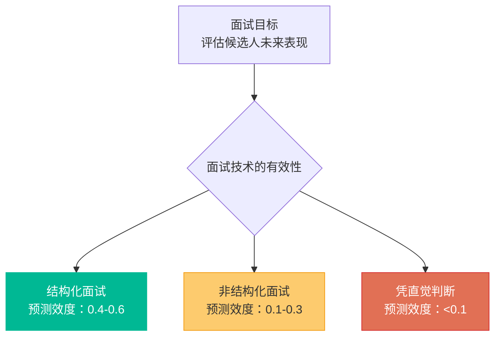
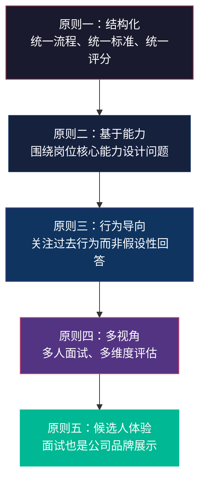
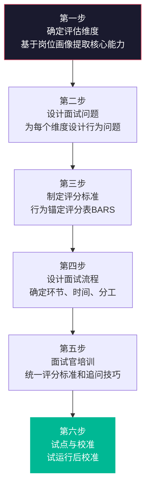
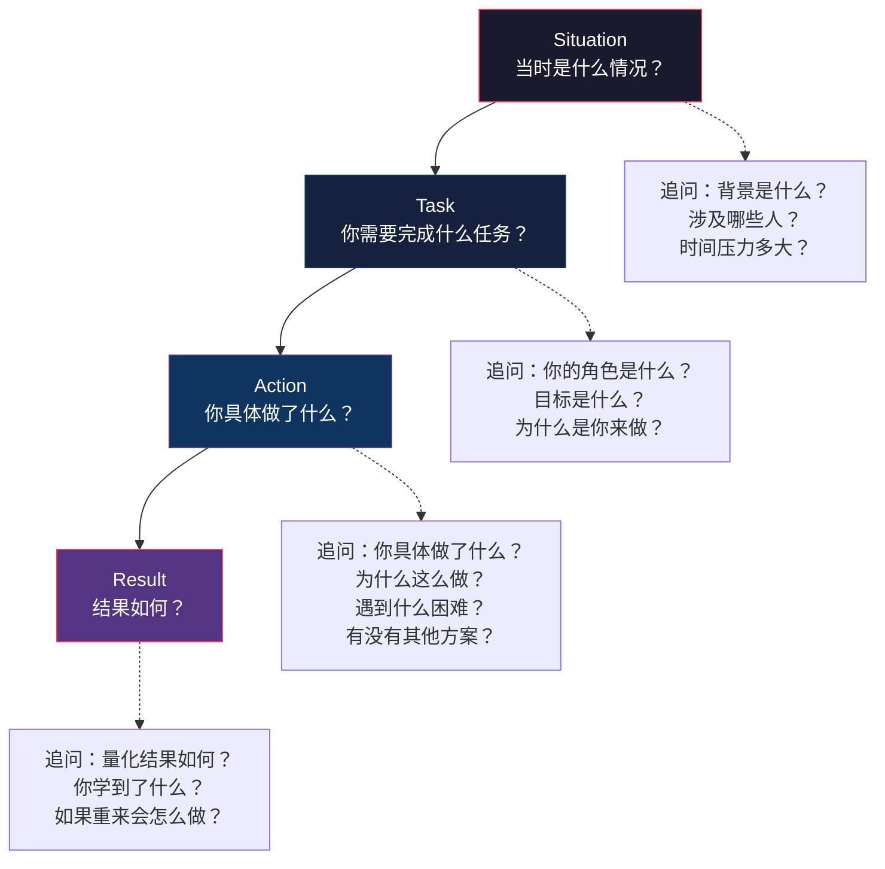
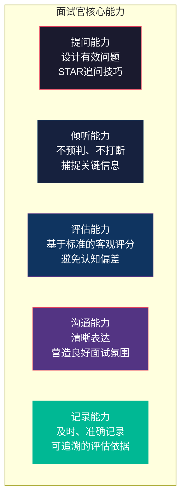
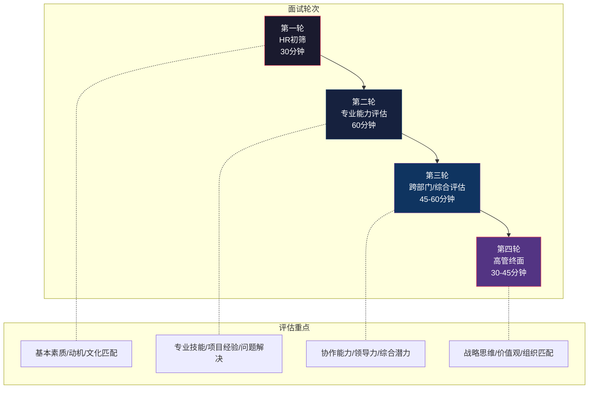
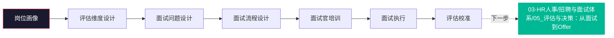

# 面试设计方法论

> [!abstract] 核心问题
> 面试是招聘流程中最核心的评估环节，也是最容易被"凭感觉"操作的环节。**如何设计一场科学、公平、有效的面试？** 本章从面试设计的方法论出发，系统梳理结构化面试、行为面试法（BEI）、情境面试、面试官培训与认证、面试分工等核心内容。
>
> **注意**：本章聚焦于**面试官如何设计面试**，而非"面试者如何回答面试题"。面试回答技巧相关内容请参考 [[03-HR人事/培训与人才发展/培训与人才发展_知识库建设方案]]。

---

## 一、面试设计的核心框架

### 1.1 面试的"测不准"问题

> [!important] 关键认知
> 研究反复证明：**非结构化面试的预测效度极低**，甚至不如简单的认知能力测试。如果不进行科学的面试设计，面试就变成了"聊得好就通过"的社交活动，而非有效的人才评估。

### 1.2 面试设计的五项原则

---

## 二、结构化面试设计

### 2.1 什么是结构化面试

> [!important] 结构化面试的定义
> 结构化面试（Structured Interview）是指面试的**内容、流程、评分标准**三方面都经过预先设计并保持一致，确保每位候选人接受相同的评估。

结构化面试的三个维度：

| 维度 | 非结构化面试 | 结构化面试 |
|:---|:---|:---|
| 问题内容 | 随面试官自由发挥，因人而异 | 基于岗位能力模型预先设计，统一题库 |
| 面试流程 | 无固定流程，时间自由 | 有固定的环节和时间分配 |
| 评分标准 | 凭感觉打分，无统一标准 | 有明确的行为锚定评分标准（BARS） |

### 2.2 结构化面试设计流程

### 2.3 评估维度设计

> [!tip] 评估维度设计原则
> 1. **聚焦关键**：选择3-5个核心维度，而非面面俱到
> 2. **可观察**：每个维度都能通过行为问题来观察
> 3. **可区分**：不同维度之间不重叠
> 4. **相关性**：每个维度都与岗位成功直接相关

**示例：产品经理岗位的评估维度**

| 维度 | 权重 | 定义 | 示例行为指标 |
|:---|:---|:---|:---|
| 用户洞察 | 25% | 理解用户需求、发现用户痛点的能力 | 用户研究方法、需求提炼、同理心 |
| 逻辑思维 | 25% | 分析问题、构建逻辑框架的能力 | 问题拆解、因果分析、数据驱动 |
| 执行力 | 20% | 推动项目落地、拿到结果的能力 | 项目管理、跨部门协调、结果导向 |
| 沟通协作 | 15% | 与团队有效沟通和协作的能力 | 表达清晰、冲突处理、向上管理 |
| 产品Sense | 15% | 对产品方向和用户体验的直觉判断 | 竞品分析、体验敏感度、创新思维 |

### 2.4 行为锚定评分表（BARS）

> [!example] BARS示例：逻辑思维维度（1-5分）
>
> **5分（卓越）**：能够快速识别复杂问题的核心矛盾，构建清晰的分析框架，能从多个角度验证假设，并得出可执行的结论。在面试中展现出跨领域的系统性思考。
>
> **4分（优秀）**：能够有效拆解问题，使用结构化的方法进行分析，结论有数据支撑。在面试中逻辑清晰，能自圆其说。
>
> **3分（合格）**：能够进行基本的逻辑分析，但框架性不够强，可能在复杂问题上需要引导。在面试中表现出基本的逻辑能力。
>
> **2分（待提升）**：分析问题的思路较为混乱，容易跳跃，结论缺乏充分支撑。在面试中需要大量引导才能表达清楚。
>
> **1分（不匹配）**：回答缺乏逻辑，前后矛盾，无法用结构化方式思考问题。在面试中表现出明显的逻辑混乱。

---

## 三、行为面试法（BEI）

### 3.1 BEI的核心原理

> [!important] BEI的底层假设
> **过去的行为是未来行为的最佳预测因子。** 与其问"你会怎么做"，不如问"你过去是怎么做的"。

### 3.2 STAR追问法

### 3.3 BEI问题的设计原则

| 设计原则 | 差的问题 | 好的问题 |
|:---|:---|:---|
| 行为导向 | "你怎么看待团队合作？" | "请分享一个你在团队中解决冲突的例子" |
| 具体而非笼统 | "你擅长沟通吗？" | "请描述一次你通过沟通改变了他人想法或决定的经历" |
| 关注个人贡献 | "你们的项目是怎么做的？" | "你在这个项目中具体做了哪些贡献？" |
| 追问细节 | 接受表面回答不追问 | 追问"具体是怎么做的？""为什么选择这个方案？" |
| 关注困难情境 | "你最大的成就是什么？" | "请分享一次你在资源不足的情况下完成任务的经历" |

### 3.4 BEI常见问题库

#### 按能力维度分类

**问题解决能力**
1. "请分享一个你遇到的最复杂的技术/业务问题，你是如何分析和解决的？"
2. "请描述一次你必须在不完整信息下做决策的经历。"
3. "请分享一个你发现并解决了一个被忽视的问题的例子。"

**领导力**
1. "请分享一次你带领团队完成一个困难目标的经历。"
2. "请描述一次你处理团队中表现不佳成员的经历。"
3. "请分享一个你推动变革或新方向的例子，遇到了什么阻力？"

**协作能力**
1. "请分享一次你与性格/风格非常不同的同事合作完成项目的经历。"
2. "请描述一次你在跨部门协作中遇到的最大挑战。"
3. "请分享一个你与上级意见不一致但最终达成共识的例子。"

**抗压能力**
1. "请分享一次你在高压下完成任务的经历，你是如何管理压力的？"
2. "请描述一次你同时处理多个紧急任务的情况。"
3. "请分享一个你经历过的最大的职业挫折，你是如何应对的？"

**学习能力**
1. "请分享一个你快速学习新技能并应用到工作的例子。"
2. "请描述一次你从失败中学习并改进的经历。"
3. "请分享一个你主动学习领域外知识并产生价值的例子。"

---

## 四、情境面试与压力面试

### 4.1 情境面试（Situational Interview）

> [!note] 情境面试 vs 行为面试
> - **行为面试**：问过去（"你以前是怎么做的？"）
> - **情境面试**：问未来（"如果遇到这种情况，你会怎么做？"）
> - 情境面试适用于：候选人缺乏相关经验（如校招）、或需要评估问题解决思路的场景

**情境面试问题设计示例**：

> [!example] 产品经理情境问题
> "假设你负责的产品，在即将上线前一周，技术负责人告诉你核心功能无法按时交付。你会怎么做？"
>
> 评估要点：
> - 是否先了解具体情况（而非直接做决定）
> - 是否考虑了多种解决方案（砍功能/MVP/延期/加资源）
> - 是否考虑了各利益相关方的沟通
> - 是否展现了决策框架和优先级判断

### 4.2 压力面试的适用场景

> [!warning] 压力面试的使用原则
> 压力面试不是"故意刁难候选人"，而是在特定岗位（如高管、销售、客户服务）中，评估候选人在真实压力下的反应。**滥用压力面试是糟糕的候选人体验，会严重损害雇主品牌。**

| 适用场景 | 不适用场景 |
|:---|:---|
| 高管岗位（需要评估高压决策能力） | 初级岗位 |
| 销售岗位（需要评估客户压力应对） | 技术研发岗位 |
| 客服/投诉处理（需要评估情绪管理） | 创意设计岗位 |
| 紧急响应/危机管理角色 | 大部分职能岗位 |

---

## 五、面试官培训与认证

### 5.1 面试官的能力模型

### 5.2 面试官培训体系

| 培训阶段 | 内容 | 方式 | 时长 |
|:---|:---|:---|:---|
| **基础培训** | 结构化面试理论、BEI方法、STAR追问 | 线上课程+案例分析 | 2-4小时 |
| **实操训练** | 模拟面试、角色扮演、录像复盘 | 线下工作坊 | 4-8小时 |
| **旁听阶段** | 旁听资深面试官的面试 | 实战旁听 | 3-5场 |
| **带教阶段** | 在资深面试官陪同下进行面试 | 实战带教 | 3-5场 |
| **独立认证** | 通过评估考核后独立面试 | 考核认证 | 1次评估 |
| **持续校准** | 定期参加校准会议，持续提升 | 季度校准 | 每季度 |

### 5.3 面试官的常见认知偏差

> [!warning] 面试中常见的认知偏差
>
> **1. 首因效应（第一印象）**
> 面试前30秒形成的印象影响整个面试评估。**对策**：延迟判断，基于证据评分。
>
> **2. 相似性偏差**
> 倾向于喜欢与自己相似的人（同校、同乡、同爱好）。**对策**：关注能力而非个人喜好。
>
> **3. 晕轮效应**
> 因为一个突出优点而忽略其他不足。**对策**：每个维度独立评分。
>
> **4. 对比效应**
> 前一个候选人的表现影响对当前候选人的判断。**对策**：使用绝对标准而非相对比较。
>
> **5. 确认偏差**
> 倾向于寻找支持自己初步判断的证据。**对策**：主动寻找反证。
>
> **6. 刻板印象**
> 基于性别、年龄、学校等标签进行预判。**对策**：建立多元化面试官团队，交叉验证。

---

## 六、面试分工与流程设计

### 6.1 面试官分工矩阵

### 6.2 面试轮次设计原则

| 原则 | 说明 |
|:---|:---|
| **逐层深入** | 从通用能力到专业能力，从个人到团队协作 |
| **避免重复** | 不同轮次评估不同的维度，避免重复问同样的问题 |
| **时间合理** | 总时长控制在合理范围内，避免候选人疲劳 |
| **反馈及时** | 每轮结束后尽快反馈结果，管理候选人预期 |
| **体验优先** | 面试流程设计要站在候选人角度思考 |

### 6.3 面试评分表模板

| 评估维度 | 权重 | 评分(1-5) | 关键证据 | 面试官评语 |
|:---|:---|:---|:---|:---|
| 维度一 | % | | | |
| 维度二 | % | | | |
| 维度三 | % | | | |
| 维度四 | % | | | |
| 维度五 | % | | | |
| **加权总分** | 100% | - | | |
| **总体评价** | | | | |
| **是否推荐进入下一轮** | 是/否 | | | |
| **需要下一轮重点验证的方面** | | | | |

---

## 七、面试中的候选人体验

> [!important] 候选人体验即雇主品牌
> 每一位候选人都可能成为公司的客户、合作伙伴或未来的员工。即使不录用，也要给候选人留下好的体验。

| 体验环节 | 好的做法 | 避免的做法 |
|:---|:---|:---|
| 面试前 | 提前发送面试流程、参会人信息 | 临时通知、信息不清晰 |
| 面试中 | 准时开始、氛围友好、双向交流 | 迟到、面试官看手机、单向审问 |
| 面试后 | 及时反馈结果、提供有价值的反馈 | 石沉大海、模板化拒信 |

---

## 八、本章小结

> [!quote] 核心原则
> **面试不是"聊得好就通过"，而是一场基于证据的评估。** 结构化面试设计的目的，就是让评估从"感觉"走向"科学"。

---

## 关联阅读

- [[03-HR人事/招聘与面试体系/03_简历筛选与初筛方法]] —— 面试前的筛选环节
- [[03-HR人事/招聘与面试体系/05_评估与决策：从面试到Offer]] —— 面试后的评估与决策
- [[03-HR人事/招聘与面试体系/08_AI如何改变招聘]] —— AI面试辅助工具的应用
- [[03-HR人事/培训与人才发展/培训与人才发展_知识库建设方案]] —— 面试回答技巧（面试者视角）
- [[03-HR人事/校招测评/校招测评知识库_建设方案_v2]] —— AI面试技术原理
- [[03-HR人事/招聘与面试体系/00_MOC_招聘与面试体系中枢]] —— 返回知识库中枢

---

*最后更新于 2026-07-27*