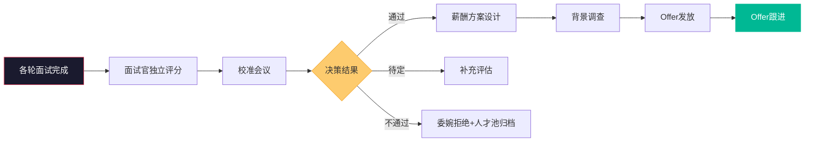
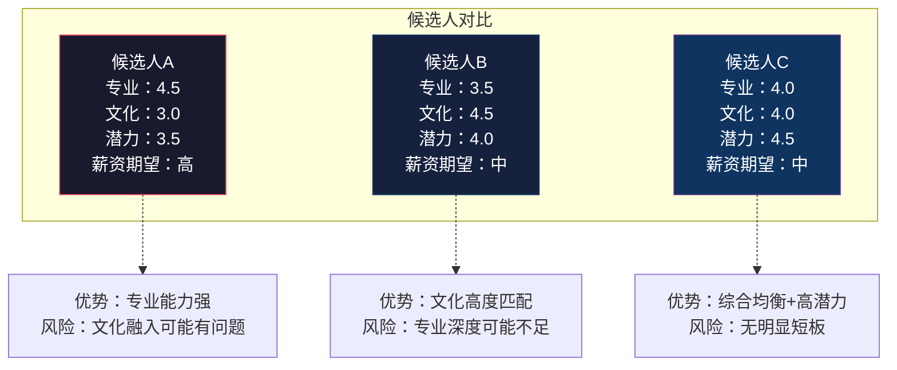
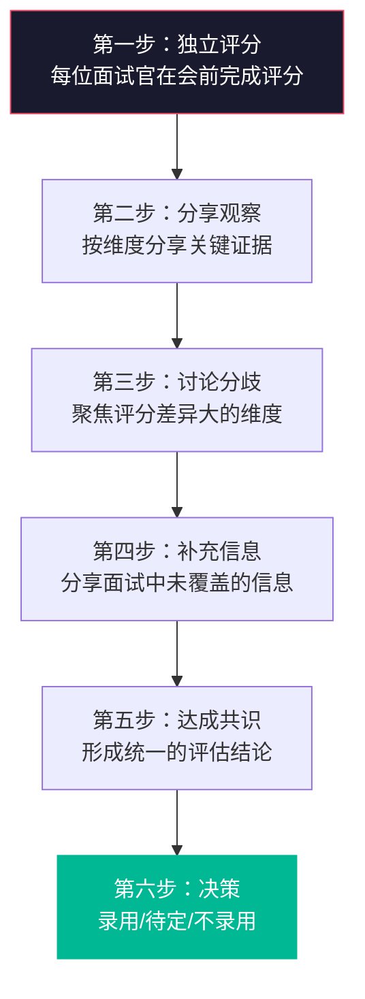
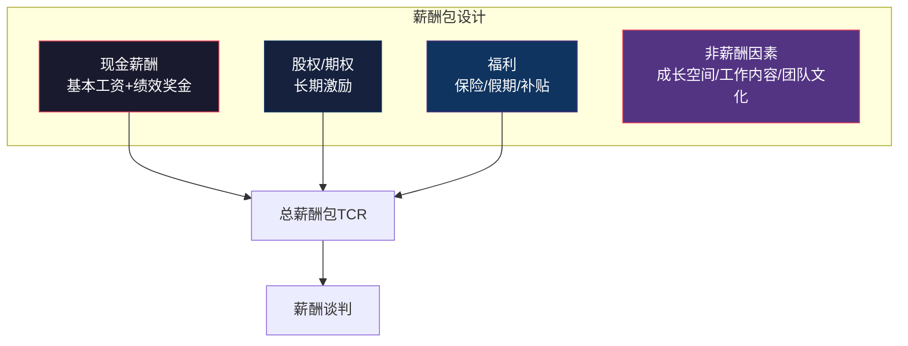
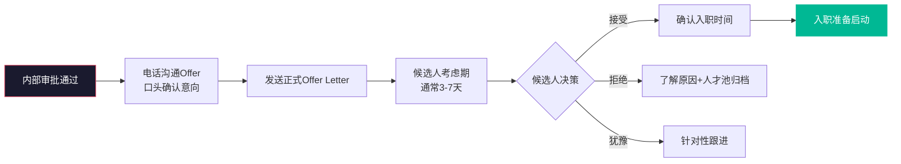

# 评估与决策：从面试到Offer

> [!abstract] 核心问题
> 面试结束后的评估与决策是招聘流程中最关键的"临门一脚"。如何在多位面试官的评估中做出准确的录用决策？如何设计薪酬方案并有效谈判？如何管理背景调查和Offer发放？本章提供从面试后到Offer确认的全流程方法论。

---

## 一、面试后评估体系

### 1.1 评估流程全景

---

## 二、候选人评估矩阵

### 2.1 多维度评估矩阵

> [!important] 评估矩阵的核心价值
> 将多个面试官的主观判断转化为可比较、可讨论的结构化数据，避免"感觉"主导决策。

| 评估维度 | 权重 | 面试官A评分 | 面试官B评分 | 面试官C评分 | 加权平均 | 备注 |
|:---|:---|:---|:---|:---|:---|:---|
| 专业能力 | 30% | 4 | 3 | 4 | 3.7 | |
| 问题解决 | 25% | 4 | 4 | 3 | 3.7 | |
| 沟通协作 | 15% | 3 | 3 | 4 | 3.3 | |
| 领导力 | 15% | 3 | 2 | 3 | 2.7 | 需深入讨论 |
| 文化匹配 | 15% | 4 | 4 | 4 | 4.0 | |
| **加权总分** | 100% | | | | **3.5** | |

### 2.2 候选人横向对比矩阵

---

## 三、校准会议

### 3.1 校准会议的目的

> [!important] 为什么要开校准会议？
> 多位面试官对同一候选人的评估往往存在差异。校准会议的目的不是"投票决定"，而是通过讨论**统一评估标准**、**分享不同视角的观察**、**减少个人偏见**，最终做出更准确的决策。

### 3.2 校准会议的流程

### 3.3 校准会议的原则

| 原则 | 说明 |
|:---|:---|
| **先评分后讨论** | 避免"锚定效应"，每位面试官独立评分后再讨论 |
| **基于证据** | 讨论必须基于面试中的具体行为证据，而非"感觉" |
| **聚焦分歧** | 重点关注评分差异超过1.5分的维度 |
| **鼓励异议** | 鼓励不同意见的表达，少数意见值得深入探讨 |
| **决策透明** | 最终决策需要明确的理由和依据 |

### 3.4 校准会议中的常见问题

> [!warning] 校准会议常见问题
>
> **1. 层级压制**：高级别面试官的意见主导讨论，低级别面试官不敢表达不同意见
> **对策**：从低级别面试官开始发言
>
> **2. 群体思维**：为了"和谐"而迅速达成一致，忽视不同声音
> **对策**：指定"魔鬼代言人"角色，专门挑战共识
>
> **3. 信息不对称**：部分面试官掌握了其他面试官不知道的信息
> **对策**：先让每位面试官充分分享观察
>
> **4. 过度妥协**：为了达成共识而取中间值，而非基于证据做判断
> **对策**：共识不等于折中，保留分歧意见也是合理的结果

---

## 四、薪酬谈判策略

### 4.1 薪酬设计框架

### 4.2 薪酬谈判的五个原则

> [!tip] 薪酬谈判核心原则
>
> **1. 先了解期望，再报价**
> 在了解候选人期望薪资之前，不要先报价。问："您目前的薪资结构和期望是怎样的？"
>
> **2. 基于价值而非最低价**
> 薪酬谈判的目标不是"压到最低"，而是"找到双方都能接受的点"。过度压价会导致入职后满意度低。
>
> **3. 关注总薪酬包**
> 如果现金受限，可以通过股权、福利、发展机会等非现金因素来提升吸引力。
>
> **4. 保持公平性**
> 薪酬方案需要与内部同级别员工保持一致，避免因入职时间不同导致的薪酬倒挂。
>
> **5. 尊重候选人的底线**
> 如果候选人期望与预算差距过大，坦诚沟通，不强求。强扭的瓜不甜。

### 4.3 薪酬谈判策略矩阵

| 场景 | 策略 | 注意事项 |
|:---|:---|:---|
| 候选人期望在预算内 | 适当让步，展现诚意，快速推进 | 不要因为"预算够"就随意加价 |
| 候选人期望略超预算 | 探索非现金补偿，展示成长空间 | 坦诚沟通预算限制 |
| 候选人有多份Offer | 突出差异化优势，加速决策 | 不要参与价格战 |
| 候选人期望远超预算 | 坦诚沟通，如果确实无法匹配则友好结束 | 建立长期关系 |
| 候选人当前薪资低于Offer | 合理定薪，不因候选人当前薪资低而压低 | 公平性是长期留存的基础 |

### 4.4 薪酬谈判的具体话术

> [!example] 薪酬谈判关键话术
>
> **了解期望**：
> "我们希望给您一个合理的方案，能否先了解一下您目前的薪资结构和期望范围？"
>
> **预算限制**：
> "我们对这个岗位的预算范围是X-Y，我们的方案在现金部分已经接近上限，但我们在股权/发展机会方面可以给您更大的空间。"
>
> **突出非现金价值**：
> "除了现金部分，我们想特别跟您分享一下这个岗位的成长机会和我们团队的培养体系..."
>
> **应对多Offer**：
> "我们理解您有多份选择，我们不希望您仅仅因为薪酬选择我们。我们想帮您做一个全面的比较..."

---

## 五、背景调查

### 5.1 背景调查的目的与范围

> [!important] 背景调查不是"找茬"
> 背景调查的核心目的是**验证**候选人提供的信息的真实性，而非"挖掘负面信息"。背景调查应在候选人同意后进行。

| 调查维度 | 内容 | 方式 |
|:---|:---|:---|
| 工作经历 | 在职时间、职位、离职原因 | 联系前雇主HR |
| 工作表现 | 能力、业绩、团队协作 | 联系前直属上级/同事 |
| 学历信息 | 学历、学位、专业 | 学信网/学校查询 |
| 职业资格 | 相关证书、资格 | 官方渠道查询 |
| 法律合规 | 犯罪记录、诉讼记录 | 第三方背景调查机构 |

### 5.2 背景调查的注意事项

> [!warning] 背景调查注意事项
> 1. **必须获得候选人书面同意**
> 2. **联系前雇主时注意保护候选人隐私**（尤其候选人尚未离职时）
> 3. **背景调查获得的信息需要交叉验证**，单一来源可能不客观
> 4. **关注信息的一致性**，而非追求"完美评价"
> 5. **区分"事实"和"主观评价"**，前同事的评价可能带有个人色彩
> 6. **发现负面信息时，给候选人解释的机会**

---

## 六、Offer发放与跟进

### 6.1 Offer发放流程

### 6.2 Offer跟进策略

> [!tip] Offer跟进的关键时间节点
>
> **Day 0（发Offer当天）**：电话沟通，确认收到，解答初步问题
> **Day 1-2**：关注候选人是否有新的问题或顾虑
> **Day 3**：如果候选人还在犹豫，主动了解犹豫的原因
> **Day 5**：跟进截止日期，如果候选人需要延期，评估是否同意
> **Day 7**：如果候选人仍未回复，可能需要设定最后期限

### 6.3 Offer被拒绝的应对

| 拒绝原因 | 应对策略 | 长期行动 |
|:---|:---|:---|
| 薪酬不够 | 探讨是否还有调整空间，或突显非现金价值 | 检讨薪酬竞争力 |
| 接受了其他Offer | 了解对方Offer的优势，作为未来参考 | 保持联系，加入人才池 |
| 现任雇主挽留 | 了解挽留方案，评估是否还有机会 | 保持联系 |
| 对岗位/团队有顾虑 | 深入了解顾虑，提供更多信息 | 改进面试中的信息传递 |
| 个人原因（地点/家庭等） | 表达理解，保持良好关系 | 加入人才池 |

### 6.4 Offer到入职期间的"保温"

> [!important] Offer到入职的空窗期管理
> 从Offer接受到正式入职通常有2-4周的离职交接期，这段时间是候选人流失的高风险期。现任雇主可能挽留，其他公司可能介入。

| 保温措施 | 具体行动 |
|:---|:---|
| 定期联系 | 每周一次非正式问候，了解离职进展 |
| 提前融入 | 邀请参加团队活动、分享内部资讯 |
| 入职准备 | 提前发送入职指南、准备好工位和设备 |
| 上级接触 | 未来的直属上级主动联系，建立关系 |
| 问题响应 | 快速响应候选人在离职期间遇到的任何问题 |

---

## 七、候选人体验在决策阶段的重要性

> [!note] 决策阶段的候选人体验
> 从面试结束到Offer发放，是候选人体验的"关键时刻"。这个阶段的体验直接影响Offer接受率和候选人入职后的初始满意度。

| 体验环节 | 优秀做法 | 糟糕做法 |
|:---|:---|:---|
| 反馈速度 | 面试后24小时内给出反馈 | 石沉大海、一周后才有回复 |
| 决策透明 | 说明评估依据和决策逻辑 | "综合考虑"式模糊回复 |
| 尊重选择 | 尊重候选人的决策节奏 | 施加压力、催促决策 |
| 备选沟通 | 对未通过者给予有价值的反馈 | 冷冰冰的模板化拒信 |

---

## 八、本章小结

> [!quote] 核心原则
> **录用决策不是"选最好的"，而是"选最合适的"。** 评估与决策的终极目标，是在组织需求、候选人能力和候选人期望之间找到三方共赢的交汇点。

---

## 关联阅读

- [[03-HR人事/招聘与面试体系/04_面试设计方法论]] —— 面试设计与评估标准
- [[03-HR人事/招聘与面试体系/06_入职与融入：从Offer到生产力]] —— Offer后的入职融入
- [[03-HR人事/招聘与面试体系/07_招聘数据分析与效能衡量]] —— 评估决策的质量衡量
- [[03-HR人事/招聘与面试体系/08_AI如何改变招聘]] —— AI在评估决策中的应用
- [[03-HR人事/培训与人才发展/培训与人才发展_知识库建设方案]] —— 新员工入职后的培训衔接
- [[03-HR人事/招聘与面试体系/00_MOC_招聘与面试体系中枢]] —— 返回知识库中枢

---

*最后更新于 2026-07-27*