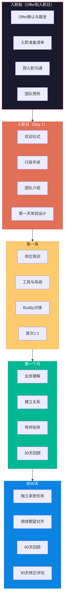
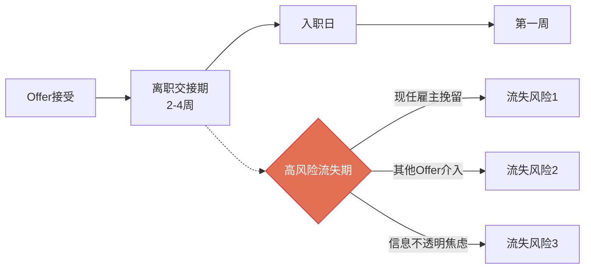
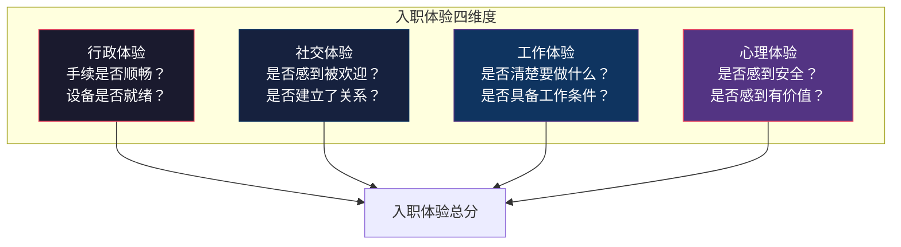
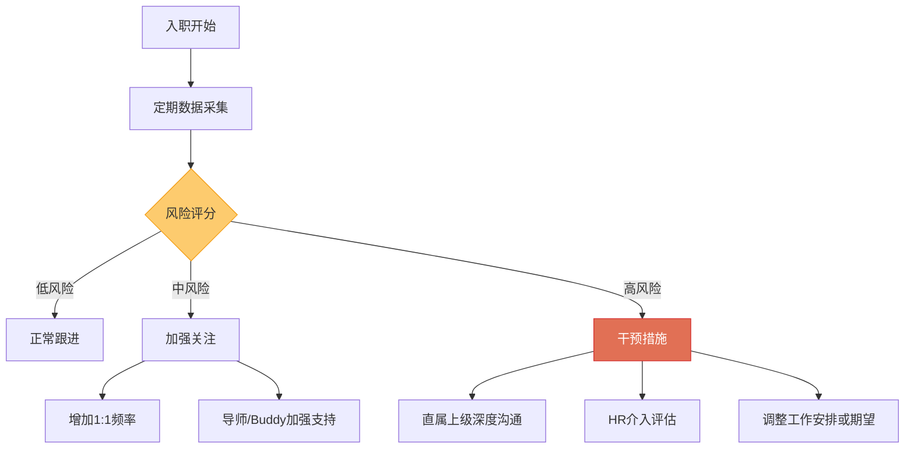

# 入职与融入：从Offer到生产力

> [!abstract] 核心问题
> Offer发放不是招聘的终点，而是新员工价值创造的起点。数据显示，**新员工入职后90天内的体验决定其长期留存意愿**，而一次失败的入职体验可能导致高达30%的新员工在6个月内离职。本章系统梳理入职流程设计、90天融入计划、导师制与Buddy制度、入职体验优化以及早期流失预警机制。

---

## 一、入职流程设计

### 1.1 入职管理的全周期视角



> [!important] 关键认知
> 入职不是"第一天来报到"这一个动作，而是从Offer接受到转正评估的**完整旅程**。入职体验的设计应从候选人接受Offer的那一刻就开始。

### 1.2 入职准备的"死亡谷"



> [!warning] 入职前"保温"期的重要性
> Offer接受到入职日之间的2-4周是"保温期"，也是流失高风险期。现任雇主可能挽留，新公司信息不透明带来的焦虑可能导致候选人反悔。

---

## 二、入职准备清单

### 2.1 入职前准备清单

| 类别 | 准备事项 | 负责人 | 完成时间 |
|:---|:---|:---|:---|
| **行政类** | 劳动合同准备 | HR | 入职前1周 |
| | 办公设备采购（电脑/显示器等） | IT | 入职前3天 |
| | 系统账号开通（邮箱/IM/内部系统） | IT | 入职前3天 |
| | 门禁/工牌准备 | 行政 | 入职前1天 |
| **工作类** | 工位安排与清洁 | 行政 | 入职前1天 |
| | 入职导师/Buddy确认 | 直属上级 | 入职前2周 |
| | 前两周工作计划制定 | 直属上级 | 入职前1周 |
| | 团队欢迎邮件/群通知 | 直属上级 | 入职前1天 |
| **沟通类** | 入职指南发送 | HR | 入职前1周 |
| | 首日安排通知 | HR | 入职前3天 |
| | 直属上级欢迎电话/信息 | 直属上级 | 入职前1周 |

### 2.2 入职第一天的体验设计

> [!tip] 第一天体验的目标
> 让新员工在第一天结束时感到：**"我做了正确的选择。"**

| 时间 | 内容 | 目标 |
|:---|:---|:---|
| 09:00-09:30 | 欢迎仪式 | 感受到被重视 |
| 09:30-10:30 | 行政手续办理 | 高效完成手续 |
| 10:30-11:00 | 团队介绍 | 认识团队成员 |
| 11:00-12:00 | 办公环境参观 | 熟悉环境 |
| 12:00-13:00 | 欢迎午餐 | 非正式交流 |
| 13:00-14:30 | 工具与系统设置 | 具备工作条件 |
| 14:30-15:30 | 直属上级1:1 | 了解期望 |
| 15:30-16:30 | Buddy对接 | 建立支持关系 |
| 16:30-17:30 | 自由探索时间 | 自主安排 |
| 17:30-18:00 | 第一天反馈 | 收集体验反馈 |

---

## 三、90天融入计划

### 3.1 90天融入路线图

```mermaid
gantt
    title 新员工90天融入计划
    dateFormat  X
    axisFormat  %s

    section 了解阶段
    了解公司文化与业务     :a1, 0, 14
    了解团队与角色         :a2, 0, 14
    学习产品与系统         :a3, 0, 21

    section 适应阶段
    建立协作关系           :b1, 14, 30
    开始承担独立任务       :b2, 21, 30
    导师定期指导           :b3, 14, 44

    section 贡献阶段
    独立完成关键任务       :c1, 30, 60
    展现初步成果           :c2, 44, 60
    建立个人影响力         :c3, 44, 90

    section 评估节点
    第30天回顾             :milestone, 29, 0
    第60天回顾             :milestone, 59, 0
    第90天转正评估         :milestone, 89, 0
```



### 3.2 三个30天的阶段目标

#### 第一阶段：了解（Day 1-30）

> [!tip] 第一阶段目标
> **从"局外人"到"了解规则的人"**

| 周次 | 重点任务 | 交付物 |
|:---|:---|:---|
| 第1周 | 熟悉环境、认识团队、完成入职培训 | 入职第一周学习笔记 |
| 第2周 | 理解业务、学习产品、阅读文档 | 业务理解总结 |
| 第3周 | 参与团队协作、观察工作流程 | 团队参与日志 |
| 第4周 | 承担第一个小任务、30天回顾 | 30天自我评估 |

#### 第二阶段：适应（Day 31-60）

> [!tip] 第二阶段目标
> **从"了解规则的人"到"能独立做事的人"**

| 周次 | 重点任务 | 交付物 |
|:---|:---|:---|
| 第5周 | 开始独立承担核心任务 | 任务进展报告 |
| 第6周 | 建立跨团队协作关系 | 协作关系图 |
| 第7周 | 提出改进建议 | 改进建议文档 |
| 第8周 | 60天回顾、绩效目标对齐 | 60天自我评估 |

#### 第三阶段：贡献（Day 61-90）

> [!tip] 第三阶段目标
> **从"能独立做事的人"到"为团队创造价值的人"**

| 周次 | 重点任务 | 交付物 |
|:---|:---|:---|
| 第9-10周 | 完成一个完整项目或关键任务 | 项目成果展示 |
| 第11周 | 建立个人专业影响力 | 知识分享/文档 |
| 第12周 | 90天全面回顾、转正评估 | 转正述职报告 |

### 3.3 90天回顾的四个关键问题

> [!important] 90天回顾四问
> 1. **你学到了什么？** —— 评估学习能力和适应速度
> 2. **你贡献了什么？** —— 评估初步产出
> 3. **你遇到了什么挑战？** —— 发现潜在问题和支持需求
> 4. **你的下一步目标是什么？** —— 对齐未来期望

---

## 四、导师制与Buddy制度

### 4.1 导师制与Buddy制度的区别

| 维度 | 导师（Mentor） | Buddy（伙伴） |
|:---|:---|:---|
| **角色定位** | 职业发展指导者 | 日常融入支持者 |
| **关系层级** | 通常跨级或跨部门 | 通常同级或同部门 |
| **关注重点** | 长期发展、能力提升 | 日常融入、文化适应 |
| **互动频率** | 每周/每两周1次 | 随时/每天 |
| **持续时间** | 3-6个月或更长 | 1-3个月 |
| **典型问题** | "我该如何规划职业路径？" | "这个系统怎么用？""午餐去哪里吃？" |

### 4.2 导师的选择与职责

```mermaid
graph TB
    A[导师选择标准] --> B1[非直属上级<br/>避免利益冲突]
    A --> B2[资深员工<br/>有丰富的组织经验]
    A --> B3[愿意投入时间<br/>每月至少2-4小时]
    A --> B4[良好的沟通能力<br/>能给予建设性反馈]

    B1 --> C[导师职责]
    B2 --> C
    B3 --> C
    B4 --> C

    C --> D1[帮助理解组织文化]
    C --> D2[指导职业发展规划]
    C --> D3[提供反馈和建议]
    C --> D4[帮助建立人脉网络]
    C --> D5[作为情绪的"安全出口"]

    style A fill:#1a1a2e,stroke:#e94560,color:#fff
    style C fill:#0f3460,stroke:#533483,color:#fff
```

### 4.3 Buddy的职责范围

> [!tip] Buddy的核心职责
> Buddy是新员工入职前30天最重要的支持者，负责帮助新员工快速融入团队日常。

| 职责 | 具体行动 |
|:---|:---|
| 日常向导 | 解答"哪里有XX"类问题，帮助熟悉环境和工具 |
| 文化引路人 | 分享"不成文规则"，帮助理解团队文化 |
| 社交连接器 | 介绍新员工认识团队成员，帮助建立社交关系 |
| 信息中转站 | 帮助新员工找到"该找谁"解决特定问题 |
| 情绪支持 | 关注新员工的情绪状态，必要时向管理者反馈 |

---

## 五、入职体验优化

### 5.1 入职体验的诊断框架



### 5.2 入职体验的常见痛点

> [!warning] 入职体验五大痛点
>
> **1. "电脑还没到"**
> 入职第一天没有工作设备，只能干坐着。**解决方案**：入职前3天完成设备准备。
>
> **2. "没人管我"**
> 直属上级太忙，入职第一周几乎见不到人。**解决方案**：确保直属上级在入职第一周至少有1-2次1:1。
>
> **3. "我不知道该做什么"**
> 没有清晰的工作计划和期望。**解决方案**：入职前制定前两周工作计划。
>
> **4. "系统账号各种不通"**
> 入职后3天还在申请各种系统权限。**解决方案**：入职前3天完成所有系统账号开通。
>
> **5. "感觉像个局外人"**
> 团队没有主动帮助融入，吃饭的时候没人叫。**解决方案**：Buddy制度确保新员工有人带。

### 5.3 入职体验的持续优化

> [!tip] 入职体验优化循环
> 1. **收集反馈**：入职第1周、第30天、第60天、第90天分别收集新员工反馈
> 2. **分析数据**：汇总常见问题，分析根本原因
> 3. **改进流程**：针对高频痛点优化流程
> 4. **验证效果**：通过下一批新员工验证改进效果
> 5. **持续迭代**：入职体验优化是一个持续的过程

---

## 六、早期流失预警

### 6.1 早期流失的预警信号

> [!warning] 新员工早期流失的预警信号
>
> **行为信号**
> - 频繁请假或迟到早退
> - 参与团队活动不积极
> - 工作中的投入度明显下降
> - 与同事的互动减少
>
> **情绪信号**
> - 在1:1中频繁表达"和预期不符"
> - 对工作内容表现出明显的失望
> - 对组织决策表现出不信任
> - 频繁提及"前公司是怎么做的"
>
> **绩效信号**
> - 任务完成速度和质量低于预期
> - 工作中频繁出现低级错误
> - 对反馈的接受度低
> - 缺乏主动学习和探索的意愿

### 6.2 早期流失预警机制



### 6.3 流失干预策略

| 流失原因 | 干预策略 |
|:---|:---|
| 工作内容与预期不符 | 重新对齐期望，调整工作内容或提供轮岗机会 |
| 无法融入团队文化 | 安排更多团队活动，Buddy加强社交支持 |
| 直属上级管理问题 | HR介入，评估是否需要调整汇报关系 |
| 成长空间不足 | 制定明确的成长计划，提供培训和发展机会 |
| 薪酬/福利不满意 | 评估是否在政策范围内做出调整 |
| 个人原因 | 提供灵活工作安排等支持 |

---

## 七、入职数据与度量

### 7.1 入职效能指标

| 指标 | 定义 | 目标值 | 监控频率 |
|:---|:---|:---|:---|
| 入职完成率 | 按计划完成入职流程的比例 | >95% | 月度 |
| 30天满意度 | 入职30天新员工满意度评分 | >4.0/5.0 | 月度 |
| 90天留存率 | 入职90天后仍在职的比例 | >90% | 月度 |
| 6个月离职率 | 入职6个月内主动离职的比例 | <10% | 季度 |
| 生产力达成时间 | 从入职到达到期望生产力的时间 | 视岗位级别 | 按人 |
| Buddy满意度 | 新员工对Buddy支持的满意度 | >4.0/5.0 | 月度 |

---

## 八、本章小结


> [!quote] 核心原则
> **招聘的终点不是Offer，而是新员工成为高绩效团队成员的那一刻。** 入职融入是招聘投资回报的"最后一公里"，也是人才发展体系的起点。

---

## 关联阅读

- [[03-HR人事/招聘与面试体系/05_评估与决策：从面试到Offer]] —— Offer发放与管理
- [[03-HR人事/招聘与面试体系/07_招聘数据分析与效能衡量]] —— 入职数据与留存分析
- [[03-HR人事/招聘与面试体系/09_招聘体系的战略视角]] —— 入职作为人才供应链的关键环节
- [[03-HR人事/培训与人才发展/培训与人才发展_知识库建设方案]] —— 新员工培训与人才发展衔接
- [[03-HR人事/招聘与面试体系/00_MOC_招聘与面试体系中枢]] —— 返回知识库中枢

---

*最后更新于 2026-07-27*