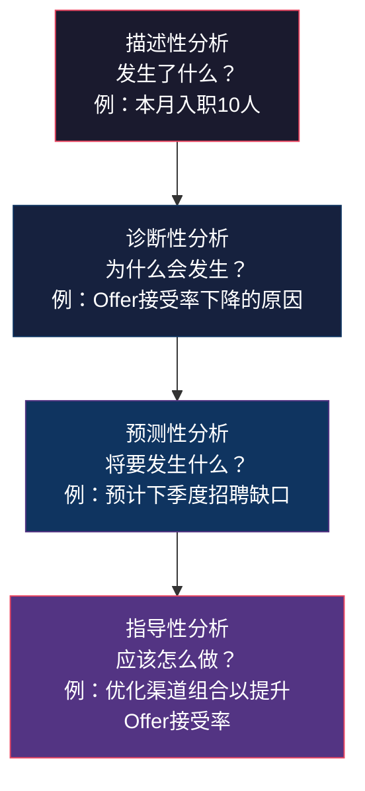
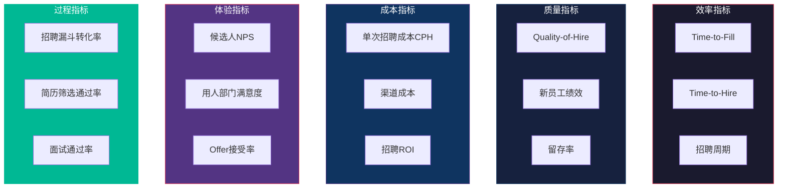
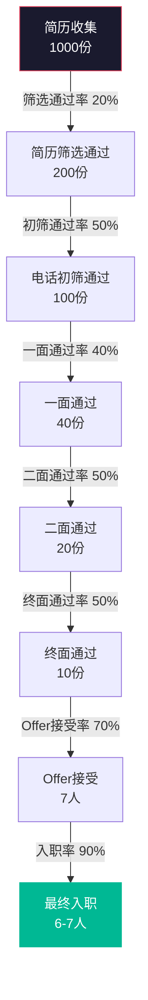
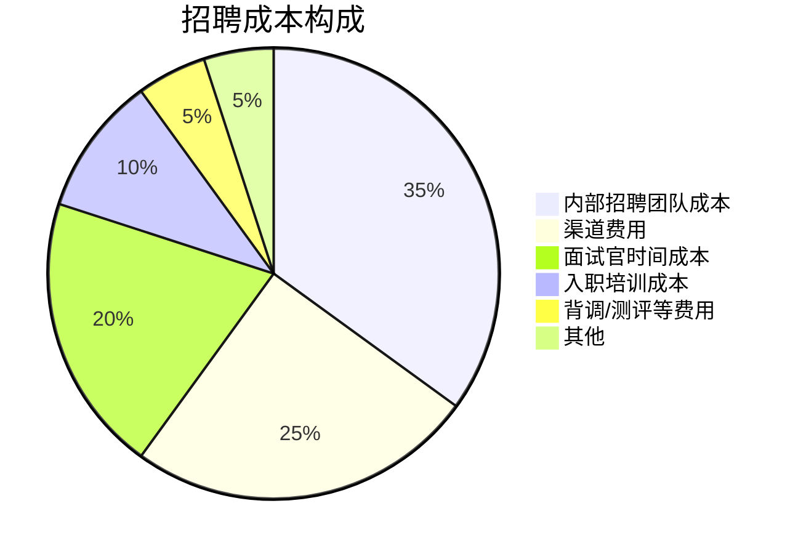
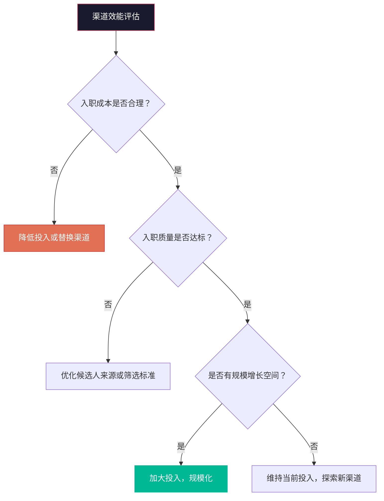
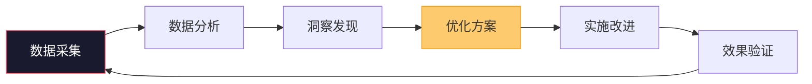

# 招聘数据分析与效能衡量

> [!abstract] 核心问题
> 如果不能衡量，就无法改进。招聘数据分析的目的是将招聘从"凭感觉"的活动转变为"数据驱动"的决策体系。本章系统梳理招聘漏斗分析、核心招聘指标、渠道效能分析、招聘成本分析以及数据驱动招聘优化的方法论。

---

## 一、招聘数据分析框架

### 1.1 招聘数据的四个层次

> [!important] 关键认知
> 大多数组织的招聘数据分析停留在**描述性分析**层面（"本月招了多少人"），但真正有价值的是**诊断性分析**（"为什么招聘效率下降"）和**预测性分析**（"未来3个月需要多少人"）。

### 1.2 招聘数据分析的指标体系

---

## 二、招聘漏斗分析

### 2.1 招聘漏斗模型

### 2.2 漏斗分析的核心价值

> [!tip] 漏斗分析的价值
> 漏斗分析不是看"最后招了多少人"，而是识别**哪个环节转化率异常**，从而定位问题。

| 异常环节 | 可能原因 | 诊断方向 |
|:---|:---|:---|
| 简历筛选通过率过低 | 渠道质量差、JD误导、筛选标准过严 | 检查渠道来源、优化JD、校准筛选标准 |
| 初筛通过率过低 | 简历与实际情况差距大、沟通能力不匹配 | 优化简历筛选标准、评估初筛流程 |
| 面试通过率过低 | 面试标准过严、候选人画像不匹配 | 校准面试标准、回顾岗位画像 |
| Offer接受率过低 | 薪酬竞争力不足、候选人体验差 | 薪酬调研、优化候选人体验 |
| 入职率过低 | 保温期管理不足、竞争对手介入 | 加强入职前跟进 |

### 2.3 漏斗分析的最佳实践

1. **分渠道分析**：不同渠道的漏斗转化率差异巨大，需要分开分析
2. **分岗位分析**：技术岗、销售岗、职能岗的漏斗模式不同
3. **分阶段分析**：对比不同时期的漏斗变化，发现趋势
4. **设定基准线**：建立各环节转化率的基准线，异常时快速识别
5. **关联质量指标**：不仅看"招了多少人"，还要看"招来的人好不好"

---

## 三、核心招聘指标

### 3.1 Time-to-Fill（岗位填补时间）

> [!important] Time-to-Fill 的定义
> **Time-to-Fill** = 从岗位需求确认（或JD发布）到候选人接受Offer的天数。
>
> **Time-to-Hire**（更精确）= 从候选人进入流程（投递/被联系）到接受Offer的天数。

| 指标 | 计算方式 | 用途 |
|:---|:---|:---|
| Time-to-Fill | 需求确认日 → Offer接受日 | 衡量整体招聘效率 |
| Time-to-Hire | 候选人进入流程日 → Offer接受日 | 衡量筛选和面试效率 |
| Time-to-Productivity | Offer接受日 → 达到期望生产力日 | 衡量入职融入效率 |

**Time-to-Fill的行业参考值**：

| 岗位级别 | 互联网/科技 | 传统行业 | 金融 |
|:---|:---|:---|:---|
| 初级 | 20-30天 | 25-35天 | 25-35天 |
| 中级 | 30-45天 | 35-50天 | 30-45天 |
| 高级 | 45-60天 | 50-70天 | 45-60天 |
| 高管 | 60-120天 | 90-180天 | 60-120天 |

### 3.2 Quality-of-Hire（招聘质量）

> [!important] Quality-of-Hire 的定义
> Quality-of-Hire（QoH）是衡量招聘效果的最核心指标，也是最难衡量的指标。它衡量的是"招来的人有多好"。

**QoH的衡量维度**：

| 维度 | 指标 | 数据来源 | 时间点 |
|:---|:---|:---|:---|
| 绩效表现 | 入职后绩效评分 | 绩效系统 | 6个月/12个月 |
| 留存率 | 6个月/12个月在职率 | HR系统 | 6个月/12个月 |
| 文化匹配 | 文化匹配度评估 | 360评估/上级评估 | 3个月/6个月 |
| 用人部门满意度 | 用人部门对新员工的满意度 | 调研问卷 | 3个月/6个月 |
| 晋升速度 | 首次晋升时间 | HR系统 | 长期 |

**QoH综合评分**：

> [!tip] QoH综合评分公式
> **QoH = (绩效评分 x 40%) + (留存状态 x 30%) + (文化匹配 x 20%) + (用人部门满意度 x 10%)**
>
> 其中留存状态为：留存=1，离职=0

### 3.3 招聘成本指标

| 指标 | 计算方式 | 说明 |
|:---|:---|:---|
| Cost-Per-Hire（CPH） | 总招聘成本 / 入职人数 | 单次招聘平均成本 |
| 渠道成本占比 | 各渠道成本 / 总招聘成本 | 渠道投入分布 |
| 招聘ROI | 新员工贡献价值 / 招聘成本 | 招聘投资回报 |

**CPH的构成**：

### 3.4 过程指标

| 指标 | 计算方式 | 健康区间 |
|:---|:---|:---|
| 简历筛选通过率 | 通过筛选 / 总简历数 | 15%-30% |
| 初筛到面试转化率 | 进入面试 / 初筛通过 | 60%-80% |
| 面试通过率 | 面试通过 / 面试人数 | 30%-50% |
| Offer接受率 | Offer接受 / Offer发放 | 70%-90% |
| 入职率 | 实际入职 / Offer接受 | 90%-98% |

---

## 四、渠道效能分析

### 4.1 渠道效能对比矩阵

| 渠道 | 简历量 | 面试转化率 | Offer转化率 | 入职转化率 | 人均成本 | 6月留存率 | 质量评分 |
|:---|:---|:---|:---|:---|:---|:---|:---|
| 内部推荐 | 中 | 高 | 高 | 高 | 低 | 高 | 高 |
| 猎头 | 低 | 高 | 高 | 中 | 高 | 中 | 中高 |
| 招聘网站 | 高 | 低 | 中 | 中 | 中 | 中 | 中 |
| LinkedIn | 中 | 中 | 中 | 中 | 中 | 中 | 中高 |
| 校招 | 高 | 中 | 中 | 高 | 中 | 高 | 中高 |
| 社交招聘 | 中 | 低 | 中 | 中 | 低 | 中 | 中 |

### 4.2 渠道优化决策树

---

## 五、招聘成本分析

### 5.1 招聘成本全景

| 成本类别 | 包含内容 | 典型占比 |
|:---|:---|:---|
| **直接成本** | 渠道费用、猎头费、招聘系统费用 | 30-40% |
| **内部人力成本** | 招聘团队薪酬、面试官时间成本 | 40-50% |
| **间接成本** | 入职培训、设备、行政 | 10-20% |
| **机会成本** | 岗位空缺期间的业务损失 | 难以量化但影响最大 |

### 5.2 招聘预算编制

> [!tip] 预算编制公式
> **年度招聘预算 = 预计招聘人数 x 历史CPH x 调整系数 + 特殊项目预算 + 弹性储备（10-15%）**

---

## 六、数据驱动招聘优化

### 6.1 招聘数据仪表盘

> [!tip] 招聘仪表盘的核心指标
> 一个好的招聘仪表盘应该包含以下核心指标，并支持按时间、部门、岗位、渠道等维度下钻：
>
> **效率面板**：
> - 当前在招岗位数、平均Time-to-Fill
> - 本月入职数 vs 目标
>
> **漏斗面板**：
> - 各环节转化率（与基准线对比）
> - 漏斗异常预警
>
> **质量面板**：
> - 新员工绩效分布
> - 6个月留存率趋势
>
> **成本面板**：
> - CPH趋势
> - 渠道成本分布
>
> **体验面板**：
> - 候选人NPS
> - 用人部门满意度

### 6.2 数据驱动的优化循环

### 6.3 常见优化场景

| 数据洞察 | 优化行动 |
|:---|:---|
| 某渠道简历量大但转化率极低 | 优化该渠道的JD投放策略或降低投入 |
| Offer接受率持续下降 | 薪酬竞争力调研、候选人体验优化 |
| 某类岗位Time-to-Fill异常长 | 增加Sourcing资源、优化面试流程 |
| 新员工6个月离职率上升 | 排查入职体验、优化入职融入流程 |
| 某面试官通过率显著偏离均值 | 面试官校准培训 |

---

## 七、招聘预测分析

### 7.1 招聘需求预测

> [!tip] 预测性招聘的三个层次
> 1. **短期预测（1-3个月）**：基于当前在招岗位和历史数据预测入职人数
> 2. **中期预测（3-6个月）**：基于业务规划预测招聘需求
> 3. **长期预测（6-12个月）**：基于战略规划预测人才缺口

### 7.2 预测模型的关键变量

| 变量 | 说明 | 数据来源 |
|:---|:---|:---|
| 业务增长率 | 营收/用户增长预期 | 业务规划 |
| 历史流失率 | 各部门历史离职率 | HR系统 |
| 招聘转化率 | 各环节历史转化率 | 招聘系统 |
| 人才市场供给 | 目标人才的市场供给量 | 市场数据 |
| 季节性因素 | 招聘旺季/淡季 | 历史数据 |

---

## 八、本章小结

> [!quote] 核心原则
> **数据不会告诉你所有答案，但没有数据，你连问题在哪里都不知道。** 招聘数据分析的终极目标不是"做报表"，而是让每一个招聘决策都有据可依。

---

## 关联阅读

- [[03-HR人事/招聘与面试体系/02_渠道策略与人才sourcing]] —— 渠道效能分析
- [[03-HR人事/招聘与面试体系/05_评估与决策：从面试到Offer]] —— Offer转化率优化
- [[03-HR人事/招聘与面试体系/06_入职与融入：从Offer到生产力]] —— 入职数据与留存分析
- [[03-HR人事/招聘与面试体系/09_招聘体系的战略视角]] —— 数据驱动的战略决策
- [[03-HR人事/招聘与面试体系/00_MOC_招聘与面试体系中枢]] —— 返回知识库中枢

---

*最后更新于 2026-07-27*