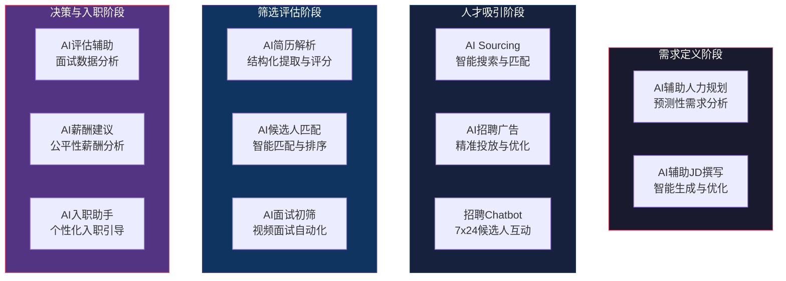
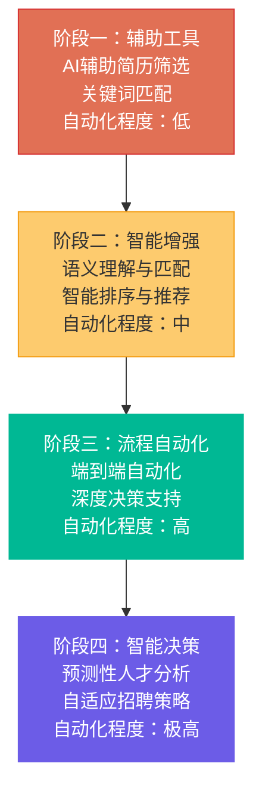
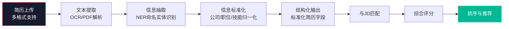
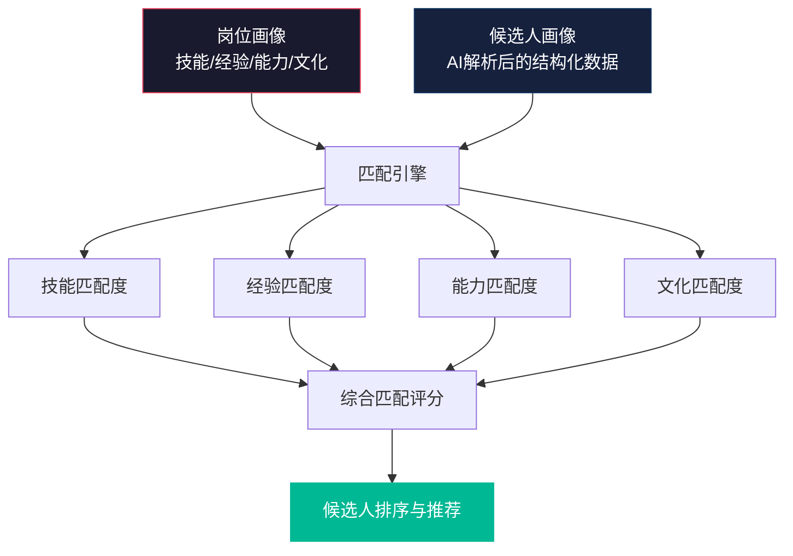
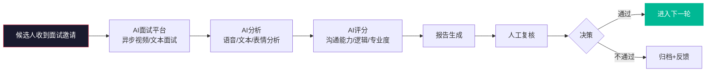
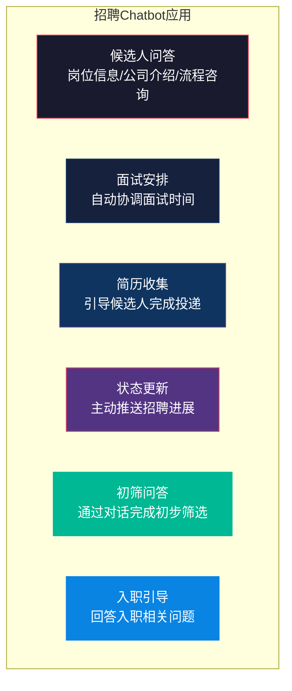
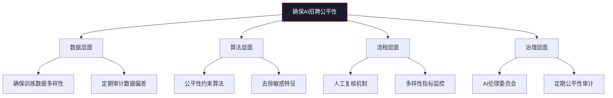
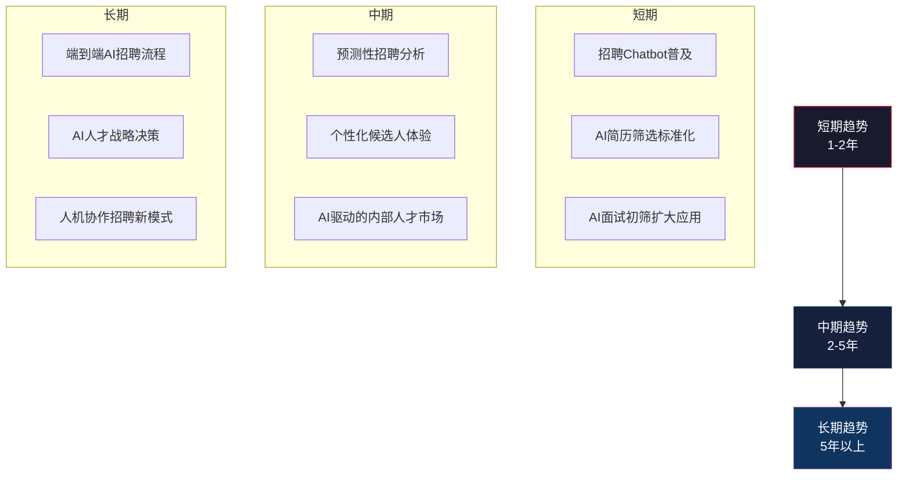
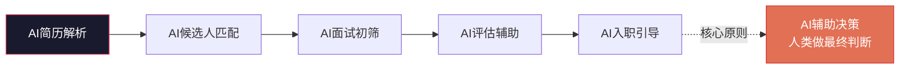

# AI如何改变招聘

> [!abstract] 核心问题
> AI正在深刻重塑招聘的每一个环节。从简历解析到候选人匹配，从面试初筛到入职预测，AI的应用正在从"辅助工具"变为"核心能力"。本章聚焦AI在招聘流程层面的应用，探讨AI如何改变招聘效率、质量和公平性。
>
> **注意**：AI面试和测评的技术原理（NLP、语音分析、情感计算等）已在 [[03-HR人事/校招测评/校招测评知识库_建设方案_v2]] 中详细覆盖，本章聚焦流程层面的AI应用。

---

## 一、AI在招聘中的应用全景

### 1.1 AI招聘应用地图

### 1.2 AI招聘的成熟度曲线

---

## 二、AI简历解析与智能筛选

### 2.1 AI简历解析的工作流程

> [!note] 技术说明
> AI简历解析涉及OCR、NLP、NER（命名实体识别）、语义匹配等技术。详细的技术原理参见 [[03-HR人事/校招测评/校招测评知识库_建设方案_v2]]。本节聚焦于流程应用。

### 2.2 AI简历筛选的优势

| 优势 | 说明 | 价值 |
|:---|:---|:---|
| 速度 | 处理1000份简历只需几分钟 | 大幅缩短初筛时间 |
| 一致性 | 所有简历使用相同标准 | 消除人工筛选的波动性 |
| 多维度 | 可同时从多个维度评分 | 比人工更全面 |
| 可追溯 | 筛选决策有记录可查 | 便于复盘和优化 |
| 24/7运行 | 不受时间限制 | 缩短候选人等待时间 |

### 2.3 AI简历筛选的局限与风险

> [!warning] AI简历筛选的核心风险
>
> **1. 算法偏见（Algorithmic Bias）**
> 如果训练数据中历史招聘存在偏见（如偏好某类学校、某类公司），AI会放大这种偏见。详见下文"AI与招聘公平性"。
>
> **2. 关键词依赖**
> AI可能因为简历中缺少特定关键词而漏掉优秀候选人。好的候选人可能只是用了不同的术语描述相同的技能。
>
> **3. 格式敏感**
> 创意设计类简历、非标准格式的简历可能被AI错误解析。
>
> **4. 缺乏上下文理解**
> AI难以理解"跨行业转行""创业经历""职业空窗期"等非标准职业路径。
>
> **5. "适合"不等于"优秀"**
> AI倾向于推荐"和历史成功员工相似的候选人"，可能阻碍多样性。

### 2.4 人机协同的最佳实践

> [!tip] 人机协同筛选策略
> 1. **AI做初筛，人工做决策**：AI负责快速过滤明显不匹配的简历
> 2. **设置人工抽检机制**：定期从AI淘汰的简历中随机抽查
> 3. **持续校准**：基于人工筛选结果反馈优化AI模型
> 4. **多样性监控**：监控AI筛选后的候选人多样性指标
> 5. **关键岗位双重确认**：关键岗位所有简历必须经过人工复核

---

## 三、AI候选人匹配

### 3.1 AI匹配的工作原理

### 3.2 AI匹配 vs 传统关键词匹配

| 维度 | 传统关键词匹配 | AI语义匹配 |
|:---|:---|:---|
| 匹配方式 | 精确或模糊关键词匹配 | 语义理解和向量匹配 |
| 同义词处理 | 需要手动配置同义词库 | 自动理解语义相似性 |
| 上下文理解 | 无法理解上下文 | 可以理解不同表述的相同含义 |
| 技能迁移 | 难以识别可迁移技能 | 可以识别跨领域的可迁移技能 |
| 学习能力 | 规则固定，无学习能力 | 基于反馈持续优化 |

---

## 四、AI面试初筛

### 4.1 AI面试初筛的流程

> [!note] 技术说明
> AI面试初筛使用的技术（语音识别、NLP、情感计算等）在 [[03-HR人事/校招测评/校招测评知识库_建设方案_v2]] 中有详细的技术原理介绍。本章聚焦于流程应用。

### 4.2 AI面试初筛的适用场景

| 适用场景 | 不适用场景 |
|:---|:---|
| 批量校招初筛 | 高管面试 |
| 初级岗位标准化评估 | 需要深度专业判断的岗位 |
| 候选人数量大、需要快速筛选 | 面试是建立雇主品牌印象的关键时刻 |
| 评估标准化能力（沟通、逻辑） | 评估创造性、领导力等复杂能力 |

### 4.3 AI面试初筛的优势与局限

> [!tip] 优势
> - **效率**：同时处理大量候选人，不受时间和地点限制
> - **一致性**：所有候选人使用相同的评估标准
> - **候选人体验**：候选人可以灵活安排面试时间
> - **数据积累**：积累结构化面试数据用于后续分析

> [!warning] 局限
> - **评估维度有限**：主要评估语言表达、逻辑清晰度等可量化的维度
> - **技术偏见**：可能对非母语者、有口音的候选人不公平
> - **缺乏互动**：候选人无法提问，单向交流体验不佳
> - **候选人接受度**：部分候选人对AI面试有抵触情绪

---

## 五、招聘Chatbot

### 5.1 招聘Chatbot的应用场景

### 5.2 招聘Chatbot的设计原则

| 原则 | 说明 |
|:---|:---|
| **透明** | 明确告知候选人正在与AI对话，而非真人 |
| **有价值** | Chatbot应能解决实际问题，而非"为了AI而AI" |
| **可升级** | 当Chatbot无法回答时，应能无缝转接人工 |
| **个性化** | 基于候选人信息和上下文提供个性化回复 |
| **多语言** | 支持候选人使用的语言 |
| **数据安全** | 保护候选人隐私和数据安全 |

---

## 六、AI与招聘公平性

### 6.1 AI招聘中的公平性风险

> [!warning] AI招聘中的公平性风险
>
> **1. 历史偏见放大**
> AI从历史招聘数据中学习，如果历史数据存在偏见（如偏好男性、偏好某类学校），AI会放大这种偏见。
>
> **2. 特征代理（Proxy Variables）**
> AI可能通过看似中性的变量（如邮政编码、兴趣爱好）推断出受保护的特征（如种族、性别）。
>
> **3. 数据缺失偏见**
> 某些群体的数据在训练集中不足，导致AI对该群体的评估准确度下降。
>
> **4. 反馈循环**
> AI筛选出某类候选人→这类候选人入职→AI学习"这类人表现好"→AI继续筛选同类人→团队多样性下降。

### 6.2 确保AI招聘公平性的措施

> [!important] 关键原则
> AI在招聘中的应用必须遵循"辅助决策而非替代决策"的原则。最终的人事决策应始终由人类做出，AI提供的是信息和建议，而非最终判断。

---

## 七、AI招聘工具评估矩阵

### 7.1 评估维度

| 维度 | 评估要点 | 权重 |
|:---|:---|:---|
| 功能匹配度 | 是否满足核心业务需求 | 30% |
| 准确度 | 筛选/匹配的准确率 | 25% |
| 公平性 | 是否存在偏见，是否通过公平性测试 | 20% |
| 易用性 | 使用门槛和用户体验 | 10% |
| 集成能力 | 与现有ATS/HR系统的集成 | 10% |
| 成本 | 总拥有成本（TCO） | 5% |

### 7.2 主流AI招聘工具分类

| 类别 | 典型工具 | 核心功能 |
|:---|:---|:---|
| AI简历解析 | Textkernel, Sovren, HireAbility | 简历结构化提取与解析 |
| AI候选人匹配 | Eightfold, Phenom, Beamery | 智能匹配与候选人推荐 |
| AI面试初筛 | HireVue, Modern Hire, Pymetrics | 视频/游戏化面试评估 |
| 招聘Chatbot | Paradox, XOR, Mya | 候选人互动与流程自动化 |
| AI Sourcing | SeekOut, Entelo, Hiretual | 智能人才搜索与触达 |

---

## 八、AI招聘的未来趋势

> [!important] 关键趋势
> AI不会取代招聘人员，但会重新定义招聘人员的角色。未来的招聘人员将从"筛选者"和"协调者"转变为"决策者"、"体验设计师"和"战略顾问"。

---

## 九、本章小结

> [!quote] 核心原则
> **AI在招聘中的最佳角色是"增强"而非"替代"人类判断。** 技术可以提升效率、减少偏见（如果设计得当），但最终的招聘决策——关于人、文化、未来的判断——仍然需要人类的智慧和同理心。

---

## 关联阅读

- [[03-HR人事/招聘与面试体系/03_简历筛选与初筛方法]] —— AI简历筛选在流程中的位置
- [[03-HR人事/招聘与面试体系/04_面试设计方法论]] —— AI面试与传统面试的关系
- [[03-HR人事/招聘与面试体系/07_招聘数据分析与效能衡量]] —— AI驱动的招聘数据分析
- [[03-HR人事/招聘与面试体系/09_招聘体系的战略视角]] —— AI对招聘战略的影响
- [[03-HR人事/校招测评/校招测评知识库_建设方案_v2]] —— AI面试技术原理（技术层面）
- [[03-HR人事/招聘与面试体系/00_MOC_招聘与面试体系中枢]] —— 返回知识库中枢

---

*最后更新于 2026-07-27*