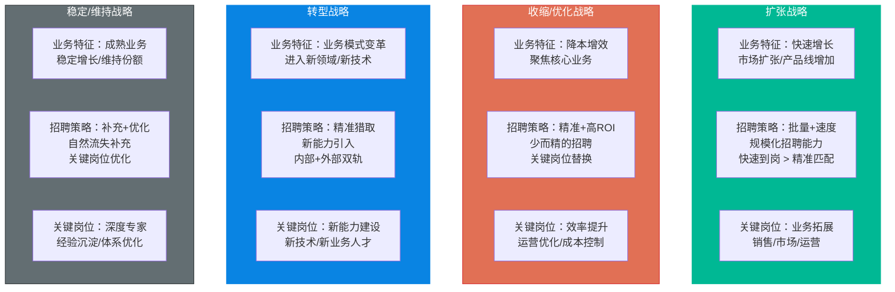
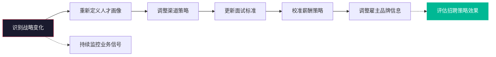
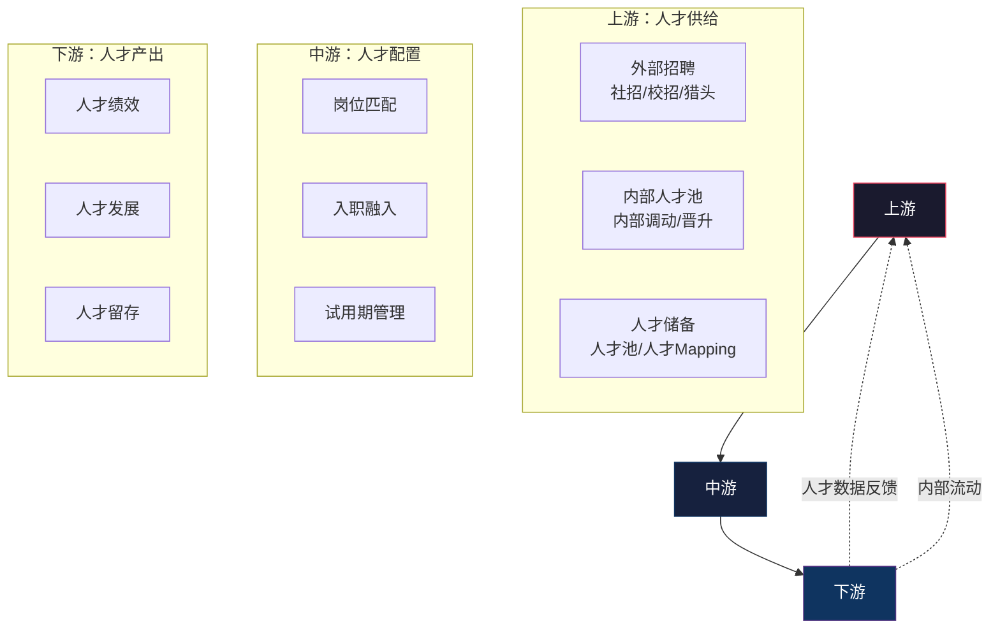
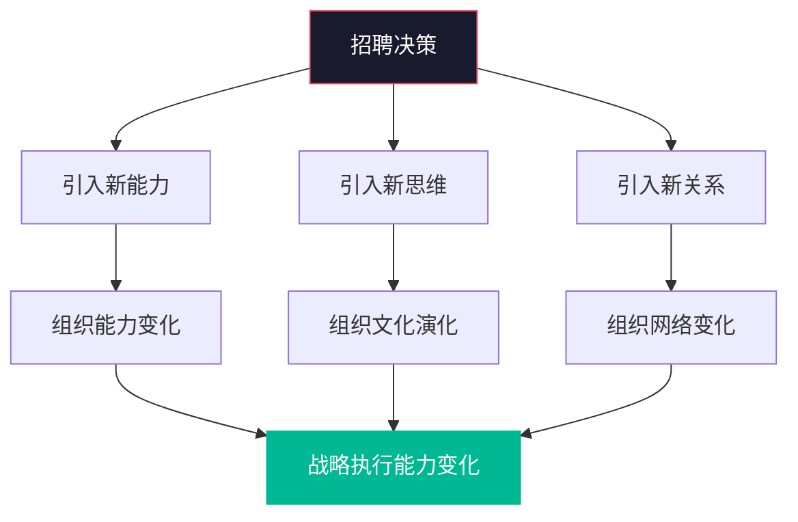
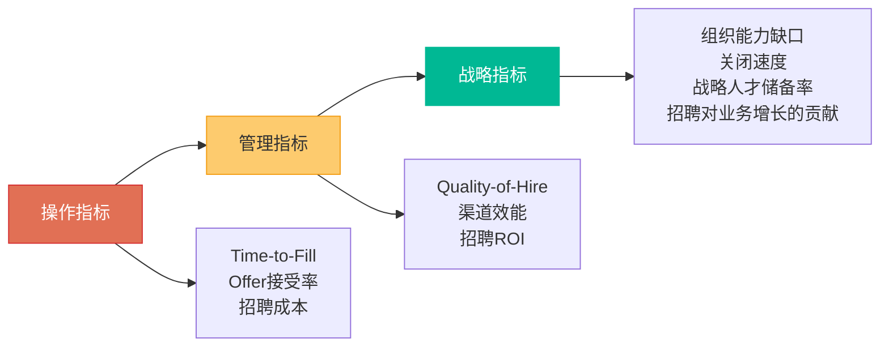
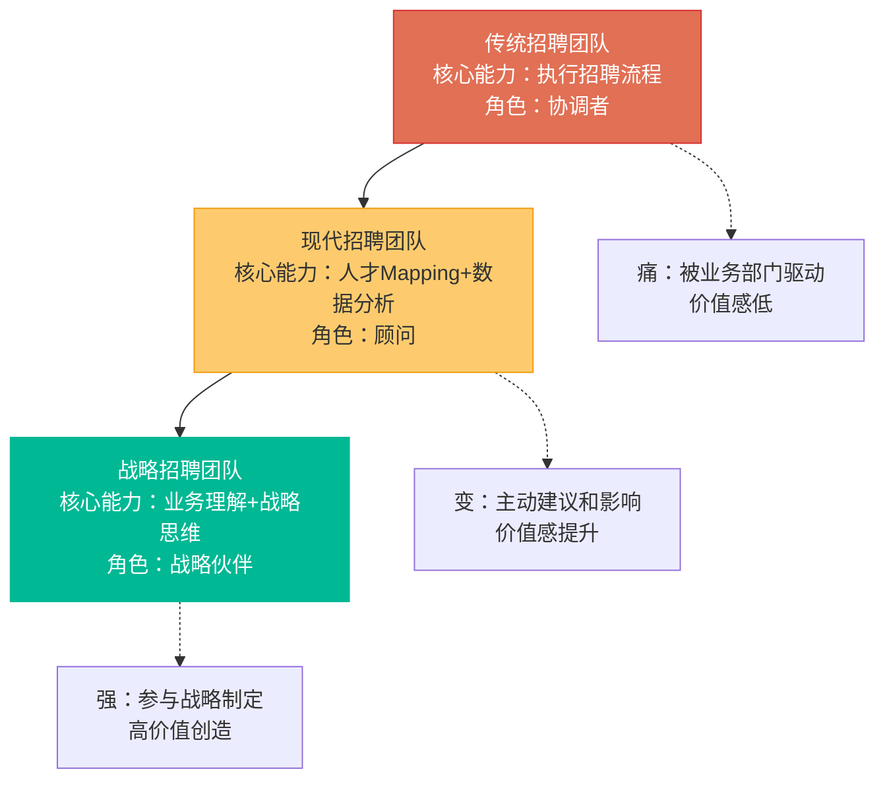
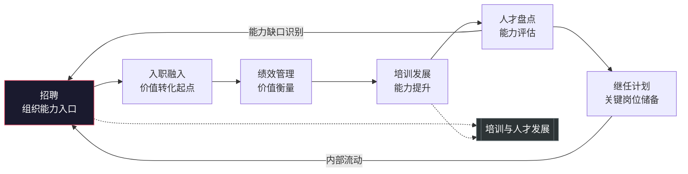
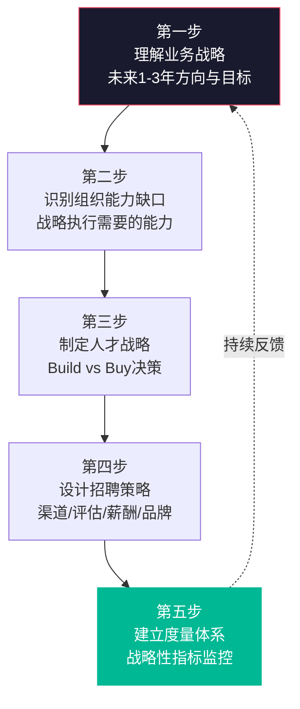
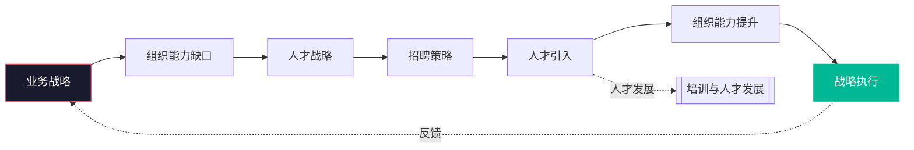

# 招聘体系的战略视角

> [!abstract] 核心问题
> 招聘不只是"填坑"——它是企业战略的落地、组织能力的入口、人才供应链的起点。本章从战略高度审视招聘体系，探讨不同业务战略下的招聘策略差异、招聘与人才供应链的衔接、招聘作为组织能力建设核心支点的战略价值。
>
> 本章与 [[03-HR人事/培训与人才发展/培训与人才发展_知识库建设方案]] 中的战略视角形成闭环，构成"招聘（入口）→ 培训发展（过程）→ 人才供给（输出）"的完整人才管理链条。

---

## 一、招聘的战略定位

### 1.1 招聘的三个层次

```mermaid
graph TB
    L1[操作层<br/>"填坑"思维<br/>有人离职就招人<br/>岗位=职位的替代] --> L2[管理层<br/>"规划"思维<br/>基于业务规划做人力规划<br/>岗位=资源的配置]
    L2 --> L3[战略层<br/>"能力构建"思维<br/>基于战略构建组织能力<br/>岗位=能力的载体]

    L1 -.->|"70%的组织处于此层"| L1A[特征：被动响应<br/>无前瞻性规划<br/>招聘与战略脱节]
    L2 -.->|"25%的组织处于此层"| L2A[特征：有规划但缺乏<br/>战略协同<br/>招聘与业务对齐]
    L3 -.->|"5%的组织处于此层"| L3A[特征：招聘是战略工具<br/>前瞻性能力布局<br/>招聘驱动组织进化]

    style L1 fill:#e17055,stroke:#d63031,color:#fff
    style L2 fill:#fdcb6e,stroke:#f39c12,color:#333
    style L3 fill:#00b894,stroke:#00b894,color:#fff
```

> [!important] 核心观点
> 招聘的最高境界不是"找到人填补空缺"，而是**通过每一次招聘决策，为组织注入未来需要的能力**。这意味着招聘人员需要理解业务战略、预判组织能力缺口、在需求出现之前就开始布局。

### 1.2 招聘的战略价值金字塔

```mermaid
graph TB
    subgraph 基础价值["基础价值：保障运营"]
        A1[按需招聘]
        A2[填补空缺]
        A3[维持运转]
    end

    subgraph 进阶价值["进阶价值：提升效率"]
        B1[缩短招聘周期]
        B2[降低招聘成本]
        B3[提升招聘质量]
    end

    subgraph 高阶价值["高阶价值：驱动增长"]
        C1[构建核心能力]
        C2[引入新思维和方法]
        C3[支撑业务转型]
    end

    subgraph 最高价值["最高价值：塑造未来"]
        D1[定义组织基因]
        D2[布局未来能力]
        D3[塑造组织文化]

    基础价值 --> 进阶价值 --> 高阶价值 --> 最高价值

    style 基础价值 fill:#e17055,stroke:#d63031,color:#fff
    style 进阶价值 fill:#fdcb6e,stroke:#f39c12,color:#333
    style 高阶价值 fill:#00b894,stroke:#00b894,color:#fff
    style 最高价值 fill:#6c5ce7,stroke:#6c5ce7,color:#fff
```

---

## 二、不同业务战略下的招聘策略

### 2.1 业务战略与招聘策略的匹配



### 2.2 各战略下招聘策略的详细对比

| 维度 | 扩张战略 | 收缩战略 | 转型战略 | 稳定战略 |
|:---|:---|:---|:---|:---|
| **招聘规模** | 大 | 小 | 中 | 中 |
| **招聘速度** | 快 | 不急于填补 | 精准 | 正常 |
| **人才来源** | 外部为主 | 内部优先 | 外部+内部 | 内部为主 |
| **渠道策略** | 多渠道并行 | 精准渠道 | 猎头+定向 | 内推+招聘网站 |
| **薪酬策略** | 有竞争力 | 控制成本 | 关键岗位溢价 | 市场平均水平 |
| **雇主品牌** | 成长故事 | 稳定价值 | 变革故事 | 专业深度 |
| **评估重点** | 潜力+执行力 | 效率+经验 | 新能力+适应力 | 深度+稳定性 |
| **主要风险** | 文化稀释 | 士气影响 | 新老融合 | 创新不足 |

### 2.3 战略调整时的招聘转型

> [!warning] 战略转型中的招聘挑战
> 当企业战略发生重大调整时，招聘策略需要同步转型。但常见的挑战是：**招聘团队仍然在用旧战略的思维招人**。

**战略转型中的招聘转型路线图**：



---

## 三、招聘与人才供应链

### 3.1 人才供应链模型



> [!important] 人才供应链的核心思维
> 将人才管理类比为供应链管理：**在正确的时间、以合理的成本、将合适的人配置到需要的位置。** 这要求招聘不能只关注"进货"（外部招聘），还需要关注"库存管理"（内部人才池）和"需求预测"（人力规划）。

### 3.2 招聘的"Make vs Buy"决策

| 决策维度 | Build（内部培养） | Buy（外部招聘） |
|:---|:---|:---|
| **适用场景** | 能力可在内部培养 | 能力需要从外部引入 |
| | 时间不是关键约束 | 时间紧迫，需要快速到位 |
| | 组织内有培养资源 | 组织内缺乏该能力 |
| | 文化匹配度要求高 | 需要引入外部视角 |
| **优势** | 成本低、文化匹配度高 | 速度快、新能力引入 |
| **劣势** | 周期长、培养风险 | 成本高、融入风险 |
| **决策因素** | 能力稀缺度、时间紧迫度、培养可行性 | |

> [!tip] Make vs Buy 决策框架
> 1. 该能力在市场上是否稀缺？
> 2. 我们有多长时间可以等待？
> 3. 内部是否有培养该能力的条件？
> 4. 该能力是否需要与现有文化高度融合？
> 5. 外部招聘和内部培养的成本对比如何？

---

## 四、招聘作为组织能力的入口

### 4.1 每一次招聘都是组织能力的一次投资



> [!important] 关键认知
> 每一次招聘决策，不仅仅是"多了一个人"，而是：
> - **组织能力的一次微调**：新人的技能组合会影响团队的能力分布
> - **组织文化的一次演化**：新人的价值观和行为方式会影响团队文化
> - **组织网络的一次重构**：新人的加入会改变团队的信息流动和协作模式

### 4.2 招聘驱动组织能力进化的路径

| 阶段 | 招聘的角色 | 核心行动 |
|:---|:---|:---|
| 被动响应 | "填坑者" | 业务部门提出需求 → 招聘执行 |
| 主动规划 | "规划者" | 基于业务规划做人力规划 |
| 能力构建 | "建设者" | 识别组织能力缺口 → 主动招聘布局 |
| 战略驱动 | "战略伙伴" | 参与战略制定 → 人才战略前置 |

### 4.3 招聘与组织文化的相互作用

> [!note] 招聘对组织文化的双向影响
> - **正向影响**：通过招聘符合文化价值观的人，强化组织文化
> - **负向影响**：过度追求"文化匹配"可能导致同质化，抑制创新
> - **演化影响**：战略性引入不同背景的人，推动文化演化

---

## 五、招聘的战略性指标

### 5.1 从操作指标到战略指标



### 5.2 战略性招聘指标

| 指标 | 定义 | 战略意义 |
|:---|:---|:---|
| 战略岗位填充率 | 被定义为"战略关键岗位"的招聘完成率 | 直接衡量招聘对战略的支撑 |
| 组织能力缺口关闭速度 | 从识别能力缺口到引入对应人才的周期 | 衡量组织能力建设的敏捷度 |
| 人才储备覆盖率 | 关键岗位是否有ready-now的继任者 | 衡量人才供应链的健康度 |
| 招聘对增长的贡献 | 新员工带来的业务增长贡献 | 衡量招聘的投资回报 |
| 人才多样性指数 | 不同背景人才的比例和分布 | 衡量组织的创新潜力 |

---

## 六、招聘团队的战略转型

### 6.1 招聘团队的能力演进



### 6.2 招聘人员的能力升级路径

| 能力维度 | 传统要求 | 战略要求 |
|:---|:---|:---|
| 业务理解 | 理解JD中的岗位要求 | 理解业务战略和商业模式 |
| 数据分析 | 统计招聘数量和时间 | 分析招聘效能和预测趋势 |
| 人才洞察 | 知道去哪里找人 | 理解人才市场趋势和人才供应链 |
| 影响力 | 执行招聘流程 | 影响业务部门的用人决策 |
| 战略思维 | 关注招聘任务的完成 | 关注招聘如何支撑业务战略 |

---

## 七、与人才管理全链条的衔接

### 7.1 招聘在人才管理全链条中的位置



> [!important] 与 [[03-HR人事/培训与人才发展/培训与人才发展_知识库建设方案]] 的闭环
> 招聘是人才管理链条的起点，[[03-HR人事/培训与人才发展/培训与人才发展_知识库建设方案]] 是人才管理链条的核心环节。两者形成闭环：
> - **招聘** → 引入人才 → **培训发展** → 提升能力 → 人才盘点 → 识别缺口 → **招聘** → ...
> - 招聘的质量直接影响培训发展的起点
> - 培训发展的效果反馈影响招聘标准的校准

### 7.2 招聘与人才发展的协同

| 协同点 | 招聘侧行动 | 人才发展侧行动 |
|:---|:---|:---|
| 能力标准 | 基于能力模型定义招聘标准 | 基于能力模型设计培训体系 |
| 新人融入 | 入职前传递准确期望 | 入职后提供系统培训 |
| 数据反馈 | 提供新员工绩效数据 | 反馈培训效果和改进建议 |
| 人才规划 | 基于组织能力缺口招聘 | 基于人才盘点制定培养计划 |

---

## 八、招聘战略的制定框架

### 8.1 招聘战略制定五步法



### 8.2 招聘战略对齐矩阵

| 业务战略要素 | 对招聘的影响 | 招聘策略调整 |
|:---|:---|:---|
| 目标市场/客户 | 需要什么样行业经验的人 | 调整候选人行业背景要求 |
| 产品/技术路线 | 需要什么样技术能力的人 | 调整技术栈和技能要求 |
| 增长模式 | 招聘规模和速度 | 调整渠道策略和招聘节奏 |
| 竞争格局 | 人才竞争激烈程度 | 调整薪酬策略和雇主品牌 |
| 组织文化 | 需要什么样文化匹配的人 | 调整文化评估维度和标准 |

---

## 九、本章小结



> [!quote] 核心信念
> **招聘不是"填坑"，而是组织能力的入口。每一次招聘决策，都是对未来组织能力的一次投资。** 从战略视角看招聘，意味着招聘团队不再是被动的"执行者"，而是主动的"组织能力构建者"。这需要招聘人员具备业务理解力、战略思维力和人才洞察力——这也是本知识库希望帮助读者建立的核心能力。

---

## 关联阅读

- [[03-HR人事/招聘与面试体系/01_招聘需求分析：从业务需求到JD]] —— 战略视角下的需求分析
- [[03-HR人事/招聘与面试体系/02_渠道策略与人才sourcing]] —— 渠道策略与战略的匹配
- [[03-HR人事/招聘与面试体系/07_招聘数据分析与效能衡量]] —— 战略性招聘指标
- [[03-HR人事/招聘与面试体系/08_AI如何改变招聘]] —— AI对招聘战略的影响
- [[03-HR人事/培训与人才发展/培训与人才发展_知识库建设方案]] —— 人才管理全链条的衔接
- [[02-AI趋势与素养/AI时代能力要求/00_MOC_AI时代能力要求中枢]] —— 能力模型与招聘标准的关联
- [[03-HR人事/招聘与面试体系/00_MOC_招聘与面试体系中枢]] —— 返回知识库中枢

---

*最后更新于 2026-07-27*