# 校招测评知识库 🎓

> 覆盖行测、AI 面试、性格测评三大核心关卡。按环节检索，按题型突破。

---

## 模块速览

```mermaid
flowchart TD
    START[🎓 校招测评] --> A[🧠 行测]
    START --> B[🤖 AI面试]
    START --> C[🧩 性格测评]
    START --> D[📋 备战体系]

    A --> A1["[[03-HR人事/校招测评/行测/行测_判断推理]] ⭐提分最快"]
    A --> A2["[[03-HR人事/校招测评/行测/行测_资料分析]] ⭐送分最稳"]
    A --> A3["[[03-HR人事/校招测评/行测/行测_言语理解]]"]
    A --> A4["[[03-HR人事/校招测评/行测/行测_数量关系]]"]
    A --> A5["[[03-HR人事/校招测评/行测/行测_常识判断]]"]
    A --> A6["[[03-HR人事/校招测评/行测/行测_冲刺要点汇总]] ⭐考前必看"]

    B --> B1["[[03-HR人事/校招测评/AI面试/AI面试_评分逻辑]] ⭐先看这篇"]
    B --> B2["[[03-HR人事/校招测评/AI面试/AI面试_行为题题库]]"]
    B --> B3["[[03-HR人事/校招测评/AI面试/AI面试_情景题题库]]"]
    B --> B4["[[03-HR人事/校招测评/AI面试/AI面试_高频题库_带答案]]"]
    B --> B5["[[03-HR人事/校招测评/AI面试/AI面试_技术篇]]"]

    C --> C1["[[03-HR人事/校招测评/性格测评/性格测评_基本原理]]"]
    C --> C2["[[03-HR人事/校招测评/性格测评/性格测评_避坑指南]] ⭐最重要"]
    C --> C3["[[03-HR人事/校招测评/性格测评/性格测评_名企偏好]]"]
    C --> C4["[[03-HR人事/校招测评/性格测评/性格测评_实战策略]]"]
    C --> C5["[[03-HR人事/校招测评/性格测评/性格测评_游戏化测评]]"]

    D --> D1["[[03-HR人事/校招测评/备战/备战_时间规划]]"]
    D --> D2["[[03-HR人事/校招测评/备战/备战_每日训练计划]]"]
    D --> D3["[[03-HR人事/校招测评/备战/备战_模拟与复盘]]"]
    D --> D4["[[03-HR人事/校招测评/备战/备战_资源汇总]] ⭐备战三步法"]
```

| 模块 | 笔记数 | 刷人比例 | 建设进度 |
|---|---|---|---|---|
| 🧠 行测 | 6 篇 | 60%-80% | ✅ 6/6 |
| 🤖 AI 面试 | 5 篇 | 50%-70% | ✅ 5/5 |
| 🧩 性格测评 | 5 篇 | 30%-50% | ✅ 5/5 |
| 📋 备战 | 4 篇 | — | ✅ 4/4 |

---

## 使用指南

| 你的状态 | 打开什么 |
|---|---|
| 刚收到笔试通知，还有 3 天 | `行测/` → 看题型对应的「解题套路」和「速杀技巧」 |
| 笔试前 30 分钟 | 扫对应题型的「常见陷阱」 |
| 拿到北森测评题库，不知道从哪刷起 | `题库/` → [[03-HR人事/校招测评/题库/北森测评_题库索引]]（714 题真题，先看北森考点分布） |
| 收到 AI 面试通知 | `AI面试/` → 先看「评分逻辑」，再练「高频题库」 |
| 要做性格测评了 | `性格测评/` → 先看「避坑指南」 |
| 整个秋招还没开始准备 | `备战/` → 「时间规划」+「每日训练计划」 |

---

## 关联笔记

- [[03-HR人事/校招测评/校招测评知识库_建设方案]] — 完整建设方案
- [[05-产品与开发/Vibe Coder/Vibe Coder 常见问题全景图]] — Vibe Coder 视角的全阶段痛点
- [[05-产品与开发/Vibe Coder/AI产品开发导航系统]] — 同样用「活文档导航」管理复杂项目
