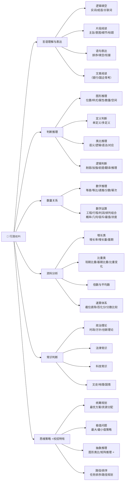
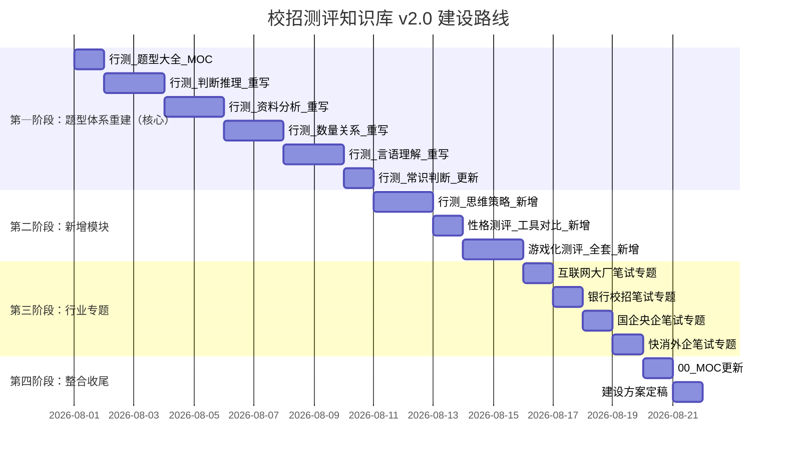

# 校招测评知识库 — 建设方案 v2.0

> [!danger] 版本说明
> 本版 v2.0 是对原版校招测评知识库的**全面修订**，主要解决两个问题：
> 1. **题型不全** — 原版行测仅笼统分为5类，未深入细分题型；缺少校招特有的"思维策略"模块（银行EPI必考）
> 2. **内容偏差** — 原版混用了公务员行测框架，未区分校招测评（北森/智鼎/赛码）与公务员行测的差异；缺少题型细分方法论
>
> **修订依据**：2026年最新校招考情数据，覆盖互联网、银行、国企、快消四大行业笔试真题分析。

---

## 一、核心认知：校招测评 ≠ 公务员行测

这是原版内容最大的偏差——把校招测评直接套用公务员行测框架。两者有本质区别：

| 维度 | 公务员行测 | 校招测评（EPI/行测） |
|------|-----------|-------------------|
| 考试目的 | 筛选政府行政人员 | 筛选企业潜力员工 |
| 时间压力 | 120分钟135题，约53秒/题 | 通常60-90秒/题，EPI单题仅45秒 |
| 核心题型 | 五大模块固定 | 增加了**思维策略**、**空间能力**、**抽象推理**等 |
| 难度分布 | 梯度明显，区分度大 | 基础题为主，拼速度和准确率 |
| 出题机构 | 国家公务员局统一命题 | 北森、智鼎、赛码、牛客、企业自研等多家平台 |
| 行业差异 | 全国统一卷 | 互联网/银行/国企/快消题型差异巨大 |

> 校招EPI（通用就业能力测试）与公务员行测底层逻辑相似，但**题型范围更广、单题时间更紧、行业差异更大**。备考策略必须"因企施策"。

---

## 二、知识库总览

```mermaid
flowchart TD
    START[🎓 校招测评知识库 v2.0]

    START --> A[🧠 行测/EPI<br/>五大核心模块]
    START --> B[🧩 性格测评<br/>六大工具+避坑]
    START --> C[🤖 AI面试<br/>评分+题库+实战]
    START --> D[👥 群面<br/>角色+案例+模拟]
    START --> E[🎮 游戏化测评<br/>Pymetrics+认知游戏]
    START --> F[📝 专业笔试<br/>分岗位题库]
    START --> G[🏢 行业×企业专题<br/>按行业+公司索引]
    START --> H[📋 备战体系<br/>规划+训练+资源]

    A --> A1["[[03-HR人事/校招测评/行测/行测_言语理解]]"]
    A --> A2["[[03-HR人事/校招测评/行测/行测_判断推理]]"]
    A --> A3["[[03-HR人事/校招测评/行测/行测_数量关系]]"]
    A --> A4["[[03-HR人事/校招测评/行测/行测_资料分析]]"]
    A --> A5["[[03-HR人事/校招测评/行测/行测_常识判断]]"]
    A --> A6["[[行测_思维策略]] ⭐校招新增"]

    B --> B1["[[03-HR人事/校招测评/性格测评/性格测评_基本原理]]"]
    B --> B2["[[性格测评_六大工具对比]] ⭐新增"]
    B --> B3["[[03-HR人事/校招测评/性格测评/性格测评_避坑指南]]"]
    B --> B4["[[03-HR人事/校招测评/性格测评/性格测评_名企偏好]]"]
    B --> B5["[[03-HR人事/校招测评/性格测评/性格测评_实战策略]]"]

    C --> C1["[[03-HR人事/校招测评/AI面试/AI面试_评分逻辑]]"]
    C --> C2["[[03-HR人事/校招测评/AI面试/AI面试_行为题题库]]"]
    C --> C3["[[03-HR人事/校招测评/AI面试/AI面试_情景题题库]]"]
    C --> C4["[[03-HR人事/校招测评/AI面试/AI面试_高频题库_带答案]]"]
    C --> C5["[[03-HR人事/校招测评/AI面试/AI面试_技术篇]]"]

    D --> D1["[[群面_角色定位]]"]
    D --> D2["[[群面_发言框架]]"]
    D --> D3["[[群面_经典案例]]"]
    D --> D4["[[群面_常见翻车]]"]
    D --> D5["[[群面_模拟指南]]"]

    E --> E1["[[游戏化测评_认知能力测试]] ⭐新增"]
    E --> E2["[[游戏化测评_Pymetrics详解]] ⭐新增"]
    E --> E3["[[游戏化测评_企业应用]] ⭐新增"]

    G --> G1["[[互联网大厂笔试专题]] ⭐新增"]
    G --> G2["[[银行校招笔试专题]] ⭐新增"]
    G --> G3["[[国企央企笔试专题]] ⭐新增"]
    G --> G4["[[快消外企笔试专题]] ⭐新增"]
```



| 模块 | 笔记数 | 刷人比例 | 建设状态 |
|------|--------|---------|---------|
| 🧠 行测/EPI（含思维策略） | 6 篇 → 大幅扩展子题型 | 60%-80% | 🔄 需重写 |
| 🧩 性格测评 | 5 篇（新增工具对比） | 30%-50% | 🔄 待补充 |
| 🤖 AI 面试 | 5 篇 | 50%-70% | ✅ 可用 |
| 👥 群面 | 5 篇 | 50%-60% | ✅ 可用 |
| 🎮 游戏化测评 | 3 篇（新增模块） | 20%-40% | 🆕 新增 |
| 📝 专业笔试 | 5 篇（分岗位） | 岗位相关 | ✅ 可用 |
| 🏢 行业×企业专题 | 4 篇（新增模块） | 针对性极强 | 🆕 新增 |
| 📋 备战体系 | 4 篇 | — | ✅ 可用 |

---

## 三、模块一：行测/EPI — 完整题型体系（核心修订）

### 3.1 原版问题

原版将行测简单分为5个模块（言语、数量、判断、资料、常识），**但每个模块下缺少题型细分**，导致知识库内容空洞、无法落地。修订版将每个模块拆解为**子题型→解题方法论→经典例题→速算技巧→常见陷阱**五层结构。

### 3.2 完整题型树



### 3.3 各题型详细分解

#### 3.3.1 言语理解与表达（30题，占比约 25%）

| 子题型 | 细分考点 | 题量占比 | 难度 |
|--------|---------|---------|------|
| 逻辑填空 | 实词辨析、成语辨析、关联词辨析 | 40% | ⭐⭐ |
| 片段阅读 | 主旨概括、意图判断、细节理解、标题选择、词句理解 | 40% | ⭐⭐⭐ |
| 语句表达 | 语句排序、语句填空、下文推断 | 15% | ⭐⭐⭐ |
| 文章阅读 | 综合阅读（银行/国企专属，1篇文章5题） | 5% | ⭐⭐ |

**解题方法论**：
- 逻辑填空：不凭语感做题，用"语境分析+词语辨析"双线法
- 片段阅读：转折之后是重点（但是/然而/却），递进之后是核心（更/甚至/尤其）
- 语句排序：首句排除法+捆绑集团法+顺序验证法
- 文章阅读：先读题再读文，定位关键句

#### 3.3.2 判断推理（35-40题，占比约 30%）

**（1）图形推理（10题）**

| 规律大类 | 具体考点 | 特征图 |
|---------|---------|-------|
| 位置规律 | 平移、旋转、翻转 | 元素组成完全相同 |
| 样式规律 | 加减同异、黑白运算、遍历 | 元素组成相似 |
| 属性规律 | 对称性（轴/中心）、曲直性、开闭性 | 元素组成凌乱 |
| 数量规律 | 点（交点/端点）、线（笔画数）、面（封闭区间）、素（种类/个数）、角 | 元素组成凌乱且无属性规律 |
| 空间重构 | 六面体折纸盒、四面体、截面图、立体拼合 | 空间类题型 |

**破题口诀**：相同看位置，相似看样式，不同看属性，凌乱数数量，复杂想空间。

**（2）定义判断（10题）**

| 类型 | 解题方法 |
|------|---------|
| 单定义 | 抓主体+客体+条件+方式+目的+结果，逐一比对排除 |
| 多定义 | 先确定目标定义，再找关键信息，排除干扰定义 |

**（3）类比推理（10题）**

| 关系类型 | 细分考点 |
|---------|---------|
| 语义关系 | 近义/反义/比喻义/象征义 |
| 逻辑关系 | 全同/并列/交叉/包含/对应/条件/因果 |
| 语法关系 | 主谓/动宾/偏正/并列 |
| 对应关系 | 功能/材料/工具/场所/时间/顺承 |

**（4）逻辑判断（10题）**

| 题型 | 考频 | 解题方法 |
|------|------|---------|
| 削弱型 | ⭐⭐⭐⭐⭐ | 否定论点>拆桥>否定论据>因果倒置 |
| 加强型 | ⭐⭐⭐⭐⭐ | 搭桥>必要条件>解释>举例 |
| 前提假设型 | ⭐⭐⭐⭐ | 搭桥法（找论点和论据的跳跃概念） |
| 翻译推理 | ⭐⭐⭐ | 如果A就B（A→B），只有A才B（B→A） |
| 真假推理 | ⭐⭐ | 找矛盾关系，一真其余全假 |
| 归纳推理 | ⭐⭐ | 主题一致、可能优先、无中生有排除 |

#### 3.3.3 数量关系（10-15题，占比约 15%）

**数字推理**：

| 数列类型 | 特征 | 解题思路 |
|---------|------|---------|
| 等差数列 | 相邻项差值恒定或等差 | 做差法 |
| 等比数列 | 相邻项比值恒定或等比 | 做商法 |
| 递推数列 | 前两项通过运算得到第三项 | 和/差/积/商递推 |
| 分数数列 | 分子分母分别有规律 | 分开看/通分/约分 |
| 幂次数列 | 平方/立方数附近 | 识别幂次特征 |
| 组合数列 | 奇偶项/两两分组各自规律 | 分组法 |

**数学运算**：

| 题型 | 核心公式/方法 | 考频 |
|------|-------------|------|
| 工程问题 | 工作总量=效率×时间，赋值法 | ⭐⭐⭐⭐⭐ |
| 行程问题 | S=VT，相遇/追及/流水行船 | ⭐⭐⭐⭐⭐ |
| 利润问题 | 售价=成本×(1+利润率) | ⭐⭐⭐⭐ |
| 排列组合 | 分类加法/分步乘法，捆绑/插空/隔板 | ⭐⭐⭐⭐ |
| 概率问题 | P=A事件数/总事件数，分步/分类概率 | ⭐⭐⭐⭐ |
| 几何问题 | 平面/立体图形公式，相似/勾股定理 | ⭐⭐⭐ |
| 容斥问题 | 两集合/三集合公式 | ⭐⭐⭐ |
| 最值问题 | 最不利原则、构造数列 | ⭐⭐⭐ |
| 浓度问题 | 溶质=溶液×浓度，十字交叉法 | ⭐⭐ |
| 年龄问题 | 年龄差不变，列表法 | ⭐⭐ |

#### 3.3.4 资料分析（20题，占比约 20%）

**核心考点**：

| 考点 | 公式 | 速算技巧 |
|------|------|---------|
| 增长率 | r=(现期-基期)/基期 | 百化分、放缩法 |
| 增长量 | Δ=现期×r/(1+r) | n+1原则（r=1/n时，Δ=现期/(n+1)） |
| 基期量 | 基期=现期/(1+r) | 截位直除 |
| 现期比重 | 比重=部分/整体 | 直除 |
| 基期比重 | (A/B)×(1+b)/(1+a) | 先算A/B，再乘(1+b)/(1+a) |
| 比重变化 | 比重差=(A/B)×(a-b)/(1+a) | 判断升降（a>b则比重上升） |
| 平均数 | 平均数=总数/个数 | 截位 |

**速算体系**（单独成篇）：
- 截位直除：看选项差距决定截几位
- 百化分：1/2=50%，1/3≈33.3%，1/4=25%，1/5=20%，1/6≈16.7%，1/7≈14.3%，1/8=12.5%，1/9≈11.1%，1/10=10%，1/12≈8.3%，1/14≈7.1%，1/15≈6.7%，1/16=6.25%
- 分数比较：一大一小直接看，同大同小比变化率

#### 3.3.5 常识判断（15题，占比约 10%）

| 领域 | 内容范围 | 备考建议 |
|------|---------|---------|
| 政治理论 | 最新时政、二十大精神、创新理论、党和国家方针政策 | **重点**，关注近半年时政 |
| 法律常识 | 宪法、民法典、行政法、劳动法 | 基础法条为主 |
| 科技常识 | 前沿科技、AI/大数据、航天、生物 | 关注科技新闻 |
| 文史常识 | 中国古代史、近现代史、文化常识 | 高频考点集中 |
| 地理国情 | 中国地理、世界地理、环境生态 | 基础识记 |
| 经济常识 | 宏观经济、微观经济、经济术语 | 基础概念 |

> 2026年新增趋势：**政治理论**成为独立考查板块，时政占比显著提升，部分企业（尤其是国企）增加了"企业文化认知"题。

#### 3.3.6 思维策略（校招EPI特有，新增模块 ⭐）

**这是原版完全缺失的模块**。思维策略是银行/国企校招EPI区别于公务员行测的**标志性题型**，主要考察统筹规划能力和最优方案选择能力。

| 题型 | 说明 | 典型题 |
|------|------|-------|
| 统筹规划 | 在有限资源下寻找最优方案 | 如何安排生产使利润最大 |
| 极值策略 | 寻找最大/最小值 | 最少需要多少人才能完成任务 |
| 抽象推理 | 图形类比、矩阵推理、数字矩阵 | 九宫格找规律、图形序列推理 |
| 路径规划 | 最短路径/最优路线 | 快递员最短送货路线 |
| 任务排序 | 多项任务的时间安排优化 | 如何安排工序使总时间最短 |

> 思维策略在银行EPI中占比约 10%-15%，在工商银行、建设银行等笔试中几乎必考，是**拉开分差的关键模块**。

---

## 四、模块二：性格测评 — 工具对比 + 实战策略

### 4.1 原版问题

原版只提到了MBTI、DISC、大五人格、Hogan、SHL五种工具，但**缺少工具对比和选择逻辑**，且未说明校招中真正高频使用的工具是哪些。

### 4.2 六大主流工具对比（新增）

| 工具 | 理论维度 | 校招使用频率 | 优点 | 缺点 | 适用场合 |
|------|---------|-------------|------|------|---------|
| MBTI | 16种性格类型 | ⭐⭐⭐⭐⭐ | 最广泛认知，易理解 | 二分法过于简化 | 互联网/外企通用 |
| DISC | 4种行为风格 | ⭐⭐⭐⭐⭐ | 简单直观，岗位匹配清晰 | 对复杂人格描述不足 | 销售/管理岗 |
| 大五人格 (OCEAN) | 5维度连续评分 | ⭐⭐⭐⭐ | 心理学信度高，预测力强 | 结果报告较抽象 | 学术研究/高端岗位 |
| 霍兰德 | 6种职业兴趣类型 | ⭐⭐⭐⭐ | 职业方向匹配直观 | 不测性格特质 | 校招通用（首轮筛选） |
| PDP | 5种动物特质 | ⭐⭐⭐ | 结果形象易懂，岗位匹配好 | 理论深度不足 | 国企/制造业 |
| 九型人格 (Enneagram) | 9种人格类型 | ⭐⭐ | 深度分析动机 | 信效度争议大 | 辅助参考 |

### 4.3 校招性格测评的"隐形规则"

- **测谎机制**：系统内置重复题/反向题/极端题，前后矛盾直接判定"作答失真"
- **时间监控**：答题速度异常（过快/过慢）会被标记，正常每题约 5-8 秒
- **社会赞许性**：过度美化自己（全部选"完全符合"）触发预警
- **企业偏好模型**：互联网偏好"高开放性+高尽责性"，国企偏好"高宜人性+中度保守"，外企偏好"高外向性+高开放性"

---

## 五、模块三：游戏化测评（新增模块 ⭐）

### 5.1 什么是游戏化测评

通过小游戏测量候选人的认知能力（反应速度、记忆力、注意力）、决策风格（冒险vs保守）和风险偏好。候选人体验好、造假难度高，越来越多企业采用。

### 5.2 主流平台

| 平台 | 特点 | 应用企业 |
|------|------|---------|
| Pymetrics | 12款小游戏，基于神经科学，评估认知和情感特质 | Meta、联合利华、部分互联网大厂 |
| 北森游戏化测评 | 手指灵敏度测试、抗干扰测试等，支持23种方言语音播报 | 蒙牛、制造业蓝领招聘 |
| Arctic Shores | 英国平台，游戏化行为评估 | 外企管培生项目 |
| 智鼎游戏化测评 | 专注力、记忆力、逻辑思维类游戏 | 国企/银行校招 |

### 5.3 常见游戏类型

| 游戏类型 | 测量维度 | 难度 |
|---------|---------|------|
| 反应速度测试 | 信息处理速度、手眼协调 | ⭐⭐ |
| 记忆测试 | 短时记忆、工作记忆 | ⭐⭐⭐ |
| 风险决策游戏 | 风险偏好、损失厌恶 | ⭐⭐ |
| 专注力测试 | 抗干扰能力、持续注意力 | ⭐⭐⭐ |
| 逻辑推理游戏 | 问题解决能力、策略思维 | ⭐⭐⭐⭐ |

---

## 六、模块四：行业×企业专题（新增模块 ⭐）

### 6.1 为什么需要这个模块

**不同行业、不同企业的校招测评差异巨大**。互联网侧重编程+行测，银行侧重EPI+综合知识+英语，国企侧重行测+企业文化+时政，快消侧重性格测评+游戏化测评+案例分析。原版未区分这些差异，导致内容"一刀切"——这是内容不对的主要原因之一。

### 6.2 四大行业测评对比

| 维度 | 互联网大厂 | 银行/金融 | 国企/央企 | 快消/外企 |
|------|-----------|----------|----------|----------|
| 核心平台 | 牛客网、赛码、企业自研 | 北森、智鼎 | 北森、智鼎、易考 | Pymetrics、SHL |
| 题型侧重点 | 编程题(60%)+行测(30%) | EPI(40%)+综合知识(30%)+英语 | 行测(50%)+性格(30%)+时政 | 性格测评(40%)+游戏化(30%) |
| 行测占比 | 30%（部分岗位不考行测） | 40%-50%（EPI） | 50%-60% | 20%-30% |
| 特色题型 | 算法题、系统设计、AIGC场景题 | 思维策略、经济金融知识、英语 | 企业文化、时政热点、公文写作 | 案例分析、小组讨论、游戏化测评 |
| 淘汰率 | 60%-80% | 50%-70% | 40%-60% | 50%-80% |
| 2026趋势 | AI评分权重提升至40%-60% | 增加AI面试环节 | 行测单题限时60-90秒 | 游戏化测评比例提升 |

### 6.3 重点企业测评流程

**互联网大厂**：
- **字节跳动**：5道编程题(150分钟)，AI评分权重60%，AIGC相关算法题，自研"火山引擎"测评系统
- **阿里巴巴**：4道编程题(120分钟)，AI评分40%，云原生场景题，关注业务落地能力
- **腾讯**：4-5道编程题，AI评分50%，采用赛码系统，动态题库每周更新15%新题型
- **华为**：3道编程题(90分钟)，AI评分30%，6G通信算法，需下载专用客户端
- **京东**：TET管培生笔试含行测(30%-50%)+性格测评+AI面试，多轮筛选

**银行**：
- **工商银行**：EPI(言语/数量/逻辑/思维策略/资料分析)+综合知识+英语，每年题型变动较大
- **中国银行**：EPI题量占25%-65%，英语占比高
- **建设银行**：EPI为主，综合知识侧重经济金融

**国企**：多数采用北森系统，行测单题限时60-90秒，新增思维策略题型，时政+企业文化必考

---

## 七、模块五：专业笔试（分岗位）

| 岗位 | 核心内容 | 更新建议 |
|------|---------|---------|
| 产品经理 | 竞品分析框架、需求优先级排序、PRD要素、数据分析题、产品设计题 | 增加AIGC产品设计题 |
| 运营 | 活动策划模板、用户分层模型、数据指标体系、AARRR模型 | 增加AI运营工具题 |
| 技术（后端） | 数据结构与算法、系统设计、数据库、网络基础、编程题 | 参考2026大厂真题 |
| 技术（前端） | HTML/CSS/JS基础、框架原理、性能优化 | 增加AI前端应用 |
| 市场/快消 | 品牌定位、营销方案框架、消费者洞察、案例分析 | 增加游戏化测评案例 |
| 金融 | 估值模型、行业分析方法、宏观指标、财务分析 | 增加ESG投资趋势 |

---

## 八、校招笔试平台分析（新增 ⭐）

| 平台 | 覆盖企业 | 测评特点 | 备考策略 |
|------|---------|---------|---------|
| **北森** | 60%以上大型企业，国企/银行首选 | 行测单题限时60-90秒，AI监考，新增AI面试官 | 限时刷题，北森专项题库 |
| **智鼎** | 金融/国企首选，支持香港手机号 | 行测+性格测评+专业笔试，题量中等 | 重点练思维策略和资料分析 |
| **赛码** | 互联网公司集中使用 | 编程题+行测，编程题需注意VPN延迟 | LeetCode + 往年真题 |
| **牛客网** | 覆盖80%科技类企业 | 行测+编程+性格测评，真题还原度高 | 全真模拟，限时训练 |
| **企业自研** | 华为、字节等头部企业 | 专用客户端，题型独特，AI评分 | 针对性准备，关注往年题型 |

---

## 九、原版问题清单 & 修订对照

| 原版问题 | 具体表现 | v2.0 修订方式 |
|---------|---------|--------------|
| 题型不全 — 言语理解 | 仅笼统提及"选词填空、片段阅读"，未细分 | 增加逻辑填空(实词/成语/关联词)、语句表达(排序/填空/衔接)、文章阅读 |
| 题型不全 — 判断推理 | 仅提到"图形推理、定义判断、类比推理、逻辑判断" | 每类细分考点，图形推理5大规律、逻辑判断6大题型 |
| 题型不全 — 数量关系 | 未区分数字推理和数学运算，数学运算仅列5种 | 增加数字推理6大数列类型、数学运算16种题型 |
| 题型不全 — 资料分析 | 仅提到"增长率/比重/倍数计算" | 增加基期比重、比重变化、增长量速算（n+1原则）、速算体系专题 |
| 缺少思维策略 | 完全缺失银行EPI标志性题型 | 新增统筹规划/极值策略/抽象推理/路径规划/任务排序5大题型 |
| 内容不对 — 混用公务员框架 | 直接套用公务员行测框架，未区分校招特殊性 | 建立校招EPI独立框架，区分行业差异 |
| 内容不对 — 缺少行业差异 | 未区分互联网/银行/国企/快消的题型差异 | 新增行业×企业专题模块 |
| 内容不对 — 缺少平台分析 | 未说明北森/智鼎/赛码的差异 | 新增校招笔试平台分析 |
| 缺少游戏化测评 | 仅在方案中提到，未展开 | 新增完整模块，覆盖Pymetrics等平台 |
| 性格测评工具不全 | 仅列5种工具无对比 | 新增6大工具对比表+校招使用频率+企业偏好模型 |

---

## 十、目录结构 v2.0

```
校招测评/
├── 00_MOC_校招测评中枢.md              ← 中枢索引（需更新）
├── 校招测评知识库_建设方案_v2.md        ← 本篇
│
├── 行测/                                ← 核心修订模块
│   ├── 行测_题型大全.md                 ← MOC（新增，含各题型细分索引）
│   ├── 行测_言语理解.md                 ← 重写，增加题型细分
│   ├── 行测_判断推理.md                 ← 重写，增加图形推理5大规律+逻辑判断6大题型
│   ├── 行测_数量关系.md                 ← 重写，增加数字推理+数学运算16种题型
│   ├── 行测_资料分析.md                 ← 重写，增加速算体系专题
│   ├── 行测_常识判断.md                 ← 更新，增加政治理论板块
│   └── 行测_思维策略.md                 ← 新增，EPI特有题型
│
├── 性格测评/
│   ├── 性格测评_基本原理.md             ← 保留
│   ├── 性格测评_六大工具对比.md         ← 新增
│   ├── 性格测评_避坑指南.md             ← 保留
│   ├── 性格测评_名企偏好.md             ← 保留
│   └── 性格测评_实战策略.md             ← 保留
│
├── AI面试/                              ← 保留
│   ├── AI面试_评分逻辑.md
│   ├── AI面试_行为题题库.md
│   ├── AI面试_情景题题库.md
│   ├── AI面试_高频题库_带答案.md
│   └── AI面试_技术篇.md
│
├── 群面/                                ← 保留
│   ├── 群面_角色定位.md
│   ├── 群面_发言框架.md
│   ├── 群面_经典案例.md
│   ├── 群面_常见翻车.md
│   └── 群面_模拟指南.md
│
├── 游戏化测评/                          ← 新增模块
│   ├── 游戏化测评_认知能力测试.md
│   ├── 游戏化测评_Pymetrics详解.md
│   └── 游戏化测评_企业应用.md
│
├── 专业笔试/                            ← 保留
│   ├── 产品岗_笔试.md
│   ├── 运营岗_笔试.md
│   ├── 技术岗_笔试.md
│   ├── 市场岗_笔试.md
│   └── 金融岗_笔试.md
│
├── 行业×企业专题/                       ← 新增模块
│   ├── 互联网大厂笔试专题.md
│   ├── 银行校招笔试专题.md
│   ├── 国企央企笔试专题.md
│   └── 快消外企笔试专题.md
│
├── 名企题库/                            ← 保留，按需扩展
│   ├── 字节跳动.md
│   ├── 腾讯.md
│   └── ...
│
└── 备战/                                ← 保留
    ├── 备战_时间规划.md
    ├── 备战_每日训练计划.md
    ├── 备战_模拟与复盘.md
    └── 备战_资源汇总.md
```

> 修订后总笔记数：约 45-50 篇（原版约 30-35 篇）
> 新增：行测_思维策略、行测_题型大全、性格测评_六大工具对比、游戏化测评×3、行业×企业专题×4 = 共约 10 篇新增
> 重写：行测_言语理解、行测_判断推理、行测_数量关系、行测_资料分析、行测_常识判断 = 5 篇重写
> 保留：AI面试、群面、备战、专业笔试、名企题库 = 约 25 篇保留

---

## 十一、建设路线图 v2.0



| 阶段 | 内容 | 产出 | 预计耗时 |
|------|------|------|---------|
| 🥇 第一阶段 | 行测5大模块重写，题型深度细分 | 6 篇笔记 | 10 天 |
| 🥈 第二阶段 | 思维策略、工具对比、游戏化测评 | 4 篇笔记 | 5 天 |
| 🥉 第三阶段 | 四大行业笔试专题 | 4 篇笔记 | 4 天 |
| 🏅 第四阶段 | MOC更新 + 方案定稿 | 2 篇 | 2 天 |

---

## 十二、关键决策点

> [!question] 需要你确认的问题

| # | 决策点 | 选项 |
|---|-------|------|
| 1 | **修订范围** | A. 按上述方案全部重写+新增 B. 先重写行测5篇，后续再补新增模块 |
| 2 | **行测题型深度** | A. 每篇按"子题型→方法论→例题→速算→陷阱"五层结构 B. 先搭框架，例题后续补充 |
| 3 | **行业专题优先级** | A. 互联网 > 银行 > 国企 > 快消 B. 按你关注方向自定义 |
| 4 | **游戏化测评** | A. 作为独立模块建立 B. 合并到性格测评中作为子章节 |

---

## 十三、修订依据与数据来源

本方案基于以下2026年校招考情数据：

- 2026国考行测题型分布：副省级135题 vs 地市级130题，判断推理35-40题占比最高 [$TRAE_REF](https://m.hqwx.com/gjgwy-kaoshi/news/17513479033312.html)
- 2026省考行测真题复盘：资料分析单题分值1.2分最高，判断推理占比超28% [$TRAE_REF](http://m.toutiao.com/group/7618906736254140982/)
- 2026互联网春招笔试全攻略：字节/阿里/腾讯题型占比，AI评分权重40%-60% [$TRAE_REF](https://m.book118.com/html/2026/0519/8053045043010073.shtm)
- 2026互联网大厂校招笔试真题：后端通用卷含编程+行测+AI评分 [$TRAE_REF](https://m.book118.com/html/2026/0726/8000016043010113.shtm)
- 银行EPI五大题型：言语理解、数字运算、逻辑推理、思维策略、资料分析 [$TRAE_REF](https://m.gwy.com/yhzp/409461.html)
- 工商银行EPI模块：言语6题、数量13题、逻辑15题、思维策略+资料分析，限时39分钟 [$TRAE_REF](http://m.toutiao.com/group/7398549695225807395/)
- 2026国企央企笔试新增思维策略，行测单题限时60-90秒 [$TRAE_REF](https://m.sohu.com/a/1023086205_121856922/)
- 北森测评：覆盖60%以上大型企业，新增AI监考功能 [$TRAE_REF](https://www.applysquare.com/topic-cn/2R7RSjmNRm7/)
- 2026春招爆款：北森AI面试官＋游戏化评估（手指灵敏度测试）[$TRAE_REF](https://www.beisen.com/res/2638.html)
- 图形推理高频考点：位置/样式/属性/数量/空间重构五大类 [$TRAE_REF](https://www.hqwx.com/gjgwy-kaoshi/news/17774459217851.html)
- 逻辑判断六种题型：削弱/加强/前提/翻译/真假/归纳 [$TRAE_REF](https://blog.csdn.net/yewakui2253/article/details/158917815)
- 数量关系16种题型：工程/行程/利润/排列组合/概率/几何/容斥/最值/浓度/年龄等 [$TRAE_REF](https://elib.nuist.edu.cn/mspace/searchDetailLocal/m9b6ffdff3c7f51c6163ac6b2c9d176e6)
- 资料分析速算体系：截位直除+百化分+n+1原则 [$TRAE_REF](http://m.toutiao.com/group/7639753111011099151/)
- 性格测评工具：PDP/DISC/MBTI/大五人格/霍兰德/SHL OPQ六大工具 [$TRAE_REF](https://m.1renshi.com/news/byd1rccpgj-3lplpgzzf)
- 游戏化测评Pymetrics：12款小游戏评估认知能力，适用于创意类/管理类岗位 [$TRAE_REF](https://blog.csdn.net/2501_92416556/article/details/154827917)
- 2026校招性格测评测谎题识别技巧：前后一致性、答题速度异常、极端选项 [$TRAE_REF](https://m.renrendoc.com/paper/518618254.html)
- 2026年秋招留学生备考：牛客网2026年最新全真模拟系统，含字节跳动等企业真题还原 [$TRAE_REF](https://www.applysquare.com/topic-cn/2R8DxvhVQHj/)

---

## 十四、关联笔记

- [[03-HR人事/校招测评/00_MOC_校招测评中枢]] — 中枢索引（需同步更新）
- [[03-HR人事/校招测评/校招测评知识库_建设方案]] — 原版v1.0方案（已归档）
- [[03-HR人事/校招测评/普适_校招测评知识库方案]] — 面向学生的简化版
- [[01-AI技术/AI Agent 工具/AI_Agent_工具全景对比]] — AI模拟面试工具选型