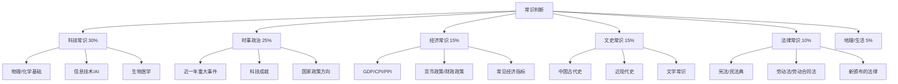

# 行测·常识判断 — 不复习，只靠积累和技巧

> [!abstract] 为什么常识判断不值得花大量时间复习
> 常识判断的范围 ==上到天文地理，下到法律经济，无所不包==。想靠复习覆盖考点是不可能的。正确策略：==每天碎片时间积累一点 + 掌握排除技巧 + 不会就蒙，不纠结。==

---

## 一、考情速览

| 维度 | 典型数据 |
|---|---|
| 题量 | 10-20 题（各企业差异大） |
| 建议用时 | 5-8 分钟（快做，不纠结） |
| 目标正确率 | 50%-60%（靠知识 + 排除法） |
| 核心策略 | 会的秒选，不会的用排除法，1 分钟想不出就蒙 |

> [!important] 校招常识判断的特点
> 和公务员考试不同，校招常识判断偏重 ==科技常识、时事政治、企业文化==，较少涉及法律条文和行政制度。

---

## 二、高频考点分布

---

## 三、科技常识速记（校招最爱考）

### 3.1 信息技术

| 概念 | 要点 |
|---|---|
| 5G | 第五代移动通信，高带宽、低延迟、广连接 |
| AI 三大要素 | 数据、算法、算力 |
| 大模型 | GPT、文心一言、通义千问等，基于 Transformer 架构 |
| 云计算 | IaaS（基础设施）、PaaS（平台）、SaaS（软件） |
| 区块链 | 去中心化、不可篡改、分布式账本 |
| 量子计算 | 利用量子叠加和纠缠，远超经典计算机的算力 |

### 3.2 航天成就

| 事件 | 时间 |
|---|---|
| 神舟系列 | 载人飞船，神舟五号首次载人（2003 杨利伟） |
| 嫦娥系列 | 月球探测，嫦娥五号采样返回（2020） |
| 天问一号 | 火星探测，祝融号火星车（2021） |
| 天宫空间站 | 中国空间站，2022 年建成 |
| 北斗系统 | 全球卫星导航系统，2020 年完成全球组网 |

### 3.3 物理/化学基础

| 知识点 | 说明 |
|---|---|
| 牛顿三大定律 | 惯性、F=ma、作用力与反作用力 |
| 光的性质 | 反射、折射、色散、干涉 |
| 声音传播 | 需要介质，真空中不能传声 |
| 物态变化 | 熔化/凝固、汽化/液化、升华/凝华 |
| 常见化学元素 | O（氧）、C（碳）、H（氢）、N（氮）、Fe（铁） |

---

## 四、时事政治速记（考前必看）

> [!tip] 复习策略
> 不需要背整本时政手册。==考前 1 周，用 APP 刷近 6 个月的时政题 100 道==，覆盖 80% 的考点。

### 高频主题

| 主题 | 要点方向 |
|---|---|
| 二十大 | 中国式现代化、高质量发展、共同富裕 |
| 新质生产力 | 科技创新引领产业创新 |
| 双碳目标 | 2030 碳达峰、2060 碳中和 |
| 一带一路 | 十周年（2023）、高质量发展 |
| 重要会议 | 两会、中央经济工作会议、政治局集体学习 |

---

## 五、经济常识速记

| 概念 | 含义 |
|---|---|
| GDP | 国内生产总值，衡量一国经济总量 |
| CPI | 居民消费价格指数，衡量通胀 |
| PPI | 工业生产者出厂价格指数 |
| PMI | 采购经理人指数，50 以上为扩张 |
| 货币政策 | 央行调控（利率、准备金率、公开市场操作） |
| 财政政策 | 政府调控（税收、政府支出、国债） |
| 通货膨胀 | 货币贬值，物价普遍上涨 |
| 恩格尔系数 | 食品支出占消费比重，越低越富裕 |

---

## 六、法律常识速记

| 法律 | 校招常考点 |
|---|---|
| 宪法 | 国家机构、公民基本权利 |
| 民法典 | 合同、侵权、婚姻家庭 |
| 劳动法 | 工作时间、加班、休假、工资 |
| 劳动合同法 | 合同签订、试用期、解除、经济补偿 |
| 新法 | 近一年新颁布/修订的法律（考前查） |

> [!tip] 劳动法重点（校招高频）
> - 试用期最长 6 个月（3 年及以上合同）
> - 标准工时：每日 8 小时，每周 40 小时
> - 加班：工作日 1.5 倍，休息日 2 倍，法定假日 3 倍
> - 带薪年假：满 1 年不满 10 年 → 5 天

---

## 七、排除法技巧（不会做时的救命稻草）

### 7.1 绝对化表述优先排除

| 排除信号 | 示例 |
|---|---|
| 绝对化词汇 | 全部、所有、一切、唯一、必然、绝不、一定 |
| 极端化表述 | 最高、最低、最大、最小、第一、最 XX |

> 除非你非常确定，否则 ==含绝对化表述的选项大概率是错的==。

### 7.2 政治正确优先

涉及国家政策、领导人讲话、党的方针的题目，==正面、积极、符合主流价值观的选项通常是对的==。

### 7.3 生活常识验证

如果一道题可以用生活常识判断，就大胆用生活常识。

> [!example] 例题
> 以下哪种做法最环保？
> A. 大量使用一次性塑料袋
> B. 垃圾分类投放
> C. 将废电池随意丢弃
> D. 大量焚烧秸秆
>
> 常识判断：B 是最环保的做法 → 选 B

### 7.4 排除矛盾选项

如果两个选项意思相反，==答案大概率是其中之一==。

### 7.5 数字题优先排除极值

涉及数字的题目，==最大和最小的数值往往是错的==，中间值更可能是正确答案。

---

## 八、复习策略

| 阶段 | 方法 | 时间 |
|---|---|---|
| 日常积累 | 每天刷 10 道常识题，看解析 | 10 分钟/天 |
| 考前 1 周 | 集中刷时政 100 题 | 每天 20 分钟 |
| 考前 1 天 | 看企业官网/企业文化 | 30 分钟 |

> [!tip] 推荐资源
> - 粉笔 APP「常识判断」专项刷题
> - 学习强国 APP（时政）
> - 人民日报客户端（时政）
> - 企业官网（企业文化、发展历程）

---

## 九、一句话总结

> [!tip] 常识判断 = 积累 + 排除 + 不纠结
> ==每天 10 分钟积累，考场上 1 分钟想不出就排除+蒙。== 不要在这块花太多时间，它不是决定胜负的板块。

---

## 关联笔记

- [[03-HR人事/校招测评/行测/行测_判断推理]] — 提分最快的行测板块
- [[03-HR人事/校招测评/行测/行测_资料分析]] — 送分最稳
- [[03-HR人事/校招测评/行测/行测_言语理解]] — 题量最大
- [[03-HR人事/校招测评/行测/行测_数量关系]] — 学会取舍
- [[03-HR人事/校招测评/备战/备战_资源汇总]] — 备考资源合集