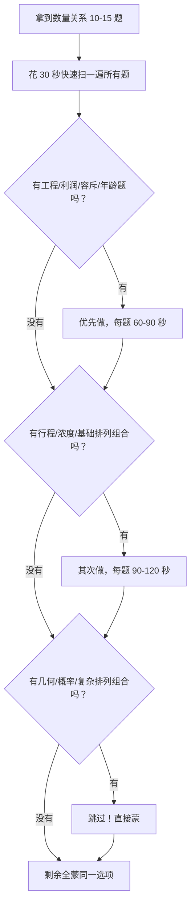
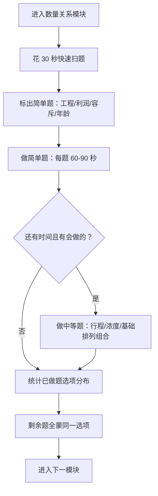

# 行测·数量关系 — 学会取舍，做对 5 题就赢

> [!abstract] 最重要的心态
> 数量关系是行测中 ==最难、最耗时、得分率最低== 的板块。你的目标不是做完全部——而是 ==挑 5-6 道简单题做对，剩下的果断蒙==。80% 的人在这板块花 15 分钟只做对 3 题，你花 10 分钟做对 5 题就赢了。

---

## 一、考情速览

| 维度 | 典型数据 |
|---|---|
| 题量 | 10-15 题 |
| 建议用时 | 10-12 分钟（不要超过 15 分钟） |
| 目标正确率 | 做对 5-6 题 + 蒙对 2-3 题 = 7-9 题 |
| 核心策略 | 挑简单题型做，难的直接蒙 |

> [!important] 校招数量关系的真相
> 校招行测的数量关系难度远低于公务员考试。大部分题目是初中数学水平，只要想起公式就能做。==真正拉开差距的不是「会不会做」，而是「能不能快速识别出哪些题值得做」。==

---

## 二、优先级策略：先做哪些题？

### 题型难度分级

| 优先级 | 题型 | 难度 | 说明 |
|---|---|---|---|
| ⭐⭐⭐ 必做 | 工程问题 | 低 | 公式固定，套路单一 |
| ⭐⭐⭐ 必做 | 利润问题 | 低 | 生活中常用，直觉可解 |
| ⭐⭐⭐ 必做 | 容斥问题 | 低 | 套公式就出答案 |
| ⭐⭐⭐ 必做 | 年龄问题 | 低 | 方程法秒杀 |
| ⭐⭐ 选做 | 行程问题 | 中 | 简单相遇追及可做，复杂的跳过 |
| ⭐⭐ 选做 | 浓度问题 | 中 | 公式简单，但数据可能绕 |
| ⭐⭐ 选做 | 基础排列组合 | 中 | 简单排列组合可做，复杂的跳过 |
| ⭐ 慎做 | 概率问题 | 高 | 容易算错，性价比低 |
| ⭐ 慎做 | 几何问题 | 高 | 需要空间想象，公式多 |
| ⭐ 慎做 | 牛吃草/时钟/日期 | 高 | 出题少，不值得专门练 |

---

## 三、必做题型 · 公式与套路

### 3.1 工程问题（必做！）

**核心公式**：`工作总量 = 工作效率 × 工作时间`

**解题方法**：==赋值法==——把工作总量赋值为各工作时间的最小公倍数。

> [!example] 例题
> 一项工程，甲单独做需要 10 天，乙单独做需要 15 天。两人合作需要多少天？
>
> 赋值工作总量 = 30（10 和 15 的最小公倍数）
> 甲的效率 = 30/10 = 3
> 乙的效率 = 30/15 = 2
> 合作效率 = 3 + 2 = 5
> 合作时间 = 30/5 = 6 天

**常见变体**：
- 多人合作：效率相加
- 交替工作：分段计算
- 中途加入/退出：分段计算工作量

### 3.2 利润问题（必做！）

**核心公式**：
- `利润 = 售价 - 成本`
- `利润率 = 利润 / 成本 × 100%`
- `售价 = 成本 × (1 + 利润率)`
- `折扣后售价 = 原价 × 折扣`

> [!example] 例题
> 某商品按定价的 8 折出售，仍能获得 20% 的利润。定价时的利润率是多少？
>
> 设成本为 100 元
> 8 折后售价 = 成本 × (1 + 20%) = 120 元
> 定价 = 120 / 0.8 = 150 元
> 定价时的利润率 = (150 - 100) / 100 = 50%

**关键技巧**：==设成本为 100 元==，所有计算都变简单。

### 3.3 容斥问题（必做！）

**两集合公式**：`A ∪ B = A + B - A ∩ B`

**三集合公式**：`A ∪ B ∪ C = A + B + C - A∩B - B∩C - A∩C + A∩B∩C`

> [!example] 例题
> 某班有 50 人，参加数学竞赛的有 30 人，参加物理竞赛的有 25 人，两科都参加的有 10 人。两科都没参加的有几人？
>
> 至少参加一科 = 30 + 25 - 10 = 45 人
> 两科都没参加 = 50 - 45 = 5 人

**关键技巧**：==画 Venn 图==，不要只靠公式。

### 3.4 年龄问题（必做！）

**核心特征**：年龄差不变，年龄同时增长。

**解题方法**：设未知数，列方程。

> [!example] 例题
> 父亲今年 40 岁，儿子今年 12 岁。几年后父亲年龄是儿子的 2 倍？
>
> 设 x 年后：40 + x = 2(12 + x)
> 40 + x = 24 + 2x
> 16 = x
> 答案：16 年后

---

## 四、选做题型 · 公式与套路

### 4.1 行程问题

**基础公式**：`路程 = 速度 × 时间`

| 类型 | 公式 | 说明 |
|---|---|---|
| 相遇问题 | `S = (v1 + v2) × t` | 速度和 × 时间 |
| 追及问题 | `S = (v1 - v2) × t` | 速度差 × 时间 |
| 环形跑道 | 相遇：`n圈 = (v1+v2) × t` | 追及：`n圈 = (v1-v2) × t` |
| 流水行船 | `v顺 = v船 + v水` | `v逆 = v船 - v水` |

> [!tip] 行程问题策略
> 简单相遇追及 → 做
> 多次相遇/环形跑道/流水行船 → 看题目数据是否简单，简单的做，复杂的跳过

### 4.2 浓度问题

**核心公式**：`浓度 = 溶质 / 溶液 × 100%`

**解题方法**：抓住溶质不变，或列方程。

> [!example] 例题
> 将 100 克浓度为 20% 的盐水与 200 克浓度为 30% 的盐水混合，混合后的浓度是多少？
>
> 溶质 = 100×20% + 200×30% = 20 + 60 = 80 克
> 溶液 = 100 + 200 = 300 克
> 浓度 = 80/300 ≈ 26.7%

### 4.3 基础排列组合

| 概念 | 公式 | 使用场景 |
|---|---|---|
| 排列 | `A(n,m) = n!/(n-m)!` | 有顺序要求 |
| 组合 | `C(n,m) = n!/[m!(n-m)!]` | 无顺序要求 |

**常用值**（背下来）：`C(4,2)=6`, `C(5,2)=10`, `C(5,3)=10`, `C(6,2)=15`, `C(6,3)=20`

> [!tip] 排列组合策略
> 简单的排列组合（直接套公式）→ 做
> 涉及「至少」「不超过」「相邻/不相邻」的 → 跳过

---

## 五、蒙题策略（不要小看这一步）

> [!tip] 蒙题也讲科学
> 数量关系全部蒙同一个选项，期望正确率 25%。如果做了 5 题，统计这 5 题中哪个选项出现最少，剩余题全蒙那个选项，期望正确率可提升到 30%+。

**蒙题流程**：
1. 做 5-6 道简单题，确定答案
2. 统计已做题目中 A/B/C/D 的分布
3. 剩余题目全部蒙出现最少的选项
4. 如果分布均匀，优先蒙 C 或 B

> [!example] 实例
> 你做了 5 题，答案分别是 A、A、C、D、B → A 出现 2 次，B/C/D 各 1 次
> 剩余 5 题全蒙 B（或 C 或 D）
> 这样至少能再蒙对 1-2 题

---

## 六、解题技巧速查

| 技巧 | 适用场景 | 操作 |
|---|---|---|
| 代入法 | 选项是具体数字 | 从中间选项代入，看是否满足条件 |
| 赋值法 | 工程问题、利润问题 | 设总量为公倍数，设成本为 100 |
| 方程法 | 年龄问题、一般应用题 | 直接设未知数列方程 |
| 整除特性 | 答案需要是整数 | 利用整除排除选项 |
| 奇偶特性 | 答案与奇偶相关 | 利用奇偶性排除选项 |
| 尾数法 | 只需求尾数 | 只算尾数，快速排除 |

### 代入法的使用技巧

> [!tip] 代入顺序
> ==先代入中间选项（C），再根据结果决定往上还是往下。==
> 如果 C 算出来太大 → 代入 A 或 B
> 如果 C 算出来太小 → 代入 D 或 E

---

## 七、考场实战流程

> [!danger] 千万不要
> - 在一道题上花超过 2 分钟
> - 所有题都尝试做一遍
> - 因为不会做而心态崩了

---

## 八、练习建议

| 阶段 | 目标 | 方法 |
|---|---|---|
| 入门 | 掌握 5 种必做题型 | 每种题型做 10 道，不限时 |
| 提速 | 快速识别题型 + 解题 | 混合题型限时训练 |
| 冲刺 | 10 分钟做对 5 题 | 套题训练 + 蒙题练习 |

**每日训练量**：10 道数量关系题，限时 12 分钟。不强求全做，但要练习「快速判断什么题值得做」。

---

## 九、一句话总结

> [!tip] 数量关系 = 看题 + 挑题 + 果断蒙
> ==扫一遍，挑 5 道简单题做对，剩下全蒙同一选项。== 不恋战，不纠结，10 分钟搞定。

---

## 关联笔记

- [[03-HR人事/校招测评/行测/行测_判断推理]] — 提分最快的行测板块
- [[03-HR人事/校招测评/行测/行测_资料分析]] — 送分最稳
- [[03-HR人事/校招测评/行测/行测_言语理解]] — 题量最大
- [[03-HR人事/校招测评/备战/备战_时间规划]] — 整体备考节奏