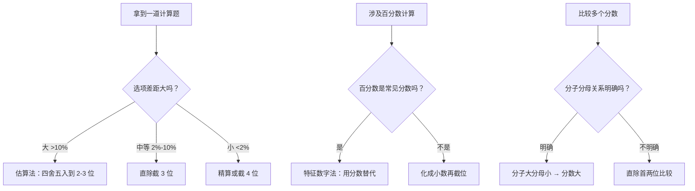
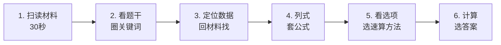

# 行测·资料分析 — 送分最稳的题型

> [!abstract] 为什么说它是「送分最稳」
> 资料分析是行测中 ==唯一一个公式有限、套路固定、不靠灵感只靠熟练度的板块==。不像判断推理需要逻辑直觉，也不像数量关系需要数学天赋——资料分析只要掌握速算技巧 + 识别陷阱，目标就是 ==全对==。

---

## 一、考情速览

| 维度 | 典型数据 |
|---|---|
| 题量 | 15-20 题（3-4 篇材料，每篇 5 题） |
| 建议用时 | 20-25 分钟 |
| 目标正确率 | 90%+（全对可期） |
| 核心能力 | 速算 + 定位 + 防坑 |
| 材料类型 | 文字材料、表格、柱状图/折线图、综合材料 |

> [!tip] 关键认知
> 资料分析 ≠ 数学题。它考的是 ==「从材料里快速找到数据 + 用公式算出来」==，而不是数学推导能力。公式不超过 10 个，全背下来就能做题。

> [!warning] 北森测评特别提示
> 从北森 714 题真题库抽样看：**图表型材料是绝对主力（柱状/折线/饼图占绝大多数），统计表次之，纯文字材料很少**。场景多为商业数据（手机销量、机场吞吐量、公司销售额）。备考北森测评时，读图速度比读文字速度更重要，练题优先选图表题。题库见 [[03-HR人事/校招测评/题库/北森测评_题库索引]]。

---

## 二、核心公式速查（全部背下来）

### 2.1 增长率相关

| 概念 | 公式 | 备注 |
|---|---|---|
| 增长率（增速） | `(现期 - 基期) / 基期 × 100%` | 增速 = 增幅 = 增长率 |
| 现期量 | `基期量 × (1 + 增长率)` | 已知基期求现期 |
| 基期量 | `现期量 / (1 + 增长率)` | 已知现期求基期 |
| 隔年增长率 | `r1 + r2 + r1×r2` | 中间隔了一年 |
| 年均增长率 | `(末期/初期)^(1/n) - 1` | n 为年份差 |
| 混合增长率 | 介于各部分增长率之间，偏向基期量大的 | 整体增速在中间 |

### 2.2 比重相关

| 概念 | 公式 | 备注 |
|---|---|---|
| 现期比重 | `部分量 / 整体量 × 100%` | 基本公式 |
| 基期比重 | `(部分/整体) × [(1+整体增速)/(1+部分增速)]` | 高频考点 |
| 比重变化量 | `(部分/整体) × [(部分增速-整体增速)/(1+部分增速)]` | 判断上升/下降 |

### 2.3 倍数与平均数

| 概念 | 公式 | 备注 |
|---|---|---|
| 倍数 | `A / B` | A 是 B 的几倍 |
| 多几倍 | `A/B - 1` | 注意区分「是几倍」和「多几倍」 |
| 平均数 | `总量 / 总数` | 基本公式 |
| 平均数增长率 | `(a-b) / (1+b)` | a=总量增速，b=总数增速 |

> [!important] 记忆优先级
> 1. 增长率（必考，最基础）
> 2. 基期量（必考）
> 3. 比重变化（高频）
> 4. 隔年增长率（高频）
> 5. 平均数增长率（中频）
> 6. 年均增长率（低频但可考）

---

## 三、速算技巧（这才是拉开差距的地方）

> [!warning] 核心原则
> 资料分析 ==不需要精确计算==。选项差距就是你偷懒的底气——先看选项，差距大就大胆估算，差距小再用精算。

### 3.1 估算法（最常用）

**适用场景**：选项差距大（如 A.12% B.24% C.36% D.48%）

**操作**：把数据四舍五入到 2-3 位有效数字再算。

> [!example] 例题
> 材料：2023 年某省 GDP 为 12783.6 亿元，同比增长 8.7%。
> 问：2022 年该省 GDP 约为多少？
>
> 计算：`12783.6 / (1 + 8.7%) = 12783.6 / 1.087`
> 估算：`12783.6 / 1.087 ≈ 12800 / 1.09 ≈ 11743`
> 选项：A.11500 B.11760 C.12000 D.12300 → 选 B

### 3.2 直除法

**适用场景**：需要比较分数大小，或选项差距中等。

**操作**：直接除到能区分选项为止，不必除完。

> [!example] 例题
> 比较 `356/487` 和 `412/568` 的大小
>
> `356/487 ≈ 0.73`（首两位 73）
> `412/568 ≈ 0.72`（首两位 72）
> → `356/487 > 412/568`

### 3.3 特征数字法（务必掌握）

| 分数 | 近似值 | 分数 | 近似值 |
|---|---|---|---|
| 1/2 | 50% | 1/3 | 33.3% |
| 1/4 | 25% | 3/4 | 75% |
| 1/5 | 20% | 2/5 | 40% |
| 1/6 | 16.7% | 1/7 | 14.3% |
| 1/8 | 12.5% | 3/8 | 37.5% |
| 1/9 | 11.1% | 1/11 | 9.1% |
| 1/12 | 8.3% | 1/13 | 7.7% |
| 1/14 | 7.1% | 1/15 | 6.7% |

**用法**：看到 16.7% 就想到 1/6，看到 14.3% 就想到 1/7，用分数替代百分数，计算量骤降。

> [!example] 例题
> 材料：某市 2023 年旅游收入为 4860 万元，同比增长 14.3%。
> 问：增长量约为多少？
>
> 14.3% ≈ 1/7
> 增长量 = `4860 × 14.3% / (1+14.3%)` 或直接用 `4860 / 8 ≈ 607.5`
> （基期约为 7 份，增长 1 份，现期为 8 份，增量为 1/8 的现期量）

### 3.4 分数比较法

**口诀**：==分子大分母小，分数大；分子小分母大，分数小。==

| 方法 | 适用场景 | 操作 |
|---|---|---|
| 差分法 | 分子分母都大 | 计算差值分数，与较小分数比较 |
| 直除首两位 | 通用 | 除到能区分为止 |
| 化同法 | 分母接近 | 把分母化成相同，比较分子 |

### 3.5 截位法

**适用场景**：多位数乘除，选项差距允许。

**规则**：
- 加减法：截到相同位数（最高位对齐）
- 乘除法：截 2-3 位有效数字，看选项差距定

> [!tip] 截位口诀
> 选项差距大 → 截 2 位 | 选项差距小 → 截 3 位 | 选项差距极小 → 精算或截 4 位

### 3.6 速算技巧选择决策树

---

## 四、常见陷阱（每年都有人掉）

### 4.1 时间陷阱 🔴

| 陷阱类型 | 表现 | 对策 |
|---|---|---|
| 年份错位 | 材料给 2023 年，问 2022 年 | 圈出题目中的年份，在材料中对应找 |
| 时间段混淆 | 问「上半年」但材料给「全年」 | 看清是累计还是单期 |
| 同比 vs 环比 | 同比=去年同月，环比=上月 | 圈出「同比」「环比」关键词 |
| 「十二五」vs「十三五」 | 十二五=2011-2015，十三五=2016-2020 | 背熟五年计划年份对应 |

### 4.2 单位陷阱 🔴

| 陷阱类型 | 表现 | 对策 |
|---|---|---|
| 亿 vs 万 | 材料用「亿元」，题目问「万元」 | 每道题都确认单位 |
| % vs ‰ | 千分号和百分号混用 | 圈出符号 |
| 吨 vs 公斤 | 重量单位不一致 | 换算后再算 |
| 美元 vs 人民币 | 汇率陷阱 | 看清楚问的是什么币种 |

### 4.3 概念陷阱 🔴

| 陷阱类型 | 表现 | 对策 |
|---|---|---|
| 是几倍 vs 多几倍 | A 是 B 的 3 倍 ≠ A 比 B 多 3 倍（实际多 2 倍） | 「多几倍」= 倍数-1 |
| 增长率 vs 增长量 | 问增速却求了增长量 | 圈出「率」还是「量」 |
| 比重 vs 比重变化 | 问比重变化但求了现期比重 | 看清楚问的是「比重」还是「比重变化」 |
| 累计值 vs 当月值 | 图表给累计值，题目问当月值 | 当月 = 本月累计 - 上月累计 |

### 4.4 范围陷阱

| 陷阱类型 | 表现 | 对策 |
|---|---|---|
| 全国 vs 某省 | 材料标题是「全国」，问题问「某省」 | 确认数据来源 |
| 城镇 vs 农村 | 人口数据中城乡分开 | 圈出范围限定词 |
| 规模以上 vs 全部 | 规模以上工业企业 ≠ 所有企业 | 注意统计口径 |

> [!tip] 防坑 SOP
> 每道题按这个顺序检查：
> 1. ==圈时间==：问的是哪一年/哪个月？
> 2. ==圈单位==：亿还是万？%还是‰？
> 3. ==圈概念==：率还是量？是几倍还是多几倍？
> 4. ==圈范围==：全国还是某省？城镇还是农村？

---

## 五、实战策略

### 5.1 做题顺序

### 5.2 材料阅读策略

| 材料类型 | 阅读重点 | 跳过什么 |
|---|---|---|
| 纯文字 | 首句、尾句、分段关键词 | 具体数字（做题时再定位） |
| 表格 | 表头（行标题、列标题）、单位 | 所有数据（做题时再找） |
| 柱状图/折线图 | 横轴（时间）、纵轴（指标）、图例、单位 | 不用读每个数据点 |
| 饼图 | 类别名称、占比标注 | 不用读具体数字 |
| 综合材料 | 先看各部分的标题和单位 | 细节数据 |

> [!tip] 阅读口诀
> ==文字看首尾，表格看表头，图形看轴和图例。== 30 秒内搞清楚「这篇材料讲什么、有哪些指标、时间范围是什么」，具体数字做题时再定位。

### 5.3 时间分配

| 阶段 | 用时 | 操作 |
|---|---|---|
| 读材料 | 30 秒 | 扫读结构，不看具体数字 |
| 第 1-4 题 | 每题 60-80 秒 | 定位 + 列式 + 速算 |
| 第 5 题（综合题） | 90-120 秒 | 4 个选项逐一验证，先看简单的 |

> [!important] 综合题策略
> 每篇材料的最后一题通常是「以下说法正确的是/错误的是」，4 个选项来自 4 个不同知识点。
> 
> ==策略：从选项 D 往前看，先算简单的选项。==
> - 涉及「简单查找」的选项优先验证
> - 涉及「增长率比较」的其次
> - 涉及「复杂计算」的放最后
> - 一旦找到正确/错误的就打住，不要验证剩余选项

### 5.4 考场应变

| 情况 | 对策 |
|---|---|
| 一篇材料有图表看不懂 | 先做纯表格/纯文字材料 |
| 一道题算了两分钟没结果 | 果断跳过，先做后面的 |
| 选项差距极小，算不出来 | 用估算排除两个，再精算剩余两个 |
| 时间不够了 | 资料分析 > 判断推理 > 言语 > 数量 > 常识 |

---

## 六、例题精讲

### 例题 1：增长量计算

> 材料：2023 年，某省规模以上工业增加值 36850 亿元，同比增长 6.8%。
> 问题：2023 年该省规模以上工业增加值同比增长约多少亿元？

**解题步骤**：

1. 圈关键词：增长量、亿元
2. 公式：`增长量 = 现期量 × 增长率 / (1 + 增长率)`
3. 代入：`36850 × 6.8% / 1.068`
4. 速算：`6.8% ≈ 1/14.7`，增长量 ≈ `36850 / 15.7 ≈ 2347`
5. 核对选项，选最接近的

### 例题 2：比重变化判断

> 材料：2023 年，全国 GDP 为 126 万亿元，同比增长 5.2%。其中第三产业增加值 68.8 万亿元，同比增长 5.8%。
> 问题：2023 年第三产业增加值占 GDP 的比重与上年相比是上升还是下降？

**解题步骤**：

1. 判断口诀：==部分增速 > 整体增速 → 比重上升==
2. 部分增速 = 5.8%，整体增速 = 5.2%
3. 5.8% > 5.2% → 比重上升
4. 不需要计算具体数值！直接答「上升」。

### 例题 3：隔年增长率

> 材料：某省 2022 年 GDP 增速为 6.5%，2023 年 GDP 增速为 5.8%。
> 问题：该省 2023 年 GDP 相对于 2021 年增长了约多少？

**解题步骤**：

1. 公式：`隔年增长率 = r1 + r2 + r1×r2`
2. 代入：`6.5% + 5.8% + 6.5%×5.8%`
3. 计算：`12.3% + 0.38% ≈ 12.68%`
4. 注意：`r1×r2` 通常很小，先算前两项，加上乘积的近似值

---

## 七、练习建议

### 7.1 练习阶段

| 阶段 | 目标 | 方法 | 时长 |
|---|---|---|---|
| 入门 | 背熟公式，理解题型 | 不限时，每道题都搞懂 | 3-5 天 |
| 提速 | 掌握速算技巧 | 限时 4 篇 × 25 分钟 | 1-2 周 |
| 冲刺 | 全对为目标 | 限时 4 篇 × 20 分钟 | 考前 1 周 |

### 7.2 每日训练量

| 训练项 | 量 | 说明 |
|---|---|---|
| 速算练习 | 每天 10 分钟 | 只练计算：增长率、基期量、比重变化 |
| 完整套题 | 每天 4 篇（20 题） | 限时 25 分钟 |
| 错题复盘 | 当天错题当天复盘 | 找出是公式错、计算错、还是看错题 |

### 7.3 推荐资源

| 资源 | 用途 |
|---|---|
| 粉笔 APP | 专项刷题，题量极大 |
| 中公/华图教材 | 系统学习公式和技巧 |
| 历年真题 | 近 3 年真题优先，了解出题风格 |
| B 站「资料分析速算」 | 看视频学速算手法 |

> [!tip] 速算打卡
> 每天 10 分钟「纯计算」练习：
> - 随机取 5 个多位数除法，练直除
> - 随机取 5 个百分数，练特征数字转换
> - 随机取 5 组分数，练大小比较
> 
> 坚持 2 周，计算速度翻倍。

---

## 八、一句话总结

> [!tip] 资料分析 = 公式 + 速算 + 防坑
> ==公式全背下来，速算练到肌肉记忆，每道题先圈时间/单位/概念。== 这是行测里唯一可以追求全对的板块，花时间练它，ROI 最高。

---

## 关联笔记

- [[03-HR人事/校招测评/行测/行测_判断推理]] — 提分最快的行测板块
- [[03-HR人事/校招测评/行测/行测_数量关系]] — 数学功底好的同学可冲
- [[03-HR人事/校招测评/备战/备战_时间规划]] — 整体备考节奏
- [[03-HR人事/校招测评/备战/备战_每日训练计划]] — 每日训练安排