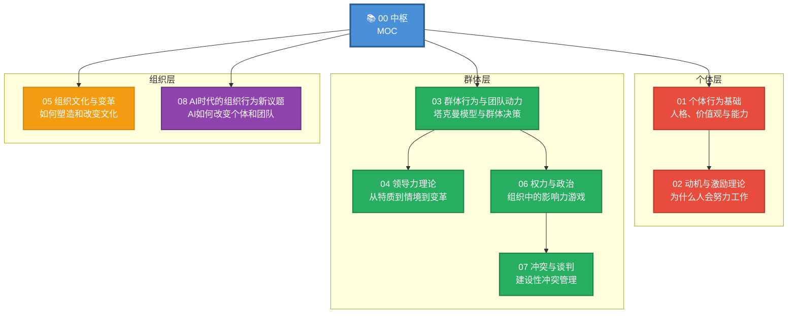
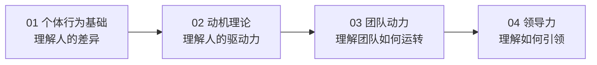
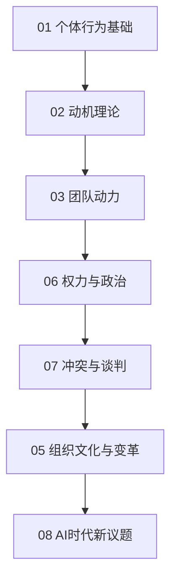
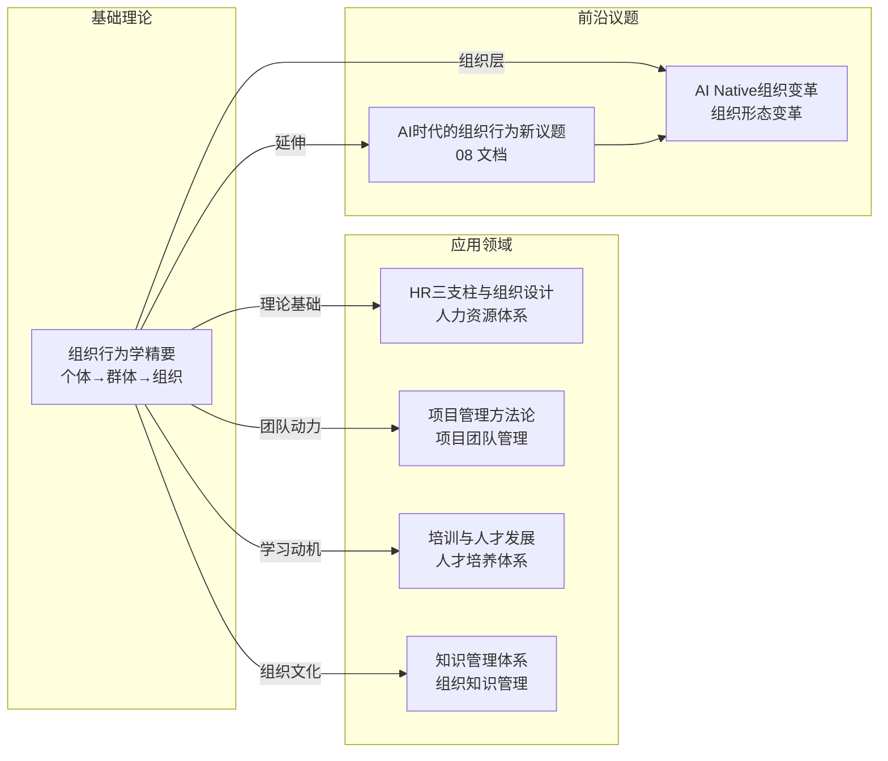

# 组织行为学精要 — 知识库中枢

> [!abstract] 这个知识库解决什么问题？
> 组织行为学（Organizational Behavior, OB）是研究个体、群体和组织结构如何影响组织有效性的学科。本知识库覆盖从个体心理到组织文化的完整分析层次，帮助你理解"人为什么这样做事"、"团队为什么这样运转"、"组织为什么这样变革"。无论你是管理者、HR从业者还是创业者，组织行为学都是理解组织运作规律的核心知识体系。

---

## 全景图：组织行为学的三个分析层次

---

## 文档索引表

| 编号 | 文档标题 | 核心内容 | 分析层次 | 优先级 |
|------|----------|----------|----------|--------|
| 00 | [[03-HR人事/组织行为学精要/00_MOC_组织行为学精要中枢]] | 知识库中枢，全景图与导航 | -- | -- |
| 01 | [[03-HR人事/组织行为学精要/01_个体行为基础：人格、价值观与能力]] | 大五人格、价值观分类、能力模型 | 个体层 | P0 |
| 02 | [[03-HR人事/组织行为学精要/02_动机与激励理论：为什么人会努力工作]] | 马斯洛需求层次、双因素理论、期望理论、自我决定论 | 个体层 | P0 |
| 03 | [[03-HR人事/组织行为学精要/03_群体行为与团队动力]] | 塔克曼模型、群体决策、社会惰化、团队效能 | 群体层 | P0 |
| 04 | [[03-HR人事/组织行为学精要/04_领导力理论：从特质到情境到变革]] | 特质理论、行为理论、变革型领导、服务型领导 | 群体层 | P0 |
| 05 | [[03-HR人事/组织行为学精要/05_组织文化与变革：如何塑造和改变文化]] | 竞争价值框架、文化冰山模型、变革管理八步法 | 组织层 | P0 |
| 06 | [[03-HR人事/组织行为学精要/06_权力与政治：组织中的影响力游戏]] | 权力来源五类、政治行为、影响力策略 | 群体层 | P1 |
| 07 | [[03-HR人事/组织行为学精要/07_冲突与谈判：建设性冲突管理]] | 冲突类型、托马斯-基尔曼模型、谈判策略 | 群体层 | P1 |
| 08 | [[03-HR人事/组织行为学精要/08_AI时代的组织行为新议题]] | AI对个体/团队/组织行为的系统性影响 | 综合层 | P1 |

---

## 三条阅读路径

### 路径一：快速入门（管理者视角）

> [!tip] 适合：新晋管理者，想快速理解团队行为规律

1. **先读 [[03-HR人事/组织行为学精要/01_个体行为基础：人格、价值观与能力]]**：理解每个人的"出厂设置"差异
2. **再读 [[03-HR人事/组织行为学精要/02_动机与激励理论：为什么人会努力工作]]**：掌握激励的核心逻辑
3. **接着读 [[03-HR人事/组织行为学精要/03_群体行为与团队动力]]**：理解团队从形成到成熟的完整过程
4. **最后读 [[03-HR人事/组织行为学精要/04_领导力理论：从特质到情境到变革]]**：找到适合你的领导风格

### 路径二：深度实践（HR/OD视角）

**阅读顺序**：01 → 02 → 03 → 06 → 07 → 05 → 04 → 08

### 路径三：按痛点查找

| 你遇到的问题 | 去看这篇 | 重点章节 |
|--------------|----------|----------|
| 不理解为什么团队成员行为差异这么大 | [[03-HR人事/组织行为学精要/01_个体行为基础：人格、价值观与能力]] | 大五人格、价值观分类 |
| 团队士气低落，不知道怎么激励 | [[03-HR人事/组织行为学精要/02_动机与激励理论：为什么人会努力工作]] | 双因素理论、期望理论 |
| 新团队磨合期太长，效率低下 | [[03-HR人事/组织行为学精要/03_群体行为与团队动力]] | 塔克曼模型、团队建设 |
| 管理者没有威信，团队不服从 | [[03-HR人事/组织行为学精要/04_领导力理论：从特质到情境到变革]] | 变革型领导、领导-成员交换 |
| 组织变革推不动，文化僵化 | [[03-HR人事/组织行为学精要/05_组织文化与变革：如何塑造和改变文化]] | 文化冰山模型、科特八步法 |
| 办公室政治严重，影响工作 | [[03-HR人事/组织行为学精要/06_权力与政治：组织中的影响力游戏]] | 权力来源、政治行为 |
| 团队冲突频繁，不知道如何调解 | [[03-HR人事/组织行为学精要/07_冲突与谈判：建设性冲突管理]] | 冲突类型、谈判策略 |
| AI引入后团队行为出现新问题 | [[03-HR人事/组织行为学精要/08_AI时代的组织行为新议题]] | 算法管理、AI对协作的影响 |

---

## 核心分析框架

> [!important] 组织行为学的三个核心命题
>
> 1. **个体差异是组织管理的起点**。每个人的认知风格、价值观、动机来源都不同，有效的管理不是"一刀切"而是"因材施管"
> 2. **群体不是个体的简单加总**。团队会出现"1+1>2"的协同效应，也会出现"三个和尚没水喝"的社会惰化。理解群体动力学才能驾驭团队
> 3. **组织文化是底层操作系统**。战略、流程、制度都是"应用层"，文化是决定组织能否持续发展的"底层操作系统"。改变文化比改变结构难得多

---

## 与其他知识库的关联

- **[[05-产品与开发/项目管理方法论/00_MOC_项目管理方法论中枢]]**：项目团队管理中的团队动力、冲突解决、干系人管理等，直接应用组织行为学的群体层理论
- **[[07-学习成长/知识管理体系/00_MOC_知识管理体系中枢]]**：知识管理的本质是组织行为——如何激励知识分享、如何建立学习型组织
- **[[02-AI趋势与素养/AI Native组织变革/00_MOC_AI Native组织变革中枢]]**：组织行为学在AI时代的延伸，探讨组织形态从金字塔到神经网络的转变
- **[[02-AI趋势与素养/AI时代能力要求/00_MOC_AI时代能力要求中枢]]**：个体能力模型的变化，与组织行为学中"个体层"分析直接呼应

---

## 核心概念速查

| 概念 | 定义 | 出处 |
|------|------|------|
| **大五人格** | 开放性、尽责性、外向性、宜人性、神经质五大维度的人格分类模型 | [[03-HR人事/组织行为学精要/01_个体行为基础：人格、价值观与能力]] |
| **自我效能感** | 个体对自己完成特定任务的能力信念 | [[03-HR人事/组织行为学精要/01_个体行为基础：人格、价值观与能力]] |
| **双因素理论** | 赫茨伯格将工作激励因素分为保健因素（不满）和激励因素（满意） | [[03-HR人事/组织行为学精要/02_动机与激励理论：为什么人会努力工作]] |
| **期望理论** | 弗鲁姆提出：动机 = 期望 × 工具性 × 效价 | [[03-HR人事/组织行为学精要/02_动机与激励理论：为什么人会努力工作]] |
| **塔克曼模型** | 团队发展五阶段：形成→震荡→规范→执行→解散 | [[03-HR人事/组织行为学精要/03_群体行为与团队动力]] |
| **群体思维** | 群体为了维持一致性而压制不同意见的决策偏差 | [[03-HR人事/组织行为学精要/03_群体行为与团队动力]] |
| **变革型领导** | 通过愿景激励和智力激发，使追随者超越个人利益追求组织目标 | [[03-HR人事/组织行为学精要/04_领导力理论：从特质到情境到变革]] |
| **竞争价值框架** | 从内部-外部和灵活-控制两个维度划分四种组织文化类型 | [[03-HR人事/组织行为学精要/05_组织文化与变革：如何塑造和改变文化]] |
| **科特八步法** | 组织变革的八个步骤，从建立紧迫感到固化变革成果 | [[03-HR人事/组织行为学精要/05_组织文化与变革：如何塑造和改变文化]] |
| **托马斯-基尔曼模型** | 五种冲突处理策略：竞争、协作、妥协、回避、迁就 | [[03-HR人事/组织行为学精要/07_冲突与谈判：建设性冲突管理]] |
| **算法管理** | 用算法替代人类管理者进行任务分配、监控和评估的新型管理方式 | [[03-HR人事/组织行为学精要/08_AI时代的组织行为新议题]] |

---

## 更新日志

| 日期 | 变更内容 |
|------|----------|
| 2026-07-31 | 创建中枢文档，定义知识库框架和全部文档 |

---

> [!quote] 最后一句
> 组织行为学的终极目标不是"控制人"，而是"理解人"。**当你真正理解了人们为什么这样思考、这样行动、这样协作，管理的艺术就从"控制"变成了"释放"。**