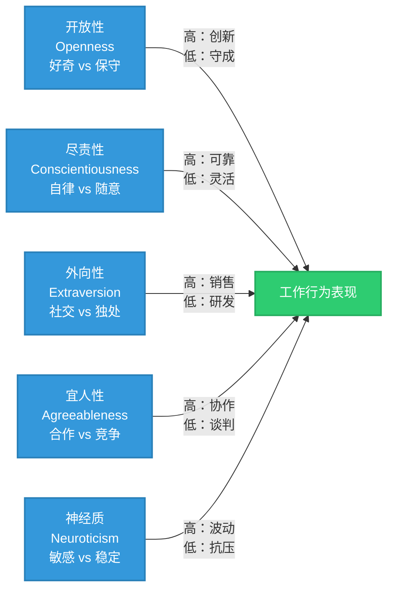
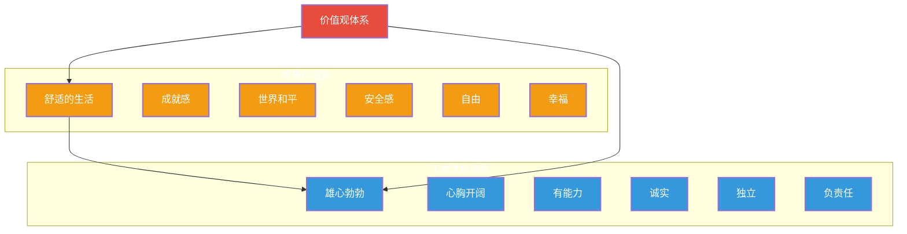

# 个体行为基础：人格、价值观与能力

> [!abstract] 核心论点
> 理解个体差异是组织管理的起点。每个人的"行为操作系统"由三个层次构成：**人格**（先天倾向）、**价值观**（后天习得的判断标准）和**能力**（可发展的技能储备）。三者的交互决定了个人在工作中的行为模式、绩效表现和职业轨迹。

---

## 一、大五人格模型：理解个体差异的黄金标准

大五人格模型（Big Five）是目前心理学界公认最可靠的人格分类框架，它将人格特质归纳为五个维度：



### 各维度对工作行为的影响

| 人格维度 | 高分特征 | 低分特征 | 对工作的影响 |
|----------|----------|----------|-------------|
| **开放性** | 好奇心强、追求新体验、创造力高 | 务实、传统、偏好稳定 | 高开放性适合创新岗位，低开放性适合标准化岗位 |
| **尽责性** | 有条理、自律、成就导向 | 灵活、随性、不拘小节 | 尽责性是**最稳定的绩效预测因子**，几乎所有岗位都受益 |
| **外向性** | 精力充沛、社交活跃、表达欲强 | 安静、内省、独立工作 | 外向性在销售、管理岗位是优势，在深度研发岗位未必 |
| **宜人性** | 同理心强、合作、信任他人 | 直接、竞争、质疑 | 宜人性高适合团队协作，低适合需要独立判断的岗位 |
| **神经质** | 情绪敏感、易焦虑、压力反应大 | 情绪稳定、抗压、冷静 | 神经质低（情绪稳定）是多数岗位的理想状态 |

> [!tip] 实践启示
> 尽管人格特质相对稳定，但在组织中我们不是要"改变人格"，而是要"把对的人放在对的位置"。面试中的人格测评不是"筛选好坏"，而是"匹配岗位"。

---

## 二、价值观：决定"什么重要"的内在指南针

价值观是个体对"什么值得做、什么重要"的深层信念。与人格不同，价值观更多受后天环境、文化、教育的影响，并且在人的一生中会发生变化。

### 罗克奇价值观分类

罗克奇将价值观分为两大类：



### 组织中的价值观冲突

> [!warning] 价值观冲突是组织中最深层的冲突
> 当员工的个人价值观与组织价值观不一致时，会出现：
> - **价值观-组织匹配度低**：员工感到"格格不入"，离职率上升
> - **表面服从 vs 内心抵触**：员工公开接受组织价值观但私下不认同，导致"表演式工作"
> - **价值观漂移**：组织快速扩张后，早期价值观被稀释，引发文化危机

---

## 三、能力模型：从冰山到知识技能

### 冰山模型

麦克利兰的冰山模型将能力分为显性和隐性两部分：

```
┌─────────────────────────────────────┐
│           水面之上（可见）            │
│  ┌───────────────────────────────┐  │
│  │         知识（Knowledge）      │  │
│  │   · 专业知识 · 业务理解       │  │
│  ├───────────────────────────────┤  │
│  │       技能（Skills）          │  │
│  │   · 沟通 · 分析 · 管理       │  │
│  └───────────────────────────────┘  │
│           水面之下（不可见）          │
│  ┌───────────────────────────────┐  │
│  │    社会角色与自我概念         │  │
│  │   · 我是谁 · 我想成为什么    │  │
│  ├───────────────────────────────┤  │
│  │       特质（Traits）          │  │
│  │   · 人格 · 认知风格          │  │
│  ├───────────────────────────────┤  │
│  │       动机（Motives）         │  │
│  │   · 成就 · 权力 · 归属       │  │
│  └───────────────────────────────┘  │
└─────────────────────────────────────┘
```

> [!key] 关键洞察
> 水面以上的知识和技能最容易培养，但也是最容易被替代的。水面以下的人格、动机、价值观虽然难以改变，但决定了一个人的长期发展潜力和岗位匹配度。**招聘看冰山以下，培训看冰山以上。**

### 能力与岗位的匹配矩阵

| 能力类型 | 评估方式 | 培养难度 | 变化速度 | 招聘策略 |
|----------|----------|---------|----------|----------|
| 专业知识 | 考试、证书 | 低 | 快 | 可短期培养 |
| 技能 | 实操、模拟 | 中 | 中 | 可培训提升 |
| 自我概念 | 行为面试 | 中高 | 慢 | 重点筛选 |
| 特质 | 人格测评 | 高 | 极慢 | 匹配为主 |
| 动机 | 深度访谈 | 高 | 慢 | 匹配为主 |

---

## 四、人格、价值观与能力的交互作用

在真实组织中，这三个维度不是独立作用的，而是持续交互：

> [!example] 交互案例：一位销售经理的"人岗匹配"分析
> - **人格**：高外向性（喜欢社交）、高尽责性（执行力强）、中等宜人性（能坚持但不过度强硬）——天生适合销售
> - **价值观**：高成就导向（追求结果）、中等权力导向（希望影响他人）——与销售岗位的"结果导向"文化一致
> - **能力**：良好的沟通技巧和谈判能力，但缺乏数据分析能力——需要培训补足
>
> **结论**：人格和价值观匹配度极高，能力短板可培训。这是一个"高潜"人选。

---

## 五、AI时代对个体行为基础的新挑战

> [!tip] AI时代的三大变化
> 1. **能力阈值的改变**：AI工具降低了某些技能的门槛（如编程、数据分析），但提升了另一些能力的要求（如判断力、创造力）
> 2. **人格-岗位匹配的重新定义**：AI擅长重复性、规则性工作，这意味着高尽责性、高宜人性在传统岗位的优势可能被AI削弱
> 3. **价值观的深层冲击**：当AI可以替代越来越多的人类工作，"人为什么工作"这个根本问题需要重新回答

关于AI对个体能力的系统性影响，详见 [[02-AI趋势与素养/AI时代能力要求/00_MOC_AI时代能力要求中枢]]。

---

## 六、管理实践建议

> [!tip] 管理者行动清单
> 1. **不要试图改变人格**，而是设计适配不同人格的工作方式
> 2. **价值观匹配是留人的关键**，尤其是新生代员工对价值观的敏感度远高于前几代
> 3. **能力是动态的**，建立"能力-培训-评估"的闭环，让能力发展可追踪
> 4. **关注"冰山以下"**：在招聘中，宜人性低但能力强的人短期好用，但长期可能带来团队协作问题

---

## 本文档的关联知识

| 关联知识库 | 具体关联文档 | 关联内容 |
|------------|-------------|----------|
| 组织行为学精要 | [[03-HR人事/组织行为学精要/02_动机与激励理论：为什么人会努力工作]] | 动机是冰山模型的最底层，也是激励理论的基础 |
| AI时代能力要求 | [[02-AI趋势与素养/AI时代能力要求/00_MOC_AI时代能力要求中枢]] | AI对能力模型的系统性重塑 |
| 培训与人才发展 | [[03-HR人事/培训与人才发展/00_MOC_培训与人才发展中枢]] | 能力培养的完整体系设计 |
| 知识管理体系 | [[07-学习成长/知识管理体系/00_MOC_知识管理体系中枢]] | 知识的获取与转化是能力发展的核心路径 |