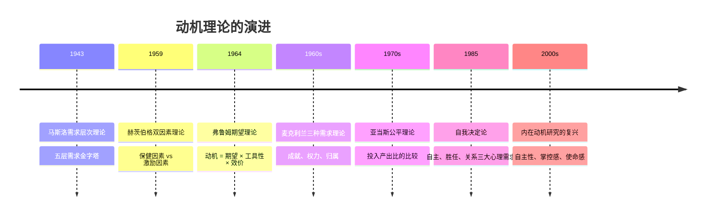
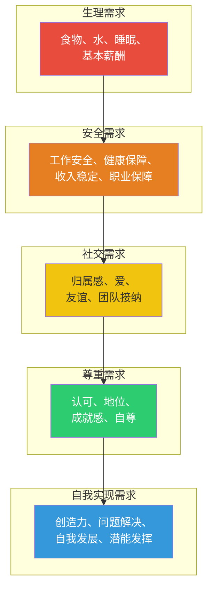
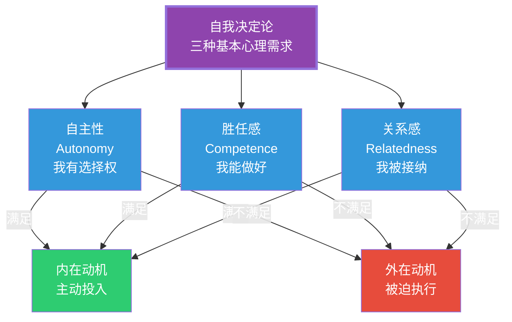
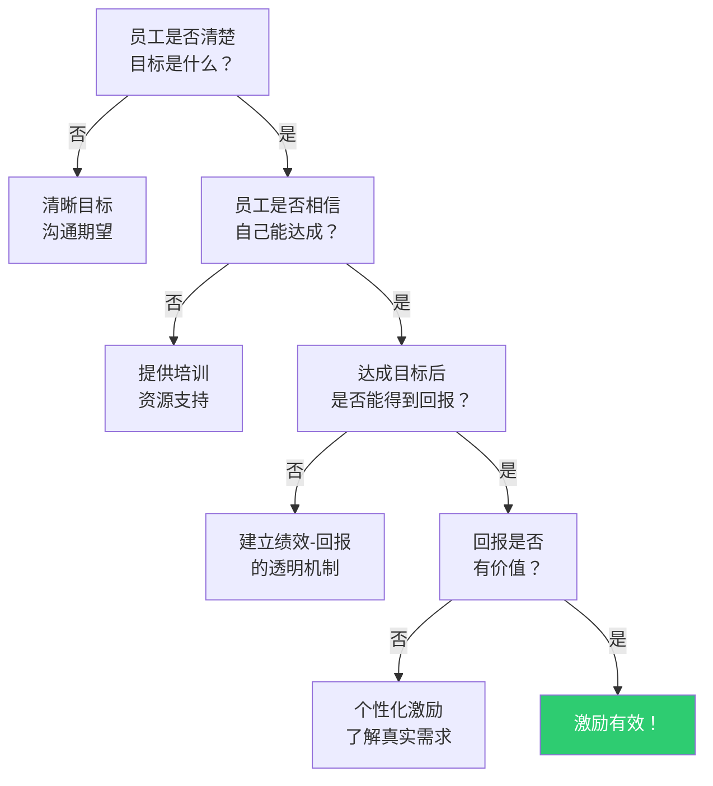

# 动机与激励理论：为什么人会努力工作

> [!abstract] 核心论点
> 激励是组织管理的核心难题。人为什么努力工作？为什么一些人比另一些人更有动力？答案不是"钱给够就行"。一百年的动机研究告诉我们：**激励的源头在"未满足的需求"，而激励的效果取决于"努力-绩效-回报"的因果链条是否清晰。**

---

## 一、经典动机理论的演进脉络



---

## 二、内容型激励理论：什么在驱动人

### 2.1 马斯洛需求层次理论

马斯洛认为人类的需求呈金字塔分布，只有低层次需求满足后，高层次需求才会成为主导动机。



> [!warning] 马斯洛理论的限制
> 马斯洛理论的"层级递进"假设过于刚性。实际上，人在同一时间可能有多个层次的需求同时存在，且不同文化背景下的需求优先级差异显著。例如，在集体主义文化中，社交需求可能比尊重需求更优先。

### 2.2 赫茨伯格双因素理论

赫茨伯格将工作因素分为两类：

| 类型 | 定义 | 包含因素 | 不满足时 | 满足时 |
|------|------|---------|----------|--------|
| **保健因素** | 导致不满的因素 | 薪酬、工作条件、公司政策、人际关系 | 产生不满 | 消除不满，但不产生满意 |
| **激励因素** | 产生满意的因素 | 成就感、认可、工作本身、成长机会 | 不产生满意 | 产生真正的满意和动力 |

> [!key] 双因素理论的核心洞察
> "不满意的反面不是满意，而是没有不满意。" 消除保健因素只能防止负面情绪，但无法产生真正的激励。**激励的唯一来源是工作本身——成就感、认可、成长。** 这就是为什么涨薪的激励效果通常只能持续3-6个月。

---

## 三、过程型激励理论：动机如何产生和维持

### 3.1 弗鲁姆期望理论（最实用的激励模型）

期望理论认为，个体的努力程度取决于三个变量的乘积：

```
动机(M) = 期望(E) × 工具性(I) × 效价(V)

其中：
- 期望(E)：我努力了，能达到绩效目标吗？（0-1）
- 工具性(I)：达到绩效目标，能得到回报吗？（0-1）
- 效价(V)：这个回报对我来说有价值吗？（可正可负）
```

> [!example] 期望理论的实战应用
> 假设你要激励销售团队完成季度目标：
> - **期望问题**：团队认为目标定得太高，不可能完成（E=0.2）→ 需要合理设定目标，提供培训和支持
> - **工具性问题**：团队质疑"公司真的会兑现承诺的奖金吗？"（I=0.5）→ 需要建立透明的绩效-回报机制
> - **效价问题**：团队说"奖金不重要，我们想要更好的晋升机会"（V=0.3）→ 需要了解每个人的真实需求，个性化激励
>
> 当前激励强度 = 0.2 × 0.5 × 0.3 = 0.03（几乎为零）

### 3.2 亚当斯公平理论

公平理论认为，人的动机不仅受绝对回报影响，更受**相对回报**影响：

```
我的产出 / 我的投入   vs   他人的产出 / 他人的投入

当两个比值不相等时 → 不公平感 → 采取行动恢复公平
```

> [!tip] 公平感的实践启示
> 公平不是"所有人拿一样多"，而是"同等贡献得到同等回报"。
> 薪酬保密政策往往适得其反——当员工无法确切知道其他人的薪酬时，反而会高估他人的收入，产生更大的不公平感。**透明化是管理公平感的有效手段。**

---

## 四、现代动机理论：自我决定论

自我决定论（Self-Determination Theory, SDT）是当前最受关注的动机理论，它提出了三种基本心理需求：



> [!important] 自我决定论的实践启示
> 传统管理强调"控制"——设定目标、监控过程、评估结果。但自我决定论告诉我们：**控制会削弱内在动机，而自主、胜任、关系会激发内在动机。** 新一代的管理实践（如OKR、敏捷管理、自组织团队）本质上都是在满足这三种需求。

---

## 五、激励理论的整合应用

### 激励诊断框架



> [!tip] 管理者激励工具箱
> 1. **个体层面**：了解每个人的"效价结构"——有人要钱，有人要成长，有人要认可
> 2. **任务层面**：设计有挑战性但不过度的任务，提供即时反馈
> 3. **环境层面**：创造安全感（不因失败受惩罚）和自主权（如何做的选择权）
> 4. **文化层面**：建立公平、透明的绩效-回报机制

---

## 六、AI时代对激励的挑战

> [!tip] 三个值得关注的趋势
> 1. **工作意义的重新定义**：当AI可以完成大量"工具性工作"后，人的工作价值更多体现在创造力、判断力和情感连接上——这些恰恰是内在动机的来源
> 2. **算法管理的激励困境**：AI驱动的精细化管理（如每30分钟考核一次工作效率）可能严重破坏自主性，削弱内在动机
> 3. **远程/混合办公的激励挑战**：缺乏面对面的社会连接，如何维持员工的归属感和关系需求？

关于AI对组织行为更深层的影响，详见 [[03-HR人事/组织行为学精要/08_AI时代的组织行为新议题]]。

---

## 本文档的关联知识

| 关联知识库 | 具体关联文档 | 关联内容 |
|------------|-------------|----------|
| 组织行为学精要 | [[03-HR人事/组织行为学精要/01_个体行为基础：人格、价值观与能力]] | 动机是冰山模型的最底层，与人格和价值观互动 |
| 组织行为学精要 | [[03-HR人事/组织行为学精要/04_领导力理论：从特质到情境到变革]] | 变革型领导的核心就是激发内在动机 |
| 培训与人才发展 | [[03-HR人事/培训与人才发展/00_MOC_培训与人才发展中枢]] | 激励理论在培训设计中的应用 |
| 项目管理方法论 | [[05-产品与开发/项目管理方法论/00_MOC_项目管理方法论中枢]] | 项目团队激励是项目经理的核心能力 |