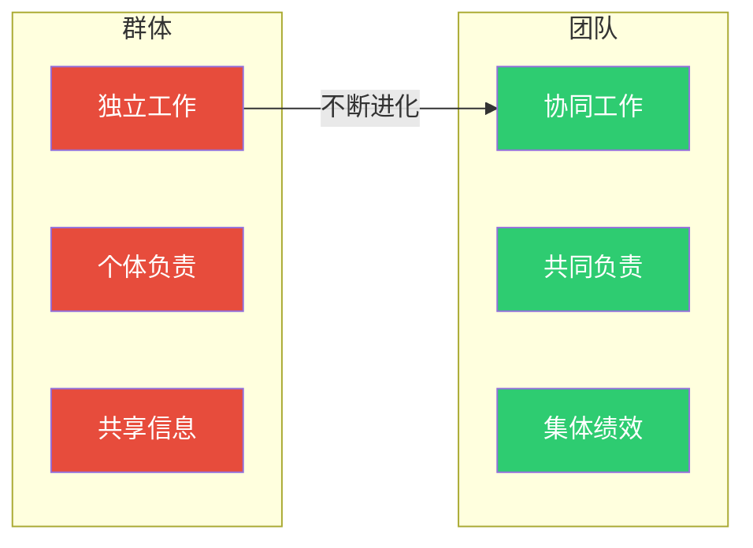
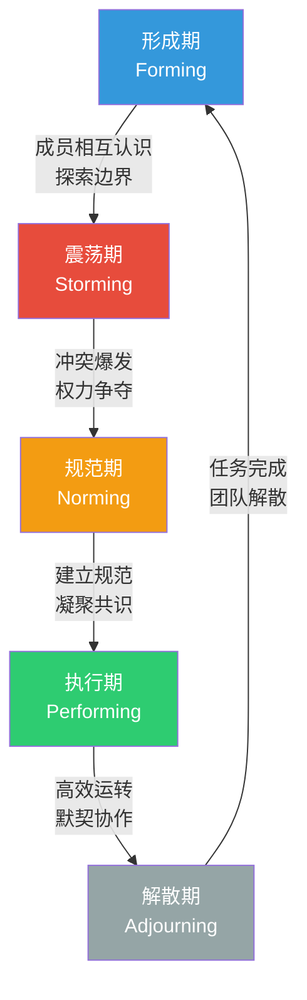
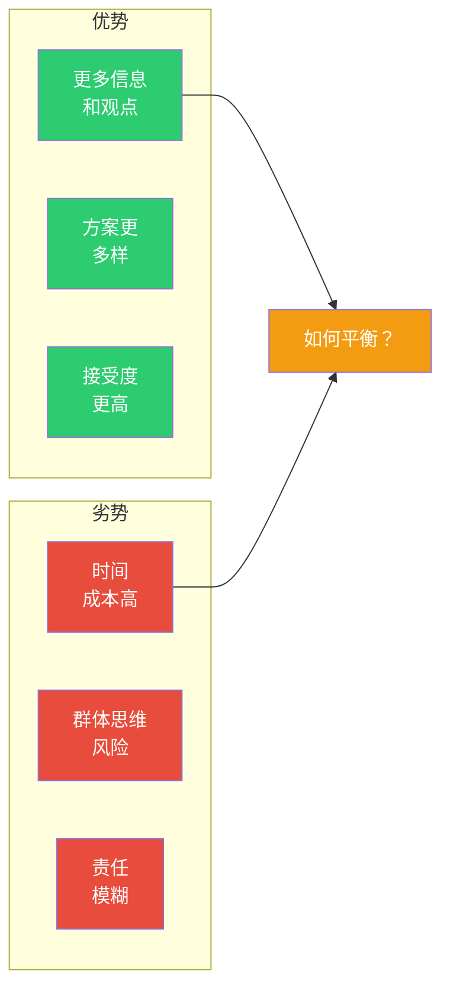
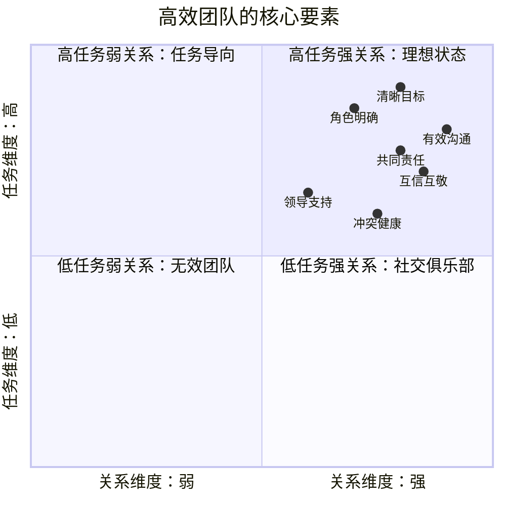

# 群体行为与团队动力

> [!abstract] 核心论点
> 团队不是个体的简单加总。群体中会出现个体单独工作时不会出现的现象——从"1+1>2"的协同效应到"三个和尚没水喝"的社会惰化。理解群体动力学的核心，是理解"当人在一起时，发生了什么变化"。

---

## 一、群体 vs 团队：不只是语义差异

| 维度 | 工作群体 | 工作团队 |
|------|---------|---------|
| 目标 | 共享信息 | 集体绩效 |
| 协同 | 中性（有时消极） | 积极（1+1>2） |
| 责任 | 个体化 | 个体+共同 |
| 技能 | 随机组合 | 互补协同 |
| 典型例子 | 同部门员工 | 项目攻坚组、Scrum团队 |

---

## 二、塔克曼模型：团队发展的五个阶段

塔克曼（Tuckman）的团队发展模型是理解团队生命周期的最经典框架：

### 各阶段的管理要点

| 阶段 | 典型特征 | 成员情绪 | 管理者角色 | 常见陷阱 |
|------|---------|----------|-----------|----------|
| **形成期** | 礼貌、试探、依赖 | 期待+焦虑 | 指导者 | 目标不清晰导致方向迷失 |
| **震荡期** | 冲突、质疑、分裂 | 挫败+抵触 | 调解者 | 过早介入压制了必要冲突 |
| **规范期** | 共识、角色明确、凝聚力 | 接纳+归属 | 促进者 | 过度追求和谐导致"群体思维" |
| **执行期** | 高效、自主、创新 | 自信+满足 | 授权者 | 自满导致创新停滞 |
| **解散期** | 收尾、反思、告别 | 不舍+成就感 | 总结者 | 忽视知识沉淀和情感处理 |

> [!warning] 关键洞察：震荡期是团队成败的分水岭
> 很多团队在震荡期就解体了。管理者最常见的错误是**过早介入压制冲突**，试图维持"表面和谐"。但事实上，震荡期的冲突是必要的——团队需要通过冲突来建立信任、明确角色、形成规则。**没有经历过震荡期的团队，永远不会进入真正的执行期。**

---

## 三、群体决策：比个体决策更好吗？

### 3.1 群体决策的优势与劣势

### 3.2 群体思维（Groupthink）

群体思维是群体决策中最危险的偏差——当群体过于追求一致性时，成员会压制自己的不同意见，导致决策质量下降。

> [!important] 群体思维的八个症状
> 1. **无懈可击的错觉**：过度乐观，认为"我们不会犯错"
> 2. **集体合理化**：为错误决策找理由，而不是反思
> 3. **对道德的深信不疑**：认为"我们做的都是对的"
> 4. **对对手的刻板印象**：低估对手，高估自己
> 5. **从众压力**：对持异议者施加直接或间接压力
> 6. **自我审查**：成员自己压制自己的疑虑
> 7. **一致同意的错觉**：沉默被误认为同意
> 8. **心理防御**：保护群体不受负面信息影响

> [!tip] 打破群体思维的方法
> 1. 指定"魔鬼代言人"角色，专门挑战主流观点
> 2. 决策前安排"静默思考时间"，让每人独立写出意见
> 3. 邀请外部专家参与讨论
> 4. 鼓励"第二方案"——即使大家都同意方案A，也要开发一个方案B

---

## 四、社会惰化：为什么团队中有人"划水"？

社会惰化是指个体在群体中工作时付出比单独工作时更少努力的现象。这是团队管理的核心挑战之一。

### 社会惰化的成因

| 原因 | 解释 | 影响程度 |
|------|------|---------|
| **责任分散** | "我不做，反正有人会做" | 高 |
| **贡献不可见** | "反正没人知道我做了什么" | 高 |
| **不公平感知** | "别人都在划水，我为什么要努力？" | 中 |
| **任务无意义** | "这事不重要，做不做都行" | 中 |

### 应对策略

> [!tip] 减少社会惰化的实操方法
> 1. **使贡献可见**：Scrum的每日站会就是让每个人的贡献透明化
> 2. **明确个体责任**：团队目标+个体目标的组合
> 3. **任务有意义**：让成员理解"为什么做"
> 4. **团队规模适度**：5-9人是最佳团队规模，超过12人社会惰化急剧上升
> 5. **公平的绩效评估**：结合个体绩效和团队绩效

---

## 五、高效团队的特征

根据对大量高效团队的研究，以下特征反复出现：

---

## 六、实践：如何诊断和干预团队问题

> [!example] 团队诊断问卷
> 当你的团队出现效率低下时，按以下顺序排查：
> 1. **目标是否清晰**？——团队是否知道"为什么做"和"做到什么算成功"？
> 2. **角色是否明确**？——每个人是否知道自己的职责和他人的职责？
> 3. **流程是否有效**？——沟通机制、决策机制、冲突解决机制是否合理？
> 4. **关系是否健康**？——信任水平、心理安全感、冲突处理方式如何？
> 5. **资源是否充足**？——时间、技能、预算、工具是否到位？

关于团队建设中的冲突管理，详见 [[03-HR人事/组织行为学精要/07_冲突与谈判：建设性冲突管理]]；关于领导者在团队中的作用，详见 [[03-HR人事/组织行为学精要/04_领导力理论：从特质到情境到变革]]。

---

## 本文档的关联知识

| 关联知识库 | 具体关联文档 | 关联内容 |
|------------|-------------|----------|
| 组织行为学精要 | [[03-HR人事/组织行为学精要/04_领导力理论：从特质到情境到变革]] | 领导力是团队发展的关键驱动因素 |
| 组织行为学精要 | [[03-HR人事/组织行为学精要/07_冲突与谈判：建设性冲突管理]] | 团队震荡期的核心挑战是冲突管理 |
| 项目管理方法论 | [[05-产品与开发/项目管理方法论/02_敏捷与Scrum：从理论到实践]] | Scrum团队的设计就是高效团队的最佳实践 |
| 项目管理方法论 | [[05-产品与开发/项目管理方法论/00_MOC_项目管理方法论中枢]] | 项目团队管理中的团队动力应用 |