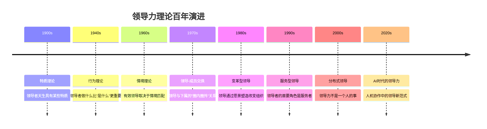
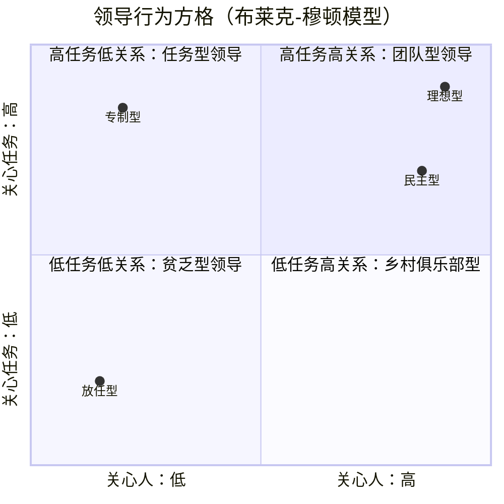
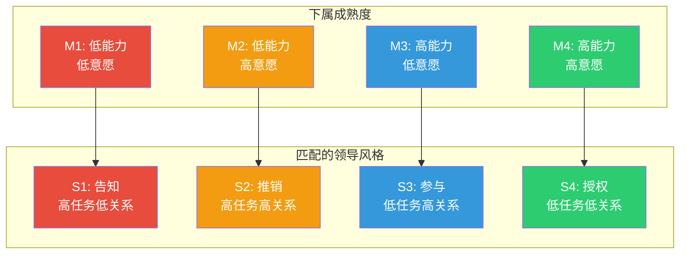

# 领导力理论：从特质到情境到变革

> [!abstract] 核心论点
> 领导力研究经历了从"领导者是谁"到"领导者做什么"到"领导行为在什么环境下有效"再到"领导如何改变组织"的演进。这不是一个"新理论取代旧理论"的过程，而是不同理论回答不同层次的问题。**领导力的本质不是职位赋予的权力，而是影响他人实现共同目标的能力。**

---

## 一、领导力理论的演进全景

---

## 二、特质理论：领导者是天生的吗？

特质理论是最早的领导力研究思路——试图找出"伟大领导者"共有的特质。

### 被广泛验证的领导力特质

| 特质类别 | 具体特质 | 实证支持度 |
|----------|---------|-----------|
| **认知能力** | 智力、洞察力、判断力 | 高 |
| **人格特质** | 尽责性、开放性、情绪稳定 | 高 |
| **动机驱动** | 成就导向、雄心、精力充沛 | 高 |
| **社交能力** | 社交智力、沟通能力、说服力 | 中高 |
| **正直诚信** | 诚实、可靠、一致性 | 高 |

> [!important] 特质理论的局限与价值
> 特质理论告诉我们"领导者需要什么"，但它无法回答"为什么同样有这些特质的人，有些人成为优秀领导者，有些人没有"。**特质是必要条件，不是充分条件。** 更重要的是，特质理论暗示领导者是天生的，这与现代领导力发展的核心理念——领导力可以被培养——相矛盾。

---

## 三、行为理论：领导者做什么比"是什么"更重要

行为理论将焦点从"谁"转向"做什么"，最著名的研究来自俄亥俄州立大学和密歇根大学。

### 领导行为的两大维度

| 行为模式 | 高任务 | 高关系 | 适用场景 | 局限 |
|---------|--------|--------|----------|------|
| **命令型** | 高 | 低 | 危机管理、新员工 | 降低员工自主性 |
| **支持型** | 低 | 高 | 高压力团队、创意工作 | 可能效率不足 |
| **参与型** | 中 | 高 | 需要团队共识的决策 | 决策慢 |
| **成就导向型** | 高 | 高 | 高绩效团队 | 对领导者要求极高 |

---

## 四、情境理论：没有最好的领导风格，只有最匹配的

费德勒的权变模型和赫塞-布兰查德的情境领导理论，将情境因素引入领导力分析。

### 情境领导模型

领导风格应根据下属的"成熟度"（能力和意愿的组合）调整：

> [!tip] 情境领导的核心启示
> 很多管理者的问题是"风格固化"——只会用自己舒服的方式管理，而不是根据团队状态调整。**最好的管理者不是"有风格"的人，而是"能切换风格"的人。**

---

## 五、变革型领导：超越交易

变革型领导是目前最受关注的领导力理论，它与传统的交易型领导形成对比：

| 维度 | 交易型领导 | 变革型领导 |
|------|-----------|-----------|
| **核心机制** | 交换（工作换报酬） | 转化（激发超越自我） |
| **目标设定** | 明确短期目标 | 塑造长期愿景 |
| **激励方式** | 外在激励（奖金、晋升） | 内在激励（意义、使命感） |
| **管理风格** | 监控、纠偏 | 授权、赋能 |
| **适用场景** | 稳定环境、常规工作 | 变革环境、创新工作 |
| **效果** | 维持现状 | 创造突破 |

### 变革型领导的四个维度（4I框架）

> [!important] 变革型领导的四个I
> 1. **理想化影响（Idealized Influence）**：以身作则，成为榜样，让追随者愿意效仿
> 2. **愿景激励（Inspirational Motivation）**：描绘有吸引力的未来，赋予工作意义
> 3. **智力激发（Intellectual Stimulation）**：挑战假设，鼓励创新，不惩罚"异见"
> 4. **个性化关怀（Individualized Consideration）**：关注每个下属的独特需求和发展

---

## 六、领导力发展的核心路径

> [!tip] 领导力是可以被培养的
> 研究表明，领导力中约30%是先天特质，约70%可以通过后天培养获得。领导力发展的关键路径包括：
>
> 1. **经历驱动**：最有价值的学习来自"挑战性任务"——带一个困难项目、管理一个跨部门团队、处理一次危机
> 2. **反馈驱动**：360度评估、高管教练、同伴反馈——没有反馈就没有成长
> 3. **反思驱动**：定期复盘自己的领导行为——"我做了什么？效果如何？下次可以怎么做？"
>
> 关于领导力发展的系统方法，详见 [[03-HR人事/培训与人才发展/00_MOC_培训与人才发展中枢]]。

---

## 七、AI时代的领导力挑战

> [!warning] AI对领导力的三个根本性冲击
> 1. **决策权转移**：当AI可以做出比人更好的决策时，领导者的角色从"决策者"变为"AI决策的审核者"
> 2. **人机团队管理**：领导者需要管理"人+AI"的混合团队，AI成员的行为模式与人类完全不同
> 3. **信任的新基础**：传统领导力建立在"人际信任"上，当AI承担管理职能时，"算法信任"成为一个新问题

关于AI时代组织变革的深入探讨，详见 [[02-AI趋势与素养/AI Native组织变革/00_MOC_AI Native组织变革中枢]] 和 [[03-HR人事/组织行为学精要/08_AI时代的组织行为新议题]]。

---

## 本文档的关联知识

| 关联知识库 | 具体关联文档 | 关联内容 |
|------------|-------------|----------|
| 组织行为学精要 | [[03-HR人事/组织行为学精要/02_动机与激励理论：为什么人会努力工作]] | 变革型领导的核心是激发内在动机 |
| 组织行为学精要 | [[03-HR人事/组织行为学精要/03_群体行为与团队动力]] | 领导力是团队发展的关键驱动因素 |
| 组织行为学精要 | [[03-HR人事/组织行为学精要/05_组织文化与变革：如何塑造和改变文化]] | 变革型领导是组织文化变革的推动力 |
| AI Native组织变革 | [[02-AI趋势与素养/AI Native组织变革/00_MOC_AI Native组织变革中枢]] | AI时代领导力范式转变 |
| 项目管理方法论 | [[05-产品与开发/项目管理方法论/00_MOC_项目管理方法论中枢]] | 项目经理的领导力在项目中的实际应用 |