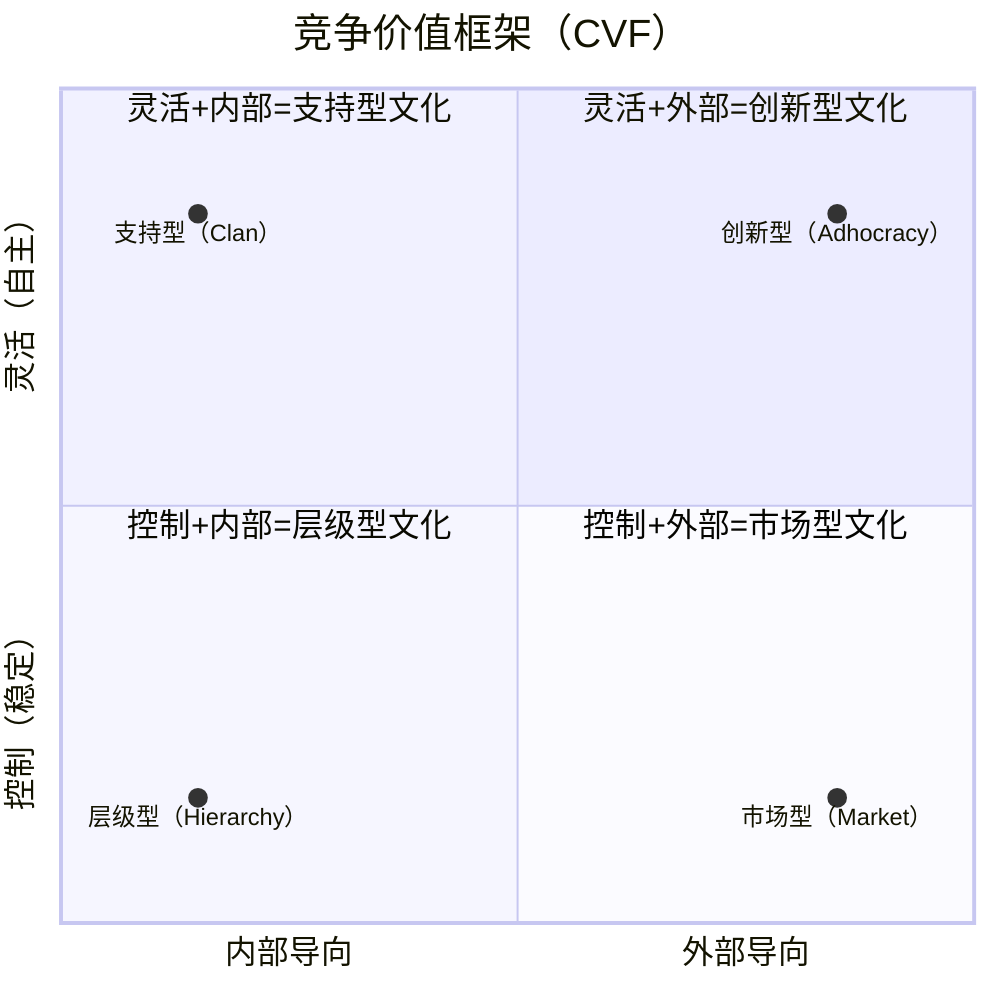
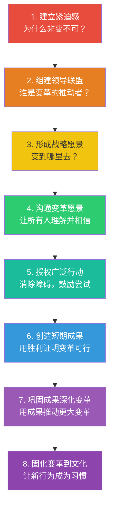

# 组织文化与变革：如何塑造和改变文化

> [!abstract] 核心论点
> "文化把战略当早餐吃"——这句话在管理界无人不知。但文化到底是什么？它如何被塑造？更重要的是，当组织需要改变时，文化这一"最顽固的要素"如何被改变？**文化不是墙上贴的标语，而是组织在长期解决问题过程中形成的"默认行为模式"。改变文化，本质上是改变组织解决问题的默认方式。**

---

## 一、什么是组织文化？三个层次

沙因（Schein）的组织文化模型将文化分为三个层次：

```mermaid
flowchart TD
    subgraph 表层
        A1["人工制品<br/>Artifacts"]:::level1
        A2["· 办公布局、着装规范<br/>· 仪式、故事、口号<br/>· 可见但难以解读"]:::detail1
    end

    subgraph 中层
        B1["信奉价值观<br/>Espoused Values"]:::level2
        B2["· 战略、目标、哲学<br/>· 墙上写的"价值观"<br/>· 可能与实际行为不一致"]:::detail2
    end

    subgraph 深层
        C1["基本假设<br/>Basic Assumptions"]:::level3
        C2["· 无意识的、理所当然的信念<br/>· 决定感知、思考和感受<br/>· 最难改变"]:::detail3
    end

    A1 --> B1 --> C1

    classDef level1 fill:#E74C3C,color:#fff
    classDef level2 fill:#F39C12,color:#fff
    classDef level3 fill:#8E44AD,color:#fff
    classDef detail1 fill:#FADBD8,color:#333
    classDef detail2 fill:#FDEBD0,color:#333
    classDef detail3 fill:#E8DAEF,color:#333
```

> [!important] 沙因模型的核心启示
> 大多数组织文化变革的失败，是因为它们只停留在"表层"——换办公布局、改价值观标语、重新设计组织架构。但真正的文化在"深层"——那些看不见的、无意识的假设。**深层假设不改变，表层变化只是装饰。**

---

## 二、竞争价值框架：四类组织文化

奎因（Quinn）的竞争价值框架（CVF）从两个维度将组织文化分为四类：



| 文化类型 | 核心特征 | 典型口号 | 优势 | 劣势 |
|---------|---------|---------|------|------|
| **层级型** | 结构化、流程驱动、稳定性 | "按流程办事" | 高效、可预测 | 官僚、僵化 |
| **市场型** | 竞争导向、结果驱动、效率 | "赢" | 执行力强、目标明确 | 忽视人、短期主义 |
| **支持型** | 家庭式、协作、参与 | "我们是一家人" | 员工忠诚、氛围好 | 可能效率不足 |
| **创新型** | 动态、创意、冒险 | "打破常规" | 创新力强、适应变化 | 混乱、不可预测 |

> [!tip] 文化类型不是"好坏"而是"是否匹配"
> 没有一种文化类型是"最好的"。层级型文化在银行和制药行业是优势，但如果在创业公司就是灾难。**文化评估的核心问题是：这种文化是否支持组织的战略目标？**

---

## 三、科特八步变革法

约翰·科特（John Kotter）的八步变革模型是组织变革领域最实用的框架：



### 变革失败的主要原因

> [!warning] 科特指出的变革失败八大错误
> 1. **自满情绪太高**——没有建立足够的紧迫感
> 2. **缺乏强大的领导联盟**——变革只靠一个人推不动
> 3. **低估愿景的力量**——没有清晰可沟通的变革愿景
> 4. **愿景沟通不足**——只沟通了10%就以为够了
> 5. **没有清除障碍**——体制、流程、管理者成为变革的阻力
> 6. **没有创造短期成果**——人们看不到希望
> 7. **过早宣布胜利**——变革刚有起色就松懈了
> 8. **没有将变革固化为文化**——新做法没有成为"我们这里做事的方式"

---

## 四、文化变革的实操路径

### 4.1 文化诊断工具

在改变文化之前，先诊断当前文化：

> [!example] 文化诊断问卷框架
> - **看什么**：观察会议中的行为模式（谁在说话？怎么决策？冲突如何处理？）
> - **听什么**：注意组织中的"故事"——人们讲什么故事？英雄是谁？反面教材是谁？
> - **问什么**：问三个问题——"我们这里真正的规则是什么？""什么行为会被奖励？""什么行为会被惩罚？"
> - **量什么**：用CVF问卷测量组织的文化类型，评估"当前文化"和"期望文化"之间的差距

### 4.2 文化变革的杠杆点

| 杠杆 | 操作方法 | 难度 | 影响力 |
|------|---------|------|--------|
| **领导者的示范** | 领导者改变自己的行为，成为新文化的"活标本" | 中 | 极高 |
| **绩效评估** | 调整绩效评估标准，奖励新文化期望的行为 | 中 | 高 |
| **人才决策** | 招聘符合新文化的人，淘汰不符合的人 | 高 | 极高 |
| **资源分配** | 把预算和资源从旧文化项目转移到新文化项目 | 中 | 高 |
| **仪式和符号** | 创造新的仪式（如创新大赛）、改变符号（如办公室布局） | 低 | 中 |
| **故事传播** | 有意识地传播体现新文化的"英雄故事" | 低 | 中 |

---

## 五、文化变革中常见的陷阱

> [!warning] 五个最常见的文化变革陷阱
> 1. **"文化项目"心态**：把文化变革当成一个"项目"，有开始和结束——但文化变革没有终点
> 2. **言行不一致**：领导者说一套做一套——这是文化变革的"杀手"
> 3. **低估时间**：真正的文化变革需要3-10年，不是3个月。组织需要对此有合理的预期
> 4. **忽视权力结构**：文化变革会触动既得利益者，如果不处理权力问题，变革会遭遇隐形阻力
> 5. **一刀切**：不同部门、不同地区可能需要不同的文化，强求统一反而适得其反

关于组织中的权力问题，详见 [[03-HR人事/组织行为学精要/06_权力与政治：组织中的影响力游戏]]。

---

## 六、AI时代的组织文化新议题

> [!tip] AI对组织文化的三个冲击
> 1. **信任文化的转变**：从"人际信任"到"算法信任"——当AI做出决策时，员工的信任对象从"我的领导"变成了"一个黑箱"
> 2. **速度文化 vs 反思文化**：AI大幅提升了决策速度，但组织需要刻意培养"慢思考"的文化来平衡
> 3. **透明文化的挑战**：AI监控在提升效率的同时，可能破坏心理安全感——员工会感到被监视

关于AI时代组织变革的系统探讨，详见 [[02-AI趋势与素养/AI Native组织变革/00_MOC_AI Native组织变革中枢]]。

---

## 本文档的关联知识

| 关联知识库 | 具体关联文档 | 关联内容 |
|------------|-------------|----------|
| 组织行为学精要 | [[03-HR人事/组织行为学精要/04_领导力理论：从特质到情境到变革]] | 变革型领导是文化变革的核心推动力 |
| 组织行为学精要 | [[03-HR人事/组织行为学精要/06_权力与政治：组织中的影响力游戏]] | 文化变革中的权力博弈 |
| AI Native组织变革 | [[02-AI趋势与素养/AI Native组织变革/00_MOC_AI Native组织变革中枢]] | AI时代组织文化的系统性变革 |
| 项目管理方法论 | [[05-产品与开发/项目管理方法论/00_MOC_项目管理方法论中枢]] | 变革本身就是一种特殊的项目管理 |
| 知识管理体系 | [[07-学习成长/知识管理体系/00_MOC_知识管理体系中枢]] | 知识分享文化是组织文化的重要组成部分 |