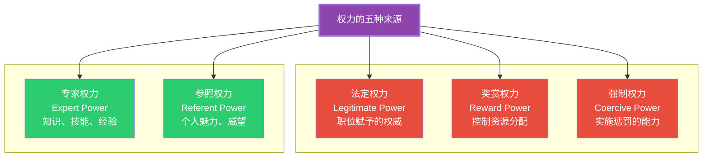
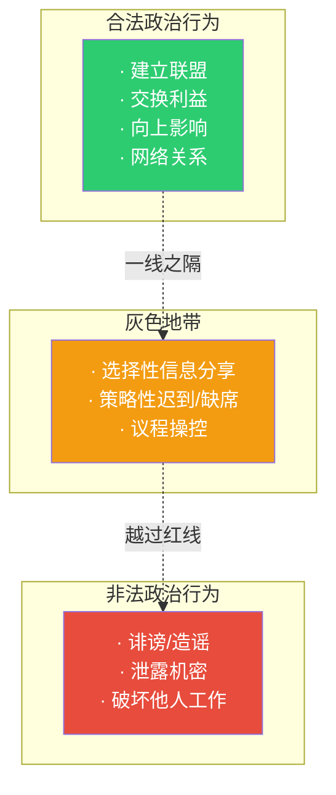

# 权力与政治：组织中的影响力游戏

> [!abstract] 核心论点
> 权力在组织中常常被视为"负面词汇"，但事实上，权力是组织运作的底层机制。没有权力，什么也做不成。**关键问题不是"你是否参与权力游戏"，而是"你是否有意识地玩好这个游戏"。** 理解权力来源和影响力策略，是组织中的"元能力"——它让你理解为什么有些事做不成，也让你的提议更有可能被采纳。

---

## 一、权力的五种来源

弗伦奇和雷文（French & Raven）提出的权力基础模型，至今仍是分析组织权力的经典框架：

### 五种权力对比

| 权力类型 | 来源 | 特点 | 优势 | 局限 |
|---------|------|------|------|------|
| **法定权力** | 职位、头衔 | 最直接，但最脆弱 | 快速建立权威 | 离开职位就消失 |
| **奖赏权力** | 资源控制权 | 产生服从 | 激励行为 | 成本高，需要持续投入 |
| **强制权力** | 惩罚能力 | 产生恐惧 | 快速制止不当行为 | 破坏关系，降低信任 |
| **专家权力** | 专业知识和技能 | 最持久 | 别人主动寻求你的意见 | 需要持续学习维持 |
| **参照权力** | 个人魅力、人品 | 影响力最大 | 别人自愿追随 | 难以培养，需要时间 |

> [!important] 权力来源的"投资组合"策略
> 依赖单一权力来源是危险的——职位权力可能一夜之间消失，但专家权力和参照权力会一直跟随你。**组织中最高效的"权力组合"是：以法定权力为"入场券"，以专家权力建立"信任"，以参照权力凝聚"追随"。**

---

## 二、组织政治：不是你想不想，而是你在不在

### 2.1 政治行为的三层面

### 2.2 为什么政治行为不可避免？

> [!tip] 组织政治的产生条件
> 当以下三个条件同时存在时，政治行为必然出现：
> 1. **资源稀缺**——预算、晋升名额、好项目永远不够分
> 2. **决策模糊**——没有"唯一正确的答案"，决策依赖于判断和共识
> 3. **目标分歧**——不同部门、不同个人的目标不完全一致
>
> 这三个条件在几乎所有组织中同时存在。所以，**政治行为不是"坏组织"的特征，而是"所有组织"的特征。**

---

## 三、影响力策略：九种影响力战术

| 战术 | 定义 | 适用场景 | 效果 |
|------|------|---------|------|
| **理性说服** | 用事实和数据论证 | 决策层、分析型受众 | 中长期有效 |
| **鼓舞诉求** | 诉诸价值观和愿景 | 需要激发热情时 | 高度有效但不可滥用 |
| **咨询** | 征求参与和意见 | 需要对方承诺时 | 提升参与感 |
| **逢迎** | 先建立好感再提要求 | 关系未建立时 | 有效但需真诚 |
| **交换** | 利益互换 | 双方各有所需 | 最常用的交易型策略 |
| **个人诉求** | 基于私人关系提要求 | 熟人之间 | 消耗关系资本 |
| **联盟** | 联合他人共同施压 | 力量不足时 | 增加影响力 |
| **合法化** | 引用规则、政策、权威 | 需要正当性 | 庄重但可能僵化 |
| **施压** | 直接要求、威胁 | 危机时刻 | 最后手段，慎用 |

> [!example] 影响力策略的选择逻辑
> - **向上影响**：理性说服 + 联盟（用数据说话，联合关键支持者）
> - **平级影响**：交换 + 咨询（互惠互利，尊重对方自主权）
> - **向下影响**：鼓舞诉求 + 合法化（激发热情，明确期望）
> - **跨部门**：联盟 + 理性说服（先建立共识，再用数据论证）

---

## 四、权力与政治的健康使用

> [!warning] 组织政治的"健康边界"
> 健康组织中的政治行为 vs 不健康组织中的政治行为：
>
> | 健康政治 | 不健康政治 |
> |----------|-----------|
> | 为了推动项目 | 为了个人利益 |
> | 公开透明 | 暗中操作 |
> | 以组织利益为准 | 以个人利益为准 |
> | 尊重他人 | 损害他人 |
> | 用事实说话 | 用谣言说话 |

---

## 五、权力与领导力的关系

权力和领导力不同，但密切相关：

| 维度 | 权力 | 领导力 |
|------|------|--------|
| **核心** | 影响他人的能力 | 影响他人的方向 |
| **来源** | 职位+个人特质 | 愿景+信任+示范 |
| **机制** | 服从 | 追随 |
| **效果** | 短期行为改变 | 长期信念改变 |
| **关系** | 领导力需要权力，但权力不等于领导力 | |

关于领导力的系统探讨，详见 [[03-HR人事/组织行为学精要/04_领导力理论：从特质到情境到变革]]。

---

## 六、AI时代的权力格局变化

> [!tip] AI对组织权力的三个重塑
> 1. **专家权力的重新分配**：当AI可以回答问题、生成方案时，"拥有知识"不再等于"拥有权力"，"知道如何向AI提问"和"能够判断AI输出质量"成为新的专家权力来源
> 2. **信息权力的去中心化**：AI让信息获取变得平等，中层管理者"信息中转站"的权力正在消失
> 3. **算法权力的崛起**：掌握AI系统和数据的团队，正在获得前所未有的组织权力——这引发了新的"算法政治"问题

---

## 本文档的关联知识

| 关联知识库 | 具体关联文档 | 关联内容 |
|------------|-------------|----------|
| 组织行为学精要 | [[03-HR人事/组织行为学精要/04_领导力理论：从特质到情境到变革]] | 权力是领导力的基础，但不等同于领导力 |
| 组织行为学精要 | [[03-HR人事/组织行为学精要/05_组织文化与变革：如何塑造和改变文化]] | 文化变革中的权力博弈 |
| 组织行为学精要 | [[03-HR人事/组织行为学精要/07_冲突与谈判：建设性冲突管理]] | 权力不对等是冲突的重要来源 |
| 项目管理方法论 | [[05-产品与开发/项目管理方法论/06_干系人管理：把关键人变成同盟]] | 干系人管理本质上是权力和影响力管理 |
| 项目管理方法论 | [[05-产品与开发/项目管理方法论/00_MOC_项目管理方法论中枢]] | 项目经理的"无权领导"能力 |