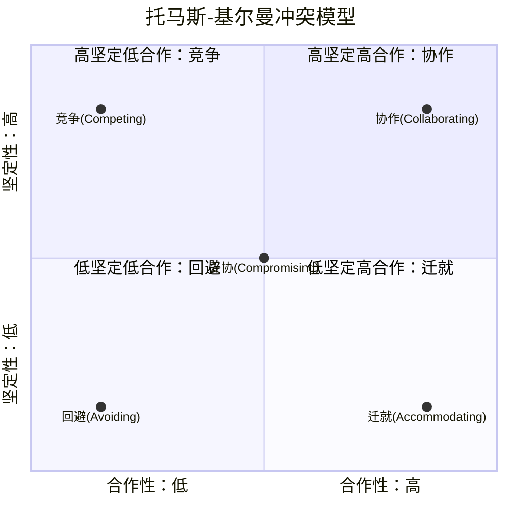
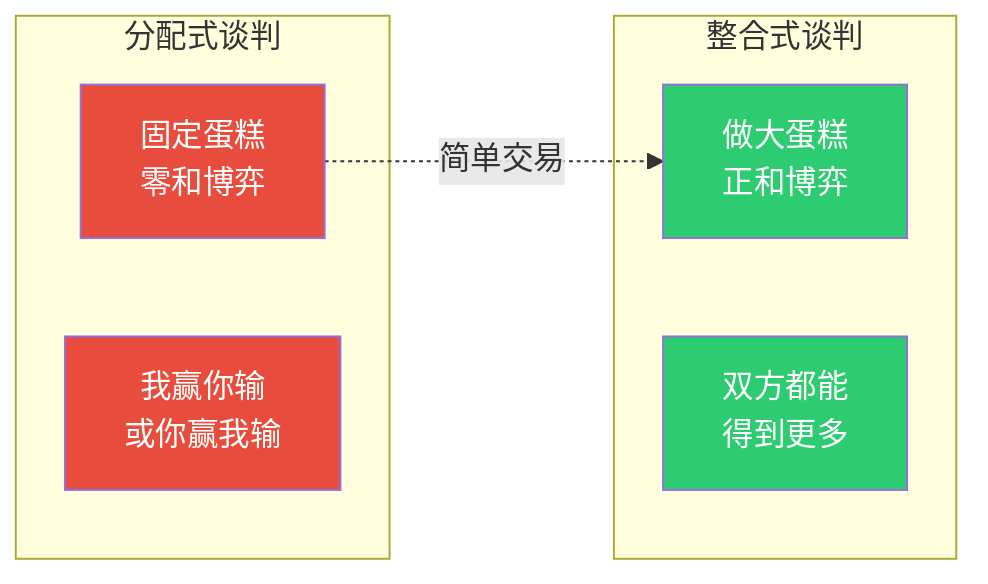
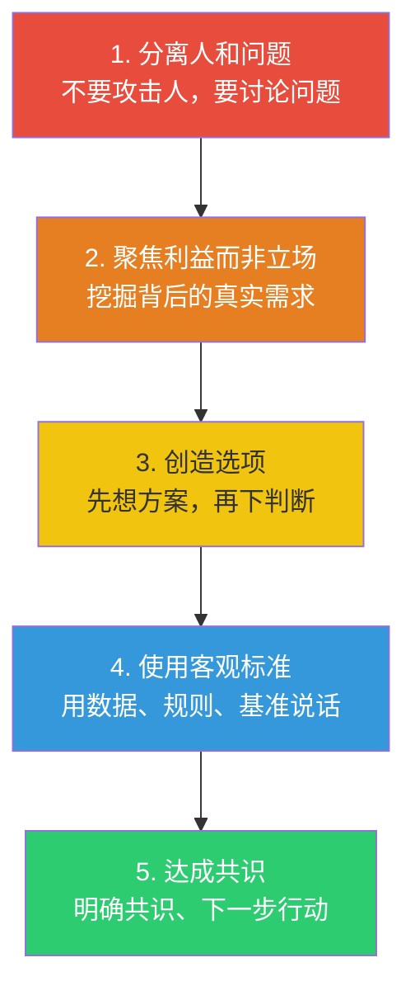

# 冲突与谈判：建设性冲突管理

> [!abstract] 核心论点
> 冲突不是坏事，关键在于"如何管理"。**没有冲突的组织是僵化的，冲突过度的组织是混乱的。** 优秀的管理者不是"消除冲突"，而是"管理冲突"——让冲突保持在建设性的水平，抑制其破坏性的一面，激发其创新性的一面。

---

## 一、冲突的类型：不是所有冲突都一样

```mermaid
flowchart TD
    C["冲突类型"]:::root

    subgraph 任务冲突
        T["任务冲突<br/>Task Conflict<br/>关于工作内容和方法的分歧"]:::task
    end
    subgraph 关系冲突
        R["关系冲突<br/>Relationship Conflict<br/>人际间的情绪和摩擦"]:::rel
    end
    subgraph 过程冲突
        P["过程冲突<br/>Process Conflict<br/>关于如何完成工作的分歧"]:::proc

    T -->|"适度有益"| POS["建设性<br/>提升决策质量"]:::good
    R -->|"总是有害"| NEG["破坏性<br/>降低团队效能"]:::bad
    P -->|"低度有益"| MID["视情况而定<br/>过度则散"]:::mid

    classDef root fill:#8E44AD,color:#fff
    classDef task fill:#3498DB,color:#fff
    classDef rel fill:#E74C3C,color:#fff
    classDef proc fill:#F39C12,color:#fff
    classDef good fill:#2ECC71,color:#fff
    classDef bad fill:#E74C3C,color:#fff
    classDef mid fill:#F39C12,color:#fff
```

> [!important] 冲突管理的第一原则
> **任务冲突是健康的，关系冲突是致命的。** 管理者需要做的是：鼓励围绕工作内容的健康争论，同时坚决制止人身攻击和情绪对抗。当任务冲突开始转向关系冲突时，立即介入。

---

## 二、托马斯-基尔曼冲突模型

托马斯-基尔曼（Thomas-Kilmann）模型从两个维度定义了五种冲突处理策略：



### 五种策略的适用场景

| 策略 | 定义 | 何时使用 | 何时避免 |
|------|------|---------|----------|
| **竞争** | 坚持己见，不合作 | 紧急决策、不道德行为、保护自身权益 | 关系重要、双方实力悬殊时 |
| **协作** | 寻找双赢方案 | 问题复杂、需要整合多方观点、有时间 | 问题简单、时间紧迫时 |
| **妥协** | 双方各退一步 | 时间紧迫、双方势均力敌、临时方案 | 问题需要最佳方案时 |
| **回避** | 暂时搁置 | 问题微小、需要冷静期、对方更合适决策 | 问题紧急、会持续恶化时 |
| **迁就** | 满足对方需求 | 你错了、对方更重要、维护关系 | 原则问题、对方会利用时 |

> [!tip] 冲突风格不是"一种打天下"
> 大多数人有一种"默认冲突风格"——有人习惯竞争，有人习惯回避。但高效的管理者会根据情境切换风格。**关键不是"哪种风格最好"，而是"在当前情境下，哪种风格最合适"。**

---

## 三、谈判策略：从分配到整合

### 3.1 分配式谈判 vs 整合式谈判



| 维度 | 分配式谈判 | 整合式谈判 |
|------|-----------|-----------|
| **资源假设** | 资源是固定的 | 资源可以扩大 |
| **目标** | 最大化自己的份额 | 寻找双方都能获益的方案 |
| **关系** | 一次性的 | 长期关系 |
| **策略** | 隐藏信息、虚张声势 | 分享信息、探索需求 |
| **典型场景** | 二手车交易 | 合作伙伴谈判 |

### 3.2 BATNA：谈判中最强大的概念

BATNA（Best Alternative To a Negotiated Agreement）——谈判协议的最佳替代方案——是谈判中最核心的概念。

> [!important] BATNA的核心逻辑
> 你的谈判筹码不取决于你"想要什么"，而取决于"如果谈不成，你的最佳替代方案是什么"。
>
> - **BATNA强**：你有更好的选择，谈判中更有底气
> - **BATNA弱**：你没有其他选择，谈判中更容易妥协
>
> **谈判的准备重点不是"我要什么"，而是"如果谈不成，我还有什么选择"。**

---

## 四、冲突管理的实操流程

### 冲突调解五步法



> [!example] 冲突调解对话示例
> 管理者："我看到你们在项目方案上有分歧。小王，你先说说你的想法，然后小李再说。"
> （分离人和问题，给双方表达机会）
>
> 管理者："听起来，小王关注的是技术可行性，小李关注的是用户需求。你们的核心目标其实是一致的，只是优先级不同。"
> （聚焦利益，揭示共同目标）
>
> 管理者："我们能不能想一个方案，既保证技术稳定，又快速验证用户需求？比如先做最小可行版本？"
> （创造选项，寻找整合方案）

---

## 五、建设性冲突的组织设计

> [!tip] 如何让组织"产生更多建设性冲突"
> 大多数组织的问题是"冲突太少了"——不是人际关系冲突，而是围绕工作内容的健康争论太少。以下方法可以帮助组织培养建设性冲突：
>
> 1. **设立"魔鬼代言人"**：在关键决策中，指定一个人专门挑战主流观点
> 2. **"红队"机制**：在重大项目中，设立独立的"红队"来质疑方案
> 3. **匿名反馈渠道**：降低表达不同意见的心理成本
> 4. **奖励"建设性异见"**：在绩效评估中，鼓励"提出不同意见"的行为
> 5. **领导示范**：领导者公开欢迎被挑战，并奖励挑战者

---

## 六、AI时代的冲突新形态

> [!warning] AI带来的三种新型冲突
> 1. **AI建议 vs 人类直觉**：当AI的建议与经验丰富的员工的直觉相悖时，冲突如何解决？
> 2. **算法决策的"责任归属"冲突**：AI推荐了一个方案但出了问题，谁负责？这是一个全新的冲突类型
> 3. **人机协作中的"角色冲突"**：当AI承担了部分工作，人类的角色边界变得模糊，引发身份认同冲突

---

## 本文档的关联知识

| 关联知识库 | 具体关联文档 | 关联内容 |
|------------|-------------|----------|
| 组织行为学精要 | [[03-HR人事/组织行为学精要/03_群体行为与团队动力]] | 团队震荡期的核心挑战就是冲突管理 |
| 组织行为学精要 | [[03-HR人事/组织行为学精要/06_权力与政治：组织中的影响力游戏]] | 权力不对等是冲突的重要来源 |
| 项目管理方法论 | [[05-产品与开发/项目管理方法论/00_MOC_项目管理方法论中枢]] | 项目经理的冲突管理能力 |
| 项目管理方法论 | [[05-产品与开发/项目管理方法论/06_干系人管理：把关键人变成同盟]] | 干系人管理中的冲突解决 |
| 项目管理方法论 | [[05-产品与开发/项目管理方法论/07_项目复盘与知识管理：如何让每个项目都增值]] | 复盘中的建设性冲突是学习的关键 |