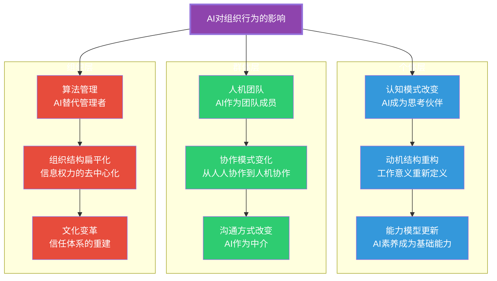
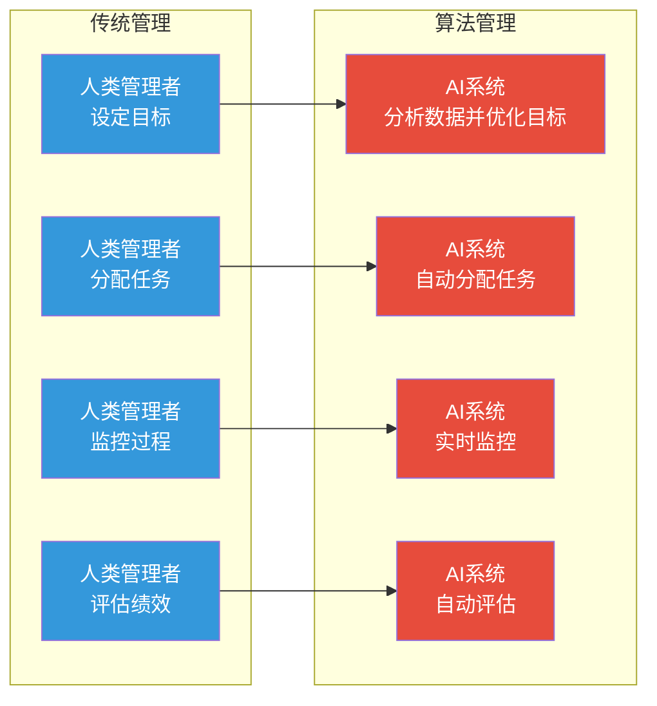

# AI时代的组织行为新议题

> [!abstract] 核心论点
> AI正在从根本上改变组织行为学的研究对象——当"人"不再是组织中唯一的行为主体，当"算法"开始承担管理职能，当"人机团队"成为新的工作单元，传统组织行为学理论需要被重新审视和扩展。**这不是"在原有理论基础上加一个AI章节"，而是组织行为学范式的整体演进。**

---

## 一、AI对组织行为三层次的影响

---

## 二、个体层：AI如何改变人的行为

### 2.1 认知自动化与认知替代

> [!important] AI对认知的影响
> 传统组织行为学假设"认知是人的专属能力"，但AI的介入改变了这一点：
> - **认知外包**：人会倾向于把思考任务"外包"给AI，长期可能导致自身认知能力退化
> - **AI依赖症**：遇到问题先问AI而不是自己思考，形成"先问AI"的习惯
> - **判断力萎缩**：当AI提供了看似完美的答案，人可能会失去独立判断和质疑的能力

### 2.2 动机结构的变化

回顾 [[03-HR人事/组织行为学精要/02_动机与激励理论：为什么人会努力工作]] 中的自我决定论，AI对三种基本心理需求产生了冲击：

| 心理需求 | AI带来的挑战 | 可能的应对 |
|---------|-------------|-----------|
| **自主性** | 算法管理剥夺了"如何做"的选择权 | 在AI设定边界内保留人类选择权 |
| **胜任感** | AI比人做得更好，人类感到"无能" | 重新定义"胜任"——从"自己做"到"用好AI" |
| **关系感** | 与AI的互动不能替代人际连接 | 有意识地保留纯人际的工作场景 |

### 2.3 AI素养：新的基础能力

关于AI对个体能力模型的系统性影响，详见 [[02-AI趋势与素养/AI时代能力要求/00_MOC_AI时代能力要求中枢]]。

---

## 三、群体层：人机团队的兴起

### 3.1 AI作为"团队成员"

当AI不再是工具，而是"团队成员"时，传统团队理论需要重新思考：

> [!example] 人机团队的三种模式
> 1. **AI作为专家成员**：AI提供专业建议，人类团队做决策（如AI医疗诊断建议+医生团队决策）
> 2. **AI作为执行成员**：人类团队规划，AI负责执行（如项目组规划任务，AI写代码）
> 3. **AI作为协调成员**：AI负责分配任务、跟踪进度、协调沟通（如AI项目经理）

### 3.2 人机团队的管理挑战

| 挑战 | 描述 | 与传统团队的区别 |
|------|------|----------------|
| **信任建立** | 人类如何信任AI的判断？ | 信任对象从"人"变成了"系统" |
| **沟通模式** | 如何与AI成员有效沟通？ | 需要明确、结构化的指令 |
| **责任归属** | AI成员出错时谁负责？ | 传统责任体系失效 |
| **角色定义** | 人类和AI的边界在哪里？ | 需要动态调整而不是固定 |
| **绩效评估** | 如何评估AI成员的表现？ | 需要全新的评估标准 |

---

## 四、组织层：算法管理的崛起

### 4.1 什么是算法管理？

算法管理是指用AI算法替代人类管理者，进行任务分配、绩效评估、过程监控等管理职能。

### 4.2 算法管理对组织行为的影响

> [!warning] 算法管理的双刃剑
> **正面影响**：
> - 决策更客观、数据驱动，减少人为偏见
> - 效率大幅提升，任务分配更优化
> - 绩效评估更透明、可追溯
>
> **负面影响**：
> - 自主性降低，削弱内在动机
> - 心理安全感下降，员工感到被"监视"
> - 算法偏见可能被放大和固化
> - 管理关系"去人性化"

---

## 五、对传统组织行为学理论的挑战

### 需要重新审视的理论

| 传统理论 | AI时代的新问题 | 是否需要修正 |
|---------|--------------|------------|
| 大五人格模型 | AI如何与不同人格类型协作？ | 扩展应用场景 |
| 期望理论 | 当AI设定目标时，期望-工具性-效价的链条如何变化？ | 增加"算法信任"变量 |
| 塔克曼模型 | 人机团队的"形成-震荡-规范-执行"是否不同？ | 需要修正 |
| 变革型领导 | 当AI可以激发动机时，领导者的角色是什么？ | 重新定义 |
| 权力五来源 | "算法权力"是新的权力来源吗？ | 需要扩展 |
| 冲突模型 | 人机冲突的本质是什么？ | 需要补充 |

---

## 六、未来研究方向与组织准备

### 6.1 组织需要关注的新议题

> [!tip] 组织应立即关注的五个议题
> 1. **AI伦理框架**：建立AI使用的伦理边界，避免算法权力的滥用
> 2. **人机协作规范**：明确"人做什么、AI做什么"的边界和规则
> 3. **算法透明性**：确保AI决策过程可解释、可追溯
> 4. **新技能培训**：培养员工的AI素养和人机协作能力
> 5. **心理安全感维护**：在AI引入过程中，持续关注员工的心理状态

### 6.2 与其他知识库的联动

关于AI时代组织变革的系统探讨，详见 [[02-AI趋势与素养/AI Native组织变革/00_MOC_AI Native组织变革中枢]]。

关于AI时代能力模型的更新，详见 [[02-AI趋势与素养/AI时代能力要求/00_MOC_AI时代能力要求中枢]]。

关于AI对项目管理的影响，详见 [[05-产品与开发/项目管理方法论/08_AI时代的项目管理变革]]。

关于AI对知识管理的影响，详见 [[07-学习成长/知识管理体系/06_AI时代的个人知识管理变革]]。

---

## 本文档的关联知识

| 关联知识库 | 具体关联文档 | 关联内容 |
|------------|-------------|----------|
| 组织行为学精要 | [[03-HR人事/组织行为学精要/01_个体行为基础：人格、价值观与能力]] | AI对个体能力模型的冲击 |
| 组织行为学精要 | [[03-HR人事/组织行为学精要/02_动机与激励理论：为什么人会努力工作]] | AI对内在动机的影响 |
| 组织行为学精要 | [[03-HR人事/组织行为学精要/04_领导力理论：从特质到情境到变革]] | AI时代的领导力新范式 |
| AI Native组织变革 | [[02-AI趋势与素养/AI Native组织变革/00_MOC_AI Native组织变革中枢]] | AI时代组织结构的系统性变革 |
| AI时代能力要求 | [[02-AI趋势与素养/AI时代能力要求/00_MOC_AI时代能力要求中枢]] | AI时代个体能力模型重构 |
| 项目管理方法论 | [[05-产品与开发/项目管理方法论/08_AI时代的项目管理变革]] | AI对项目管理实践的影响 |
| 知识管理体系 | [[07-学习成长/知识管理体系/06_AI时代的个人知识管理变革]] | AI对知识管理的影响 |