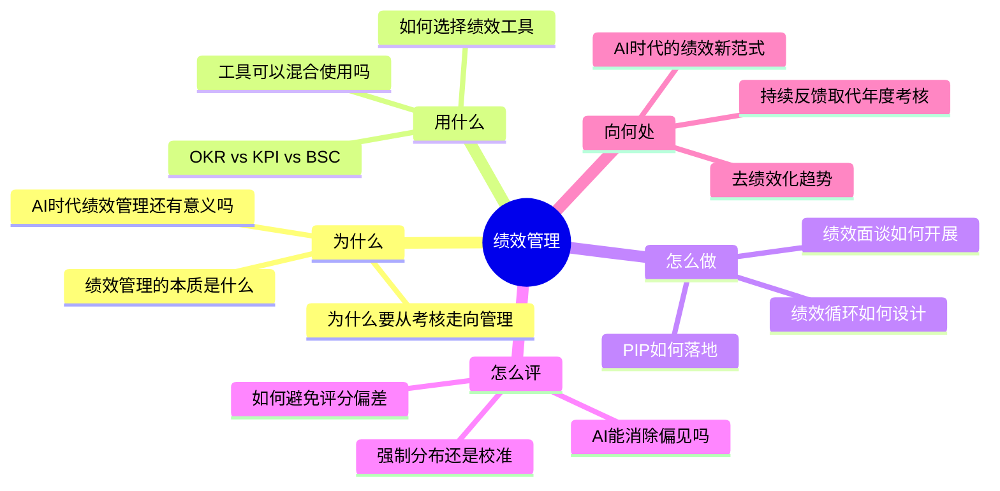
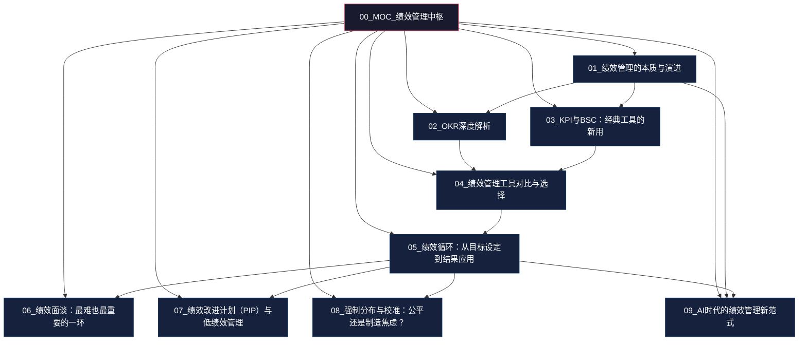
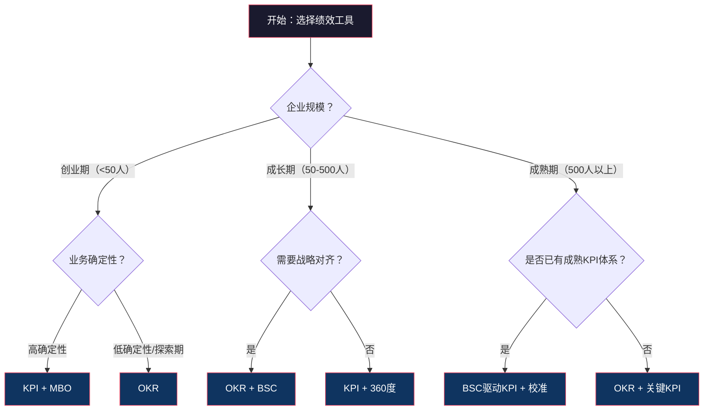
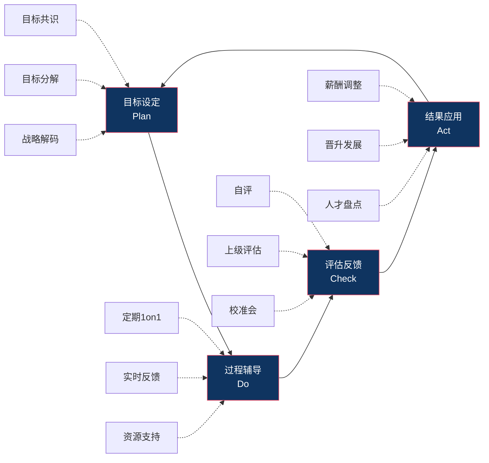
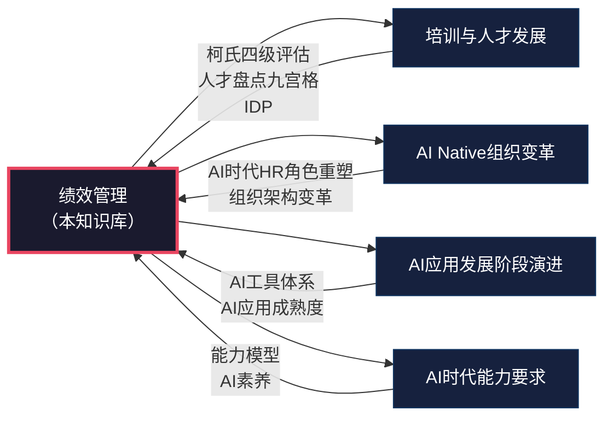
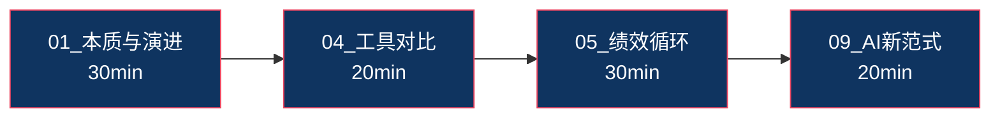
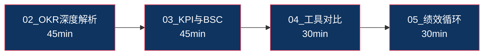
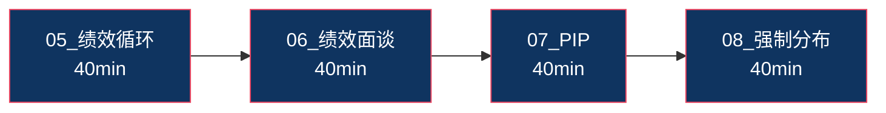
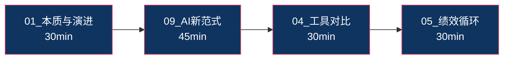

# 绩效管理中枢（Map of Content）

## 知识库定位

本知识库聚焦**绩效管理本身**，从"战略 + HR + AI"三个视角，覆盖绩效管理的全链路方法论：从工具选择、循环设计、面谈技巧，到 AI 时代的新范式。

> [!NOTE] 知识库差异化定位
> 本知识库与现有知识库的关系：
> - [[03-HR人事/培训与人才发展/培训与人才发展_知识库建设方案]] 聚焦"培养"维度（柯氏四级评估、ADDIE、70-20-10），本知识库聚焦"评价与管理"维度
> - [[03-HR人事/培训与人才发展/培训与人才发展_知识库建设方案]] 中的"人才盘点九宫格""继任者计划""IDP"属于人才发展领域，本知识库聚焦绩效循环、PIP、强制分布与校准
> - [[02-AI趋势与素养/AI Native组织变革/00_MOC_AI Native组织变革中枢]] 聚焦组织架构变革，本知识库部分章节（如 [[03-HR人事/绩效管理/09_AI时代的绩效管理新范式]]）与之形成交叉与互补
> - 三者形成"识人—育人—用人—评人"的完整人才管理闭环

## 核心问题地图

本知识库试图回答以下核心问题：

## 知识库结构总览

## 文档导航

### 第一部分：认知篇 —— 理解绩效管理的本质

#### [[03-HR人事/绩效管理/01_绩效管理的本质与演进]]

**核心命题**：绩效管理不是"打分"，而是"战略落地工具"。

- 从工业时代的绩效考核到知识时代的绩效管理，再到 AI 时代的持续绩效管理
- 绩效管理的四层价值：战略落地、人才识别、激励分配、能力发展
- 为什么"绩效主义毁了索尼"——绩效管理的异化与反思
- 绩效管理的三个根本矛盾：控制 vs 发展、个体 vs 团队、结果 vs 过程

> [!TIP] 阅读建议
> 如果你是第一次接触绩效管理，建议从这篇开始，建立对绩效管理的底层认知。如果你已经有一定的实践经验，可以直接跳到工具篇或实操篇。

**关键概念**：
- 绩效考核（Performance Appraisal）vs 绩效管理（Performance Management）
- 持续绩效管理（Continuous Performance Management, CPM）
- 绩效管理的四层价值模型

---

### 第二部分：工具篇 —— 绩效管理的武器库

#### [[03-HR人事/绩效管理/02_OKR深度解析]]

**核心命题**：OKR 不是待办清单，而是"聚焦+挑战+对齐"的战略沟通工具。

- OKR 的起源：Andy Grove（Intel）→ John Doerr（Google）→ 全球普及
- OKR 的核心原则：聚焦（Focus）、对齐（Alignment）、挑战（Commitment）、透明（Tracking）
- OKR 的撰写方法：Objective 的"定性+鼓舞人心"、Key Results 的"定量+可衡量"
- OKR 与 KPI 的本质区别：方向性指标 vs 衡量性指标
- 常见误区：写成任务清单、目标不挑战、缺乏对齐、KR 不可衡量、与考核挂钩

> [!WARNING] 常见误区
> 很多企业把 OKR 当成"另一种 KPI"来用，这是最大的误区。OKR 的核心价值在于**对齐**和**挑战**，而不是监控和考核。

**关键概念**：
- OKR 双循环：战略 OKR + 战术 OKR
- CFR 工具：Conversation（对话）、Feedback（反馈）、Recognition（认可）
- 信心指数（Confidence Score）

#### [[03-HR人事/绩效管理/03_KPI与BSC：经典工具的新用]]

**核心命题**：KPI 和 BSC 并非"过时工具"，而是需要被正确理解和运用。

- KPI 的设计原则：SMART 原则、关键成功因素法（CSF）
- BSC（平衡计分卡）四维度：财务、客户、内部流程、学习与成长
- 战略地图：将战略转化为可操作的指标体系
- KPI 的局限：指标僵化、博弈行为（古德哈特定律）、短期主义
- KPI 的"新用"：在数字化时代如何让 KPI 更敏捷

> [!IMPORTANT] 核心洞察
> KPI 的问题不在于"指标"本身，而在于"指标管理"的方式。好的 KPI 体系是战略沟通的工具，坏的 KPI 体系是数字游戏。

**关键概念**：
- 关键成功因素（CSF）→ 关键绩效指标（KPI）
- 领先指标 vs 滞后指标
- 战略地图（Strategy Map）
- 古德哈特定律（Goodhart's Law）

#### [[03-HR人事/绩效管理/04_绩效管理工具对比与选择]]

**核心命题**：没有最好的工具，只有最适合的工具。

- OKR vs KPI vs BSC vs MBO vs 360度反馈的全面对比
- 对比维度：适用场景、优缺点、实施难度、对组织文化的要求
- 不同企业阶段的工具选择建议
- 混合使用的可能性与陷阱
- 工具选择的决策树

**关键概念**：
- MBO（目标管理）
- 360度反馈
- 绩效工具矩阵（工具 × 组织阶段）
- 混合绩效管理（Hybrid Performance Management）

---

### 第三部分：实操篇 —— 绩效管理的落地方法论

#### [[03-HR人事/绩效管理/05_绩效循环：从目标设定到结果应用]]

**核心命题**：绩效管理是一个闭环，任何一个环节的缺失都会导致整体失效。

- 绩效管理的 PDCA 循环：目标设定 → 过程辅导 → 评估反馈 → 结果应用
- 目标设定：战略解码与目标层层分解（从公司战略到个人目标）
- 过程辅导：不是"秋后算账"，而是"日常赋能"
- 评估反馈：多维度评估与校准
- 结果应用：薪酬、晋升、培训、人才盘点的联动
- 每个环节的常见陷阱与应对策略

**关键概念**：
- PDCA 绩效循环
- 战略解码（Strategy Decoding）
- 目标层层分解（Cascading Goals）
- 定期 1on1

#### [[03-HR人事/绩效管理/06_绩效面谈：最难也最重要的一环]]

**核心命题**：绩效面谈是绩效管理中最容易被忽视、但最能产生价值的环节。

- 绩效面谈的准备：数据准备、心理准备、环境准备
- 结构化面谈流程：开场 → 回顾 → 反馈 → 讨论 → 共识 → 跟进
- SBI 反馈模型：Situation（情境）→ Behavior（行为）→ Impact（影响）
- 如何给出建设性反馈：避免"三明治法"的陷阱
- 如何处理情绪化反应：倾听、共情、引导
- 如何引导员工制定改进计划

> [!TIP] 黄金法则
> 绩效面谈的目标不是"让员工接受评分"，而是"让员工理解自己的表现，并愿意为改进而努力"。面谈的质量取决于管理者日常的反馈积累，而非面谈当天的技巧。

**关键概念**：
- SBI 模型（Situation-Behavior-Impact）
- 建设性反馈（Constructive Feedback）
- 积极倾听（Active Listening）
- 改进计划（Improvement Plan）

#### [[03-HR人事/绩效管理/07_绩效改进计划（PIP）与低绩效管理]]

**核心命题**：PIP 的目标是"改进"而非"劝退"，但现实中往往沦为解雇的前奏。

- PIP 的设计原则：明确、可衡量、有时限、有支持
- PIP 的正当程序：避免法律风险的七个步骤
- PIP 成功与失败的案例
- 低绩效员工的管理策略：识别根因、分类管理
- 末位淘汰的争议与替代方案
- 从"管理低绩效"到"预防低绩效"

> [!WARNING] 法律风险警示
> PIP 在中国劳动法语境下具有特殊意义。如果 PIP 被认定为"变相解雇"的前置程序，可能在劳动仲裁中处于不利地位。必须在 PIP 中明确"改进目标"和"支持措施"，而非仅仅设置"不合格就离职"的条款。

**关键概念**：
- PIP（Performance Improvement Plan）
- 正当程序（Due Process）
- 低绩效根因分析（能力问题 vs 意愿问题 vs 环境问题）
- 末位淘汰（Rank and Yank）

#### [[03-HR人事/绩效管理/08_强制分布与校准：公平还是制造焦虑？]]

**核心命题**：强制分布是"必要的恶"还是"过时的毒药"？

- 强制分布法的起源：GE 杰克·韦尔奇的"活力曲线"（20-70-10）
- 强制分布的争议：破坏协作、制造焦虑、统计假设失效
- 校准会（Calibration）的操作方法：会前准备、会议流程、角色分工
- 替代方案：无强制分布但仍需校准
- 中国企业的实践：阿里的 361、华为的 A/B/C/D 评价

> [!NOTE] 辩证思考
> 强制分布的本质是用"统计修正"对抗"评分通胀"。但在小团队（<30人）中，正态分布假设根本不成立。关键不是"是否强制分布"，而是"如何确保评价标准的一致性"。

**关键概念**：
- 活力曲线（Vitality Curve）
- 评分通胀（Rating Inflation）
- 校准会（Calibration Session）
- 中心化趋势（Central Tendency Bias）

---

### 第四部分：未来篇 —— 绩效管理的进化方向

#### [[03-HR人事/绩效管理/09_AI时代的绩效管理新范式]]

**核心命题**：AI 不是绩效管理的"替代者"，而是"催化剂"——它让"持续绩效管理"从理念变为现实。

- 持续反馈取代年度考核：从"年度大考"到"日常对话"
- AI 辅助绩效数据收集与分析：自然语言处理、情感分析、行为数据
- AI 消除评估偏见（真的吗？）：算法的偏见与人类的偏见谁更可控
- 实时绩效 Dashboard：数据驱动的绩效洞察
- "去绩效化"趋势：Netflix 的无绩效评估模式、Adobe 的 Check-in、德勤的绩效快照
- AI 时代的绩效管理伦理问题

> [!IMPORTANT] 关键判断
> AI 时代的绩效管理不会"消失"，但会"隐形"——它从一次性的评判活动，转变为嵌入在日常工作中的持续感知和反馈系统。管理者的角色从"裁判"变为"教练"。

**关键概念**：
- 持续绩效管理（Continuous Performance Management）
- 算法偏见（Algorithmic Bias）
- 绩效 Dashboard
- 去绩效化（De-Performance Management）

---

## 跨知识库关联

### 与 [[03-HR人事/培训与人才发展/培训与人才发展_知识库建设方案]] 的关联

| 本知识库文档 | 关联的培训与人才发展文档 | 关联逻辑 |
|---|---|---|
| [[03-HR人事/绩效管理/05_绩效循环：从目标设定到结果应用]] | [[03-HR人事/培训与人才发展/04-人才发展/12_人才盘点九宫格]] | 绩效评估结果是人才盘点的重要输入 |
| [[03-HR人事/绩效管理/07_绩效改进计划（PIP）与低绩效管理]] | [[03-HR人事/培训与人才发展/04-人才发展/14_IDP个人发展计划]] | PIP 与 IDP 的互补关系：PIP 解决"短板"，IDP 发展"长板" |
| [[03-HR人事/绩效管理/06_绩效面谈：最难也最重要的一环]] | [[03-HR人事/培训与人才发展/02-核心理论/04_成人学习理论]] | 反馈沟通中的成人学习原则 |
| [[03-HR人事/绩效管理/09_AI时代的绩效管理新范式]] | [[03-HR人事/培训与人才发展/06-前沿趋势/19_AI在培训中的应用]] | AI 在人才管理中的双重应用 |

### 与 [[02-AI趋势与素养/AI Native组织变革/00_MOC_AI Native组织变革中枢]] 的关联

| 本知识库文档 | 关联的AI Native组织变革文档 | 关联逻辑 |
|---|---|---|
| [[03-HR人事/绩效管理/09_AI时代的绩效管理新范式]] | [[02-AI趋势与素养/AI Native组织变革/05_HR部门在AI Native组织中的角色重塑]] | AI 时代 HR 的绩效管理角色转型 |
| [[03-HR人事/绩效管理/01_绩效管理的本质与演进]] | [[02-AI趋势与素养/AI Native组织变革/02_组织架构变革：从金字塔到神经网络]] | 组织形态变化对绩效管理的要求 |
| [[03-HR人事/绩效管理/04_绩效管理工具对比与选择]] | [[02-AI趋势与素养/AI Native组织变革/04_决策机制变革：AI如何改变组织决策]] | 数据驱动的绩效决策 |

### 与 [[02-AI趋势与素养/AI应用发展阶段演进/00_MOC_AI应用发展阶段演进中枢]] 的关联

| 本知识库文档 | 关联的AI应用发展阶段演进文档 | 关联逻辑 |
|---|---|---|
| [[03-HR人事/绩效管理/09_AI时代的绩效管理新范式]] | [[02-AI趋势与素养/AI应用发展阶段演进/02_阶段一二：Chatbot与Copilot——AI的嘴和手]] | AI 辅助绩效数据收集与分析 |
| [[03-HR人事/绩效管理/09_AI时代的绩效管理新范式]] | [[02-AI趋势与素养/AI应用发展阶段演进/04_阶段四：AI Product——从功能到解决方案]] | AI 驱动的绩效管理系统 |

### 与 [[02-AI趋势与素养/AI时代能力要求/00_MOC_AI时代能力要求中枢]] 的关联

| 本知识库文档 | 关联的AI时代能力要求文档 | 关联逻辑 |
|---|---|---|
| [[03-HR人事/绩效管理/06_绩效面谈：最难也最重要的一环]] | [[02-AI趋势与素养/AI时代能力要求/04_软技能的变化：AI时代的稀缺能力]] | 绩效面谈所需的共情、沟通等软技能 |
| [[03-HR人事/绩效管理/07_绩效改进计划（PIP）与低绩效管理]] | [[02-AI趋势与素养/AI时代能力要求/02_能力模型重构：从I型到T型到π型到梳型]] | 能力模型与绩效改进的关系 |

---

## 阅读路径建议

### 路径一：快速入门（1-2小时）

适合：HR 新人、业务管理者、对绩效管理感兴趣的读者。

### 路径二：工具深度（2-3小时）

适合：正在设计或优化绩效体系的 HRBP、OD 专家。

### 路径三：实操落地（3-4小时）

适合：需要落地绩效管理的一线管理者、HRBP。

### 路径四：前沿探索（2-3小时）

适合：关注 AI 时代组织变革的 HR 负责人、CHO。

---

## 关键概念索引

以下按字母顺序列出本知识库中最重要的概念，点击链接可跳转到对应文档。

| 概念 | 英文 | 主要出处 |
|---|---|---|
| 360度反馈 | 360-Degree Feedback | [[03-HR人事/绩效管理/04_绩效管理工具对比与选择]] |
| 平衡计分卡 | Balanced Scorecard (BSC) | [[03-HR人事/绩效管理/03_KPI与BSC：经典工具的新用]] |
| 校准会 | Calibration Session | [[03-HR人事/绩效管理/08_强制分布与校准：公平还是制造焦虑？]] |
| 持续绩效管理 | Continuous Performance Management | [[03-HR人事/绩效管理/01_绩效管理的本质与演进]]、[[03-HR人事/绩效管理/09_AI时代的绩效管理新范式]] |
| 关键绩效指标 | Key Performance Indicator (KPI) | [[03-HR人事/绩效管理/03_KPI与BSC：经典工具的新用]] |
| 目标管理 | Management by Objectives (MBO) | [[03-HR人事/绩效管理/04_绩效管理工具对比与选择]] |
| 目标与关键成果 | Objectives and Key Results (OKR) | [[03-HR人事/绩效管理/02_OKR深度解析]] |
| PDCA循环 | Plan-Do-Check-Act | [[03-HR人事/绩效管理/05_绩效循环：从目标设定到结果应用]] |
| 绩效改进计划 | Performance Improvement Plan (PIP) | [[03-HR人事/绩效管理/07_绩效改进计划（PIP）与低绩效管理]] |
| SBI反馈模型 | Situation-Behavior-Impact | [[03-HR人事/绩效管理/06_绩效面谈：最难也最重要的一环]] |
| 强制分布 | Forced Distribution | [[03-HR人事/绩效管理/08_强制分布与校准：公平还是制造焦虑？]] |
| 战略地图 | Strategy Map | [[03-HR人事/绩效管理/03_KPI与BSC：经典工具的新用]] |
| 古德哈特定律 | Goodhart's Law | [[03-HR人事/绩效管理/03_KPI与BSC：经典工具的新用]] |
| 活力曲线 | Vitality Curve | [[03-HR人事/绩效管理/08_强制分布与校准：公平还是制造焦虑？]] |
| 去绩效化 | De-Performance Management | [[03-HR人事/绩效管理/09_AI时代的绩效管理新范式]] |

---

## 面试常见问题速查

如果你正在准备 HR 相关面试，以下问题可能会用到本知识库的内容：

| 面试问题 | 参考文档 | 关键要点 |
|---|---|---|
| "请谈谈你对绩效管理的理解" | [[03-HR人事/绩效管理/01_绩效管理的本质与演进]] | 四层价值模型、考核 vs 管理 |
| "OKR 和 KPI 有什么区别？" | [[03-HR人事/绩效管理/02_OKR深度解析]]、[[03-HR人事/绩效管理/04_绩效管理工具对比与选择]] | 方向性 vs 衡量性、聚焦 vs 全面 |
| "如何设计一套绩效管理体系？" | [[03-HR人事/绩效管理/05_绩效循环：从目标设定到结果应用]] | PDCA 循环、战略解码 |
| "如何做好绩效面谈？" | [[03-HR人事/绩效管理/06_绩效面谈：最难也最重要的一环]] | SBI 模型、积极倾听 |
| "如何处理低绩效员工？" | [[03-HR人事/绩效管理/07_绩效改进计划（PIP）与低绩效管理]] | PIP 设计原则、根因分析 |
| "强制分布是否合理？" | [[03-HR人事/绩效管理/08_强制分布与校准：公平还是制造焦虑？]] | 辩证分析、替代方案 |
| "AI 时代绩效管理会怎样变化？" | [[03-HR人事/绩效管理/09_AI时代的绩效管理新范式]] | 持续反馈、去绩效化 |

---

## 知识库建设日志

- **2026-07-27**：知识库创建，完成全部 9 篇内容文档 + 1 篇 MOC 中枢。
- **待办**：后续可补充案例库（如字节跳动 OKR 实践、华为绩效管理）、工具模板（面谈记录表、PIP 模板、校准会流程 SOP）。

---

## 相关资源

- **书籍推荐**：
  - 《Measure What Matters》（John Doerr）—— OKR 圣经
  - 《平衡计分卡》（Kaplan & Norton）—— BSC 经典
  - 《绩效管理》（Herman Aguinis）—— 学术经典
  - 《驱动力》（Daniel Pink）—— 内在动机与绩效
  - 《Humanocracy》（Gary Hamel）—— 官僚制批判与绩效变革

- **外部链接**：
  - Google re:Work - OKR 指南
  - Adobe Check-in 实践
  - Netflix Culture Deck

- **关联知识库**：
  - [[03-HR人事/培训与人才发展/培训与人才发展_知识库建设方案]]
  - [[02-AI趋势与素养/AI Native组织变革/00_MOC_AI Native组织变革中枢]]
  - [[02-AI趋势与素养/AI时代能力要求/00_MOC_AI时代能力要求中枢]]
  - [[02-AI趋势与素养/AI应用发展阶段演进/00_MOC_AI应用发展阶段演进中枢]]