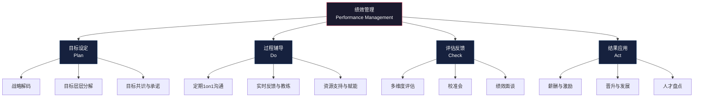
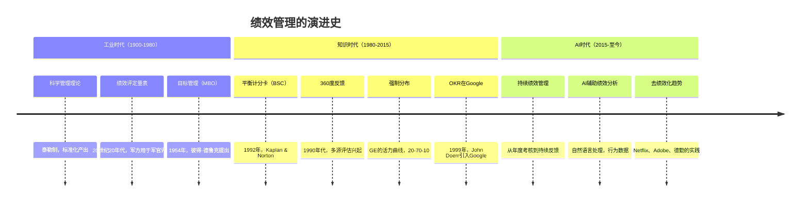
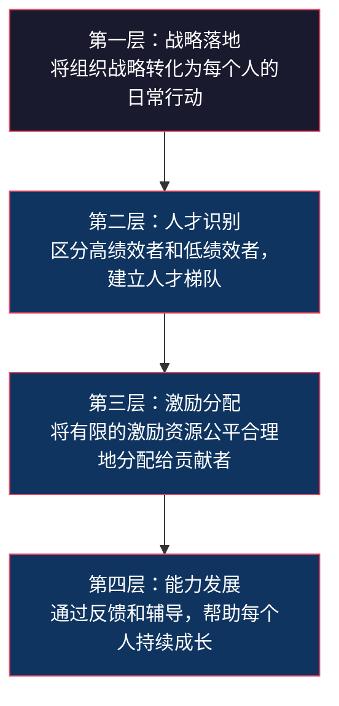
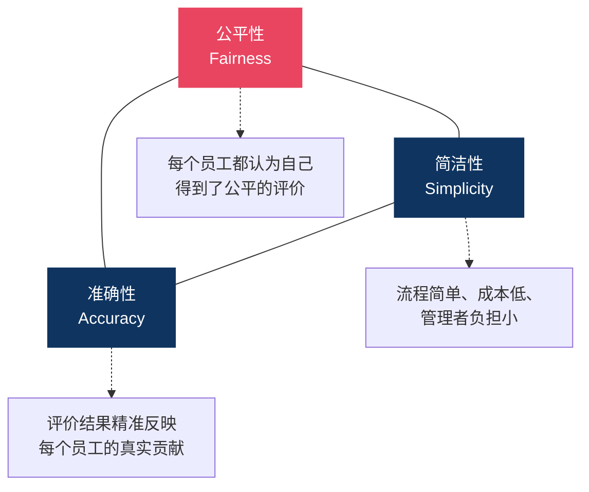

# 绩效管理的本质与演进

## 核心命题

> [!IMPORTANT] 核心命题
> 绩效管理不是"打分"，而是"战略落地工具"。它的本质是通过系统化的目标设定、过程辅导、评估反馈和结果应用，将组织战略转化为每个员工的日常行动。

## 一、绩效管理的定义：从"考核"到"管理"

### 1.1 绩效考核 vs 绩效管理

很多人将"绩效考核"和"绩效管理"混为一谈，但二者有本质区别。

| 维度 | 绩效考核（Performance Appraisal） | 绩效管理（Performance Management） |
|---|---|---|
| 时间取向 | 面向过去（回顾性） | 面向未来（前瞻性） |
| 核心动作 | 打分、评级 | 目标设定、反馈、辅导、发展 |
| 频率 | 年度/半年度 | 持续进行 |
| 管理者角色 | 裁判 | 教练 |
| 员工角色 | 被动接受者 | 主动参与者 |
| 核心目标 | 区分优劣、分配薪酬 | 战略落地、能力发展 |
| 典型工具 | 评分表、强制分布 | OKR、1on1、360度反馈 |

> [!NOTE] 关键区分
> 绩效考核是绩效管理的一个环节，而非全部。如果把绩效管理等同于"年底打分"，就犯了"只见树木、不见森林"的错误。

### 1.2 绩效管理的完整定义

绩效管理是一个**持续循环**，包括：

1. **目标设定**（Plan）：将组织战略分解为团队和个人目标
2. **过程辅导**（Do）：通过持续沟通和反馈，帮助员工达成目标
3. **评估反馈**（Check）：客观评估绩效表现，给予建设性反馈
4. **结果应用**（Act）：将评估结果与薪酬、晋升、发展联动



---

## 二、绩效管理的演进史：三个时代的跃迁



### 2.1 工业时代：绩效考核的诞生（1900-1980）

**时代背景**：工业经济，标准化生产，体力劳动者为主体。

**核心特征**：
- **可量化**：产出可以用件数、工时等物理指标衡量
- **标准化**：每个人的工作内容高度相似，易于横向比较
- **上级驱动**：管理者制定标准，劳动者执行标准
- **结果导向**：只看结果，不看过程

**代表人物与理论**：
- **弗雷德里克·泰勒**（Frederick Taylor）：科学管理理论，将工作分解为标准动作，以"最优方式"衡量效率
- **彼得·德鲁克**（Peter Drucker）：1954年提出"目标管理"（MBO），首次将"目标"作为管理的核心

**工业时代绩效管理的局限**：
- 把人当作"机器"——忽视人的主观能动性和创造力
- 只衡量"可见产出"——知识工作者的产出难以量化
- "秋后算账"——缺乏过程管理和持续改进

### 2.2 知识时代：从考核到管理（1980-2015）

**时代背景**：知识经济兴起，脑力劳动者成为主体，创新成为核心竞争力。

**核心转变**：

| 从 | 到 |
|---|---|
| 衡量产出 | 衡量贡献 |
| 上级单向评价 | 多源反馈（360度） |
| 结果导向 | 结果+过程 |
| 控制工具 | 发展工具 |
| 年度事件 | 持续过程 |

**关键方法论的出现**：

1. **平衡计分卡（BSC, 1992）**：Kaplan 和 Norton 提出，将绩效从单一财务维度拓展到客户、内部流程、学习成长四个维度，解决了"只看财务指标"的短视问题。

2. **360度反馈（1990s）**：从上级、同事、下属、客户等多个角度收集反馈，提升评估的全面性和客观性。

3. **OKR（1999年引入Google）**：Andy Grove 在 Intel 发明，John Doerr 引入 Google，强调"聚焦+对齐+挑战+透明"。

4. **强制分布（GE活力曲线）**：杰克·韦尔奇推行"20-70-10"的强制分布，识别顶尖人才和末位员工。

**知识时代的反思**：
- 2004年，索尼前常务董事天外伺郎发表《绩效主义毁了索尼》，引发对"过度绩效化"的反思
- 越来越多的研究表明：过度依赖量化指标会扼杀创新、破坏内在动机
- Daniel Pink 在《驱动力》中指出：对于创造性工作，内在动机（自主、精通、目的）比外在激励（奖金、评分）更有效

> [!WARNING] 绩效主义的异化
> 当绩效管理从"帮助组织和个人成功的工具"异化为"控制员工行为的枷锁"，它就失去了存在的意义。索尼的教训是：当所有人都盯着短期KPI时，没有人会去做那些"重要但不紧急"的创新工作。

### 2.3 AI时代：持续绩效管理（2015-至今）

**时代背景**：AI 技术成熟，VUCA 环境加速，Z世代进入职场。

**核心转变**：

- **从年度考核到持续反馈**：Adobe 2012年取消年度绩效评估，改为"Check-in"制度；德勤 2015年重新设计绩效管理，从"评级"转向"绩效快照"；GE 2015年取消强制分布和年度评级
- **从"裁判"到"教练"**：管理者的角色从评估者转变为赋能者
- **从"标准答案"到"个性化"**：AI 技术使个性化绩效管理成为可能
- **从"控制"到"信任"**：Netflix 的"自由与责任"文化，取消绩效评估，聚焦高密度人才

**AI 时代的绩效管理特征**：

| 特征 | 传统模式 | AI时代模式 |
|---|---|---|
| 频率 | 年度/半年度 | 持续/实时 |
| 数据来源 | 上级主观评价 | 多源数据+AI分析 |
| 反馈方式 | 正式面谈 | 日常对话+即时反馈 |
| 目标设定 | 自上而下分解 | 上下对齐+动态调整 |
| 关注点 | 评分与排名 | 成长与发展 |
| 技术支撑 | 电子表格 | AI驱动的绩效平台 |

关于 AI 时代的绩效管理新范式，详见 [[03-HR人事/绩效管理/09_AI时代的绩效管理新范式]]。

---

## 三、绩效管理的四层价值

绩效管理不是"为做而做"，它承载着四个层次的价值。



### 3.1 第一层：战略落地

**核心问题**：如何确保每个人的工作都在为组织战略服务？

**绩效管理的作用**：
- 将公司战略翻译为可衡量的目标和指标
- 通过目标层层分解，确保"上下同欲"
- 通过定期复盘，确保战略方向不偏离

**反面案例**：如果战略是"提升客户满意度"，但销售团队的 KPI 只有"销售额"，那销售就会为了成交而过度承诺，最终损害客户满意度。

**关键工具**：战略地图、OKR、BSC —— 详见 [[03-HR人事/绩效管理/03_KPI与BSC：经典工具的新用]] 和 [[03-HR人事/绩效管理/02_OKR深度解析]]。

### 3.2 第二层：人才识别

**核心问题**：谁是我们最优秀的人？谁需要帮助？

**绩效管理的作用**：
- 通过持续的绩效观察，识别高绩效者和高潜力者
- 为人才盘点（九宫格）提供数据基础
- 为继任者计划提供关键输入

**与 [[03-HR人事/培训与人才发展/培训与人才发展_知识库建设方案]] 的关联**：绩效评估结果是人才盘点九宫格的核心输入，绩效数据驱动 IDP 的设计方向。

### 3.3 第三层：激励分配

**核心问题**：如何公平地分配有限的薪酬和晋升资源？

**绩效管理的作用**：
- 为调薪、奖金、股权激励提供依据
- 为晋升决策提供客观参考
- 通过"公平感"维持组织信任

**公平的三种维度**：
- **分配公平**：结果是否与贡献匹配
- **程序公平**：评价过程是否透明、一致
- **互动公平**：沟通过程中是否受到尊重

> [!TIP] 激励分配的黄金法则
> 激励分配的公平性比激励的绝对值更重要。一个人可以接受低奖金，但不能接受"凭什么他比我多"的不公平感。

### 3.4 第四层：能力发展

**核心问题**：如何帮助每个人变得更好？

**绩效管理的作用**：
- 通过反馈识别能力短板和发展方向
- 通过教练式辅导激发员工潜能
- 通过 PIP 帮助低绩效员工改进

**与 [[03-HR人事/培训与人才发展/培训与人才发展_知识库建设方案]] 的关联**：绩效反馈是培训需求分析（TNA）的重要来源，绩效差距驱动培训项目的设计。详见 [[03-HR人事/培训与人才发展/03-培训体系/08_培训需求分析TNA]]。

---

## 四、绩效管理的三个根本矛盾

绩效管理在实践中面临三个难以调和的矛盾。理解这些矛盾，才能更理性地看待绩效管理的不完美。

### 4.1 控制 vs 发展

```
矛盾的双方：
├── 控制视角：绩效管理是用来"管人"的 —— 确保员工做该做的事，不做不该做的事
└── 发展视角：绩效管理是用来"育人"的 —— 帮助员工成长，释放潜能
```

**实践中的张力**：
- 如果过于强调"控制"，员工会感到被监视、不信任，扼杀创造力
- 如果过于强调"发展"，可能无法有效区分绩效差异，激励分配失去依据
- **平衡之道**：发展为主，控制为辅。绩效管理的默认模式应该是"帮助员工成功"，而非"抓住员工的错误"

### 4.2 个体 vs 团队

```
矛盾的双方：
├── 个体绩效：识别每个人的贡献，区分优劣，激励个体
└── 团队绩效：强调协作和集体结果，避免"个人英雄主义"
```

**实践中的张力**：
- 过度强调个体绩效，会导致"各自为战"，破坏团队协作（如销售团队的"抢单"）
- 过度强调团队绩效，会导致"搭便车"，优秀个体失去动力
- **平衡之道**：个体绩效 + 团队绩效双轨制。如 Google 的 OKR 中，个人 OKR 必须与团队 OKR 对齐

### 4.3 结果 vs 过程

```
矛盾的双方：
├── 结果导向：只看结果，不管过程 —— "我不管你怎么做，我只要结果"
└── 过程导向：关注行为和方法 —— "只要你过程对了，结果自然会好"
```

**实践中的张力**：
- 过度结果导向：可能导致短期行为、道德风险（如 Wells Fargo 的虚假账户丑闻）
- 过度过程导向：可能导致"表演式工作"（看起来忙，实际没产出）
- **平衡之道**：结果定义目标，过程确保可持续。好的绩效管理既看"做了什么"（结果），也看"怎么做的"（行为/价值观）

---

## 五、绩效管理的"不可能三角"

绩效管理领域存在一个经典的"不可能三角"——你无法同时满足以下三个目标：



**为什么是"不可能三角"？**

- **要公平 + 准确**：需要多维度数据、多评估者、校准会、详细记录 —— 流程必然复杂
- **要公平 + 简洁**：只能依赖少数几个关键指标 —— 准确性必然下降
- **要准确 + 简洁**：需要高度标准化和自动化 —— 个体差异难以体现，公平性受损

**实践启示**：根据组织当前的优先级，选择"牺牲"哪个角。初创期可能牺牲"准确性"换取"简洁"，成熟期可能牺牲"简洁"换取"公平"。

---

## 六、绩效管理的"第一性原理"

回到最根本的问题：**绩效管理到底是为了什么？**

> [!IMPORTANT] 绩效管理的第一性原理
> 绩效管理的终极目标是**提升组织效能**。所有的工具、流程、方法论，都是为这个目标服务的。如果绩效管理本身变成了"为做而做"的官僚流程，它就背离了存在的意义。

从第一性原理出发，可以推导出几个关键判断：

1. **如果绩效管理不能提升组织效能，那就可以不做**。Netflix 的选择证明了这一点。
2. **绩效管理的形式服从于组织的业务模式和文化**。Google 的 OKR 和 GE 的强制分布，都是特定组织阶段的产物，不可简单复制。
3. **绩效管理的核心不是"评"，而是"管"**。管理意味着持续关注、及时反馈、主动赋能。

---

## 七、与关联知识库的对话

本知识库与 [[03-HR人事/绩效管理/00_MOC_绩效管理中枢]] 中提到的其他知识库形成互补：

- **[[03-HR人事/培训与人才发展/培训与人才发展_知识库建设方案]]**：绩效管理识别"差距"，培训与人才发展"填补"差距。绩效评估结果是培训需求分析（TNA）和 IDP 设计的关键输入。
- **[[02-AI趋势与素养/AI Native组织变革/00_MOC_AI Native组织变革中枢]]**：AI 时代的组织形态变化（从金字塔到神经网络）要求绩效管理从"层级考核"转向"网络化反馈"。详见 [[02-AI趋势与素养/AI Native组织变革/05_HR部门在AI Native组织中的角色重塑]]。
- **[[02-AI趋势与素养/AI时代能力要求/00_MOC_AI时代能力要求中枢]]**：AI 时代对员工能力的新要求，需要通过绩效管理来识别和引导。

---

## 八、本章要点回顾

| 要点 | 核心内容 |
|---|---|
| 考核 vs 管理 | 绩效考核是"打分"，绩效管理是"持续循环" |
| 三个时代 | 工业时代（结果导向）→ 知识时代（过程+结果）→ AI时代（持续反馈） |
| 四层价值 | 战略落地 → 人才识别 → 激励分配 → 能力发展 |
| 三个矛盾 | 控制 vs 发展、个体 vs 团队、结果 vs 过程 |
| 不可能三角 | 公平性、简洁性、准确性不可兼得 |
| 第一性原理 | 绩效管理的终极目标是提升组织效能 |

---

## 下一步阅读

- 如果你想了解具体工具，请阅读 [[03-HR人事/绩效管理/02_OKR深度解析]] 和 [[03-HR人事/绩效管理/03_KPI与BSC：经典工具的新用]]
- 如果你想了解工具如何选择，请阅读 [[03-HR人事/绩效管理/04_绩效管理工具对比与选择]]
- 如果你想了解绩效管理的落地实操，请阅读 [[03-HR人事/绩效管理/05_绩效循环：从目标设定到结果应用]]
- 如果你关注 AI 时代的绩效管理变革，请阅读 [[03-HR人事/绩效管理/09_AI时代的绩效管理新范式]]