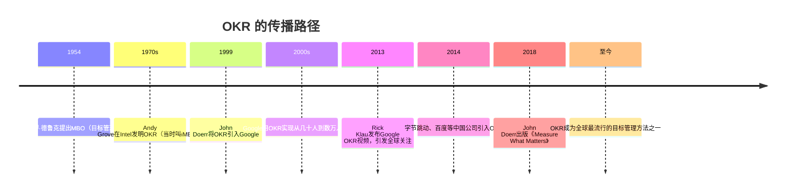
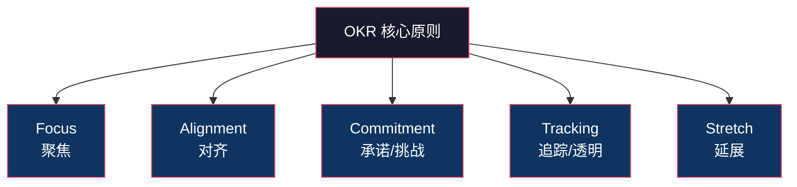
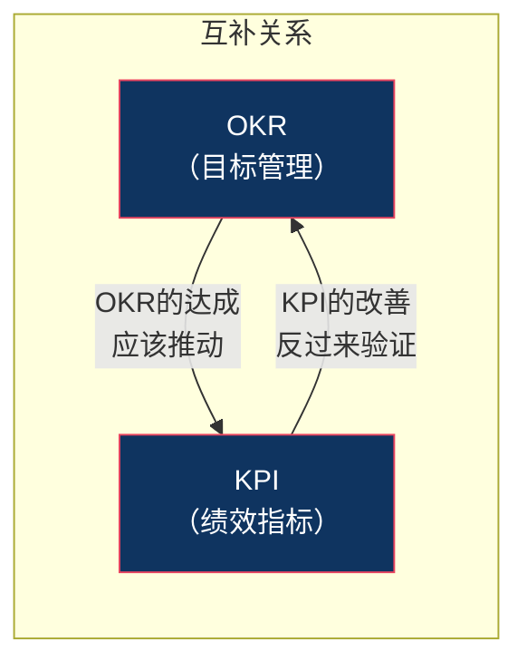
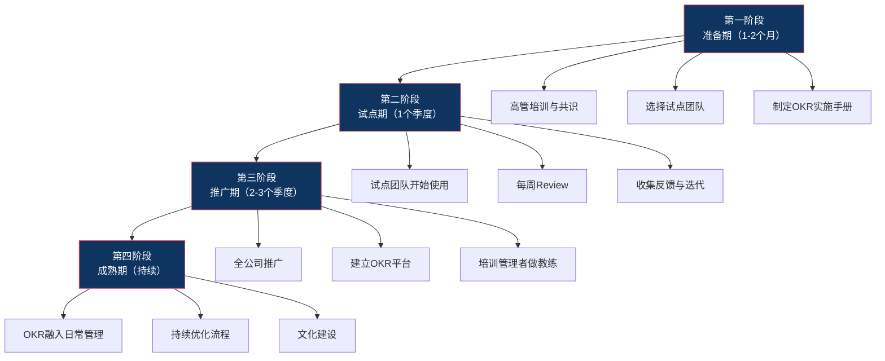

# OKR深度解析

## 核心命题

> [!IMPORTANT] 核心命题
> OKR 不是待办清单，也不是"另一种 KPI"。它是"聚焦 + 挑战 + 对齐"的战略沟通工具，让组织中的每个人都知道"我们要去哪里"以及"如何知道我们到了"。

## 一、OKR 的起源：从 Intel 到世界



### 1.1 Andy Grove 的发明

Intel 前 CEO **Andy Grove** 在德鲁克 MBO 的基础上做了关键改进：

- 将 MBO 的"年度目标"改为**更短周期**（季度或月度）
- 将目标（Objective）与关键结果（Key Results）**显式分离**
- 强调**自下而上**的目标设定，而非纯自上而下

Grove 在《High Output Management》中写道：

> "目标应该是'我要去哪里'，关键结果应该是'我怎么知道我在往那里去'。"

### 1.2 John Doerr 与 Google

1999年，风险投资家 **John Doerr**（前 Intel 员工）将 OKR 引入当时只有几十人的 Google。Google 用 OKR 实现了从几十人到数万人的规模化增长，而没有被官僚化拖垮。

Doerr 的 OKR 公式：

```
I will ______ as measured by ______.
（我将______，通过______来衡量。）
```

### 1.3 全球普及

OKR 从 Google 扩散到 LinkedIn、Twitter、Spotify、Uber、字节跳动、百度、华为等众多公司，成为全球最流行的目标管理方法之一。

---

## 二、OKR 的核心原则：F.A.C.T.S.

OKR 的核心可以用五个关键词概括：



### 2.1 Focus（聚焦）

**原则**：每个周期设定少量的关键目标（通常3-5个O，每个O下3-5个KR）。

**为什么重要**：
- 人的注意力是有限的资源
- 目标太多 = 没有目标
- 聚焦意味着"对不重要的事情说不"

**实践建议**：
- 问自己："如果这个周期只能完成一件事，那是什么？"
- 将目标列表从10个砍到3个，砍掉的不是"不重要"，而是"不够重要"

### 2.2 Alignment（对齐）

**原则**：个人 OKR 与团队 OKR 对齐，团队 OKR 与公司 OKR 对齐。

**对齐的两种方式**：
- **自上而下**：公司 O → 部门 O → 团队 O → 个人 O（层层分解）
- **自下而上**：个人提出 O → 团队整合 → 部门对齐 → 公司确认（Google 的做法）

> [!TIP] 最佳实践
> Google 的做法是"60%自上而下 + 40%自下而上"。自上而下确保战略一致性，自下而上激发员工的主人翁意识。

### 2.3 Commitment（承诺/挑战）

**原则**：OKR 分为两类 —— 承诺型（Committed）和挑战型（Aspirational）。

| 类型 | 承诺型 OKR | 挑战型 OKR |
|---|---|---|
| 期望达成率 | 100% | 60-70% |
| 与考核的关系 | 可能挂钩 | 不挂钩 |
| 目标特征 | 必须完成 | 野心勃勃、可能失败 |
| 激励方式 | 完成是"应该的" | 完成60%就是成功 |

**Google 的做法**：
- 承诺型 OKR：与绩效评估和薪酬挂钩
- 挑战型 OKR（"Moonshot"）：追求10倍改进，与薪酬脱钩

### 2.4 Tracking（追踪/透明）

**原则**：OKR 对所有人可见，定期更新进度。

**透明的价值**：
- 减少重复劳动：知道别人在做什么
- 促进协作：发现可以互相帮助的机会
- 建立信任：公开透明本身就是一种信任信号

**追踪频率**：
- 每周检查进度（如周会上的 OKR Review）
- 每月更新信心指数（Confidence Score）

### 2.5 Stretch（延展）

**原则**：好的 OKR 应该有"挑战性"——让团队走出舒适区。

**为什么需要延展**：
- 容易达成的目标不会激发创新
- 挑战性目标即使未能100%完成，也可能比"安全目标"的100%更有价值

---

## 三、OKR 的撰写方法

### 3.1 Objective（O）的撰写

**O 的特征**：
- **定性的**（Qualitative）：描述方向和意图，而非数字
- **鼓舞人心的**（Inspirational）：让人有"想做"的冲动
- **有时限的**（Time-bound）：通常为一个季度
- **可独立执行的**：团队或个人可以独立推动

**好的 O 示例**：
- "打造让用户'上瘾'的产品体验"（而非"提升用户满意度"）
- "成为行业公认的AI技术领导者"（而非"提升技术能力"）
- "建立一支"召之即来、来之能战"的销售铁军"（而非"提升销售团队能力"）

**不好的 O 示例**：
- "完成Q3销售目标"（这是任务，不是目标）
- "提升客户满意度"（太模糊，缺乏方向感）
- "做好日常工作"（这不是目标）

### 3.2 Key Results（KR）的撰写

**KR 的特征**：
- **定量的**（Quantitative）：有明确的数字
- **可衡量的**（Measurable）：可以客观判断是否达成
- **有挑战性但可实现的**（Aspirational but Achievable）
- **结果导向的**（Outcome-oriented）：衡量的是"结果"而非"任务"

**好的 KR 示例**：
- "NPS 从 45 提升到 60"（而非"做用户调研"）
- "月活跃用户从 100万 增长到 150万"（而非"做市场推广"）
- "客户问题首次解决率从 70% 提升到 85%"（而非"优化客服流程"）

**不好的 KR 示例**：
- "完成用户调研报告"（这是任务，不是结果）
- "发布新版本"（发布后用户不增长，有意义吗？）
- "拜访100个客户"（拜访了但没成交，有意义吗？）

### 3.3 OKR 撰写自检清单

| 检查项 | Objective | Key Results |
|---|---|---|
| 是否聚焦？（3-5个） | 是/否 | 是/否 |
| 是否定性/定量？ | 定性 | 定量 |
| 是否鼓舞人心？ | 是/否 | N/A |
| 是否可衡量？ | N/A | 是/否 |
| 是否结果导向？ | 是/否 | 是/否（不是任务） |
| 是否有时限？ | 是/否 | 是/否 |
| 是否与上级对齐？ | 是/否 | 是/否 |

---

## 四、OKR 与 KPI 的本质区别

这是被问得最多的问题。直接看对比：

| 维度 | OKR | KPI |
|---|---|---|
| 本质 | 目标管理工具 | 绩效衡量指标 |
| 核心问题 | "我们要去哪里？" | "我们做得好不好？" |
| 方向性 | 方向性：指明方向 | 衡量性：衡量现状 |
| 设定方式 | 自下而上 + 自上而下 | 通常自上而下分解 |
| 挑战性 | 追求挑战（60-70%达成即成功） | 追求达成（100%达成是目标） |
| 与薪酬关系 | 通常不直接挂钩 | 通常直接挂钩 |
| 透明度 | 全员可见 | 通常仅上下级可见 |
| 周期 | 月度/季度 | 月度/季度/年度 |
| 调整频率 | 周期内可调整 | 通常固定 |

> [!WARNING] 最大误区
> 很多企业把 OKR 当作"另一种 KPI"来用，甚至把 OKR 的达成率直接与奖金挂钩。这是对 OKR 最大的误解。一旦 OKR 与薪酬挂钩，人们就会"降低目标以确保达标"，OKR 的"挑战性"就消失了。

**OKR 和 KPI 的正确关系**：



**简单理解**：
- OKR 回答"我们要去哪里"（目标）
- KPI 回答"我们做得好不好"（指标）
- 好的 OKR 的达成，应该推动 KPI 的改善
- KPI 可以监控"健康度"，OKR 驱动"突破"

---

## 五、OKR 的常见误区

### 误区一：把 OKR 写成"任务清单"

```
错误示例：
  O: 完成Q3产品迭代
  KR1: 完成需求评审
  KR2: 完成UI设计
  KR3: 完成开发和测试
  KR4: 上线发布

正确示例：
  O: 让用户"离不开"我们的产品
  KR1: 日活跃用户从50万提升到80万
  KR2: 用户次日留存率从30%提升到45%
  KR3: NPS从40提升到55
```

> [!TIP] 区分方法
> 问自己："如果这个KR完成了，但业务结果没有变化，它还有意义吗？" 如果答案是"没有意义"，那说明你写的是任务而非结果。

### 误区二：目标不挑战

```
错误示例：
  O: 完成Q3销售目标
  KR1: 销售额达到1000万（去年Q3已经900万了）

正确示例：
  O: 打造行业标杆的销售体系
  KR1: 新客户获取成本降低30%
  KR2: 销售人均产出从200万提升到350万
  KR3: 客户转介绍率从15%提升到30%
```

### 误区三：缺乏对齐

```
错误示例：
  公司O: 成为行业AI领导者
  销售团队O: 完成Q3销售额
  （两者毫无关联）

正确示例：
  公司O: 成为行业AI领导者
  销售团队O: 让AI产品成为客户的首选解决方案
  KR1: AI产品销售额占比从20%提升到50%
  KR2: 成功签约3个AI标杆客户
```

### 误区四：KR 不可衡量

```
错误示例：
  KR: 提升团队协作效率
  （什么叫"提升"？什么叫"协作效率"？）

正确示例：
  KR: 项目平均交付周期从30天缩短到20天
  KR: 跨部门协作满意度从3.2分提升到4.0分
```

### 误区五：与考核挂钩

这是 OKR 最常见的"自杀式"用法。一旦 OKR 与薪酬挂钩：
- 员工会"压低目标以求达标"
- 挑战型 OKR 消失，只剩下"安全型"OKR
- OKR 的"透明"变成"互相监视"

**正确做法**：OKR 用于"对齐和挑战"，KPI 或综合评估用于"考核和薪酬"。详见 [[03-HR人事/绩效管理/04_绩效管理工具对比与选择]]。

---

## 六、OKR 的配套工具：CFR

OKR 不能单独运行，需要配套的沟通工具。John Doerr 提出 **CFR 模型**：

| 工具 | 含义 | 频率 | 目的 |
|---|---|---|---|
| **Conversation**（对话） | 管理者与员工的一对一对话 | 每周/每两周 | 了解进展、提供支持、教练辅导 |
| **Feedback**（反馈） | 双向的、建设性的反馈 | 实时/持续 | 帮助员工了解自己的表现和改进方向 |
| **Recognition**（认可） | 对贡献的公开认可 | 实时/持续 | 强化正向行为、激励团队 |

**OKR + CFR 的关系**：
- OKR 提供"目标"（我们要去哪里）
- CFR 提供"燃料"（如何让团队持续前进）
- 没有 CFR 的 OKR 是"无源之水"，没有 OKR 的 CFR 是"无的放矢"

---

## 七、OKR 的实施路线图



**关键成功因素**：
1. **CEO 必须亲自推动**：OKR 是"一把手工程"，没有 CEO 的深度参与，OKR 只会沦为形式
2. **先试点，再推广**：不要在第一天就全员推行，找1-2个有意愿的团队试点
3. **不要求完美**：第一季度的 OKR 大概率写得不好，这不重要，重要的是"开始做"
4. **OKR 不与薪酬挂钩**：至少在前2-3个周期，确保 OKR 与薪酬完全脱钩

---

## 八、本章要点回顾

| 要点 | 核心内容 |
|---|---|
| 起源 | Andy Grove（Intel）→ John Doerr（Google）→ 全球普及 |
| 核心原则 | Focus（聚焦）、Alignment（对齐）、Commitment（挑战）、Tracking（透明）、Stretch（延展） |
| O 的撰写 | 定性、鼓舞人心、有时限、方向性 |
| KR 的撰写 | 定量、可衡量、结果导向（不是任务清单） |
| vs KPI | OKR 是"方向"，KPI 是"指标"；OKR 追求挑战，KPI 追求达成 |
| 配套工具 | CFR（Conversation、Feedback、Recognition） |
| 常见误区 | 写成任务清单、目标不挑战、缺乏对齐、KR 不可衡量、与考核挂钩 |

---

## 下一步阅读

- 如果你想了解 KPI 和 BSC 的设计方法，请阅读 [[03-HR人事/绩效管理/03_KPI与BSC：经典工具的新用]]
- 如果你想了解不同工具的对比和选择，请阅读 [[03-HR人事/绩效管理/04_绩效管理工具对比与选择]]
- 如果你想了解 OKR 如何融入绩效循环，请阅读 [[03-HR人事/绩效管理/05_绩效循环：从目标设定到结果应用]]